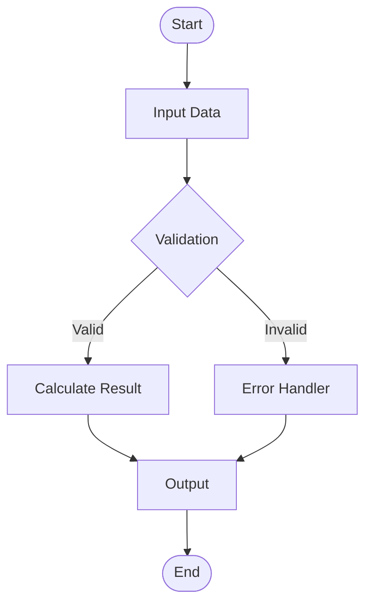
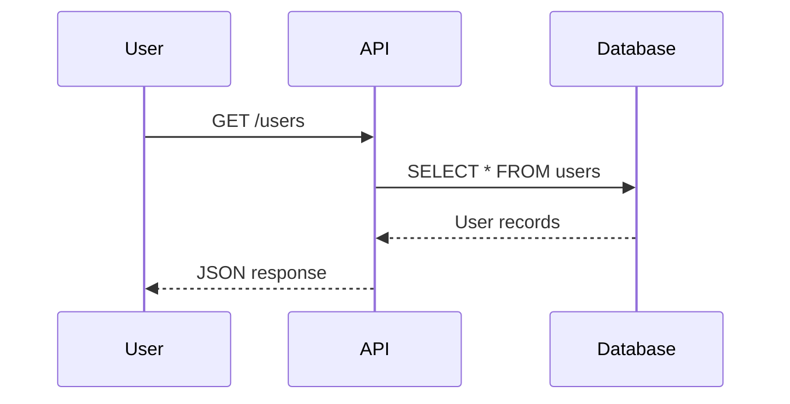
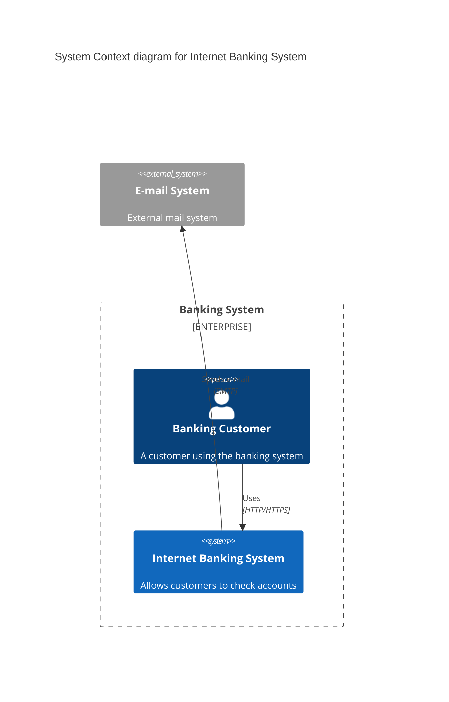

## Quick Reference

Mermaid Diagram Expert v7.0.0 - Pure skill-based Mermaid rendering for Claude Code with MCP Playwright integration.

This skill provides complete Mermaid 11.12.2 syntax for all 21 diagram types, MCP Playwright integration for rendering SVG and PNG outputs, ready-to-use examples and reference documentation, and enterprise diagram patterns with best practices.

To invoke this skill, use the standard skill invocation pattern with the skill name moai-library-mermaid.

### Supported Diagram Types

The skill supports 21 diagram types organized into five categories:

Structural Diagrams include Flowchart for process flows and decision trees, Sequence for interaction sequences and message flows, Class for object-oriented class relationships, ER for entity-relationship databases, Block for block diagram structures, and State for state machines and stateful flows.

Timeline and Tracking diagrams include Timeline for chronological events and milestones, Gantt for project scheduling and timelines, and Gitgraph for Git workflow and branching visualization.

Architecture and Design diagrams include C4 for Context, Container, Component, and Code architecture diagrams, Architecture for system architecture diagrams, and Requirement for requirements and traceability documentation.

Data Visualization diagrams include Pie Chart for pie and donut charts, XY Chart for scatter and line charts, Sankey for flow diagrams with proportional width, and Radar for multi-variable comparison charts.

User and Process diagrams include Mindmap for hierarchical mind mapping, User Journey for user experience flows, Kanban for board state visualization, and Packet for network packet structures.

### MCP Playwright Integration

This skill integrates with MCP Playwright for diagram rendering. The MCP configuration in the project mcp.json file enables the Playwright server, which can be configured to use npx with the anthropic-ai playwright-mcp package.

To render diagrams, the MCP Playwright server must be configured in the project MCP settings, Node.js must be installed on the system, and Playwright must be available through npx.

---

## Implementation Guide

### Diagram Syntax Examples

Flowchart diagrams use the flowchart keyword followed by direction indicators such as TD for top-down or LR for left-right. Nodes are defined with brackets for shapes, and connections use arrow syntax with optional labels.

Sequence diagrams define participants first, then show interactions using arrow notation. Solid arrows represent synchronous calls, while dashed arrows represent responses.

C4 Context diagrams use the C4Context keyword and define boundaries, persons, systems, and relationships using dedicated functions for each element type.

### Diagram Categories

Process and Flow diagrams encompass Flowchart, Sequence, State, Timeline, Gitgraph, and User Journey diagram types. These diagrams represent dynamic processes and temporal sequences.

Structure and Design diagrams include Class, ER, Block, Architecture, and C4 types. These diagrams represent static structures and system compositions.

Data and Analytics diagrams cover Pie Chart, XY Chart, Sankey, and Radar types. These diagrams visualize quantitative data and comparative metrics.

Planning and Organization diagrams include Gantt, Mindmap, Kanban, and Requirement types. These diagrams support project management and requirements tracking.

Network and Technical diagrams currently include the Packet type with additional types reserved for future extensions.

### Best Practices

Clarity and Readability guidelines recommend using descriptive labels for all nodes, keeping diagram complexity moderate with a maximum of 20 to 30 nodes, and using consistent styling and color schemes throughout the diagram.

Performance considerations include breaking complex diagrams into multiple smaller diagrams, using subgraphs to organize large flowcharts, and limiting text length within nodes to maintain rendering performance.

Accessibility requirements include providing text alternatives for all diagrams, using both color and shape differentiation rather than color alone, and including descriptive titles and legends for context.

Organization practices recommend grouping related diagrams in directories, using consistent naming conventions for diagram files, and documenting diagram purposes in comments within the source files.

---

## Advanced Patterns

### Integration with MoAI-ADK

This skill is designed for use within Claude Code during various development phases:

During the architecture phase with the moai:1-plan command, create system design diagrams to visualize proposed solutions and component relationships.

During the documentation phase with the moai:3-sync command, generate visual documentation including flowcharts, sequence diagrams, and architecture overviews.

During code review phases, use diagrams to communicate system design visually and highlight areas of concern or proposed changes.

During onboarding processes, create diagrams that help new team members understand architecture, data flows, and system boundaries.

### Common Architecture Patterns

API Architecture patterns typically use C4 diagrams to show system context with API gateway, backend services, database layer, and cache layer relationships.

Microservices Flow patterns use sequence diagrams to illustrate client requests flowing through API gateway to individual services and their data stores.

Data Pipeline patterns use flowchart diagrams to show data movement through extract, transform, load, validate, and report stages.

### Context7 Integration

For the latest Mermaid documentation, use Context7 library resolution and documentation tools. The current stable version is Mermaid 11.12.2 as of December 2025.

Official documentation is available at mermaid.js.org/intro for general documentation and mermaid.js.org/config/setup/modules/mermaidAPI.html for API reference.

Release notes and migration guides are available in the Mermaid GitHub repository releases section.

### Learning Resources

The official Mermaid site is located at mermaid.js.org. An interactive live editor for testing diagrams is available at mermaid.live. The complete syntax guide is at mermaid.js.org/syntax/.

For working examples of all 21 diagram types, see the examples.md file in this skill directory. For extended reference documentation, see reference.md. For optimization techniques, see optimization.md. For complex diagram patterns, see advanced-patterns.md.

---

## Works Well With

This skill integrates with several agents and other skills:

Agents that work well with this skill include workflow-docs for documentation with diagrams, workflow-spec for SPEC diagrams and requirements visualization, and design-uiux for architecture visualization and interface documentation.

Skills that complement this skill include moai-docs-generation for comprehensive documentation generation, moai-workflow-docs for diagram validation and documentation workflows, and moai-library-nextra for architecture documentation sites.

Commands that utilize this skill include moai:3-sync for documentation with embedded diagrams and moai:1-plan for SPEC creation with visual architecture diagrams.

Focus: Pure skill-based Mermaid rendering with MCP Playwright integration
