# Example Diagrams - All 21 Types

Quick reference examples for each Mermaid diagram type.

## 1. Flowchart Example

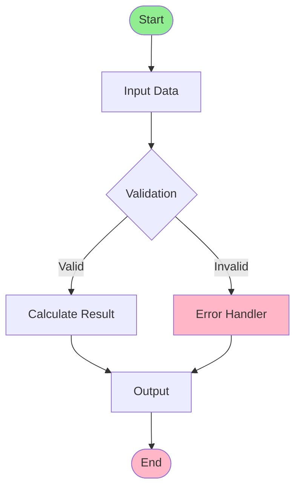

## 2. Sequence Diagram Example

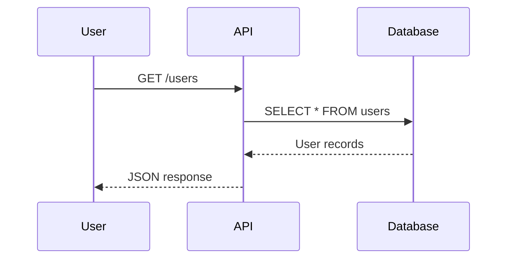

## 3. Class Diagram Example

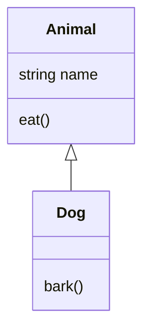

## 4. State Diagram Example

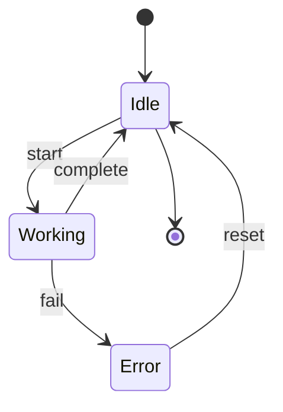

## 5. ER Diagram Example

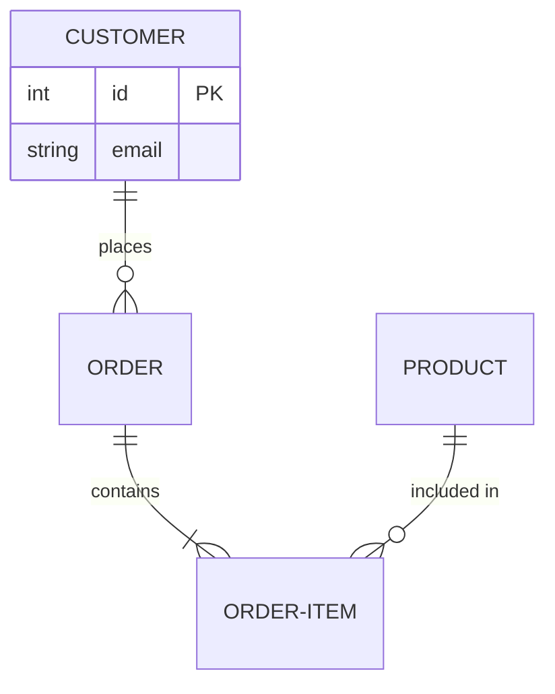

## 6. Gantt Chart Example

```mermaid
gantt
 title Project Schedule
 dateFormat YYYY-MM-DD
 
 section Phase 1
 Design :des, 2025-01-01, 30d
 Implementation :impl, after:des, 45d
 Testing :test, after:impl, 20d
```

## 7. Mindmap Example

```mermaid
mindmap
 root((Project))
 Planning
 Timeline
 Resources
 Execution
 Development
 Testing
 Delivery
 Deployment
 Documentation
```

## 8. Timeline Example

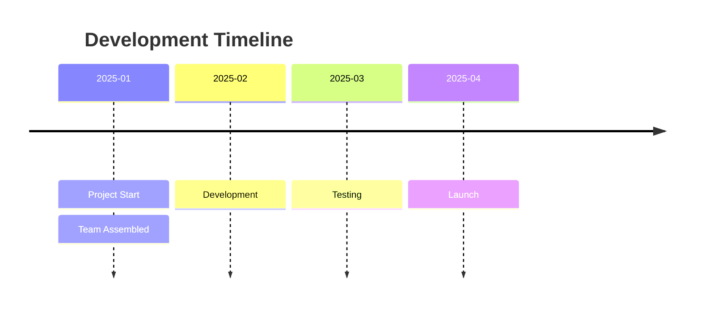

## 9. Git Graph Example

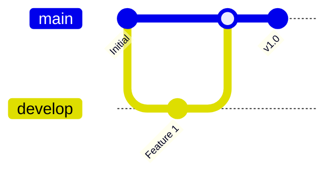

## 10. C4 Diagram Example

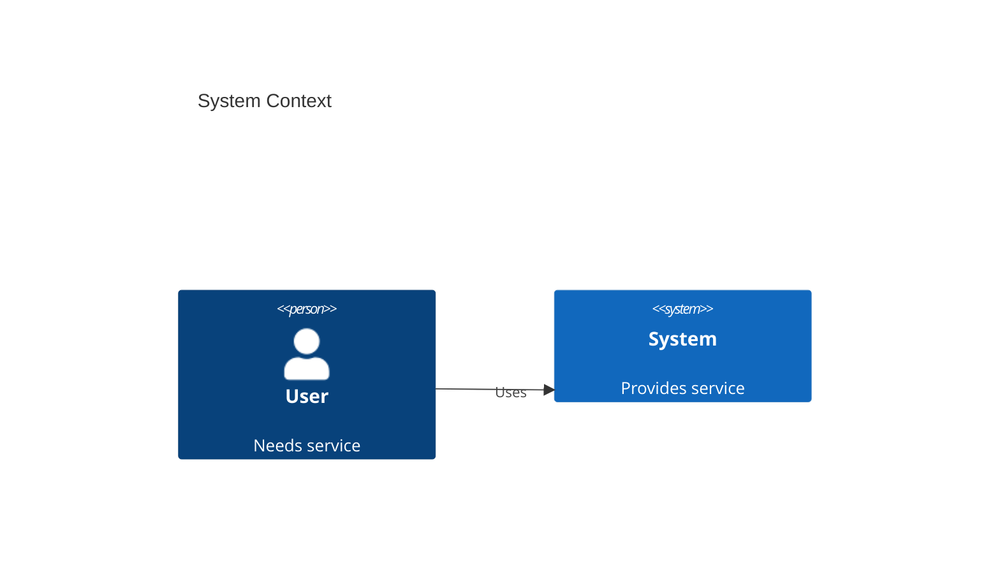

## 11. User Journey Example

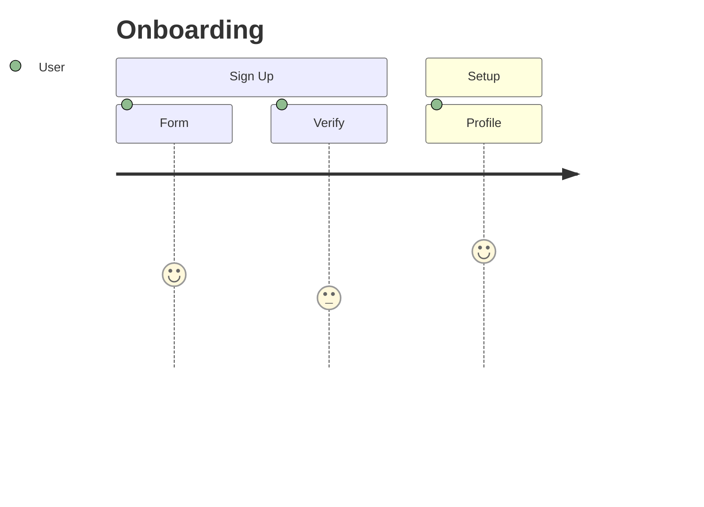

## 12. Requirement Diagram Example

```mermaid
requirementDiagram
 requirement REQ1 {
 id: 1
 text: Authentication
 risk: High
 }
 element webapp {
 type: Software
 }
 REQ1 - satisfies - webapp
```

## 13. Pie Chart Example

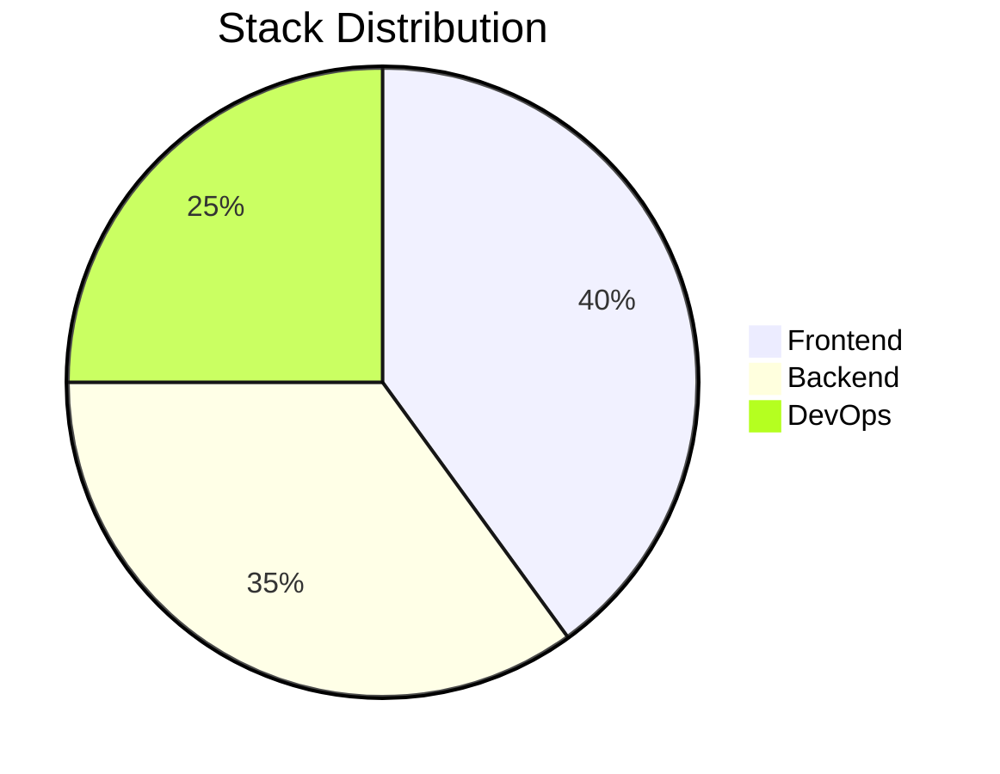

## 14. Quadrant Chart Example

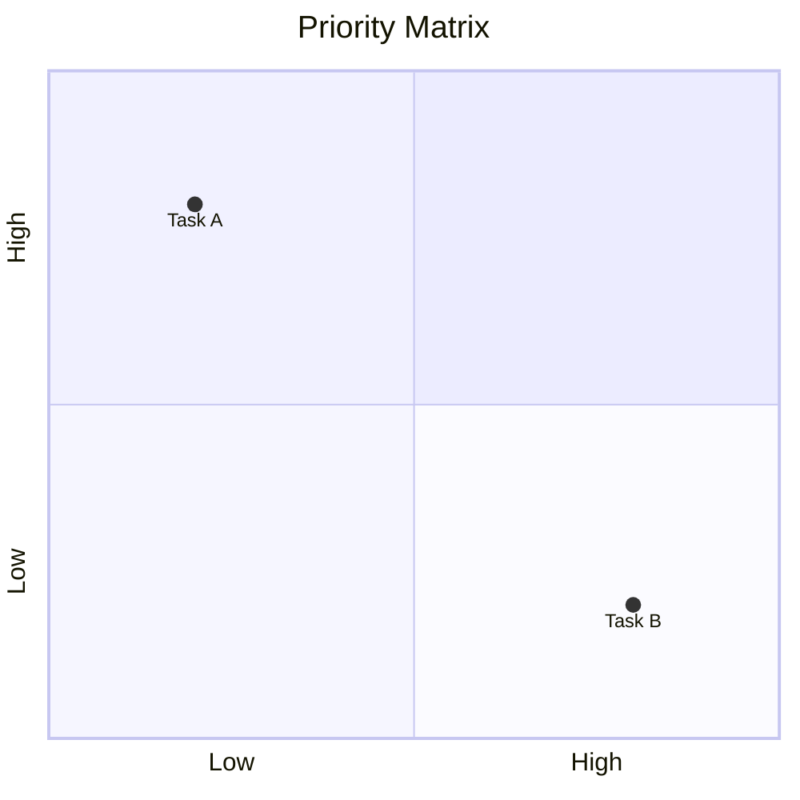

## 15. XY Chart Example

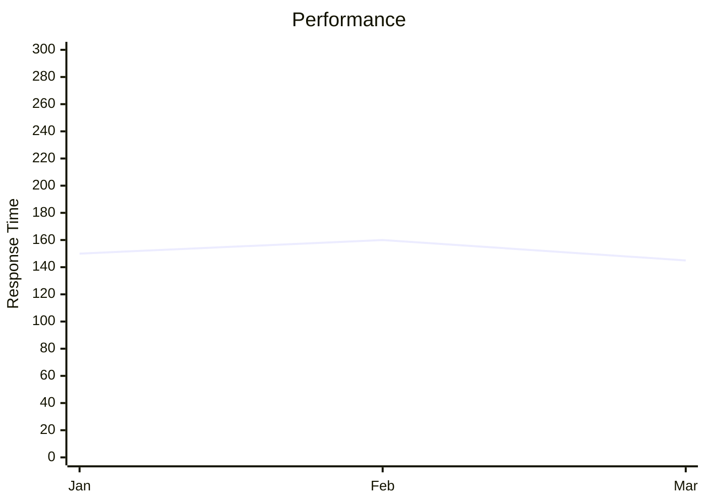

## 16. Block Diagram Example

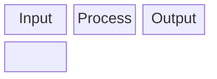

## 17. Kanban Example

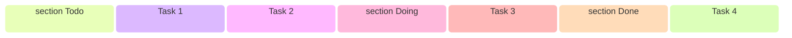

## 18. Sankey Diagram Example

```mermaid
sankey-beta
 Users, 100
 Users, Development, 60
 Users, QA, 40
 Development, Production, 60
 QA, Production, 40
```

## 19. Packet Diagram Example


## 20. Radar Chart Example

```mermaid
radar
 title Skills
 Frontend: 90
 Backend: 85
 DevOps: 75
 Design: 70
 max: 100
```

## 21. Architecture Diagram Example

```mermaid
graph TB
 Web["Web App"]
 API["API Server"]
 DB["Database"]
 Cache["Redis"]
 
 Web --> API
 API --> DB
 API --> Cache
```

---

For more examples, visit [mermaid.live](https://mermaid.live)
