# Advanced Mermaid Diagram Patterns (v6.0.0)

## Enterprise Architecture Patterns

### 1. Microservices Architecture with C4 Diagram

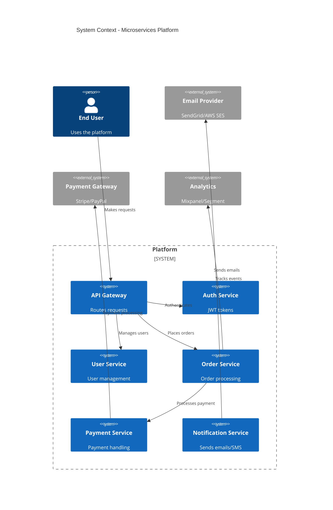

### 2. Complex State Machine (Ecommerce Order Flow)

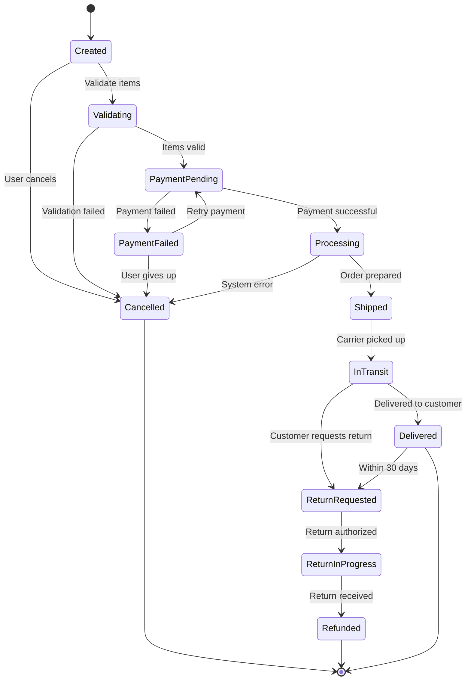

### 3. Multi-Tenant Architecture

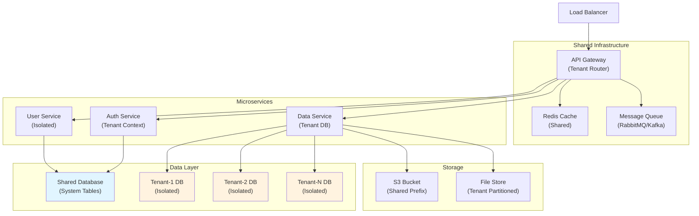

## Integration Pattern Examples

### 1. Event-Driven Architecture

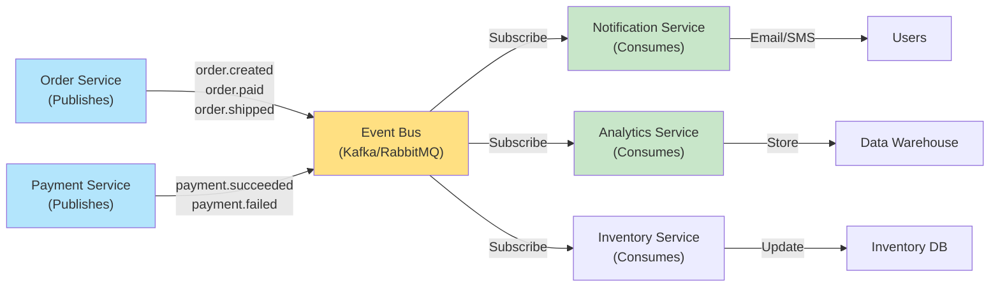

### 2. Data Pipeline Architecture

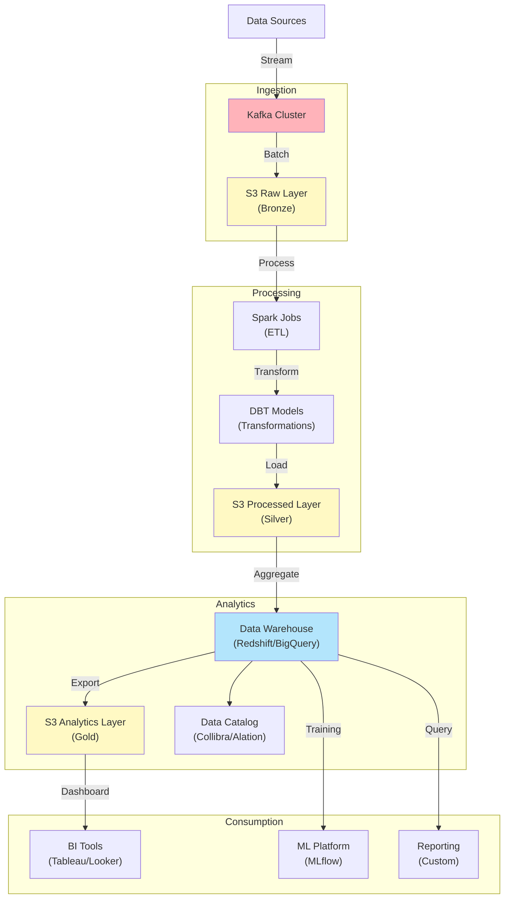

## Advanced Sequence Patterns

### 1. API Request with Error Handling and Retry

```mermaid
sequenceDiagram
 participant Client as Client App
 participant LB as Load Balancer
 participant API as API Server
 participant Cache as Redis Cache
 participant DB as Database
 participant Logger as Log Service

 Client->>+LB: GET /api/users/123
 LB->>+API: Forward request
 API->>+Cache: Check cache

 alt Cache Hit
 Cache-->>-API: Return cached data
 API-->>-LB: 200 OK (cached)
 LB-->>-Client: Return data
 else Cache Miss
 Cache-->>API: Not found
 API->>+DB: Query database

 alt Database Success
 DB-->>-API: Return data
 API->>+Cache: Store in cache
 Cache-->>-API: OK
 API->>Logger: Log success
 API-->>-LB: 200 OK
 LB-->>-Client: Return data
 else Database Timeout (Retry)
 DB-->>API: Timeout
 API->>Logger: Log timeout
 API->>API: Wait 1s
 API->>+DB: Retry query
 DB-->>-API: Success (retry)
 API-->>-LB: 200 OK
 LB-->>-Client: Return data
 else Database Failure
 DB-->>API: Error
 API->>Logger: Log error
 API-->>-LB: 500 Error
 LB-->>-Client: Return error
 end
 end
```

### 2. OAuth2 Authorization Code Flow

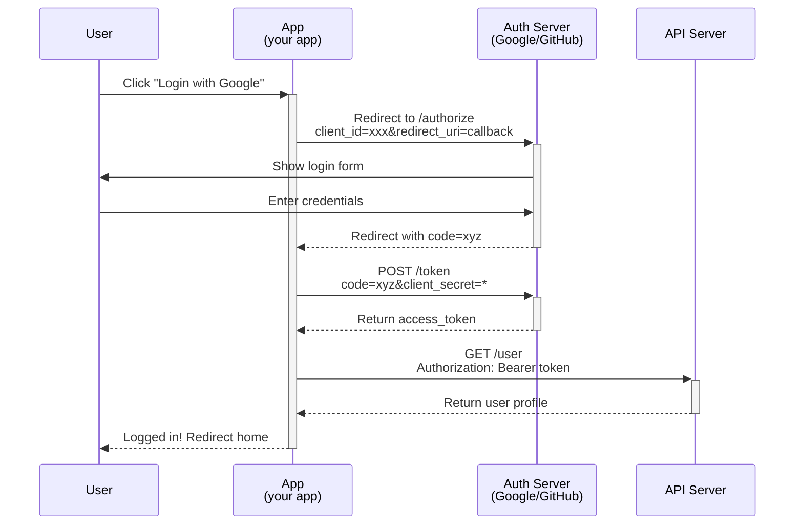

## Performance Optimization Patterns

### 1. Database Query Optimization Flow

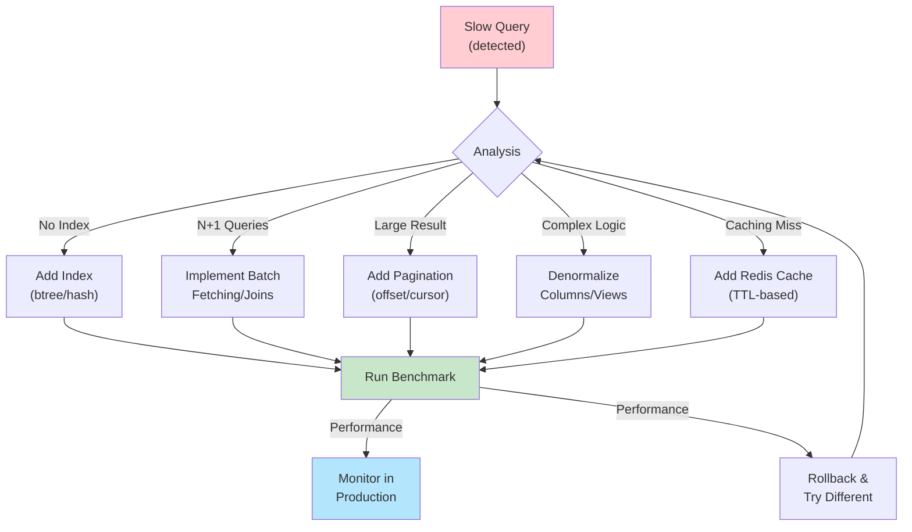

### 2. Frontend Performance Optimization

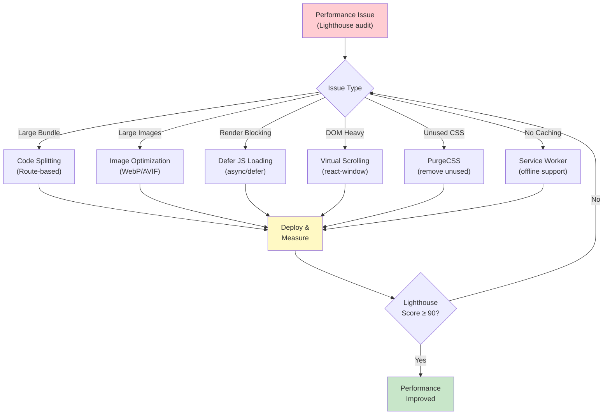

## Testing and QA Patterns

### 1. Test Coverage and Quality Gates

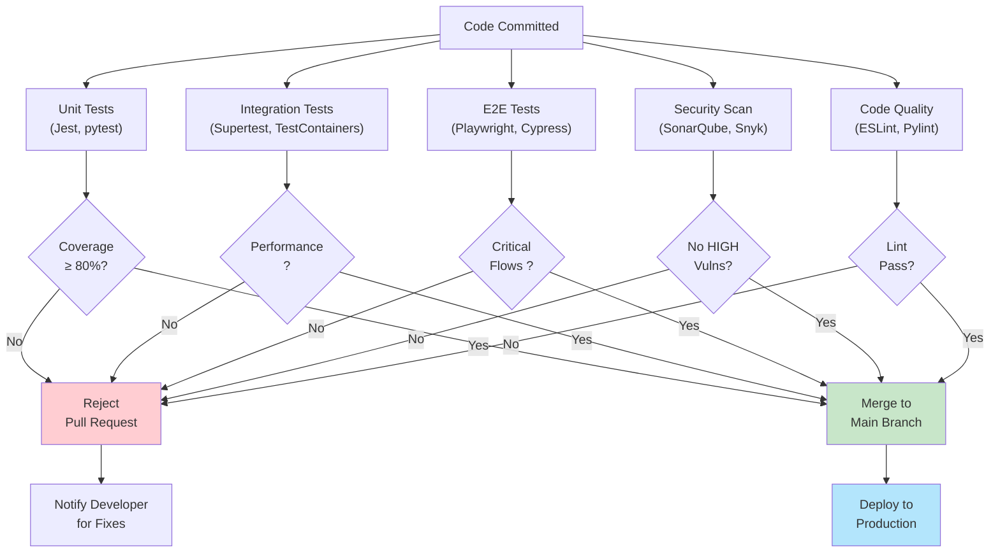

### 2. Incident Response Flow

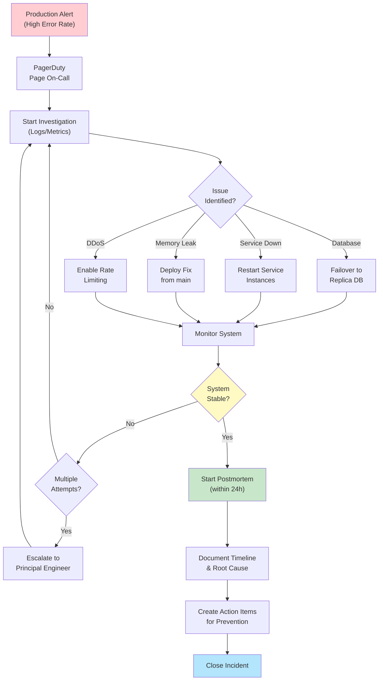

## Context7 Integration Examples

### 1. Mermaid Documentation Workflow

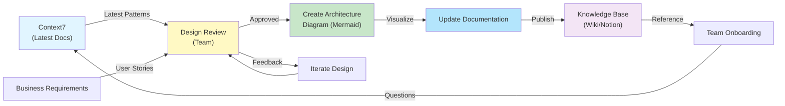

## Best Practices for Complex Diagrams

1. Diagram Size: Keep to <50 nodes for readability
2. Color Coding: Use consistent colors for system components (blue=services, green=databases, orange=external)
3. Labeling: Include technology names (Kafka, PostgreSQL, Redis)
4. Hierarchy: Use subgraphs/boundaries to show ownership/boundaries
5. Arrows: Use descriptive labels on arrows for protocols/data types
6. Version Control: Store diagrams in git with markdown files
7. Documentation: Add context and assumptions in comments above diagrams

---

Version: 6.0.0 | Last Updated: 2025-11-22 | Enterprise Ready:
