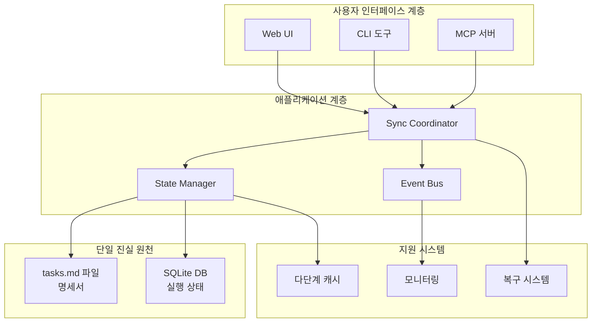
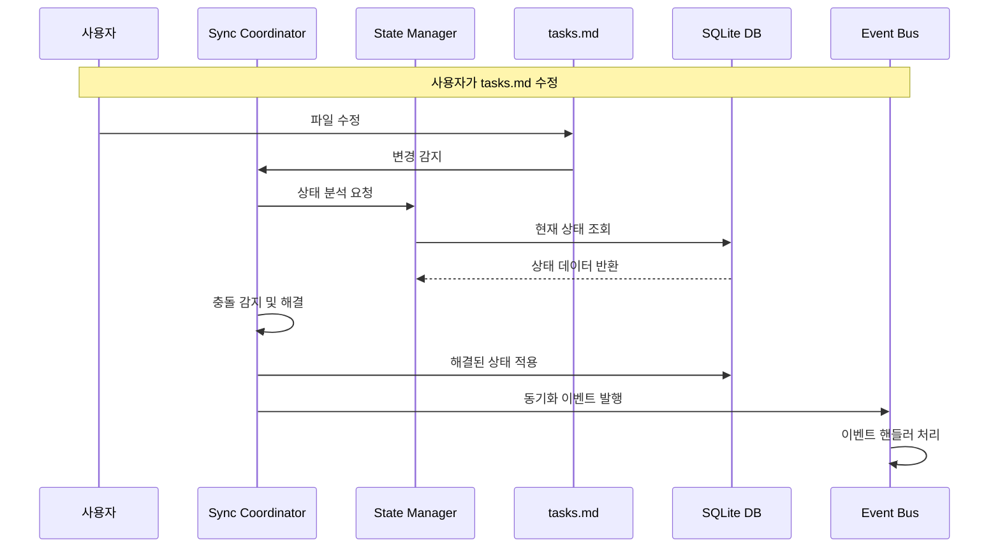

# ZyFlow 단일 진실 원천 아키텍처 설계 문서

## 개요

이 문서는 ZyFlow 프로젝트의 단일 진실 원천(Single Source of Truth) 아키텍처 설계에 대한 포괄적인 가이드입니다. 복잡한 동기화 문제를 해결하고, 안정적이며 확장 가능한 시스템을 구축하기 위한 완전한 아키텍처 솔루션을 제시합니다.

## 아키텍처 목표

### 1. 핵심 목표
- **단일 진실 원천 확보**: tasks.md 파일과 SQLite DB 간의 일관성 보장
- **데이터 무결성**: 모든 상태 변경의 추적 가능성 및 원자성 보장
- **고가용성**: 99.9% 이상의 시스템 가용성 및 장애 복구 능력
- **확장성**: 수평적 확장이 가능한 마이크로서비스 아키텍처
- **성능**: 동기화 지연 100ms 이하의 고성능 처리

### 2. 기술적 목표
- **TypeScript 완전 지원**: 타입 안전성 보장
- **이벤트 기반 아키텍처**: CQRS 패턴 적용
- **동시성 제어**: MVCC 기반의 낙관적 동시성 제어
- **자동 복구**: 셀프 힐링 메커니즘
- **오프라인 지원**: 네트워크 불안정성 대응

## 아키텍처 구성 요소

### 1. 하이브리드 단일 진실 원천

ZyFlow는 하이브리드 방식의 단일 진실 원천을 채택합니다:

- **tasks.md 파일**: 사용자 명세서(Source of Specification)
  - 사용자가 직접 편집하는 명세서 역할
  - 버전 관리 및 협업 기능 제공
  - Git을 통한 변경 이력 추적

- **SQLite DB**: 실행 상태(Source of Runtime State)
  - 시스템의 실제 실행 상태 저장
  - 빠른 조회 및 복잡한 쿼리 지원
  - 트랜잭션 및 동시성 제어

### 2. 핵심 컴포넌트

#### 중앙 동기화 코디네이터 (SyncCoordinator)
```typescript
// 모든 동기화 작업을 조율하는 핵심 컴포넌트
class SyncCoordinator {
  // 3계층 충돌 감지
  detectConflicts(local, remote, base): Conflict[]
  
  // 지능형 충돌 해결
  resolveConflicts(conflicts): Resolution[]
  
  // 원자적 동기화 실행
  executeSync(syncRequest): SyncResult
}
```

#### 이벤트 기반 아키텍처
```typescript
// CQRS 패턴 적용
interface DomainEvent {
  id: string
  type: string
  aggregateId: string
  timestamp: Date
  data: any
  metadata: any
}

// 모든 상태 변경을 이벤트로 기록
class EventStore {
  append(event: DomainEvent): Promise<void>
  getEvents(aggregateId: string): Promise<DomainEvent[]>
  replay(aggregateId: string, version?: number): Promise<any>
}
```

#### 상태 관리 시스템
```typescript
// MVCC 기반 동시성 제어
class StateManager {
  // 낙관적 동시성 제어
  updateStateWithVersion(aggregateId, state, expectedVersion): Promise<void>
  
  // 다중 버전 상태 관리
  readVersion(aggregateId, version?): Promise<VersionedState>
  
  // 충돌 감지 및 해결
  detectAndResolveConflicts(local, remote): Promise<Resolution>
}
```

### 3. 지원 시스템

#### 성능 최적화
- **다단계 캐싱**: L1(메모리) → L2(Redis) → L3(DB)
- **배치 처리**: 대량 동기화 작업의 효율적 처리
- **병렬 처리**: 동시성 제어와 성능의 균형

#### 장애 격리 및 복구
- **서킷 브레이커**: 연쇄적 장애 방지
- **자동 복구**: 장애 감지 및 자동 해결
- **롤백 시스템**: 안전한 상태 복원

## 아키텍처 다이어그램

### 전체 시스템 구조



### 데이터 흐름



## 기술 스택

### 핵심 기술
- **언어**: TypeScript 5.0+
- **데이터베이스**: SQLite (주요), PostgreSQL (이벤트 저장소)
- **캐시**: Redis
- **이벤트 버스**: 내부 구현 또는 Redis Streams
- **파일 시스템**: Node.js fs 모듈 + chokidar

### 개발 도구
- **테스트**: Jest + Supertest + K6
- **모니터링**: Prometheus + Grafana
- **CI/CD**: GitHub Actions
- **문서**: Mermaid 다이어그램

## 설계 문서 구조

이 아키텍처 설계는 다음 문서들로 구성됩니다:

### 1. 핵심 아키텍처 문서
- [`single-source-of-truth.md`](./single-source-of-truth.md): 하이브리드 단일 진실 원천 전략
- [`sync-coordinator-design.md`](./sync-coordinator-design.md): 중앙 동기화 코디네이터 설계
- [`event-driven-cqrs-design.md`](./event-driven-cqrs-design.md): 이벤트 기반 아키텍처 및 CQRS 패턴

### 2. 시스템 설계 문서
- [`state-management-concurrency.md`](./state-management-concurrency.md): 상태 관리 및 동시성 제어
- [`performance-scalability.md`](./performance-scalability.md): 성능 및 확장성 최적화
- [`fault-isolation-recovery.md`](./fault-isolation-recovery.md): 장애 격리 및 자동 복구

### 3. 구현 가이드
- [`core-interfaces-types.md`](./core-interfaces-types.md): 핵심 인터페이스 및 타입 정의
- [`architecture-diagrams.md`](./architecture-diagrams.md): 아키텍처 다이어그램 및 시각화
- [`migration-strategy.md`](./migration-strategy.md): 마이그레이션 전략 및 로드맵
- [`integration-testing-strategy.md`](./integration-testing-strategy.md): 통합 테스트 전략

## 구현 로드맵

### 1단계: 기반 인프라 구축 (2주)
- 이벤트 저장소 구축
- 상태 관리자 기본 구현
- 모니터링 시스템 연동

### 2단계: 이벤트 시스템 도입 (3주)
- 도메인 이벤트 정의
- 이벤트 핸들러 구현
- File Watcher 확장

### 3단계: 상태 관리 및 동시성 제어 (4주)
- MVCC 구현
- 충돌 감지기 통합
- 자동 충돌 해결기 구현

### 4단계: 고급 기능 통합 (3주)
- 다단계 캐싱 시스템
- 서킷 브레이커 패턴
- 자동 복구 시스템

### 5단계: 전면 전환 및 레거시 제거 (2주)
- 트래픽 점진적 전환
- 데이터 최종 동기화
- 레거시 코드 제거

## 성공 지표

### 기술적 지표
- **동기화 지연 시간**: 100ms 이하
- **시스템 가용성**: 99.9% 이상
- **충돌 해결률**: 90% 이상
- **오류율**: 0.1% 이하

### 운영적 지표
- **롤백 횟수**: 2회 이하
- **장애 복구 시간**: 5분 이하
- **팀 생산성**: 90% 이상 유지

### 비즈니스 지표
- **사용자 만족도**: 4.5/5 이상
- **기능 완성도**: 100%
- **비용 효율성**: 20% 개선

## 위험 관리

### 기술적 위험 완화
- **데이터 손실**: 정기 백업, 롤백 계획
- **성능 저하**: 성능 테스트, 점진적 전환
- **호환성 문제**: 이중 운영, 호환성 테스트

### 운영적 위험 완화
- **다운타임**: 카나리 배포, 블루-그린 배포
- **팀 피로도**: 단계적 마이그레이션, 충분한 휴식
- **일정 지연**: 여유 시간 확보, 우선순위 조정

## 결론

ZyFlow 단일 진실 원천 아키텍처는 복잡한 동기화 문제를 해결하기 위한 포괄적인 솔루션을 제공합니다. 하이브리드 방식의 단일 진실 원천, 이벤트 기반 아키텍처, 그리고 강력한 동시성 제어 메커니즘을 통해 안정적이고 확장 가능한 시스템을 구축할 수 있습니다.

이 아키텍처의 핵심 강점:

1. **안정성**: 다중 계층의 장애 격리 및 자동 복구
2. **확장성**: 마이크로서비스 기반의 수평적 확장
3. **성능**: 다단계 캐싱과 최적화된 동기화
4. **유지보수성**: 명확한 인터페이스와 포괄적인 테스트
5. **미래 대비**: 유연한 아키텍처로 기술 변화에 대응

이 설계 문서를 통해 개발팀은 명확한 방향성을 가지고 ZyFlow의 차세대 아키텍처를 성공적으로 구축할 수 있을 것입니다.

---

## 시작 가이드

### 개발 환경 설정
```bash
# 의존성 설치
npm install

# 테스트 환경 설정
npm run test:setup

# 개발 서버 시작
npm run dev
```

### 아키텍처 학습 순서
1. [`single-source-of-truth.md`](./single-source-of-truth.md) - 아키텍처 전체 이해
2. [`sync-coordinator-design.md`](./sync-coordinator-design.md) - 핵심 동기화 메커니즘
3. [`event-driven-cqrs-design.md`](./event-driven-cqrs-design.md) - 이벤트 기반 설계
4. [`migration-strategy.md`](./migration-strategy.md) - 구현 계획
5. [`integration-testing-strategy.md`](./integration-testing-strategy.md) - 테스트 전략

### 기여 가이드
- 모든 코드 변경은 해당 테스트를 포함해야 합니다
- 새로운 기능은 먼저 설계 문서에 논의되어야 합니다
- 성능 영향은 반드시 측정하고 문서화해야 합니다
- 아키텍처 변경은 팀 리뷰를 거쳐야 합니다