# 아키텍처 다이어그램 및 데이터 흐름 시각화

## 개요

ZyFlow 단일 진실 원천 아키텍처의 복잡한 컴포넌트 간의 관계와 데이터 흐름을 시각화하여 시스템의 동작 방식을 명확하게 이해할 수 있도록 합니다. 이 다이어그램들은 개발자, 시스템 관리자, 및 이해관계자들이 아키텍처를 쉽게 파악할 수 있도록 돕습니다.

## 전체 아키텍처 다이어그램

### 1. 시스템 전체 구조도

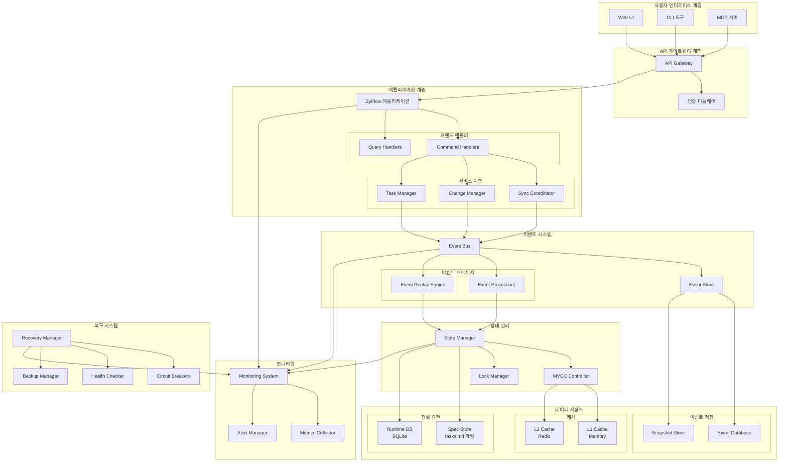

### 2. 데이터 흐름 다이어그램

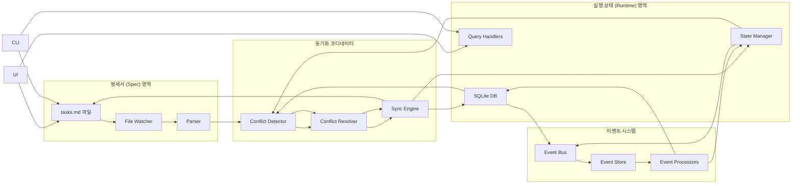

## 컴포넌트 상세 다이어그램

### 1. 동기화 코디네이터 상세 흐름

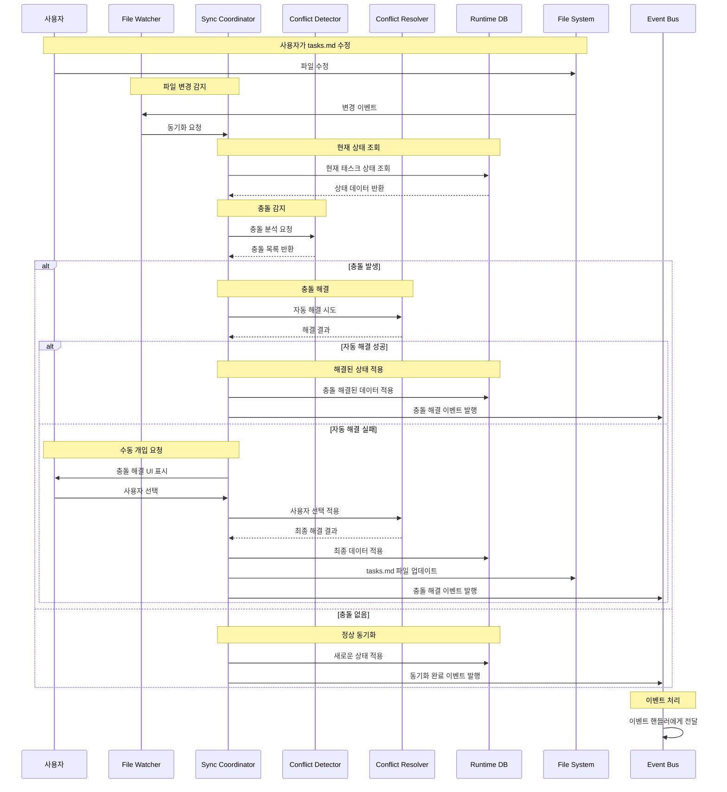

### 2. 이벤트 기반 CQRS 흐름

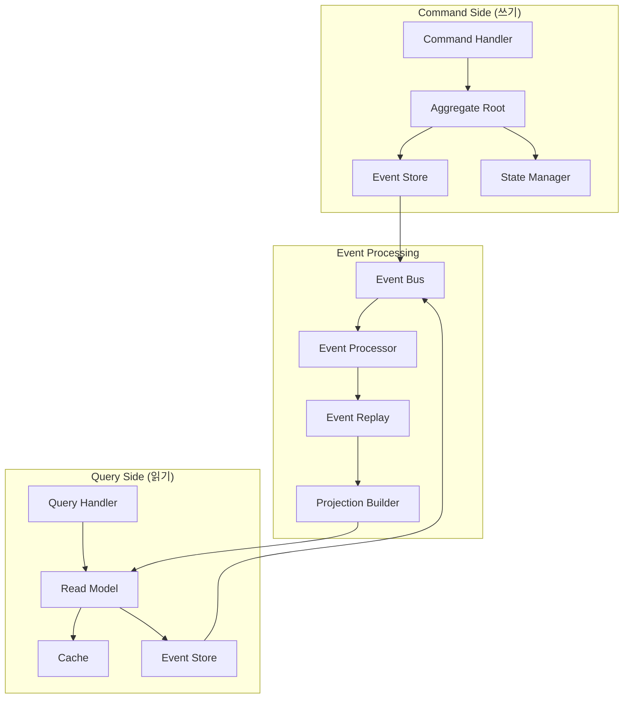

### 3. 상태 관리 및 동시성 제어 흐름

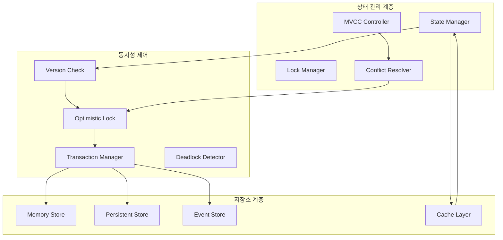

### 4. 장애 격리 및 복구 흐름

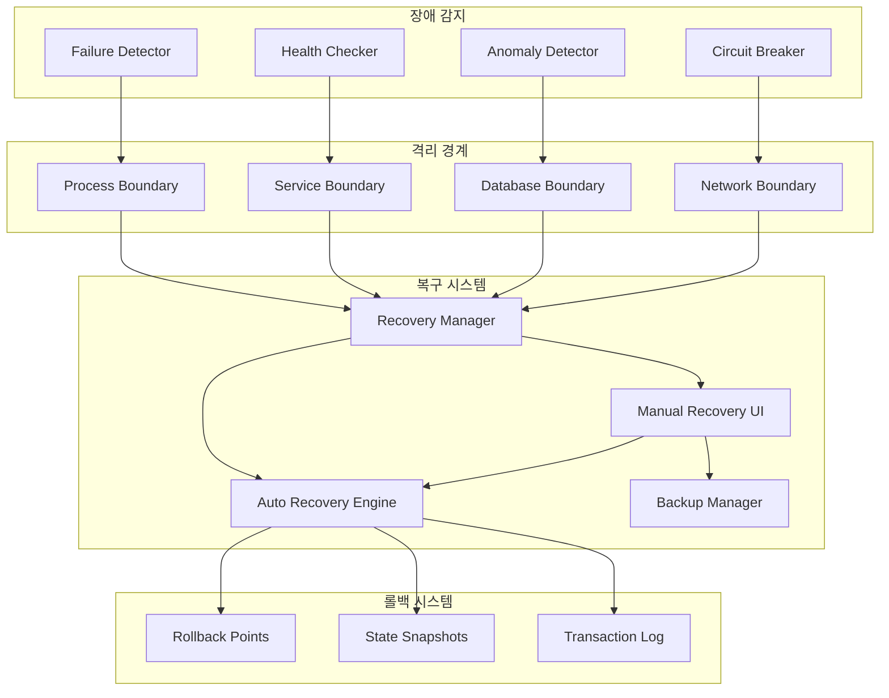

## 데이터 모델 관계도

### 1. 태스크 데이터 모델

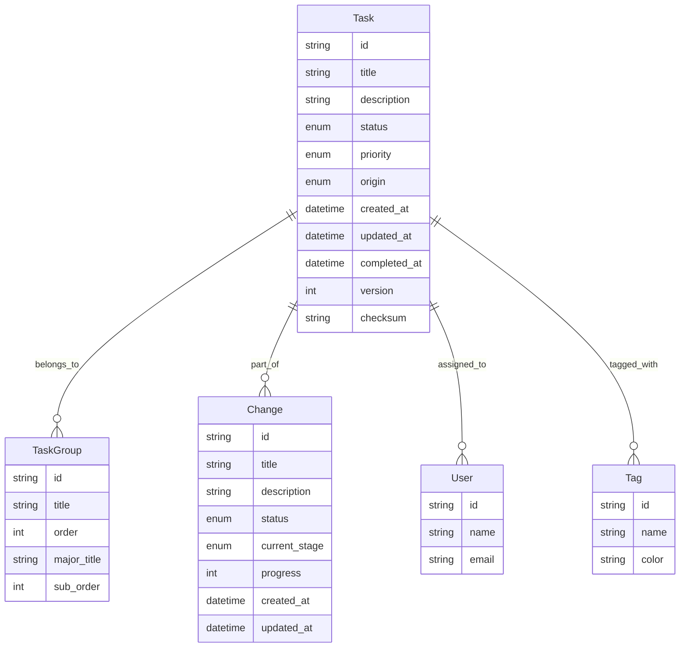

### 2. 이벤트 데이터 모델

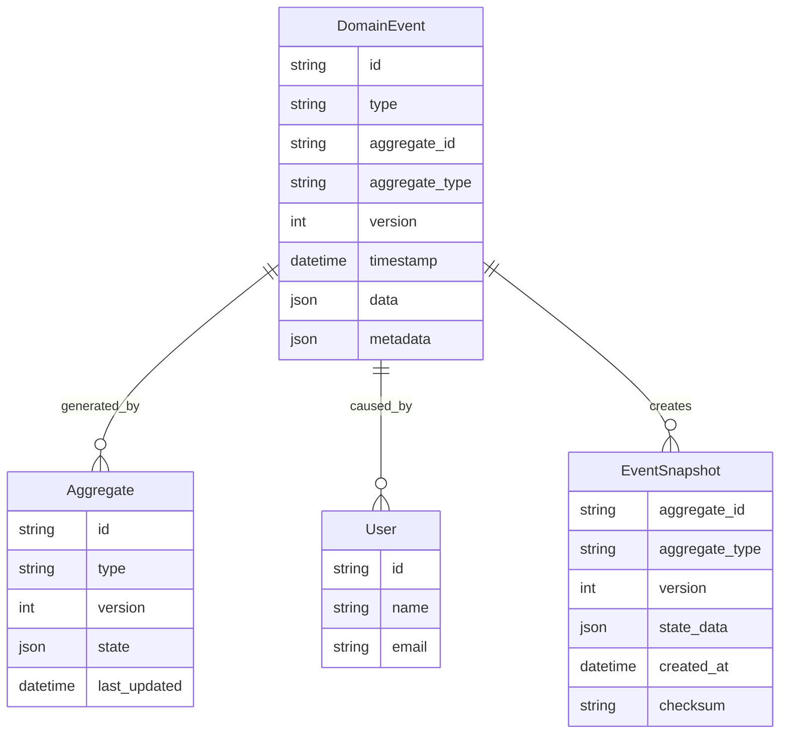

## 배포 아키텍처

### 1. 마이크로서비스 아키텍처

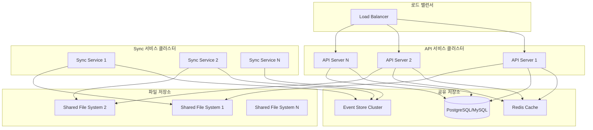

### 2. 하이브리드 클라우드 아키텍처

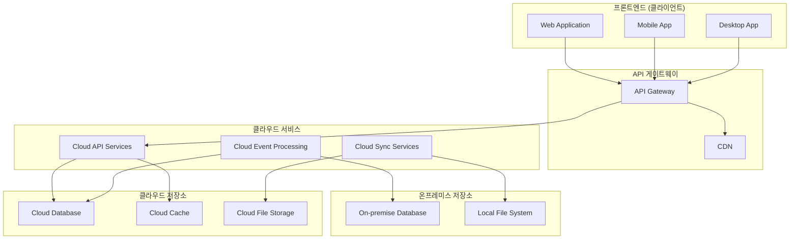

## 성능 최적화 다이어그램

### 1. 캐싱 전략

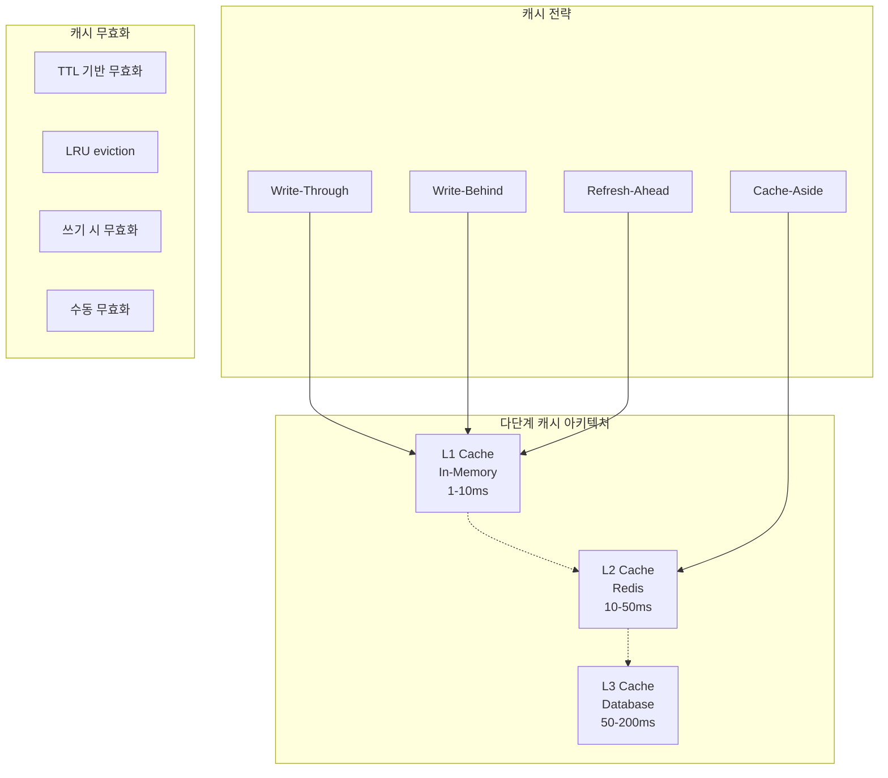

### 2. 데이터베이스 최적화

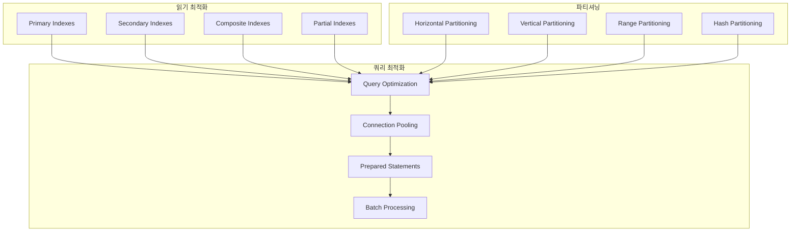

## 모니터링 및 관찰 가능성

### 1. 모니터링 아키텍처

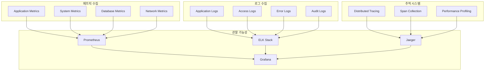

### 2. 알림 시스템

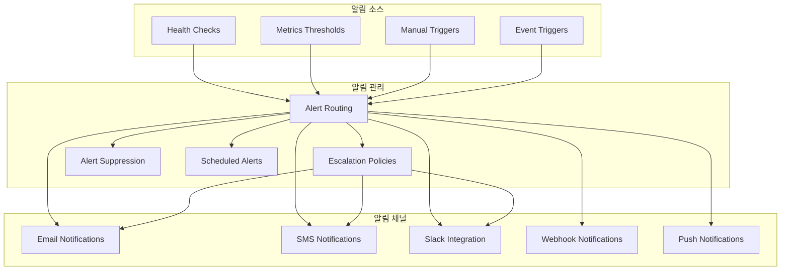

## 결론

이 아키텍처 다이어그램들은 ZyFlow 단일 진실 원천 시스템의 복잡성을 시각적으로 표현하여 다음과 같은 이점들을 제공합니다:

1. **전체 시스템 구조**: 모든 컴포넌트 간의 관계와 의존성 명확화
2. **데이터 흐름**: 명세서와 실행 상태 간의 동기화 과정 상세화
3. **컴포넌트 상호작용**: 각 컴포넌트의 내부 동작 방식 시각화
4. **배포 전략**: 다양한 배포 환경에서의 아키텍처 적용 방안
5. **최적화 전략**: 성능 향상을 위한 다양한 최적화 기법 시각화
6. **모니터링 아키텍처**: 시스템 상태 모니터링과 알림 구조

이 다이어그램들은 개발팀이 시스템을 이해하고, 문제를 진단하며, 새로운 기능을 추가할 때 중요한 참고 자료로 활용될 것입니다.