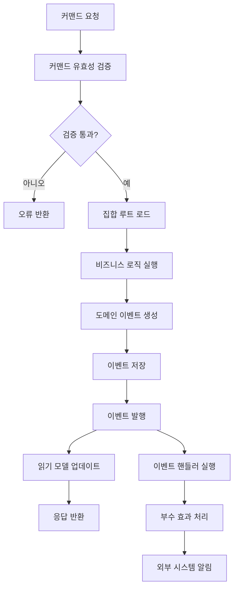
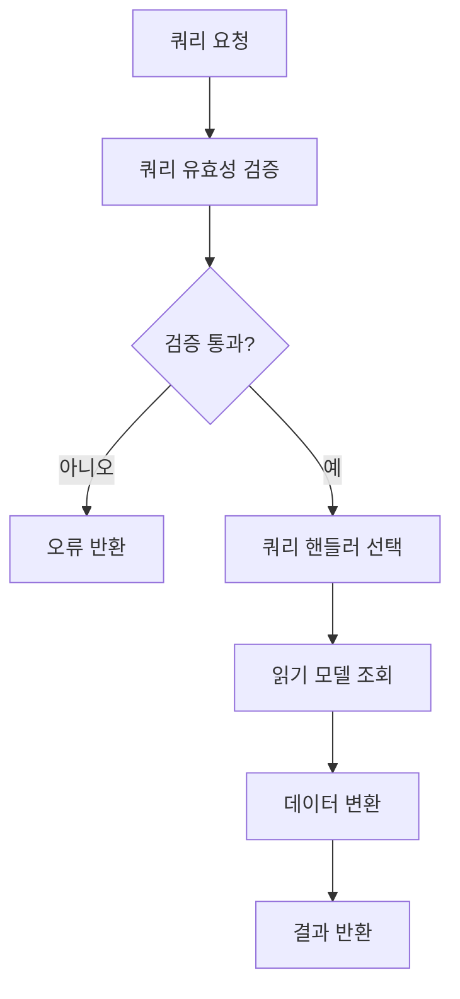
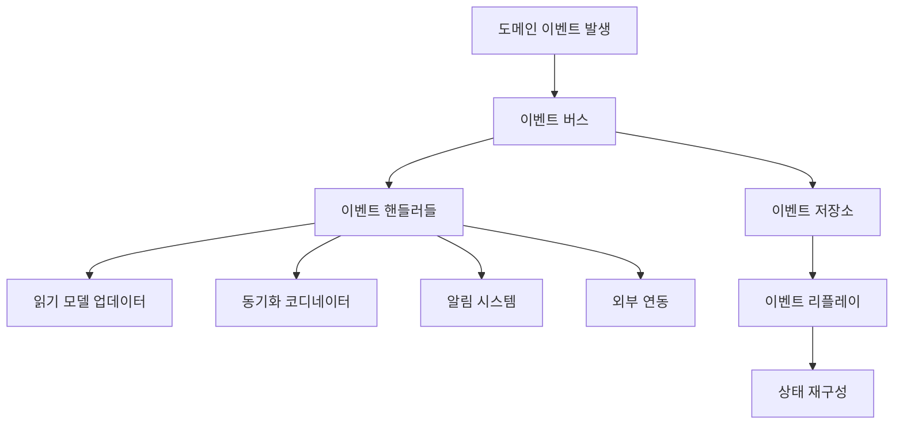

# 이벤트 기반 아키텍처 및 CQRS 패턴 설계

## 개요

ZyFlow의 단일 진실 원천 아키텍처는 이벤트 기반 아키텍처(Event-Driven Architecture)와 CQRS(Command Query Responsibility Segregation) 패턴을 적용하여 시스템의 확장성, 유연성, 및 유지보수성을 향상시킵니다. 이 설계는 모든 상태 변경을 불변 이벤트로 기록하고, 읽기와 쓰기 책임을 분리하여 시스템의 복잡성을 관리합니다.

## 핵심 원칙

### 1. 이벤트 소싱 (Event Sourcing)
- 모든 상태 변경은 도메인 이벤트로 기록
- 이벤트는 불변(Immutable)이며 순서가 보장됨
- 현재 상태는 이벤트 스트림을 재생하여 재구성

### 2. CQRS (Command Query Responsibility Segregation)
- Command: 상태를 변경하는 작업 (쓰기)
- Query: 상태를 조회하는 작업 (읽기)
- 읽기 모델과 쓰기 모델의 완전한 분리

### 3. 최종 일관성 (Eventual Consistency)
- 시스템 구성 요소 간의 일관성은 비동기적으로 보장
- 이벤트를 통한 느슨한 결합(Loose Coupling)

## 아키텍처 구성 요소

### 1. 도메인 이벤트 (Domain Events)

```typescript
// 기본 이벤트 인터페이스
interface DomainEvent {
  id: string
  type: string
  aggregateId: string
  aggregateType: string
  version: number
  timestamp: number
  
  // 이벤트 데이터
  data: Record<string, unknown>
  
  // 메타데이터
  metadata: {
    userId?: string
    correlationId?: string
    causationId?: string
    [key: string]: unknown
  }
}

// 태스크 관련 이벤트
interface TaskCreatedEvent extends DomainEvent {
  type: 'TaskCreated'
  data: {
    taskId: string
    changeId: string
    title: string
    description?: string
    status: TaskStatus
    priority: TaskPriority
    assignee?: string
  }
}

interface TaskUpdatedEvent extends DomainEvent {
  type: 'TaskUpdated'
  data: {
    taskId: string
    changes: Partial<Task>
    previousValues: Partial<Task>
  }
}

interface TaskCompletedEvent extends DomainEvent {
  type: 'TaskCompleted'
  data: {
    taskId: string
    completedAt: number
    completedBy: string
  }
}

// 변경(Change) 관련 이벤트
interface ChangeCreatedEvent extends DomainEvent {
  type: 'ChangeCreated'
  data: {
    changeId: string
    title: string
    description?: string
    specPath?: string
  }
}

interface ChangeStatusUpdatedEvent extends DomainEvent {
  type: 'ChangeStatusUpdated'
  data: {
    changeId: string
    previousStatus: ChangeStatus
    newStatus: ChangeStatus
    updatedBy: string
  }
}

// 동기화 관련 이벤트
interface SyncStartedEvent extends DomainEvent {
  type: 'SyncStarted'
  data: {
    syncId: string
    changeId: string
    syncType: SyncType
    direction: SyncDirection
  }
}

interface SyncCompletedEvent extends DomainEvent {
  type: 'SyncCompleted'
  data: {
    syncId: string
    changeId: string
    result: SyncResult
  }
}

interface ConflictDetectedEvent extends DomainEvent {
  type: 'ConflictDetected'
  data: {
    conflictId: string
    changeId: string
    conflictType: ConflictType
    description: string
    specValue: unknown
    runtimeValue: unknown
  }
}
```

### 2. 커맨드 (Commands)

```typescript
// 기본 커맨드 인터페이스
interface Command {
  id: string
  type: string
  aggregateId: string
  userId: string
  timestamp: number
  
  // 커맨드 데이터
  data: Record<string, unknown>
  
  // 메타데이터
  metadata?: {
    correlationId?: string
    expectedVersion?: number
    [key: string]: unknown
  }
}

// 태스크 커맨드
interface CreateTaskCommand extends Command {
  type: 'CreateTask'
  data: {
    changeId: string
    title: string
    description?: string
    priority?: TaskPriority
    assignee?: string
  }
}

interface UpdateTaskCommand extends Command {
  type: 'UpdateTask'
  data: {
    taskId: string
    changes: Partial<Task>
  }
}

interface CompleteTaskCommand extends Command {
  type: 'CompleteTask'
  data: {
    taskId: string
    completedBy: string
  }
}

// 동기화 커맨드
interface StartSyncCommand extends Command {
  type: 'StartSync'
  data: {
    changeId: string
    syncType: SyncType
    direction: SyncDirection
    options?: SyncOptions
  }
}

interface ResolveConflictCommand extends Command {
  type: 'ResolveConflict'
  data: {
    conflictId: string
    strategy: ResolutionStrategy
    resolution: unknown
  }
}
```

### 3. 쿼리 (Queries)

```typescript
// 기본 쿼리 인터페이스
interface Query<T = unknown> {
  id: string
  type: string
  parameters: Record<string, unknown>
  
  // 쿼리 옵션
  options?: {
    include?: string[]
    exclude?: string[]
    sort?: Record<string, 'ASC' | 'DESC'>
    limit?: number
    offset?: number
  }
}

// 태스크 쿼리
interface GetTaskQuery extends Query<Task> {
  type: 'GetTask'
  parameters: {
    taskId: string
  }
}

interface ListTasksQuery extends Query<Task[]> {
  type: 'ListTasks'
  parameters: {
    changeId?: string
    status?: TaskStatus
    assignee?: string
    priority?: TaskPriority
  }
}

interface SearchTasksQuery extends Query<Task[]> {
  type: 'SearchTasks'
  parameters: {
    query: string
    filters?: {
      status?: TaskStatus[]
      priority?: TaskPriority[]
      dateRange?: {
        start: number
        end: number
      }
    }
  }
}

// 변경 쿼리
interface GetChangeQuery extends Query<Change> {
  type: 'GetChange'
  parameters: {
    changeId: string
  }
}

interface ListChangesQuery extends Query<Change[]> {
  type: 'ListChanges'
  parameters: {
    status?: ChangeStatus
    stage?: Stage
  }
}

// 동기화 쿼리
interface GetSyncStatusQuery extends Query<SyncStatus> {
  type: 'GetSyncStatus'
  parameters: {
    changeId: string
  }
}

interface GetSyncHistoryQuery extends Query<SyncHistory[]> {
  type: 'GetSyncHistory'
  parameters: {
    changeId: string
    timeRange?: {
      start: number
      end: number
    }
  }
}
```

### 4. 이벤트 버스 (Event Bus)

```typescript
interface EventBus {
  // 이벤트 발행
  publish<T extends DomainEvent>(event: T): Promise<void>
  publishBatch<T extends DomainEvent>(events: T[]): Promise<void>
  
  // 이벤트 구독
  subscribe<T extends DomainEvent>(
    eventType: string,
    handler: EventHandler<T>
  ): UnsubscribeFunction
  
  // 이벤트 스트림
  getEventStream(filter?: EventFilter): AsyncIterable<DomainEvent>
  replayEvents(fromTimestamp: number, filter?: EventFilter): AsyncIterable<DomainEvent>
  
  // 이벤트 저장
  saveEvents(events: DomainEvent[]): Promise<void>
  getEvents(filter?: EventFilter): Promise<DomainEvent[]>
}

type EventHandler<T extends DomainEvent> = (event: T) => Promise<void> | void
type UnsubscribeFunction = () => void

interface EventFilter {
  eventTypes?: string[]
  aggregateIds?: string[]
  aggregateTypes?: string[]
  timeRange?: {
    start: number
    end: number
  }
  userIds?: string[]
}

// 구현체
class InMemoryEventBus implements EventBus {
  private handlers = new Map<string, Set<EventHandler<DomainEvent>>>()
  private events: DomainEvent[] = []
  
  async publish<T extends DomainEvent>(event: T): Promise<void> {
    // 이벤트 저장
    this.events.push(event)
    
    // 핸들러 실행
    const handlers = this.handlers.get(event.type)
    if (handlers) {
      await Promise.allSettled(
        Array.from(handlers).map(handler => 
          Promise.resolve(handler(event)).catch(error => 
            console.error(`Event handler error for ${event.type}:`, error)
          )
        )
      )
    }
  }
  
  subscribe<T extends DomainEvent>(
    eventType: string,
    handler: EventHandler<T>
  ): UnsubscribeFunction {
    if (!this.handlers.has(eventType)) {
      this.handlers.set(eventType, new Set())
    }
    
    this.handlers.get(eventType)!.add(handler)
    
    return () => {
      this.handlers.get(eventType)?.delete(handler)
    }
  }
  
  async *getEventStream(filter?: EventFilter): AsyncIterable<DomainEvent> {
    for (const event of this.events) {
      if (this.matchesFilter(event, filter)) {
        yield event
      }
    }
  }
  
  private matchesFilter(event: DomainEvent, filter?: EventFilter): boolean {
    if (!filter) return true
    
    if (filter.eventTypes && !filter.eventTypes.includes(event.type)) {
      return false
    }
    
    if (filter.aggregateIds && !filter.aggregateIds.includes(event.aggregateId)) {
      return false
    }
    
    if (filter.timeRange) {
      const { start, end } = filter.timeRange
      if (event.timestamp < start || event.timestamp > end) {
        return false
      }
    }
    
    return true
  }
}
```

### 5. 커맨드 핸들러 (Command Handlers)

```typescript
interface CommandHandler<T extends Command> {
  handle(command: T): Promise<DomainEvent[]>
  canHandle(command: Command): command is T
}

// 태스크 커맨드 핸들러
class TaskCommandHandler implements CommandHandler<CreateTaskCommand | UpdateTaskCommand | CompleteTaskCommand> {
  constructor(
    private taskRepository: TaskRepository,
    private eventBus: EventBus
  ) {}
  
  canHandle(command: Command): command is CreateTaskCommand | UpdateTaskCommand | CompleteTaskCommand {
    return ['CreateTask', 'UpdateTask', 'CompleteTask'].includes(command.type)
  }
  
  async handle(command: CreateTaskCommand | UpdateTaskCommand | CompleteTaskCommand): Promise<DomainEvent[]> {
    switch (command.type) {
      case 'CreateTask':
        return await this.handleCreateTask(command as CreateTaskCommand)
      case 'UpdateTask':
        return await this.handleUpdateTask(command as UpdateTaskCommand)
      case 'CompleteTask':
        return await this.handleCompleteTask(command as CompleteTaskCommand)
      default:
        throw new Error(`Unsupported command type: ${command.type}`)
    }
  }
  
  private async handleCreateTask(command: CreateTaskCommand): Promise<DomainEvent[]> {
    const { data } = command
    const taskId = generateTaskId()
    
    // 비즈니스 규칙 검증
    await this.validateCreateTask(data)
    
    const event: TaskCreatedEvent = {
      id: generateEventId(),
      type: 'TaskCreated',
      aggregateId: taskId,
      aggregateType: 'Task',
      version: 1,
      timestamp: Date.now(),
      data: {
        taskId,
        changeId: data.changeId,
        title: data.title,
        description: data.description,
        status: 'todo',
        priority: data.priority || 'medium',
        assignee: data.assignee
      },
      metadata: {
        userId: command.userId,
        correlationId: command.metadata?.correlationId
      }
    }
    
    // 이벤트 발행
    await this.eventBus.publish(event)
    
    return [event]
  }
  
  private async handleUpdateTask(command: UpdateTaskCommand): Promise<DomainEvent[]> {
    const { data } = command
    
    // 현재 태스크 상태 조회
    const currentTask = await this.taskRepository.getById(data.taskId)
    if (!currentTask) {
      throw new Error(`Task not found: ${data.taskId}`)
    }
    
    // 비즈니스 규칙 검증
    await this.validateUpdateTask(currentTask, data.changes)
    
    const event: TaskUpdatedEvent = {
      id: generateEventId(),
      type: 'TaskUpdated',
      aggregateId: data.taskId,
      aggregateType: 'Task',
      version: currentTask.version + 1,
      timestamp: Date.now(),
      data: {
        taskId: data.taskId,
        changes: data.changes,
        previousValues: this.extractPreviousValues(currentTask, data.changes)
      },
      metadata: {
        userId: command.userId,
        correlationId: command.metadata?.correlationId
      }
    }
    
    await this.eventBus.publish(event)
    
    return [event]
  }
  
  private async handleCompleteTask(command: CompleteTaskCommand): Promise<DomainEvent[]> {
    const { data } = command
    
    // 현재 태스크 상태 조회
    const currentTask = await this.taskRepository.getById(data.taskId)
    if (!currentTask) {
      throw new Error(`Task not found: ${data.taskId}`)
    }
    
    if (currentTask.status === 'done') {
      throw new Error(`Task already completed: ${data.taskId}`)
    }
    
    const event: TaskCompletedEvent = {
      id: generateEventId(),
      type: 'TaskCompleted',
      aggregateId: data.taskId,
      aggregateType: 'Task',
      version: currentTask.version + 1,
      timestamp: Date.now(),
      data: {
        taskId: data.taskId,
        completedAt: Date.now(),
        completedBy: data.completedBy
      },
      metadata: {
        userId: command.userId,
        correlationId: command.metadata?.correlationId
      }
    }
    
    await this.eventBus.publish(event)
    
    return [event]
  }
}
```

### 6. 쿼리 핸들러 (Query Handlers)

```typescript
interface QueryHandler<T extends Query, R> {
  handle(query: T): Promise<R>
  canHandle(query: Query): query is T
}

// 태스크 쿼리 핸들러
class TaskQueryHandler implements QueryHandler<GetTaskQuery, Task> | QueryHandler<ListTasksQuery, Task[]> | QueryHandler<SearchTasksQuery, Task[]> {
  constructor(
    private taskReadModel: TaskReadModel
  ) {}
  
  canHandle(query: Query): query is GetTaskQuery | ListTasksQuery | SearchTasksQuery {
    return ['GetTask', 'ListTasks', 'SearchTasks'].includes(query.type)
  }
  
  async handle(query: GetTaskQuery | ListTasksQuery | SearchTasksQuery): Promise<Task | Task[]> {
    switch (query.type) {
      case 'GetTask':
        return await this.handleGetTask(query as GetTaskQuery)
      case 'ListTasks':
        return await this.handleListTasks(query as ListTasksQuery)
      case 'SearchTasks':
        return await this.handleSearchTasks(query as SearchTasksQuery)
      default:
        throw new Error(`Unsupported query type: ${query.type}`)
    }
  }
  
  private async handleGetTask(query: GetTaskQuery): Promise<Task> {
    const task = await this.taskReadModel.getById(query.parameters.taskId)
    if (!task) {
      throw new Error(`Task not found: ${query.parameters.taskId}`)
    }
    return task
  }
  
  private async handleListTasks(query: ListTasksQuery): Promise<Task[]> {
    return await this.taskReadModel.list(query.parameters, query.options)
  }
  
  private async handleSearchTasks(query: SearchTasksQuery): Promise<Task[]> {
    return await this.taskReadModel.search(query.parameters.query, query.parameters.filters, query.options)
  }
}
```

### 7. 읽기 모델 (Read Models)

```typescript
// 태스크 읽기 모델
interface TaskReadModel {
  getById(taskId: string): Promise<Task | null>
  list(filters: TaskFilters, options?: QueryOptions): Promise<Task[]>
  search(query: string, filters?: TaskFilters, options?: QueryOptions): Promise<Task[]>
  
  // 이벤트 처리
  applyTaskCreated(event: TaskCreatedEvent): Promise<void>
  applyTaskUpdated(event: TaskUpdatedEvent): Promise<void>
  applyTaskCompleted(event: TaskCompletedEvent): Promise<void>
}

interface TaskFilters {
  changeId?: string
  status?: TaskStatus
  assignee?: string
  priority?: TaskPriority
}

interface QueryOptions {
  sort?: Record<string, 'ASC' | 'DESC'>
  limit?: number
  offset?: number
}

class SQLiteTaskReadModel implements TaskReadModel {
  constructor(private db: Database) {}
  
  async getById(taskId: string): Promise<Task | null> {
    const row = this.db.prepare(`
      SELECT * FROM task_read_model WHERE id = ?
    `).get(taskId)
    
    return row ? this.mapRowToTask(row) : null
  }
  
  async list(filters: TaskFilters, options?: QueryOptions): Promise<Task[]> {
    let query = 'SELECT * FROM task_read_model WHERE 1=1'
    const params: unknown[] = []
    
    // 필터 적용
    if (filters.changeId) {
      query += ' AND change_id = ?'
      params.push(filters.changeId)
    }
    
    if (filters.status) {
      query += ' AND status = ?'
      params.push(filters.status)
    }
    
    if (filters.assignee) {
      query += ' AND assignee = ?'
      params.push(filters.assignee)
    }
    
    if (filters.priority) {
      query += ' AND priority = ?'
      params.push(filters.priority)
    }
    
    // 정렬 적용
    if (options?.sort) {
      const sortFields = Object.entries(options.sort)
        .map(([field, direction]) => `${field} ${direction}`)
        .join(', ')
      query += ` ORDER BY ${sortFields}`
    }
    
    // 페이징 적용
    if (options?.limit) {
      query += ' LIMIT ?'
      params.push(options.limit)
      
      if (options.offset) {
        query += ' OFFSET ?'
        params.push(options.offset)
      }
    }
    
    const rows = this.db.prepare(query).all(...params)
    return rows.map(row => this.mapRowToTask(row))
  }
  
  async search(query: string, filters?: TaskFilters, options?: QueryOptions): Promise<Task[]> {
    // 전문 검색 구현
    let sql = `
      SELECT * FROM task_read_model 
      WHERE title LIKE ? OR description LIKE ?
    `
    const params = [`%${query}%`, `%${query}%`]
    
    // 추가 필터 적용
    if (filters) {
      if (filters.changeId) {
        sql += ' AND change_id = ?'
        params.push(filters.changeId)
      }
      // ... 다른 필터들
    }
    
    const rows = this.db.prepare(sql).all(...params)
    return rows.map(row => this.mapRowToTask(row))
  }
  
  // 이벤트 핸들러
  async applyTaskCreated(event: TaskCreatedEvent): Promise<void> {
    const { data } = event
    
    this.db.prepare(`
      INSERT INTO task_read_model (
        id, change_id, title, description, status, priority, 
        assignee, created_at, updated_at, version
      ) VALUES (?, ?, ?, ?, ?, ?, ?, ?, ?, ?)
    `).run(
      data.taskId,
      data.changeId,
      data.title,
      data.description || null,
      data.status,
      data.priority,
      data.assignee || null,
      event.timestamp,
      event.timestamp,
      1
    )
  }
  
  async applyTaskUpdated(event: TaskUpdatedEvent): Promise<void> {
    const { data } = event
    
    // 동적 UPDATE 문 생성
    const setClauses: string[] = []
    const params: unknown[] = []
    
    Object.entries(data.changes).forEach(([key, value]) => {
      setClauses.push(`${key} = ?`)
      params.push(value)
    })
    
    params.push(event.timestamp) // updated_at
    params.push(event.version) // version
    params.push(data.taskId) // WHERE
    
    this.db.prepare(`
      UPDATE task_read_model 
      SET ${setClauses.join(', ')}, updated_at = ?, version = ?
      WHERE id = ?
    `).run(...params)
  }
  
  async applyTaskCompleted(event: TaskCompletedEvent): Promise<void> {
    const { data } = event
    
    this.db.prepare(`
      UPDATE task_read_model 
      SET status = 'done', completed_at = ?, updated_at = ?, version = ?
      WHERE id = ?
    `).run(
      data.completedAt,
      event.timestamp,
      event.version,
      data.taskId
    )
  }
  
  private mapRowToTask(row: any): Task {
    return {
      id: row.id,
      changeId: row.change_id,
      title: row.title,
      description: row.description,
      status: row.status,
      priority: row.priority,
      assignee: row.assignee,
      createdAt: row.created_at,
      updatedAt: row.updated_at,
      completedAt: row.completed_at,
      version: row.version
    }
  }
}
```

### 8. 집합 루트 (Aggregate Root)

```typescript
// 태스크 집합 루트
class Task {
  private id: string
  private version: number = 0
  private uncommittedEvents: DomainEvent[] = []
  
  // 상태
  private changeId: string
  private title: string
  private description?: string
  private status: TaskStatus
  private priority: TaskPriority
  private assignee?: string
  private createdAt: number
  private updatedAt: number
  private completedAt?: number
  
  constructor(id: string) {
    this.id = id
  }
  
  // 비즈니스 메서드
  static create(data: CreateTaskData): Task {
    const task = new Task(data.taskId)
    
    task.apply(new TaskCreatedEvent({
      id: generateEventId(),
      aggregateId: data.taskId,
      aggregateType: 'Task',
      version: 1,
      timestamp: Date.now(),
      data: {
        taskId: data.taskId,
        changeId: data.changeId,
        title: data.title,
        description: data.description,
        status: 'todo',
        priority: data.priority || 'medium',
        assignee: data.assignee
      }
    }))
    
    return task
  }
  
  update(changes: Partial<Task>): void {
    this.validateUpdate(changes)
    
    this.apply(new TaskUpdatedEvent({
      id: generateEventId(),
      aggregateId: this.id,
      aggregateType: 'Task',
      version: this.version + 1,
      timestamp: Date.now(),
      data: {
        taskId: this.id,
        changes,
        previousValues: this.extractPreviousValues(changes)
      }
    }))
  }
  
  complete(completedBy: string): void {
    if (this.status === 'done') {
      throw new Error('Task is already completed')
    }
    
    this.apply(new TaskCompletedEvent({
      id: generateEventId(),
      aggregateId: this.id,
      aggregateType: 'Task',
      version: this.version + 1,
      timestamp: Date.now(),
      data: {
        taskId: this.id,
        completedAt: Date.now(),
        completedBy
      }
    }))
  }
  
  // 이벤트 적용
  private apply(event: DomainEvent): void {
    switch (event.type) {
      case 'TaskCreated':
        this.applyTaskCreated(event as TaskCreatedEvent)
        break
      case 'TaskUpdated':
        this.applyTaskUpdated(event as TaskUpdatedEvent)
        break
      case 'TaskCompleted':
        this.applyTaskCompleted(event as TaskCompletedEvent)
        break
    }
    
    this.version = event.version
    this.uncommittedEvents.push(event)
  }
  
  private applyTaskCreated(event: TaskCreatedEvent): void {
    const { data } = event
    this.changeId = data.changeId
    this.title = data.title
    this.description = data.description
    this.status = data.status
    this.priority = data.priority
    this.assignee = data.assignee
    this.createdAt = event.timestamp
    this.updatedAt = event.timestamp
  }
  
  private applyTaskUpdated(event: TaskUpdatedEvent): void {
    const { data } = event
    Object.assign(this, data.changes)
    this.updatedAt = event.timestamp
  }
  
  private applyTaskCompleted(event: TaskCompletedEvent): void {
    const { data } = event
    this.status = 'done'
    this.completedAt = data.completedAt
    this.updatedAt = event.timestamp
  }
  
  // 검증 메서드
  private validateUpdate(changes: Partial<Task>): void {
    if (changes.status && changes.status === 'done') {
      throw new Error('Use complete() method to mark task as done')
    }
  }
  
  private extractPreviousValues(changes: Partial<Task>): Partial<Task> {
    const previousValues: Partial<Task> = {}
    
    Object.keys(changes).forEach(key => {
      if (key in this) {
        (previousValues as any)[key] = (this as any)[key]
      }
    })
    
    return previousValues
  }
  
  // 공용 메서드
  getId(): string { return this.id }
  getVersion(): number { return this.version }
  getUncommittedEvents(): DomainEvent[] { return [...this.uncommittedEvents] }
  markEventsAsCommitted(): void { this.uncommittedEvents = [] }
  
  // 상태 접근자
  getState(): Task {
    return {
      id: this.id,
      changeId: this.changeId,
      title: this.title,
      description: this.description,
      status: this.status,
      priority: this.priority,
      assignee: this.assignee,
      createdAt: this.createdAt,
      updatedAt: this.updatedAt,
      completedAt: this.completedAt,
      version: this.version
    }
  }
}
```

## 데이터 흐름

### 1. 커맨드 처리 흐름



### 2. 쿼리 처리 흐름



### 3. 이벤트 흐름



## 최적화 전략

### 1. 이벤트 스냅샷

```typescript
interface EventSnapshot {
  aggregateId: string
  aggregateType: string
  version: number
  data: Record<string, unknown>
  timestamp: number
}

class SnapshotManager {
  async createSnapshot(aggregate: Task): Promise<void> {
    const snapshot: EventSnapshot = {
      aggregateId: aggregate.getId(),
      aggregateType: 'Task',
      version: aggregate.getVersion(),
      data: aggregate.getState(),
      timestamp: Date.now()
    }
    
    await this.saveSnapshot(snapshot)
  }
  
  async getLatestSnapshot(aggregateId: string): Promise<EventSnapshot | null> {
    return await this.loadSnapshot(aggregateId)
  }
  
  async replayFromSnapshot(
    aggregateId: string,
    fromVersion: number
  ): Promise<DomainEvent[]> {
    const snapshot = await this.getLatestSnapshot(aggregateId)
    if (!snapshot || snapshot.version < fromVersion) {
      return await this.getAllEvents(aggregateId)
    }
    
    return await this.getEventsSince(aggregateId, snapshot.version)
  }
}
```

### 2. 이벤트 배치 처리

```typescript
class EventBatchProcessor {
  private batchSize = 100
  private flushInterval = 1000 // 1초
  private pendingEvents: DomainEvent[] = []
  private flushTimer?: NodeJS.Timeout
  
  async addEvent(event: DomainEvent): Promise<void> {
    this.pendingEvents.push(event)
    
    if (this.pendingEvents.length >= this.batchSize) {
      await this.flush()
    } else if (!this.flushTimer) {
      this.flushTimer = setTimeout(() => this.flush(), this.flushInterval)
    }
  }
  
  private async flush(): Promise<void> {
    if (this.pendingEvents.length === 0) return
    
    const events = [...this.pendingEvents]
    this.pendingEvents = []
    
    if (this.flushTimer) {
      clearTimeout(this.flushTimer)
      this.flushTimer = undefined
    }
    
    await this.saveEvents(events)
    await this.publishEvents(events)
  }
}
```

## 결론

이벤트 기반 아키텍처와 CQRS 패턴의 적용은 ZyFlow 시스템에 다음과 같은 이점을 제공합니다:

1. **확장성**: 읽기와 쓰기 모델의 분리로 독립적인 확장 가능
2. **유연성**: 이벤트 기반 설계로 새로운 기능 추가 용이
3. **감사 추적**: 모든 상태 변경이 이벤트로 기록되어 완전한 추적 가능
4. **성능**: 읽기 모델 최적화로 조회 성능 향상
5. **복원력**: 이벤트 리플레이를 통한 시스템 상태 복원 가능

이 아키텍처는 ZyFlow의 단일 진실 원천 구현에 강력한 기반이 됩니다.