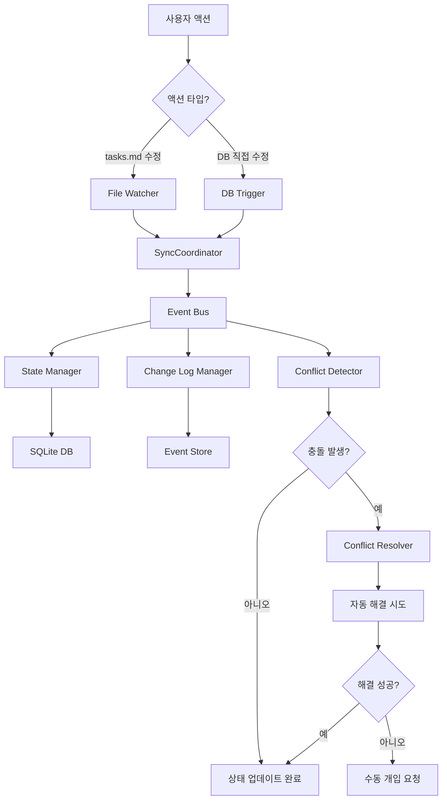
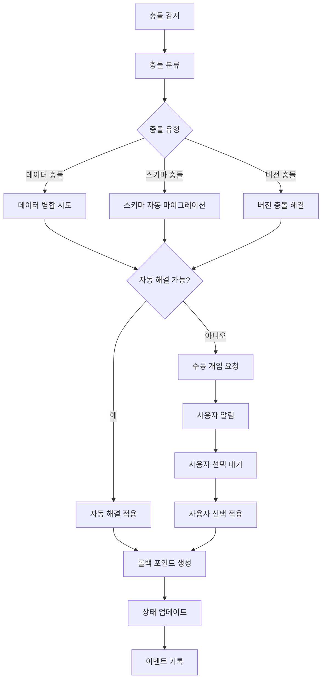

# ZyFlow 단일 진실 원천(Single Source of Truth) 아키텍처 설계

## 개요

ZyFlow의 단일 진실 원천 아키텍처는 하이브리드 방식을 채택하여 **tasks.md 파일을 명세서(Spec)로**, **SQLite DB를 실행 상태(Runtime State)로** 분리합니다. 이 아키텍처는 기존의 충돌 감지, 자동 복구, 변경 로그 및 리플레이 시스템을 통합하여 안정적이고 확장 가능한 시스템을 구축합니다.

## 핵심 원칙

### 1. 책임 분리 (Separation of Concerns)
- **tasks.md**: 사용자 인터페이스, 명세서, 버전 관리의 진실 원천
- **SQLite DB**: 실행 상태, 성능 최적화, 복잡한 쿼리의 진실 원천
- **Event Store**: 모든 변경의 불변 기록, 시스템 상태 재구성의 진실 원천

### 2. 이벤트 기반 아키텍처 (Event-Driven Architecture)
- 모든 상태 변경은 이벤트를 통해 발생
- 이벤트 소싱(Event Sourcing)을 통한 상태 재구성
- CQRS(Command Query Responsibility Segregation) 패턴 적용

### 3. 최종 일관성 (Eventual Consistency)
- 시스템 구성 요소 간의 일관성은 비동기적으로 보장
- 충돌 발생 시 자동 해결 및 수동 개입 프로세스
- 롤백 포인트를 통한 안정적인 상태 복원

## 아키텍처 구성 요소

### 1. 중앙 동기화 코디네이터 (SyncCoordinator)

```typescript
interface SyncCoordinator {
  // 명세서와 실행 상태 간의 동기화 조율
  syncSpecToRuntime(changeId: string): Promise<SyncResult>
  syncRuntimeToSpec(changeId: string): Promise<SyncResult>
  
  // 충돌 감지 및 해결
  detectConflicts(changeId: string): Promise<Conflict[]>
  resolveConflicts(conflicts: Conflict[], strategy: ResolutionStrategy): Promise<void>
  
  // 상태 일관성 검증
  validateConsistency(changeId: string): Promise<ConsistencyReport>
}
```

### 2. 이벤트 버스 (Event Bus)

```typescript
interface EventBus {
  // 이벤트 발행 및 구독
  publish<T extends Event>(event: T): Promise<void>
  subscribe<T extends Event>(eventType: string, handler: EventHandler<T>): () => void
  
  // 이벤트 스트림 관리
  getEventStream(filter?: EventFilter): AsyncIterable<Event>
  replayEvents(fromTimestamp: number): AsyncIterable<Event>
}
```

### 3. 상태 관리자 (StateManager)

```typescript
interface StateManager {
  // 명세서 상태 관리
  getSpecState(changeId: string): Promise<SpecState>
  updateSpecState(changeId: string, state: Partial<SpecState>): Promise<void>
  
  // 실행 상태 관리
  getRuntimeState(changeId: string): Promise<RuntimeState>
  updateRuntimeState(changeId: string, state: Partial<RuntimeState>): Promise<void>
  
  // 상태 동기화
  syncStates(changeId: string): Promise<SyncResult>
}
```

## 데이터 흐름

### 1. 정상 동기화 흐름



### 2. 충돌 해결 흐름



## 동시성 제어 전략

### 1. 낙관적 동시성 제어 (Optimistic Concurrency Control)

```typescript
interface VersionedState {
  version: number
  timestamp: number
  checksum: string
}

interface OptimisticLock {
  acquireLock(resourceId: string, expectedVersion: number): Promise<LockToken>
  releaseLock(token: LockToken): Promise<void>
  validateVersion(resourceId: string, expectedVersion: number): Promise<boolean>
}
```

### 2. MVCC (Multi-Version Concurrency Control)

```typescript
interface VersionedRecord {
  id: string
  version: number
  validFrom: number
  validTo: number | null
  data: Record<string, unknown>
  createdBy: string
  createdAt: number
}
```

## 성능 최적화

### 1. 다단계 캐싱

```typescript
interface CacheManager {
  // L1: 인메모리 캐시 (가장 빈번한 접근)
  getL1<T>(key: string): Promise<T | null>
  setL1<T>(key: string, value: T, ttl?: number): Promise<void>
  
  // L2: Redis 캐시 (공유 상태)
  getL2<T>(key: string): Promise<T | null>
  setL2<T>(key: string, value: T, ttl?: number): Promise<void>
  
  // L3: DB 캐시 (쿼리 결과)
  getL3<T>(query: string): Promise<T | null>
  setL3<T>(query: string, result: T, ttl?: number): Promise<void>
}
```

### 2. 배치 처리 및 스트리밍

```typescript
interface BatchProcessor {
  processBatch<T, R>(items: T[], processor: (item: T) => Promise<R>): Promise<R[]>
  streamProcess<T, R>(stream: AsyncIterable<T>, processor: (item: T) => Promise<R>): AsyncIterable<R>
}
```

## 장애 격리 및 복구

### 1. 서킷 브레이커 패턴

```typescript
interface CircuitBreaker {
  execute<T>(operation: () => Promise<T>): Promise<T>
  getState(): 'CLOSED' | 'OPEN' | 'HALF_OPEN'
  reset(): void
}
```

### 2. 장애 격리 영역

```typescript
interface IsolationBoundary {
  // 파일 시스템 격리
  isolateFileSystem(operation: () => Promise<void>): Promise<void>
  
  // 데이터베이스 격리
  isolateDatabase<T>(operation: () => Promise<T>): Promise<T>
  
  // 네트워크 격리
  isolateNetwork<T>(operation: () => Promise<T>): Promise<T>
}
```

## 마이그레이션 전략

### 1. 점진적 마이그레이션

1. **Phase 1**: 이벤트 시스템 도입 및 기존 시스템과의 통합
2. **Phase 2**: SyncCoordinator 도입 및 양방향 동기화 구현
3. **Phase 3**: CQRS 패턴 적용 및 읽기/쓰기 분리
4. **Phase 4**: 성능 최적화 및 모니터링 강화

### 2. 호환성 보장

- 기존 API와의 하위 호환성 유지
- 점진적 기능 전환을 위한 플래그 시스템
- 롤백 계획 및 데이터 백업 전략

## 모니터링 및 관찰 가능성

### 1. 메트릭 수집

```typescript
interface MetricsCollector {
  // 동기화 메트릭
  recordSyncDuration(changeId: string, duration: number): void
  recordConflictCount(changeId: string, count: number): void
  recordErrorRate(component: string, error: Error): void
  
  // 성능 메트릭
  recordCacheHitRate(cacheLevel: string, hitRate: number): void
  recordThroughput(operation: string, count: number): void
  recordLatency(operation: string, latency: number): void
}
```

### 2. 분산 추적

```typescript
interface DistributedTracing {
  startSpan(operationName: string, parentSpan?: Span): Span
  injectContext(span: Span, carrier: Record<string, string>): void
  extractContext(carrier: Record<string, string>): SpanContext | null
}
```

## 보안 고려사항

### 1. 접근 제어

```typescript
interface AccessControl {
  checkPermission(userId: string, resource: string, action: string): Promise<boolean>
  grantPermission(userId: string, resource: string, action: string): Promise<void>
  revokePermission(userId: string, resource: string, action: string): Promise<void>
}
```

### 2. 데이터 암호화

- 전송 중 데이터 암호화 (TLS)
- 저장된 데이터 암호화 (AES-256)
- 키 관리 시스템 통합

## 결론

ZyFlow의 단일 진실 원천 아키텍처는 하이브리드 방식을 통해 명세서와 실행 상태의 책임을 명확히 분리하면서, 이벤트 기반 아키텍처를 통해 시스템의 일관성과 안정성을 보장합니다. 이 아키텍처는 기존 시스템의 강점을 유지하면서도 확장성과 유지보수성을 크게 향상시킬 수 있습니다.