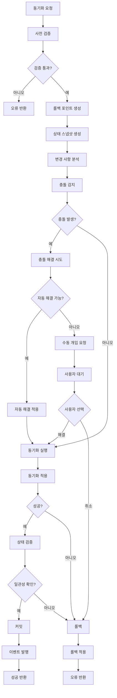

# 중앙 동기화 코디네이터(SyncCoordinator) 설계

## 개요

SyncCoordinator는 ZyFlow 단일 진실 원천 아키텍처의 핵심 컴포넌트로, tasks.md 파일(명세서)과 SQLite DB(실행 상태) 간의 동기화를 조율합니다. 이 컴포넌트는 충돌 감지, 해결, 상태 일관성 보장 등 모든 동기화 관련 작업을 중앙에서 관리합니다.

## 핵심 책임

### 1. 동기화 조율
- Spec-to-Runtime 동기화: tasks.md → SQLite DB
- Runtime-to-Spec 동기화: SQLite DB → tasks.md
- 양방향 동기화: 변경 사항 병합 및 충돌 해결

### 2. 충돌 관리
- 실시간 충돌 감지
- 충돌 분류 및 우선순위 결정
- 자동 및 수동 충돌 해결 조율

### 3. 상태 일관성 보장
- 버전 관리 및 낙관적 잠금
- 상태 검증 및 복구
- 롤백 포인트 관리

## 상세 설계

### 1. 핵심 인터페이스

```typescript
interface SyncCoordinator {
  // 초기화
  initialize(config: SyncCoordinatorConfig): Promise<void>
  
  // 동기화 작업
  syncSpecToRuntime(changeId: string, options?: SyncOptions): Promise<SyncResult>
  syncRuntimeToSpec(changeId: string, options?: SyncOptions): Promise<SyncResult>
  bidirectionalSync(changeId: string, options?: SyncOptions): Promise<SyncResult>
  
  // 충돌 관리
  detectConflicts(changeId: string): Promise<Conflict[]>
  resolveConflicts(conflicts: Conflict[], strategy: ResolutionStrategy): Promise<ConflictResolution>
  
  // 상태 관리
  validateConsistency(changeId: string): Promise<ConsistencyReport>
  createRollbackPoint(changeId: string, description?: string): Promise<RollbackPoint>
  rollbackToPoint(changeId: string, rollbackPointId: string): Promise<void>
  
  // 모니터링
  getSyncStatus(changeId: string): Promise<SyncStatus>
  getSyncHistory(changeId: string, filter?: HistoryFilter): Promise<SyncHistory[]>
}

interface SyncCoordinatorConfig {
  // 동기화 설정
  syncInterval: number
  maxRetries: number
  retryDelay: number
  
  // 충돌 해결 설정
  defaultResolutionStrategy: ResolutionStrategy
  autoResolveThreshold: number
  
  // 성능 설정
  batchSize: number
  maxConcurrency: number
  timeoutMs: number
  
  // 의존성 주입
  eventBus: EventBus
  stateManager: StateManager
  conflictResolver: ConflictResolver
  changeLogManager: ChangeLogManager
  recoveryManager: SyncRecoveryManager
}
```

### 2. 동기화 결과 타입

```typescript
interface SyncResult {
  success: boolean
  changeId: string
  syncType: 'SPEC_TO_RUNTIME' | 'RUNTIME_TO_SPEC' | 'BIDIRECTIONAL'
  
  // 처리 통계
  recordsProcessed: number
  recordsSucceeded: number
  recordsFailed: number
  recordsSkipped: number
  
  // 충돌 정보
  conflictsDetected: Conflict[]
  conflictsResolved: Conflict[]
  conflictsRemaining: Conflict[]
  
  // 성능 메트릭
  duration: number
  throughput: number
  
  // 롤백 정보
  rollbackPointId?: string
  
  // 오류 정보
  errors?: SyncError[]
  warnings?: SyncWarning[]
}

interface Conflict {
  id: string
  changeId: string
  type: ConflictType
  severity: ConflictSeverity
  
  // 충돌 대상
  resourceType: 'task' | 'change' | 'metadata'
  resourceId: string
  
  // 충돌 내용
  specValue: unknown
  runtimeValue: unknown
  baseValue: unknown
  
  // 메타데이터
  detectedAt: number
  detectedBy: string
  context: Record<string, unknown>
}

type ConflictType = 
  | 'DATA_CONFLICT'      // 데이터 내용 불일치
  | 'STRUCTURE_CONFLICT'  // 구조 불일치
  | 'VERSION_CONFLICT'    // 버전 불일치
  | 'DEPENDENCY_CONFLICT' // 의존성 충돌
  | 'PERMISSION_CONFLICT' // 권한 충돌

type ConflictSeverity = 'LOW' | 'MEDIUM' | 'HIGH' | 'CRITICAL'

interface ConflictResolution {
  conflictId: string
  strategy: ResolutionStrategy
  resolution: unknown
  resolvedAt: number
  resolvedBy: 'AUTO' | 'USER' | 'SYSTEM'
  applied: boolean
}

type ResolutionStrategy = 
  | 'SPEC_WINS'         // 명세서 우선
  | 'RUNTIME_WINS'       // 실행 상태 우선
  | 'LAST_WRITE_WINS'    // 마지막 쓰기 우선
  | 'MERGE'              // 자동 병합
  | 'MANUAL'             // 수동 해결
  | 'SKIP'               // 건너뛰기
```

### 3. 상태 일관성 보장

```typescript
interface ConsistencyReport {
  changeId: string
  isConsistent: boolean
  checkedAt: number
  
  // 불일치 항목
  inconsistencies: Inconsistency[]
  
  // 상태 요약
  specState: StateSnapshot
  runtimeState: StateSnapshot
  
  // 권장 사항
  recommendations: string[]
}

interface Inconsistency {
  id: string
  type: InconsistencyType
  severity: 'LOW' | 'MEDIUM' | 'HIGH'
  
  // 불일치 상세
  resourcePath: string
  expectedValue: unknown
  actualValue: unknown
  
  // 해결 제안
  suggestedAction: string
  autoFixable: boolean
}

type InconsistencyType = 
  | 'MISSING_RESOURCE'     // 리소스 누락
  | 'EXTRA_RESOURCE'       // 추가 리소스
  | 'VALUE_MISMATCH'       // 값 불일치
  | 'TYPE_MISMATCH'        // 타입 불일치
  | 'VERSION_MISMATCH'     // 버전 불일치
  | 'DEPENDENCY_BROKEN'    // 의존성 깨짐

interface StateSnapshot {
  version: number
  timestamp: number
  checksum: string
  
  // 리소스 상태
  resources: ResourceState[]
  
  // 메타데이터
  metadata: Record<string, unknown>
}

interface ResourceState {
  id: string
  type: string
  version: number
  lastModified: number
  checksum: string
  data: Record<string, unknown>
}
```

### 4. 동기화 옵션

```typescript
interface SyncOptions {
  // 동기화 범위
  resourceTypes?: string[]
  includeIds?: string[]
  excludeIds?: string[]
  
  // 동기화 전략
  strategy?: 'INCREMENTAL' | 'FULL' | 'SMART'
  conflictResolution?: ResolutionStrategy
  
  // 성능 옵션
  batchSize?: number
  maxConcurrency?: number
  timeoutMs?: number
  
  // 안전 옵션
  dryRun?: boolean
  createRollbackPoint?: boolean
  stopOnConflict?: boolean
  
  // 필터링
  modifiedSince?: number
  filter?: (resource: ResourceState) => boolean
}
```

## 구현 전략

### 1. 동기화 워크플로우



### 2. 충돌 해결 전략

#### 2.1 자동 해결 알고리즘

```typescript
class AutoConflictResolver {
  async resolveConflict(conflict: Conflict): Promise<ConflictResolution> {
    switch (conflict.type) {
      case 'DATA_CONFLICT':
        return await this.resolveDataConflict(conflict)
      
      case 'STRUCTURE_CONFLICT':
        return await this.resolveStructureConflict(conflict)
      
      case 'VERSION_CONFLICT':
        return await this.resolveVersionConflict(conflict)
      
      case 'DEPENDENCY_CONFLICT':
        return await this.resolveDependencyConflict(conflict)
      
      default:
        throw new Error(`Unsupported conflict type: ${conflict.type}`)
    }
  }
  
  private async resolveDataConflict(conflict: Conflict): Promise<ConflictResolution> {
    // 1. 3-way merge 시도
    const mergeResult = await this.threeWayMerge(
      conflict.baseValue,
      conflict.specValue,
      conflict.runtimeValue
    )
    
    if (mergeResult.success) {
      return {
        conflictId: conflict.id,
        strategy: 'MERGE',
        resolution: mergeResult.mergedValue,
        resolvedAt: Date.now(),
        resolvedBy: 'AUTO',
        applied: false
      }
    }
    
    // 2. 타임스탬프 기반 해결
    if (conflict.context.specModifiedAt > conflict.context.runtimeModifiedAt) {
      return {
        conflictId: conflict.id,
        strategy: 'SPEC_WINS',
        resolution: conflict.specValue,
        resolvedAt: Date.now(),
        resolvedBy: 'AUTO',
        applied: false
      }
    }
    
    return {
      conflictId: conflict.id,
      strategy: 'RUNTIME_WINS',
      resolution: conflict.runtimeValue,
      resolvedAt: Date.now(),
      resolvedBy: 'AUTO',
      applied: false
    }
  }
}
```

#### 2.2 3-way Merge 알고리즘

```typescript
interface MergeResult {
  success: boolean
  mergedValue?: unknown
  conflicts?: string[]
  warnings?: string[]
}

class ThreeWayMerger {
  async merge(
    base: unknown,
    spec: unknown,
    runtime: unknown
  ): Promise<MergeResult> {
    // 객체 타입 확인
    if (this.isObject(base) && this.isObject(spec) && this.isObject(runtime)) {
      return await this.mergeObjects(base, spec, runtime)
    }
    
    // 배열 타입 확인
    if (Array.isArray(base) && Array.isArray(spec) && Array.isArray(runtime)) {
      return await this.mergeArrays(base, spec, runtime)
    }
    
    // 기본 타입
    return this.mergePrimitives(base, spec, runtime)
  }
  
  private async mergeObjects(
    base: Record<string, unknown>,
    spec: Record<string, unknown>,
    runtime: Record<string, unknown>
  ): Promise<MergeResult> {
    const result: Record<string, unknown> = {}
    const conflicts: string[] = []
    const warnings: string[] = []
    
    // 모든 키 수집
    const allKeys = new Set([
      ...Object.keys(base),
      ...Object.keys(spec),
      ...Object.keys(runtime)
    ])
    
    for (const key of allKeys) {
      const baseValue = base[key]
      const specValue = spec[key]
      const runtimeValue = runtime[key]
      
      // 값이 동일한 경우
      if (this.deepEqual(specValue, runtimeValue)) {
        result[key] = specValue
        continue
      }
      
      // base와 동일한 경우
      if (this.deepEqual(baseValue, specValue)) {
        result[key] = runtimeValue
        continue
      }
      
      if (this.deepEqual(baseValue, runtimeValue)) {
        result[key] = specValue
        continue
      }
      
      // 재귀적 병합 시도
      const mergeResult = await this.merge(baseValue, specValue, runtimeValue)
      if (mergeResult.success) {
        result[key] = mergeResult.mergedValue
        warnings.push(`Auto-merged conflicting values for key: ${key}`)
      } else {
        conflicts.push(`Unresolvable conflict for key: ${key}`)
        // 기본 전략: spec 우선
        result[key] = specValue
      }
    }
    
    return {
      success: conflicts.length === 0,
      mergedValue: result,
      conflicts,
      warnings
    }
  }
}
```

### 3. 성능 최적화

#### 3.1 배치 처리

```typescript
class BatchSyncProcessor {
  async processBatch(
    items: SyncItem[],
    options: SyncOptions
  ): Promise<BatchResult> {
    const results: SyncResult[] = []
    const batchSize = options.batchSize || 100
    
    // 배치로 분할
    const batches = this.chunkArray(items, batchSize)
    
    for (const batch of batches) {
      const batchResults = await Promise.allSettled(
        batch.map(item => this.processItem(item, options))
      )
      
      results.push(...batchResults.map(result => 
        result.status === 'fulfilled' ? result.value : this.createErrorResult(result.reason)
      ))
    }
    
    return this.aggregateResults(results)
  }
  
  private async processItem(item: SyncItem, options: SyncOptions): Promise<SyncResult> {
    // 개별 아이템 처리 로직
    // 낙관적 잠금, 충돌 감지, 해결 등
  }
}
```

#### 3.2 캐싱 전략

```typescript
class SyncCacheManager {
  private specCache = new Map<string, CachedSpecState>()
  private runtimeCache = new Map<string, CachedRuntimeState>()
  private conflictCache = new Map<string, CachedConflictResult>()
  
  async getCachedSpecState(changeId: string): Promise<SpecState | null> {
    const cached = this.specCache.get(changeId)
    if (cached && !this.isExpired(cached)) {
      return cached.state
    }
    return null
  }
  
  async cacheSpecState(changeId: string, state: SpecState): Promise<void> {
    this.specCache.set(changeId, {
      state,
      cachedAt: Date.now(),
      ttl: 5 * 60 * 1000 // 5분
    })
  }
  
  // 유사한 패턴으로 runtimeCache, conflictCache 구현
}

interface CachedSpecState {
  state: SpecState
  cachedAt: number
  ttl: number
}
```

### 4. 모니터링 및 진단

#### 4.1 동기화 메트릭

```typescript
interface SyncMetrics {
  // 기본 메트릭
  totalSyncs: number
  successfulSyncs: number
  failedSyncs: number
  averageSyncTime: number
  
  // 충돌 메트릭
  conflictsDetected: number
  conflictsResolved: number
  averageResolutionTime: number
  
  // 성능 메트릭
  throughput: number
  latency: number
  errorRate: number
  
  // 리소스 메트릭
  memoryUsage: number
  cpuUsage: number
  diskIO: number
}

class SyncMetricsCollector {
  private metrics: SyncMetrics = this.initializeMetrics()
  
  recordSyncStart(changeId: string): void {
    // 동기화 시작 기록
  }
  
  recordSyncComplete(changeId: string, result: SyncResult): void {
    // 동기화 완료 기록
    this.updateMetrics(result)
  }
  
  recordConflictDetected(conflict: Conflict): void {
    // 충돌 감지 기록
  }
  
  recordConflictResolved(resolution: ConflictResolution): void {
    // 충돌 해결 기록
  }
  
  getMetrics(): SyncMetrics {
    return { ...this.metrics }
  }
}
```

#### 4.2 상태 진단

```typescript
class SyncDiagnostics {
  async diagnoseSyncIssues(changeId: string): Promise<DiagnosticReport> {
    const report: DiagnosticReport = {
      changeId,
      timestamp: Date.now(),
      issues: [],
      recommendations: []
    }
    
    // 1. 상태 일관성 검사
    const consistencyReport = await this.checkConsistency(changeId)
    if (!consistencyReport.isConsistent) {
      report.issues.push(...consistencyReport.inconsistencies.map(
        inc => this.inconsistencyToIssue(inc)
      ))
    }
    
    // 2. 성능 문제 검사
    const performanceIssues = await this.checkPerformance(changeId)
    report.issues.push(...performanceIssues)
    
    // 3. 의존성 문제 검사
    const dependencyIssues = await this.checkDependencies(changeId)
    report.issues.push(...dependencyIssues)
    
    // 4. 권장 사항 생성
    report.recommendations = this.generateRecommendations(report.issues)
    
    return report
  }
  
  private async checkPerformance(changeId: string): Promise<Issue[]> {
    const issues: Issue[] = []
    
    // 동기화 시간 확인
    const syncHistory = await this.getSyncHistory(changeId)
    const recentSyncs = syncHistory.filter(s => 
      Date.now() - s.timestamp < 24 * 60 * 60 * 1000 // 최근 24시간
    )
    
    if (recentSyncs.length > 0) {
      const avgTime = recentSyncs.reduce((sum, s) => sum + s.duration, 0) / recentSyncs.length
      
      if (avgTime > 10000) { // 10초 이상
        issues.push({
          type: 'PERFORMANCE',
          severity: 'HIGH',
          description: `Average sync time is ${avgTime}ms, which exceeds the 10s threshold`,
          suggestions: [
            'Consider increasing batch size',
            'Check for resource contention',
            'Optimize database queries'
          ]
        })
      }
    }
    
    return issues
  }
}
```

## 통합 전략

### 1. 기존 시스템과의 통합

- **File Watcher**: 파일 변경 감지 시 SyncCoordinator에 알림
- **Sync Manager**: 기존 동기화 로직을 SyncCoordinator로 마이그레이션
- **Change Log Manager**: 모든 동기화 이벤트 기록
- **Recovery Manager**: 동기화 실패 시 자동 복구

### 2. MCP 서버 연동

```typescript
// MCP 서버에 추가할 도구들
const syncCoordinatorTools = [
  {
    name: 'sync_change',
    description: 'Sync a specific change between spec and runtime',
    inputSchema: {
      type: 'object',
      properties: {
        changeId: { type: 'string' },
        direction: { type: 'string', enum: ['spec_to_runtime', 'runtime_to_spec', 'bidirectional'] },
        options: { type: 'object' }
      },
      required: ['changeId']
    }
  },
  {
    name: 'detect_conflicts',
    description: 'Detect conflicts for a specific change',
    inputSchema: {
      type: 'object',
      properties: {
        changeId: { type: 'string' }
      },
      required: ['changeId']
    }
  },
  {
    name: 'resolve_conflicts',
    description: 'Resolve detected conflicts',
    inputSchema: {
      type: 'object',
      properties: {
        conflictIds: { type: 'array', items: { type: 'string' } },
        strategy: { type: 'string', enum: ['spec_wins', 'runtime_wins', 'merge', 'manual'] }
      },
      required: ['conflictIds', 'strategy']
    }
  }
]
```

## 결론

SyncCoordinator는 ZyFlow의 단일 진실 원천 아키텍처에서 핵심적인 역할을 수행하며, tasks.md 파일과 SQLite DB 간의 일관성을 보장합니다. 충돌 감지 및 해결, 성능 최적화, 모니터링 기능을 통해 안정적이고 확장 가능한 동기화 시스템을 제공합니다.