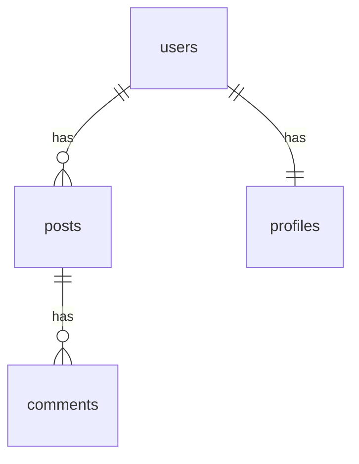

# ZyWiki 로드맵

> **비전**: CLI 도구 → 에이전트가 쓰는 프로그래머블 지식 인프라
>
> **핵심 메시지**: "자동 신선도 유지 + 로컬 RAG"

---

## 현재 상태 (v0.3.0)

```
사람 → CLI 실행 → Claude가 마크다운 생성 → 사람이 읽음
```

**현재 기능**:
- `zywiki init` - 프로젝트 초기화
- `zywiki add` - 파일 트래킹 추가
- `zywiki build` - 문서 생성
- `zywiki update` - 변경된 문서만 업데이트
- `zywiki status` - 트래킹 상태 확인
- `zywiki search` - RAG 기반 검색 (`--json` 지원)
- `zywiki stack` - 기술 스택 분석

**한계**:
- `search --json` 외 다른 명령은 텍스트 출력만
- 구조화된 상태 조회 없음 (`status --json` 미지원)
- 전체 빌드만 가능 (비용 낭비)
- 안전장치 없음

---

## v0.4.0 - JSON 출력

> **목표**: 구조화된 출력으로 에이전트 친화성 확보

### 핵심 기능

| 기능 | 설명 |
|------|------|
| `--json` 플래그 | 모든 CLI 명령에 JSON 출력 옵션 |
| `zywiki status --json` | 구조화된 상태 조회 |
| 매니페스트 | `.zywiki/manifest.json` 자동 생성 |

### 상세

**상태 조회**
```bash
zywiki status --json
zywiki status src/auth.ts --json
```
```json
{
  "file": "src/auth.ts",
  "documented": true,
  "docPath": "zywiki/security/auth.md",
  "freshness": "stale",
  "staleDays": 5
}
```

**빌드 결과 리포트**
```bash
zywiki build --json
```
```json
{
  "success": true,
  "updated": ["zywiki/api/users.md"],
  "skipped": ["zywiki/utils/date.md"],
  "errors": [],
  "stats": { "filesProcessed": 10, "tokensUsed": 15000 }
}
```

**매니페스트 자동 생성**

빌드 시 `.zywiki/manifest.json` 생성:
```json
{
  "generatedAt": "2024-01-20T15:00:00Z",
  "codeToDocMap": {
    "src/auth.ts": "zywiki/security/auth.md"
  },
  "coverage": { "tracked": 45, "documented": 38, "percent": 84.4 }
}
```

### v0.4.0 완료 시

에이전트가 ZyWiki를 **"읽을 수 있음"**

---

## v0.5.0 - SQL 스키마 문서화

> **목표**: DB 스키마를 자동 문서화하여 에이전트의 DB 이해도 향상

### 지원 소스

```bash
# ORM 스키마 파일
zywiki schema prisma/schema.prisma   # Prisma
zywiki schema server/db/schema.ts    # Drizzle

# SQL 파일
zywiki schema migrations/*.sql

# DB 직접 연결
zywiki schema --db sqlite:./data.db
zywiki schema --db postgres://localhost/mydb
```

### 출력 예시

```markdown
# Table: users

<cite>prisma/schema.prisma:15</cite>

## Overview
사용자 계정 정보를 저장하는 테이블

## Columns
| Column | Type | Nullable | Default | Description |
|--------|------|----------|---------|-------------|
| id | TEXT | NO | uuid() | Primary Key |
| email | TEXT | NO | - | 사용자 이메일 |
| created_at | TIMESTAMP | NO | now() | 생성일시 |

## Relations
- `posts` → 1:N (users.id → posts.user_id)
- `profiles` → 1:1 (users.id → profiles.user_id)

## Indexes
- `users_email_idx` (email) UNIQUE
```

### JSON 출력 (에이전트용)

```bash
zywiki schema --json
```
```json
{
  "tables": [
    {
      "name": "users",
      "sourceFile": "prisma/schema.prisma",
      "sourceLine": 15,
      "columns": [
        { "name": "id", "type": "TEXT", "nullable": false, "primaryKey": true },
        { "name": "email", "type": "TEXT", "nullable": false, "unique": true }
      ],
      "relations": [
        { "table": "posts", "type": "1:N", "foreignKey": "user_id" }
      ],
      "indexes": [
        { "name": "users_email_idx", "columns": ["email"], "unique": true }
      ]
    }
  ],
  "meta": { "dialect": "postgresql", "tableCount": 12 }
}
```

### 지원 스키마 소스 (사용자 선택)

| 소스 | 대상 프로젝트 | 파싱 난이도 |
|------|--------------|------------|
| **Prisma** | Prisma 사용 프로젝트 | 쉬움 (DSL) |
| **raw SQL** | Supabase, 마이그레이션 기반 | 보통 |
| **Drizzle** | Drizzle ORM 사용 | 보통 (TS 파싱) |
| **TypeORM** | TypeORM 레거시 | 어려움 (데코레이터) |
| **DB 직접 연결** | 모든 프로젝트 | 쉬움 (introspection) |

사용자가 프로젝트에 맞는 소스를 선택:

```bash
# 자동 감지 (권장)
zywiki schema --auto

# 명시적 선택
zywiki schema --prisma prisma/schema.prisma
zywiki schema --sql supabase/migrations/*.sql
zywiki schema --drizzle server/db/schema.ts
zywiki schema --db postgres://localhost/mydb
```

**자동 감지 우선순위**:
1. `prisma/schema.prisma` 존재 → Prisma
2. `drizzle.config.ts` 존재 → Drizzle
3. `supabase/migrations/` 존재 → raw SQL
4. 없으면 → DB 직접 연결 안내

### v0.5.0 완료 시

에이전트가 **DB 구조를 즉시 파악** 가능

---

## v0.6.0 - 세분화 빌드 + 안전장치

> **목표**: 비용 통제와 안전한 자동화를 위한 기반

### 핵심 기능

| 기능 | 설명 |
|------|------|
| 범위 지정 빌드 | 파일/디렉토리/태그 단위 빌드 |
| 안전장치 | dry-run, 토큰 제한, 타임아웃 |
| 종료 코드 체계 | 프로그래밍적 오류 판단 |

### 범위 지정 빌드

```bash
zywiki build --file src/auth.ts      # 단일 파일
zywiki build --path src/api/         # 디렉토리
zywiki build --stale-only            # 오래된 것만
zywiki build --filter security       # 태그 필터
```

### 안전장치

```bash
zywiki build --dry-run               # 미리보기 (실제 빌드 안함)
zywiki build --max-tokens 50000      # 토큰 예산 제한
zywiki build --max-files 10          # 파일 수 제한
zywiki build --timeout 300           # 타임아웃 (초)
```

### 종료 코드 체계

| 코드 | 의미 |
|-----|------|
| 0 | 성공 |
| 1 | 일반 오류 |
| 2 | 설정 오류 |
| 3 | API 오류 |
| 4 | 예산 초과 |
| 5 | 타임아웃 |

### v0.6.0 완료 시

에이전트가 **안전하게 빌드** 가능 (비용 폭주 방지)

---

## v0.7.0 - ER 다이어그램

> **목표**: 스키마 문서화 고도화

### 추가 기능

```bash
# ER 다이어그램 자동 생성
zywiki schema --diagram
```

### ER 다이어그램 출력



### v0.7.0 완료 시

**시각적 DB 구조 파악** 가능

---

## v1.0.0 - MCP 서버

> **v1.0.0인 이유**: CLI에서 MCP로의 패러다임 전환
> - v0.x: 사람이 CLI 실행 → 결과 확인
> - v1.0: 에이전트가 직접 도구 호출 → 자동화 가능
>
> 이것이 "에이전트 친화적 지식 인프라"로의 본격적인 전환점

> **목표**: CLI 없이 에이전트가 직접 호출

### MCP 도구

```typescript
zywiki_status   // 문서화 상태 조회
zywiki_search   // 문서 검색
zywiki_build    // 문서 빌드
zywiki_schema   // 스키마 조회
zywiki_analyze  // 문서화 필요성 분석
```

### 사용 예시 (에이전트 관점)

```
에이전트: zywiki_search({ query: "authentication" })
→ JSON 결과 즉시 반환

에이전트: zywiki_build({ files: ["src/auth.ts"], dryRun: true })
→ 빌드 미리보기 결과 반환
```

### v1.0.0 완료 시

에이전트가 **CLI 없이 직접 호출** 가능

---

## v1.1.0 - 자율 운영

> **목표**: 변경 감지 → 자동 문서 갱신

### analyze 명령

```bash
zywiki analyze --json
```
```json
{
  "urgent": [
    { "file": "src/payment.ts", "reason": "복잡도 높음, 문서 없음" }
  ],
  "stale": [
    { "file": "src/auth.ts", "staleDays": 14 }
  ],
  "suggestions": [
    "src/api/ 디렉토리 문서화 권장 (0% 커버리지)"
  ]
}
```

### watch 모드

```bash
zywiki watch --max-daily-tokens 100000
```

- 파일 변경 감지 → 자동 빌드
- **반드시** 토큰 예산 제한 필수
- v0.6.0 안전장치가 선행되어야 함

### v1.1.0 완료 시

**자율 운영** 가능 (단, 비용 모니터링 필수)

---

## 버전별 요약

```
v0.3.0 (현재)  기본 CLI + RAG 검색 (search --json 지원)
              └─ 사람이 실행하고 읽음

v0.4.0        JSON 출력 확장 + 매니페스트
              └─ 에이전트가 "읽을 수 있음"

v0.5.0        SQL 스키마 문서화
              └─ 에이전트가 "DB를 이해함"

v0.6.0        세분화 빌드 + 안전장치
              └─ 에이전트가 "안전하게 빌드"

v0.7.0        ER 다이어그램
              └─ 시각적 DB 구조 파악

─────────────────────────────────────
v1.0.0        MCP 서버 ← 패러다임 전환
              └─ 에이전트가 "직접 호출"

v1.1.0        analyze + watch 모드
              └─ "자율 운영" (비용 주의)
```

---

## 차별화 포지셔닝

| vs | ZyWiki |
|----|--------|
| Docusaurus/GitBook | 코드 변경 시 문서 자동 갱신 |
| Copilot/Cursor | 일회성 힌트 → 팀 공유 지속 문서 |
| RAG 도구 | 문서 생성 + 코드 인덱스 통합, 로컬 완결 |
| dbdocs.io/DBML | 로컬 완결 + ORM 스키마 직접 지원 |

---

## 다음 할 일 (v0.4.0 toward)

1. `--json` 플래그 출력 스키마 정의
2. `zywiki status --json` 구현
3. `zywiki build --json` 결과 리포트 추가
4. `.zywiki/manifest.json` 자동 생성

이 4개가 끝나면 **v0.4.0 릴리스** 가능.
