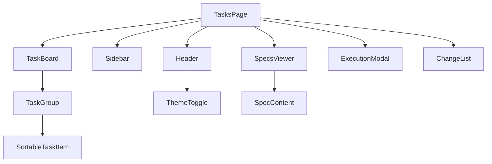
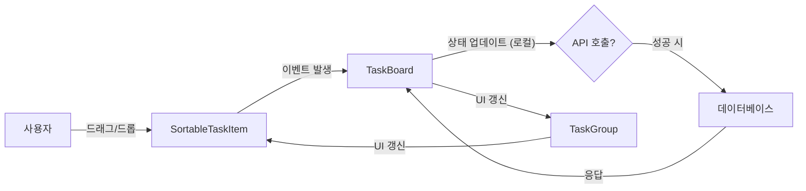
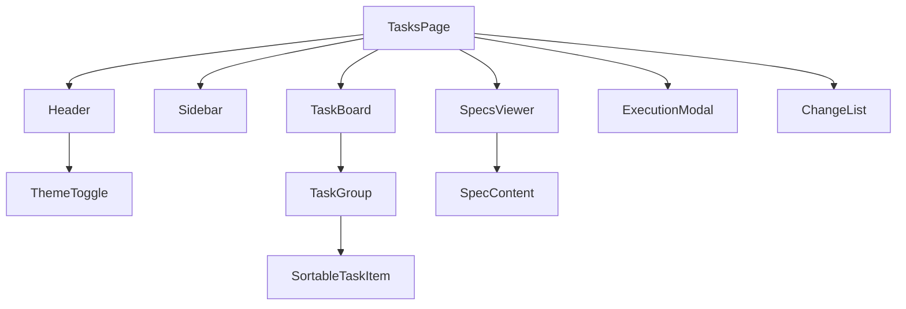

<cite>src/components/dashboard</cite>

### 개요

본 문서는 프로젝트의 핵심 대시보드 기능을 구현하는 컴포넌트들을 설명합니다. 이 컴포넌트들은 사용자가 작업을 시각적으로 관리하고, 사양을 확인하며, 실행 흐름을 제어할 수 있는 통합된 인터페이스를 제공하는 것을 목적으로 합니다. 효율적인 작업 관리와 명확한 사양 열람을 통해 개발 및 운영 워크플로우를 최적화하는 데 기여합니다.

### 아키텍처 다이어그램



### 데이터 흐름 다이어그램 (TaskBoard 기준)



### 컴포넌트 의존성 다이어그램



### 주요 함수/클래스

*   **`TasksPage`**
    *   **설명**: 대시보드의 최상위 페이지 컴포넌트입니다. `Header`, `Sidebar`, `TaskBoard`, `SpecsViewer` 등 모든 주요 대시보드 컴포넌트를 통합하고, 전역 상태 및 데이터 관리를 조정합니다.
    *   **시그니처**: `function TasksPage(): JSX.Element`
*   **`TaskBoard`**
    *   **설명**: 여러 `TaskGroup`을 포함하는 메인 작업 보드입니다. 드래그 앤 드롭 기능을 통해 작업 항목의 그룹 간 이동 및 순서 변경을 처리합니다.
    *   **시그니처**: `function TaskBoard({ taskGroups, onTaskMove, onTaskReorder }: TaskBoardProps): JSX.Element`
        *   `taskGroups`: `TaskGroup`에 표시될 작업 그룹 데이터 배열.
        *   `onTaskMove`: 작업 항목이 다른 그룹으로 이동했을 때 호출되는 콜백 함수.
        *   `onTaskReorder`: 작업 항목이 같은 그룹 내에서 재정렬되었을 때 호출되는 콜백 함수.
*   **`TaskGroup`**
    *   **설명**: `TaskBoard` 내의 단일 작업 그룹(예: "할 일", "진행 중", "완료")을 나타냅니다. 그룹에 속한 `SortableTaskItem`들을 렌더링하고, 해당 그룹 내에서의 드래그 앤 드롭 이벤트를 처리합니다.
    *   **시그니처**: `function TaskGroup({ id, title, tasks, onTaskDrop }: TaskGroupProps): JSX.Element`
        *   `id`: 그룹의 고유 식별자.
        *   `title`: 그룹의 제목.
        *   `tasks`: 해당 그룹에 속한 `SortableTaskItem` 데이터 배열.
        *   `onTaskDrop`: 작업 항목이 이 그룹에 드롭되었을 때 호출되는 콜백 함수.
*   **`SortableTaskItem`**
    *   **설명**: 개별 작업을 나타내는 드래그 가능한 UI 컴포넌트입니다. 작업의 제목, 상태, 담당자 등 세부 정보를 표시하며, 클릭 시 추가 정보 열람이나 `ExecutionModal`을 트리거할 수 있습니다.
    *   **시그니처**: `function SortableTaskItem({ id, content, index, onClick }: SortableTaskItemProps): JSX.Element`
        *   `id`: 작업 항목의 고유 식별자.
        *   `content`: 작업 항목에 표시될 내용 (예: 제목).
        *   `index`: 드래그 앤 드롭 라이브러리에서 사용되는 항목의 인덱스.
        *   `onClick`: 작업 항목 클릭 시 호출되는 콜백 함수.
*   **`SpecsViewer`**
    *   **설명**: 다양한 사양(Spec) 목록을 표시하고, 선택된 사양의 내용을 `SpecContent`를 통해 보여주는 뷰어 컴포넌트입니다.
    *   **시그니처**: `function SpecsViewer({ specs, onSpecSelect }: SpecsViewerProps): JSX.Element`
        *   `specs`: 표시할 사양 데이터 배열.
        *   `onSpecSelect`: 사양이 선택되었을 때 호출되는 콜백 함수.
*   **`ExecutionModal`**
    *   **설명**: 특정 작업이나 사양에 대한 실행 작업을 수행하기 위한 모달 창입니다. 실행 버튼, 진행 상태 표시, 결과 피드백 등을 포함할 수 있습니다.
    *   **시그니처**: `function ExecutionModal({ isOpen, onClose, onExecute, dataToExecute }: ExecutionModalProps): JSX.Element`
        *   `isOpen`: 모달의 열림/닫힘 상태.
        *   `onClose`: 모달 닫기 시 호출되는 콜백 함수.
        *   `onExecute`: 실행 버튼 클릭 시 호출되는 콜백 함수.
        *   `dataToExecute`: 모달에서 실행될 작업/사양 데이터.
*   **`Header`**
    *   **설명**: 대시보드의 상단 헤더 영역을 담당합니다. 애플리케이션 제목, 사용자 정보, `ThemeToggle`과 같은 전역 유틸리티를 포함합니다.
    *   **시그니처**: `function Header(): JSX.Element`
*   **`Sidebar`**
    *   **설명**: 대시보드의 좌측 또는 우측 사이드바를 담당합니다. 주요 메뉴, 필터 옵션, 빠른 링크 등을 포함할 수 있습니다.
    *   **시그니처**: `function Sidebar(): JSX.Element`
*   **`ThemeToggle`**
    *   **설명**: 애플리케이션의 테마(예: 라이트/다크 모드)를 전환하는 기능을 제공하는 컴포넌트입니다.
    *   **시그니처**: `function ThemeToggle(): JSX.Element`

### 설정/사용법

대시보드 페이지는 일반적으로 라우터에 의해 렌더링됩니다. `TasksPage` 컴포넌트를 직접 사용하거나, 애플리케이션의 메인 레이아웃 내에 포함하여 사용할 수 있습니다.

**예시 1: 라우터에 `TasksPage` 설정**

```jsx
// src/App.tsx 또는 src/routes/index.tsx
import React from 'react';
import { BrowserRouter as Router, Route, Routes } from 'react-router-dom';
import TasksPage from './components/dashboard/TasksPage';
import LoginPage from './components/auth/LoginPage'; // 예시

function AppRouter() {
  return (
    <Router>
      <Routes>
        <Route path="/login" element={<LoginPage />} />
        <Route path="/dashboard" element={<TasksPage />} />
        {/* 다른 라우트들 */}
      </Routes>
    </Router>
  );
}

export default AppRouter;
```

**예시 2: `TaskBoard`에 데이터 전달 및 이벤트 처리**

`TasksPage` 내부에서 `TaskBoard`를 사용하는 예시입니다. 여기서는 더미 데이터를 사용합니다.

```jsx
// src/components/dashboard/TasksPage.tsx (일부)
import React, { useState } from 'react';
import TaskBoard from './TaskBoard';
import Header from './Header';
import Sidebar from './Sidebar';

// 더미 데이터 예시
const initialTaskGroups = [
  {
    id: 'todo',
    title: '할 일',
    tasks: [{ id: 'task-1', content: '대시보드 문서 작성' }, { id: 'task-2', content: 'API 연동' }],
  },
  {
    id: 'in-progress',
    title: '진행 중',
    tasks: [{ id: 'task-3', content: '디자인 검토' }],
  },
  {
    id: 'done',
    title: '완료',
    tasks: [{ id: 'task-4', content: '환경 설정' }],
  },
];

function TasksPage() {
  const [taskGroups, setTaskGroups] = useState(initialTaskGroups);

  const handleTaskMove = (taskId, sourceGroupId, destinationGroupId, newIndex) => {
    const updatedGroups = [...taskGroups];
    const sourceGroup = updatedGroups.find(group => group.id === sourceGroupId);
    const destinationGroup = updatedGroups.find(group => group.id === destinationGroupId);

    if (!sourceGroup || !destinationGroup) return;

    const [movedTask] = sourceGroup.tasks.splice(sourceGroup.tasks.findIndex(task => task.id === taskId), 1);
    destinationGroup.tasks.splice(newIndex, 0, movedTask);

    setTaskGroups(updatedGroups);
    // 실제 애플리케이션에서는 여기서 서버 API 호출하여 변경 사항 저장
  };

  const handleTaskReorder = (groupId, taskId, newIndex) => {
    const updatedGroups = [...taskGroups];
    const group = updatedGroups.find(g => g.id === groupId);
    if (!group) return;

    const [reorderedTask] = group.tasks.splice(group.tasks.findIndex(task => task.id === taskId), 1);
    group.tasks.splice(newIndex, 0, reorderedTask);

    setTaskGroups(updatedGroups);
    // 실제 애플리케이션에서는 여기서 서버 API 호출하여 변경 사항 저장
  };

  return (
    <div className="dashboard-layout">
      <Header />
      <Sidebar />
      <main className="dashboard-content">
        <TaskBoard
          taskGroups={taskGroups}
          onTaskMove={handleTaskMove}
          onTaskReorder={handleTaskReorder}
        />
        {/* SpecsViewer, ExecutionModal 등 다른 컴포넌트 */}
      </main>
    </div>
  );
}

export default TasksPage;
```

### 문제 해결 가이드

*   **드래그 앤 드롭 기능이 작동하지 않을 때**
    *   **원인**: `react-beautiful-dnd` 또는 유사한 드래그 앤 드롭 라이브러리의 `DragDropContext`, `Droppable`, `Draggable` 컴포넌트가 올바르게 래핑되지 않았거나, `id` 속성이 중복되거나 누락되었을 수 있습니다.
    *   **해결**: 개발자 도구 콘솔에서 오류 메시지를 확인하고, 각 `Droppable` 및 `Draggable` 컴포넌트에 고유한 `id`가 할당되었는지, 그리고 `Droppable` 내부에 `Draggable`이 올바르게 렌더링되는지 확인합니다. `onDragEnd` 콜백 함수가 정확히 구현되어 상태를 업데이트하는지 검토합니다.
*   **대시보드 데이터 로딩 실패 또는 지연**
    *   **원인**: 백엔드 API 호출 실패, 네트워크 문제, 데이터 직렬화/역직렬화 오류, 또는 서버 응답 지연이 원인일 수 있습니다.
    *   **해결**: 브라우저의 네트워크 탭을 확인하여 API 요청 및 응답 상태(HTTP 코드)를 검사합니다. 서버 로그를 확인하여 백엔드 오류를 식별하고, 프론트엔드에서 데이터 로딩 시 로딩 스피너나 오류 메시지를 표시하여 사용자 경험을 개선합니다. 데이터 페칭 로직에 `try-catch` 블록을 추가하여 오류를 처리합니다.
*   **테마 토글(ThemeToggle)이 올바르게 적용되지 않을 때**
    *   **원인**: 테마 컨텍스트(Context API)가 올바르게 설정되지 않았거나, CSS 변수가 누락되었을 수 있습니다. `ThemeToggle` 컴포넌트가 테마 상태를 업데이트하지만, 해당 상태가 전역적으로 하위 컴포넌트에 전달되지 않을 수 있습니다.
    *   **해결**: 애플리케이션의 최상위 레벨에 테마 컨텍스트 프로바이더가 올바르게 래핑되어 있는지 확인합니다. CSS 파일에 다크/라이트 모드에 해당하는 CSS 변수(예: `--background-color`, `--text-color`)가 정의되어 있고, 각 컴포넌트에서 이 변수들을 사용하고 있는지 검토합니다. `ThemeToggle`이 테마 상태를 변경할 때, 이 변경이 전역 컨텍스트를 통해 하위 컴포넌트에 전달되는지 디버깅합니다.