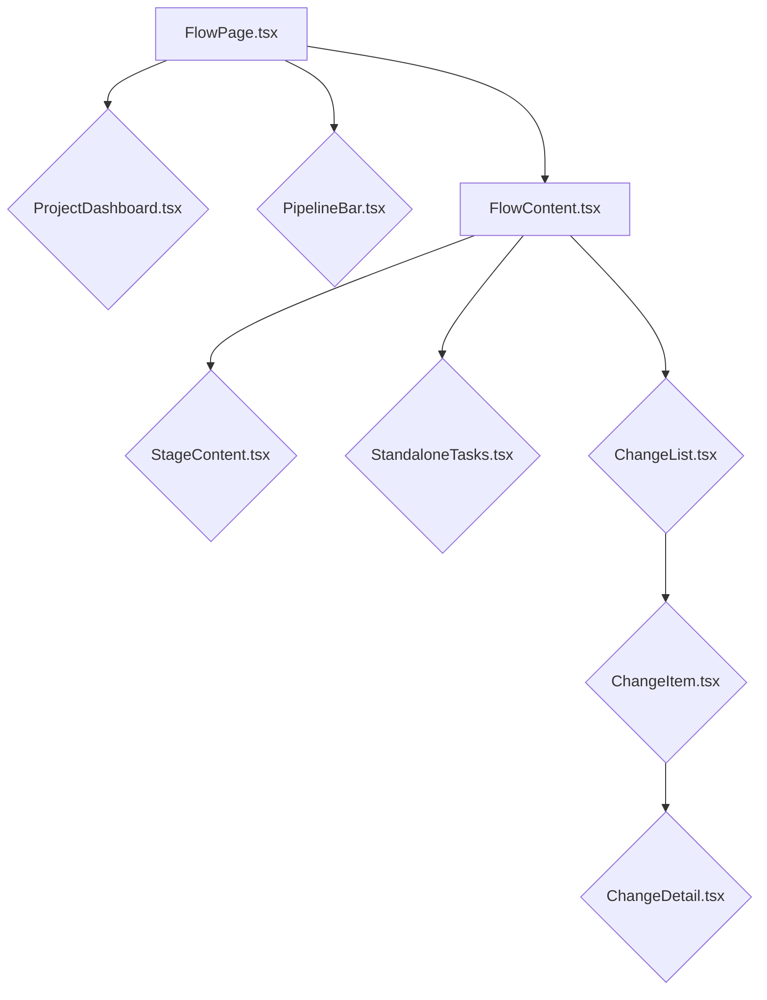
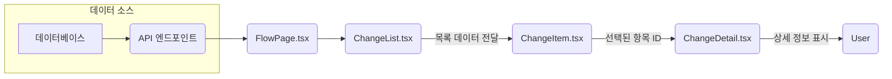
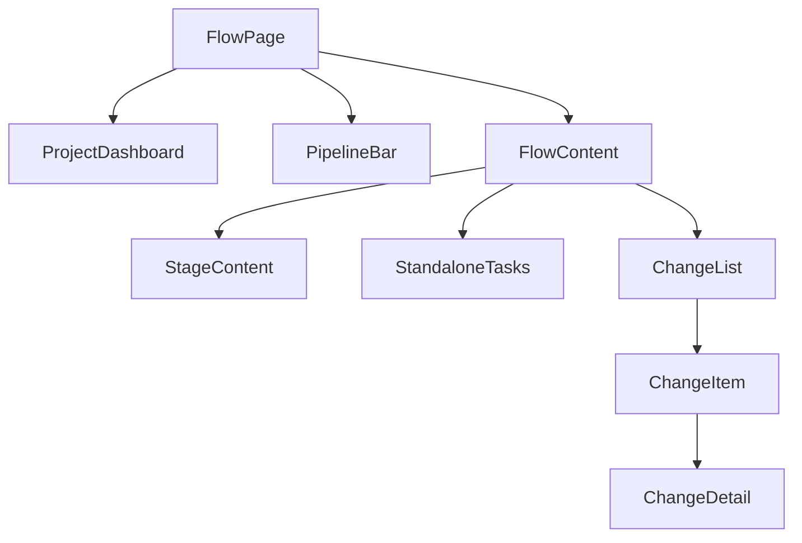

<cite>src/components/flow</cite>

## 개요

"컴포넌트 - Flow" 모듈은 소프트웨어 개발 및 배포 파이프라인과 관련된 다양한 시각화 및 상호작용 기능을 제공하는 UI 컴포넌트 집합입니다. 이 모듈은 프로젝트의 전체적인 흐름, 개별 파이프라인 단계, 변경 사항 및 독립적인 작업을 효과적으로 관리하고 모니터링할 수 있도록 설계되었습니다. 복잡한 워크플로우를 사용자 친화적인 방식으로 표현하여 개발 프로세스의 투명성과 제어력을 향상시키는 것을 목표로 합니다.

## 아키텍처 다이어그램



## 데이터 흐름 다이어그램 (변경 내역)



## 주요 컴포넌트 의존성



## 주요 함수/클래스

*   **`FlowPage`** (React Component)
    *   **설명**: Flow 모듈의 최상위 페이지 컴포넌트입니다. 전체 Flow 인터페이스의 레이아웃을 구성하고, 관련 데이터를 로드하며, `ProjectDashboard`, `PipelineBar`, `FlowContent`와 같은 하위 컴포넌트들을 통합하여 렌더링합니다.
    *   **시그니처**: `const FlowPage: React.FC = () => { ... }`

*   **`FlowContent`** (React Component)
    *   **설명**: 파이프라인의 주요 내용 영역을 담당하는 컴포넌트입니다. 현재 선택된 뷰(예: 특정 스테이지의 상세 내용, 독립 실행형 태스크 목록, 변경 사항 목록 등)에 따라 `StageContent`, `StandaloneTasks`, `ChangeList` 등을 조건부로 렌더링합니다.
    *   **시그니처**: `interface FlowContentProps { currentView: 'stage' | 'tasks' | 'changes'; stageId?: string; projectId: string; } const FlowContent: React.FC<FlowContentProps> = ({ currentView, stageId, projectId }) => { ... }`

*   **`StageContent`** (React Component)
    *   **설명**: 특정 파이프라인 단계(Stage)의 세부 정보를 표시하는 컴포넌트입니다. 해당 단계에서 수행된 작업, 상태, 로그, 관련 지표 등을 시각적으로 보여줍니다.
    *   **시그니처**: `interface StageContentProps { stageId: string; projectId: string; } const StageContent: React.FC<StageContentProps> = ({ stageId, projectId }) => { ... }`

*   **`ProjectDashboard`** (React Component)
    *   **설명**: 전체 프로젝트의 개요 및 주요 지표를 보여주는 대시보드 컴포넌트입니다. 현재 진행 중인 파이프라인 상태, 최근 변경 사항 요약, 중요 알림 등을 포함할 수 있습니다.
    *   **시그니처**: `interface ProjectDashboardProps { projectId: string; } const ProjectDashboard: React.FC<ProjectDashboardProps> = ({ projectId }) => { ... }`

*   **`PipelineBar`** (React Component)
    *   **설명**: 파이프라인의 진행 상태를 시각적으로 표시하거나, 파이프라인 단계 간 탐색 기능을 제공하는 바 컴포넌트입니다. 각 단계의 성공/실패 여부를 아이콘 등으로 나타낼 수 있습니다.
    *   **시그니처**: `interface PipelineBarProps { projectId: string; currentStageId: string; onStageSelect: (stageId: string) => void; } const PipelineBar: React.FC<PipelineBarProps> = ({ projectId, currentStageId, onStageSelect }) => { ... }`

*   **`ChangeList`** (React Component)
    *   **설명**: 프로젝트 또는 특정 파이프라인과 관련된 변경 사항 목록을 표시하는 컴포넌트입니다. 각 변경 항목은 `ChangeItem` 컴포넌트를 사용하여 렌더링하며, 필터링 및 정렬 기능을 포함할 수 있습니다.
    *   **시그니처**: `interface ChangeListProps { projectId: string; } const ChangeList: React.FC<ChangeListProps> = ({ projectId }) => { ... }`

*   **`ChangeDetail`** (React Component)
    *   **설명**: `ChangeList`에서 선택된 특정 변경 사항의 상세 정보를 표시하는 컴포넌트입니다. 변경 내용, 커밋 정보, 관련 태스크, 작성자 등의 상세 데이터를 보여줍니다.
    *   **시그니처**: `interface ChangeDetailProps { changeId: string; } const ChangeDetail: React.FC<ChangeDetailProps> = ({ changeId }) => { ... }`

## 설정/사용법

`FlowPage`는 일반적으로 애플리케이션의 라우팅 시스템 내에서 사용됩니다. `FlowContent`는 `FlowPage` 내에서 현재 활성화된 뷰에 따라 동적으로 콘텐츠를 변경할 때 활용됩니다.

```tsx
// src/pages/ProjectFlowView.tsx 예시
import React, { useState } from 'react';
import { FlowPage, FlowContent, PipelineBar, ProjectDashboard } from '../components/flow';

const ProjectFlowView: React.FC = () => {
  const [currentStage, setCurrentStage] = useState('stage-1');
  const projectId = 'project-abc-123'; // 실제 프로젝트 ID

  return (
    <FlowPage>
      <ProjectDashboard projectId={projectId} />
      <PipelineBar projectId={projectId} currentStageId={currentStage} onStageSelect={setCurrentStage} />
      <FlowContent currentView="stage" stageId={currentStage} projectId={projectId} />
    </FlowPage>
  );
};

export default ProjectFlowView;
```

`FlowContent` 내에서 다른 뷰를 렌더링하는 예시:

```tsx
// FlowContent.tsx 내부 로직의 일부
import React from 'react';
import { StageContent, StandaloneTasks, ChangeList } from './'; // index.ts를 통해 export

interface FlowContentProps {
  currentView: 'stage' | 'tasks' | 'changes';
  stageId?: string;
  projectId: string;
}

const FlowContent: React.FC<FlowContentProps> = ({ currentView, stageId, projectId }) => {
  switch (currentView) {
    case 'stage':
      if (!stageId) return <div>스테이지 ID가 필요합니다.</div>;
      return <StageContent stageId={stageId} projectId={projectId} />;
    case 'tasks':
      return <StandaloneTasks projectId={projectId} />;
    case 'changes':
      return <ChangeList projectId={projectId} />;
    default:
      return <div>뷰를 선택해주세요.</div>;
  }
};

export default FlowContent;
```

## 문제 해결 가이드

1.  **데이터 로딩 실패 또는 빈 화면:**
    *   **문제**: `ProjectDashboard` 또는 `StageContent` 등에서 데이터를 제대로 불러오지 못하여 컴포넌트가 비어 있거나 오류 메시지를 표시합니다.
    *   **해결**:
        *   컴포넌트에 전달되는 `projectId`, `stageId`, `changeId` 등의 `props`가 올바른지 확인하십시오.
        *   해당 데이터를 가져오는 API 엔드포인트가 정상적으로 작동하는지, 네트워크 요청에 오류가 없는지 개발자 도구(Network 탭)를 통해 확인하십시오.
        *   데이터 페칭 로직 내에서 오류 처리가 제대로 되어 있는지, 로딩 상태가 적절히 관리되고 있는지 검토하십시오.

2.  **UI 렌더링 오류 또는 잘못된 정보 표시:**
    *   **문제**: 컴포넌트가 예상과 다르게 렌더링되거나, 표시되는 정보가 최신이 아니거나 잘못되었습니다.
    *   **해결**:
        *   `props`로 전달되는 데이터의 형식이 컴포넌트가 기대하는 형식과 일치하는지 확인하십시오. (예: `ChangeItem`에 전달되는 변경 객체의 속성 이름)
        *   React 개발자 도구를 사용하여 컴포넌트의 `state`와 `props`를 검사하여 데이터가 올바르게 전달되고 있는지 확인하십시오.
        *   조건부 렌더링 로직(예: `FlowContent`의 `switch` 문)이 올바른 `currentView` 값에 따라 정확한 컴포넌트를 렌더링하는지 확인하십시오.

3.  **성능 저하 및 느린 반응성:**
    *   **문제**: Flow 페이지 전환 시 지연이 발생하거나, 많은 변경 사항 목록을 스크롤할 때 버벅거림이 발생합니다.
    *   **해결**:
        *   `ChangeList`와 같이 대량의 데이터를 렌더링하는 컴포넌트의 경우, 가상화(Virtualization) 라이브러리(예: `react-window`, `react-virtualized`)를 사용하여 DOM 요소를 최적화하십시오.
        *   `React.memo`를 사용하여 불필요한 리렌더링을 방지하십시오. 특히 `PipelineBar`와 같이 자주 업데이트되지 않는 하위 컴포넌트에 적용하는 것이 효과적입니다.
        *   데이터 페칭 시 `debounce`나 `throttle`을 적용하여 과도한 API 호출을 방지하십시오.