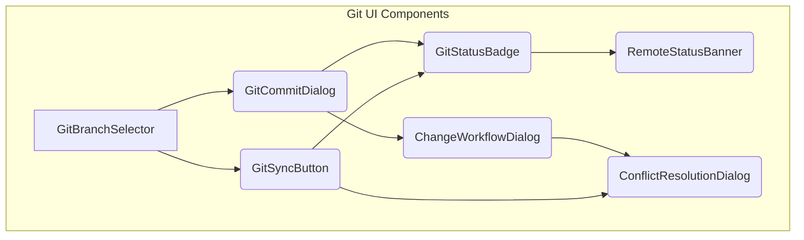
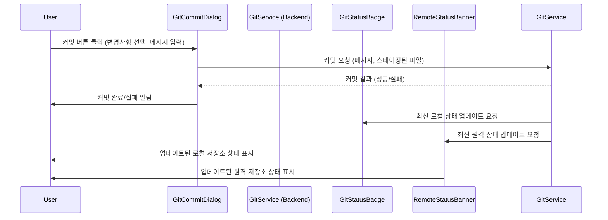
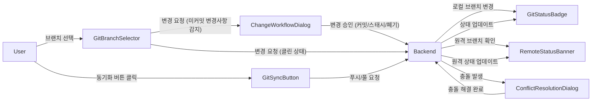

<cite>src/components/git/</cite>

## 개요
이 문서는 Git 버전 관리 시스템과 상호작용하는 데 필요한 UI 컴포넌트들을 설명합니다. `src/components/git` 디렉토리에 포함된 이 컴포넌트들은 브랜치 관리, 커밋, 상태 표시, 동기화, 충돌 해결 등 Git의 핵심 기능을 사용자 친화적인 인터페이스로 제공하여 애플리케이션 내에서 Git 작업을 원활하게 수행할 수 있도록 돕습니다.

## 아키텍처 다이어그램

### 1. 전체 Git UI 컴포넌트 아키텍처
이 다이어그램은 Git 관련 UI 컴포넌트들이 어떻게 구성되고 서로 연관되는지 개념적으로 보여줍니다. 사용자는 브랜치를 선택하고, 변경사항을 커밋하며, 원격 저장소와 동기화하고, 이 과정에서 발생하는 충돌이나 작업 흐름 변경을 처리합니다.



### 2. Git 커밋 워크플로우
이 시퀀스 다이어그램은 사용자가 변경 사항을 커밋하는 과정에서 각 컴포넌트와 백엔드 서비스가 어떻게 상호작용하는지 보여줍니다.



### 3. 브랜치 변경 및 동기화 워크플로우
이 다이어그램은 브랜치 변경 및 동기화 과정에서 발생할 수 있는 주요 상호작용 및 조건부 흐름을 나타냅니다.



## 주요 함수/클래스

-   **이름**: `ChangeWorkflowDialog`
    -   **시그니처**: `(props: ChangeWorkflowDialogProps) => JSX.Element`
    -   **설명**: 사용자가 브랜치를 변경하거나 다른 작업 흐름으로 전환할 때, 현재 작업 공간에 커밋되지 않은 변경사항이나 스태시되지 않은 변경사항이 존재할 경우 이를 사용자에게 알리고 어떻게 처리할지(예: 변경사항 버리기, 스태시하기, 커밋하기) 선택할 수 있도록 돕는 모달 대화 상자입니다. 이 컴포넌트는 잠재적인 데이터 손실을 방지하고 작업 흐름의 안정성을 유지하는 데 필수적입니다.

-   **이름**: `ConflictResolutionDialog`
    -   **시그니처**: `(props: ConflictResolutionDialogProps) => JSX.Element`
    -   **설명**: Git 병합(merge) 또는 리베이스(rebase) 작업 중 충돌이 발생했을 때, 사용자에게 충돌이 발생한 파일 목록과 각 파일 내의 충돌 영역을 시각적으로 표시하는 대화 상자입니다. 사용자는 이 인터페이스를 통해 충돌을 수동으로 해결하고, 해결된 파일을 표시한 후 병합/리베이스 작업을 완료할 수 있습니다. Git 서비스와의 연동을 통해 충돌 상태를 반영하고 해결 결과를 전달합니다.

-   **이름**: `GitBranchSelector`
    -   **시그니처**: `(props: GitBranchSelectorProps) => JSX.Element`
    -   **설명**: 현재 활성화된 Git 브랜치의 이름을 표시하고, 사용 가능한 다른 브랜치 목록을 드롭다운 메뉴 형태로 제공하여 사용자가 쉽게 브랜치를 전환할 수 있도록 하는 컴포넌트입니다. 브랜치 전환 시 `ChangeWorkflowDialog`와 같은 다른 컴포넌트와 연동하여 안전한 전환 프로세스를 유도할 수 있습니다. `currentBranch`와 `branches` prop을 통해 현재 상태를 받아오고, `onChange` prop을 통해 브랜치 변경 이벤트를 상위 컴포넌트로 전달합니다.

-   **이름**: `GitCommitDialog`
    -   **시그니처**: `(props: GitCommitDialogProps) => JSX.Element`
    -   **설명**: 사용자가 Git 변경사항을 스테이징(staging)하고 커밋 메시지를 작성하여 Git 커밋을 수행할 수 있도록 하는 모달 대화 상자입니다. 변경된 파일 목록을 표시하고, 사용자가 커밋할 파일을 선택(체크박스 등)할 수 있는 기능을 포함할 수 있습니다. 커밋 성공 시 `GitStatusBadge` 등의 다른 컴포넌트에 상태 업데이트를 트리거합니다. `onSubmit` prop을 통해 커밋 요청을 처리하는 콜백 함수를 받습니다.

-   **이름**: `GitStatusBadge`
    -   **시그니처**: `(props: GitStatusBadgeProps) => JSX.Element`
    -   **설명**: 현재 Git 작업 트리의 상태를 시각적으로 요약하여 표시하는 작은 배지(badge) 또는 아이콘 컴포넌트입니다. 예를 들어, 수정된 파일 수, 추적되지 않은 파일 수, 스테이징된 파일 수 등을 숫자로 표시하여 사용자가 한눈에 Git 저장소의 변경사항 유무를 파악할 수 있도록 돕습니다. 실시간으로 Git 저장소의 변경을 감지하고 상태를 업데이트하는 기능을 백엔드 서비스와 연동하여 제공합니다.

-   **이름**: `GitSyncButton`
    -   **시그니처**: `(props: GitSyncButtonProps) => JSX.Element`
    -   **설명**: 로컬 Git 저장소와 원격 Git 저장소 간의 동기화 작업(pull 및 push)을 시작하는 버튼 컴포넌트입니다. 버튼의 상태는 동기화 진행 중인지(`isSyncing`), 원격 저장소에 푸시되지 않은 변경사항이 있는지(`hasUnsyncedChanges`), 또는 원격에서 가져올 변경사항이 있는지(`hasIncomingChanges`)에 따라 다르게 표시될 수 있습니다. `onSync` prop을 통해 동기화 로직을 호출합니다.

-   **이름**: `RemoteStatusBanner`
    -   **시그니처**: `(props: RemoteStatusBannerProps) => JSX.Element`
    -   **설명**: 로컬 브랜치가 원격 브랜치에 비해 얼마나 앞서 있거나 뒤쳐져 있는지를 사용자에게 알리는 상단 또는 하단 배너 컴포넌트입니다. `aheadCount`와 `behindCount` prop을 통해 원격과의 차이점을 숫자로 표시하며, 사용자가 동기화 필요성을 인지하도록 돕습니다. `GitSyncButton`과 함께 사용되어 Git 저장소의 전체적인 동기화 상태를 시각적으로 완성합니다.

## 설정/사용법

Git 컴포넌트들은 React 애플리케이션 내에서 Git 관련 기능을 UI로 통합하는 데 사용됩니다. 다음은 주요 Git 컴포넌트들을 사용하여 대시보드를 구성하는 예시입니다.

```tsx
import React, { useState } from 'react';
import {
  GitBranchSelector,
  GitStatusBadge,
  GitSyncButton,
  GitCommitDialog,
  RemoteStatusBanner,
  ConflictResolutionDialog,
  ChangeWorkflowDialog
} from './components/git'; // 실제 경로에 맞게 조정

const MyGitDashboard = () => {
  const [isCommitDialogOpen, setIsCommitDialogOpen] = useState(false);
  const [isConflictDialogOpen, setIsConflictDialogOpen] = useState(false);
  const [isChangeWorkflowDialogOpen, setIsChangeWorkflowDialogOpen] = useState(false);
  const [currentBranch, setCurrentBranch] = useState('main');
  const branches = ['main', 'feature/A', 'bugfix/B'];

  // Git 동기화 로직을 처리하는 함수
  const handleSync = async () => {
    console.log('Git 동기화 시작...');
    // 실제 Git 동기화 로직 (API 호출 등)을 여기에 구현합니다.
    // 예: await gitApi.sync();
    await new Promise(resolve => setTimeout(resolve, 1000)); // API 호출 시뮬레이션
    console.log('Git 동기화 완료!');
    // 동기화 후 Git 상태를 업데이트하는 로직을 호출합니다.
    // 필요 시 충돌 발생 시 ConflictResolutionDialog 열기 로직 추가
    // setIsConflictDialogOpen(true);
  };

  // 브랜치 변경 로직을 처리하는 함수
  const handleBranchChange = (newBranch: string) => {
    console.log(`브랜치 변경 요청: ${newBranch}`);
    // 실제 브랜치 변경 로직 및 변경사항 확인 로직을 구현합니다.
    // 만약 미커밋 변경사항이 있다면 ChangeWorkflowDialog를 엽니다.
    // if (hasUncommittedChanges) {
    //   setIsChangeWorkflowDialogOpen(true);
    // } else {
    //   setCurrentBranch(newBranch);
    // }
    setCurrentBranch(newBranch); // 예시를 위해 단순화
  };

  // 커밋 로직을 처리하는 함수
  const handleCommit = async (message: string, filesToCommit: string[]) => {
    console.log(`커밋 메시지: "${message}", 커밋할 파일: ${filesToCommit.join(', ')}`);
    // 실제 Git 커밋 로직 (API 호출 등)을 여기에 구현합니다.
    // 예: await gitApi.commit(message, filesToCommit);
    await new Promise(resolve => setTimeout(resolve, 1500)); // API 호출 시뮬레이션
    console.log('커밋 완료!');
    setIsCommitDialogOpen(false); // 대화 상자 닫기
    // 커밋 후 Git 상태 업데이트 트리거
  };

  // 충돌 해결 로직을 처리하는 함수
  const handleResolveConflict = (resolvedFiles: string[]) => {
    console.log(`충돌 해결된 파일: ${resolvedFiles.join(', ')}`);
    // 충돌 해결 후 Git 서비스에 알리는 로직 구현
    setIsConflictDialogOpen(false);
  };

  // 작업 흐름 변경 액션 (커밋, 스태시, 폐기) 처리 함수
  const handleChangeWorkflowAction = (action: 'commit' | 'stash' | 'discard') => {
    console.log(`작업 흐름 변경 액션: ${action}`);
    // 선택된 액션에 따라 Git 명령을 실행하는 로직 구현
    setIsChangeWorkflowDialogOpen(false);
  };

  return (
    <div>
      <h1>Git 대시보드</h1>
      <RemoteStatusBanner aheadCount={2} behindCount={0} /> {/* 원격 저장소 상태 표시 */}
      <div style={{ display: 'flex', alignItems: 'center', gap: '10px', margin: '20px 0' }}>
        <GitBranchSelector
          currentBranch={currentBranch}
          branches={branches}
          onChange={handleBranchChange}
        />
        <GitStatusBadge
          modifiedCount={5}
          untrackedCount={2}
          stagedCount={3}
        />
        <button onClick={() => setIsCommitDialogOpen(true)} style={{ padding: '8px 15px', cursor: 'pointer' }}>
          커밋하기
        </button>
        <GitSyncButton
          onSync={handleSync}
          isSyncing={false}
          hasUnsyncedChanges={true}
        />
        {/* 테스트용 버튼 (필요 시 주석 해제) */}
        {/* <button onClick={() => setIsConflictDialogOpen(true)}>충돌 해결 테스트</button> */}
        {/* <button onClick={() => setIsChangeWorkflowDialogOpen(true)}>작업 흐름 변경 테스트</button> */}
      </div>

      {/* 커밋 대화 상자 */}
      {isCommitDialogOpen && (
        <GitCommitDialog
          isOpen={isCommitDialogOpen}
          onClose={() => setIsCommitDialogOpen(false)}
          onSubmit={handleCommit}
          stagedFiles={['file1.txt', 'file2.js']}
          unstagedFiles={['file3.css']}
        />
      )}

      {/* 충돌 해결 대화 상자 */}
      {isConflictDialogOpen && (
        <ConflictResolutionDialog
          isOpen={isConflictDialogOpen}
          onClose={() => setIsConflictDialogOpen(false)}
          onResolve={handleResolveConflict}
          conflictingFiles={[{ path: 'README.md', status: 'conflict' }]}
        />
      )}

      {/* 작업 흐름 변경 대화 상자 */}
      {isChangeWorkflowDialogOpen && (
        <ChangeWorkflowDialog
          isOpen={isChangeWorkflowDialogOpen}
          onClose={() => setIsChangeWorkflowDialogOpen(false)}
          onAction={handleChangeWorkflowAction}
          uncommittedChangesExist={true}
          stashedChangesExist={false}
        />
      )}
    </div>
  );
};

export default MyGitDashboard;
```

## 문제 해결 가이드

### 1. Git 상태가 업데이트되지 않음.
-   **원인**: `GitStatusBadge`나 `RemoteStatusBanner`가 올바른 Git 저장소 상태 데이터를 수신하지 못하고 있거나, 백엔드 Git 서비스에서 변경사항을 감지하지 못하는 경우입니다. 프론트엔드에서 폴링(polling) 메커니즘이 없거나 웹소켓 연결이 끊겼을 수도 있습니다.
-   **해결**:
    1.  **백엔드 서비스 확인**: Git 서비스의 로그를 확인하여 Git 명령어가 정상적으로 실행되고 상태가 올바르게 반환되는지 검증합니다.
    2.  **API 호출 및 응답 확인**: 개발자 도구(브라우저 콘솔의 네트워크 탭)를 사용하여 프론트엔드가 Git 상태 API를 주기적으로 호출하고 있으며, 그 응답이 유효한지 확인합니다.
    3.  **컴포넌트 Prop 확인**: `GitStatusBadge`와 `RemoteStatusBanner`에 `modifiedCount`, `untrackedCount`, `aheadCount`, `behindCount` 등의 `prop`이 올바르게 전달되고 있는지 확인합니다.
    4.  **강제 새로고침 기능 제공**: 일시적인 문제일 경우, Git 상태를 강제로 새로고침하는 기능을 제공하여 사용자가 직접 상태를 갱신할 수 있도록 합니다.

### 2. 커밋 또는 동기화 작업 실패.
-   **원인**: `GitCommitDialog`나 `GitSyncButton`을 통한 작업이 실패하는 경우는 다양한 원인이 있습니다. Git 인증 정보가 유효하지 않거나, 네트워크 연결 문제, 원격 저장소 접근 권한 부족, 또는 병합 충돌이 해결되지 않은 상태에서 동기화를 시도하는 경우 등이 있습니다.
-   **해결**:
    1.  **인증 정보 확인**: 사용자에게 Git 자격 증명(사용자 이름, 비밀번호/토큰)이 올바르게 설정되어 있는지 확인하도록 안내합니다. 필요한 경우 자격 증명 관리자를 통해 업데이트합니다.
    2.  **네트워크 및 권한 점검**: 네트워크 연결 상태를 점검하고, Git 저장소에 대한 읽기/쓰기 권한이 있는지 확인합니다.
    3.  **충돌 해결**: `ConflictResolutionDialog`를 통해 해결되지 않은 병합 충돌이 있는지 확인하고, 모든 충돌을 해결한 후 다시 시도하도록 안내합니다.
    4.  **상세 오류 메시지 표시**: 백엔드에서 받은 Git 오류 메시지를 사용자에게 명확하게 표시하여 문제 해결에 도움을 줍니다.

### 3. 브랜치 변경 시 예기치 않은 동작.
-   **원인**: `GitBranchSelector`를 통해 브랜치를 변경할 때, 현재 작업 트리에 커밋되지 않거나 스태시되지 않은 변경사항이 있는 경우 Git은 브랜치 전환을 거부할 수 있습니다. 이로 인해 사용자에게 혼란을 주거나 작업이 중단될 수 있습니다.
-   **해결**:
    1.  **변경사항 처리 안내**: `ChangeWorkflowDialog`를 사용하여 브랜치 변경 전에 커밋되지 않은 변경사항을 어떻게 처리할지(예: 커밋, 스태시, 폐기) 사용자에게 명확하게 선택지를 제공합니다.
    2.  **안전한 전환 로직**: `GitBranchSelector` 컴포넌트가 브랜치 전환을 시도하기 전에 현재 작업 트리의 상태를 확인하고, 필요한 경우 `ChangeWorkflowDialog`를 트리거하도록 구현 로직을 검토합니다.
    3.  **스태시 기능 활용**: 임시로 변경사항을 저장할 수 있는 스태시(stash) 기능을 UI에 통합하여, 사용자가 브랜치 전환 시 변경사항을 안전하게 보관할 수 있도록 돕습니다.