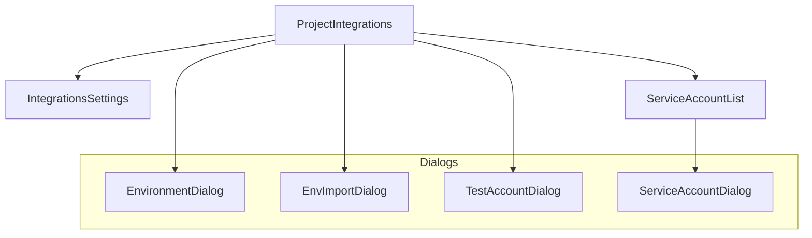
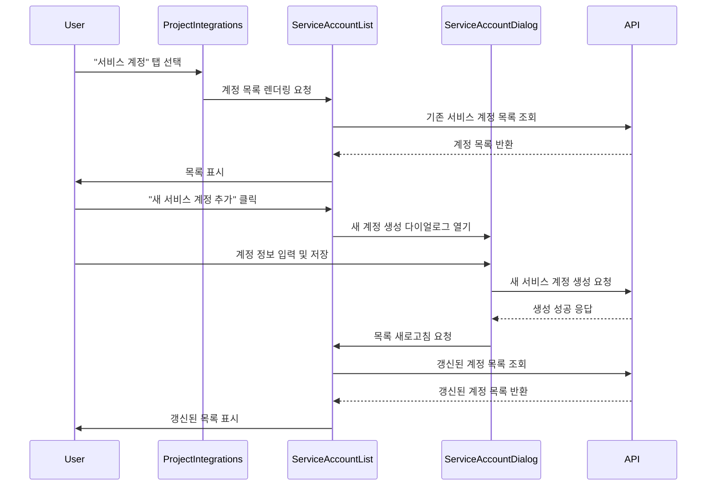

<cite>src/components/integrations/</cite>

## 개요
`src/components/integrations` 모듈은 애플리케이션이 외부 서비스와 연동하고 프로젝트의 기능을 확장할 수 있도록 다양한 통합 기능을 관리하는 컴포넌트들을 포함합니다. 이 모듈은 서비스 계정, 환경 변수, 테스트 계정 등 프로젝트에 필요한 외부 연결 설정 및 관리를 위한 사용자 인터페이스를 제공합니다.

## 아키텍처 다이어그램


## 서비스 계정 관리 흐름 다이어그램


## 주요 컴포넌트 및 함수

*   **`ProjectIntegrations`**
    *   **설명**: 프로젝트 수준의 통합 설정을 관리하는 메인 컴포넌트입니다. 여러 통합 탭(예: 서비스 계정, 환경 변수)을 포함하며 각 탭에 해당하는 하위 컴포넌트를 렌더링합니다.
    *   **시그니처**: `function ProjectIntegrations(props: ProjectIntegrationsProps): JSX.Element`
    *   **주요 Props**:
        *   `projectId: string`: 현재 프로젝트의 ID.
        *   `initialTab?: string`: 초기 활성화될 탭의 이름.

*   **`IntegrationsSettings`**
    *   **설명**: 일반적인 통합 관련 설정이나 전역적인 통합 기능을 제공하는 컴포넌트입니다. 특정 통합 유형에 국한되지 않는 설정을 담당할 수 있습니다.
    *   **시그니처**: `function IntegrationsSettings(): JSX.Element`

*   **`ServiceAccountList`**
    *   **설명**: 프로젝트에 등록된 서비스 계정 목록을 표시하고, 새 계정 추가, 기존 계정 편집 및 삭제 기능을 제공합니다. `ServiceAccountDialog`를 통해 계정 관리를 수행합니다.
    *   **시그니처**: `function ServiceAccountList(props: ServiceAccountListProps): JSX.Element`
    *   **주요 Props**:
        *   `projectId: string`: 서비스 계정을 조회하고 관리할 프로젝트 ID.

*   **`ServiceAccountDialog`**
    *   **설명**: 서비스 계정을 생성하거나 편집하기 위한 모달 다이얼로그입니다. 계정 이름, 권한 등의 정보를 입력받고 API를 통해 저장합니다.
    *   **시그니처**: `function ServiceAccountDialog(props: ServiceAccountDialogProps): JSX.Element`
    *   **주요 Props**:
        *   `open: boolean`: 다이얼로그의 열림/닫힘 상태.
        *   `onClose: () => void`: 다이얼로그가 닫힐 때 호출되는 콜백 함수.
        *   `projectId: string`: 서비스 계정이 속할 프로젝트 ID.
        *   `serviceAccount?: ServiceAccount`: 편집할 기존 서비스 계정 객체 (생성 시에는 `undefined`).
        *   `onSaveSuccess: () => void`: 계정 저장 성공 시 호출되는 콜백 함수.

*   **`EnvironmentDialog`**
    *   **설명**: 프로젝트의 환경 변수를 추가, 편집, 삭제하는 기능을 제공하는 다이얼로그입니다.
    *   **시그니처**: `function EnvironmentDialog(props: EnvironmentDialogProps): JSX.Element`
    *   **주요 Props**:
        *   `open: boolean`: 다이얼로그의 열림/닫힘 상태.
        *   `onClose: () => void`: 다이얼로그가 닫힐 때 호출되는 콜백 함수.
        *   `projectId: string`: 환경 변수가 적용될 프로젝트 ID.
        *   `initialEnv?: EnvironmentVariable`: 편집할 기존 환경 변수 객체.
        *   `onSaveSuccess: () => void`: 환경 변수 저장 성공 시 호출되는 콜백 함수.

## 설정/사용법

### 1. 프로젝트 통합 컴포넌트 렌더링
`ProjectIntegrations` 컴포넌트를 사용하여 특정 프로젝트의 통합 관리 페이지를 구성할 수 있습니다.

```tsx
import React from 'react';
import { ProjectIntegrations } from 'src/components/integrations';

function MyProjectIntegrationsPage({ currentProjectId }: { currentProjectId: string }) {
  return (
    <div>
      <h1>프로젝트 통합 관리</h1>
      <ProjectIntegrations projectId={currentProjectId} initialTab="service-accounts" />
    </div>
  );
}
```

### 2. 서비스 계정 생성 다이얼로그 사용 예시
`ServiceAccountDialog`를 직접 호출하여 서비스 계정을 생성하거나 편집하는 모달을 띄울 수 있습니다.

```tsx
import React, { useState } from 'react';
import { Button } from '@mui/material';
import { ServiceAccountDialog } from 'src/components/integrations';

function ServiceAccountManagement({ projectId }: { projectId: string }) {
  const [isDialogOpen, setIsDialogOpen] = useState(false);

  const handleOpenDialog = () => {
    setIsDialogOpen(true);
  };

  const handleCloseDialog = () => {
    setIsDialogOpen(false);
    // 서비스 계정 목록 새로고침 로직 (예: 부모 컴포넌트의 상태 업데이트)
  };

  const handleSaveSuccess = () => {
    alert('서비스 계정이 성공적으로 저장되었습니다!');
    handleCloseDialog();
  };

  return (
    <div>
      <Button variant="contained" onClick={handleOpenDialog}>
        새 서비스 계정 추가
      </Button>
      <ServiceAccountDialog
        open={isDialogOpen}
        onClose={handleCloseDialog}
        projectId={projectId}
        onSaveSuccess={handleSaveSuccess}
        // serviceAccount prop을 전달하면 편집 모드가 됩니다.
      />
    </div>
  );
}
```

## 문제 해결 가이드

### 1. 통합 연결 실패
*   **증상**: 외부 서비스와 연동 시 연결 오류 메시지가 표시되거나 데이터가 동기화되지 않습니다.
*   **해결책**:
    *   **자격 증명 확인**: 서비스 계정의 API 키, 토큰, 비밀번호 등 자격 증명이 올바르게 입력되었는지, 만료되지 않았는지 확인합니다.
    *   **권한 확인**: 해당 서비스 계정에 외부 서비스에 접근하고 필요한 작업을 수행할 수 있는 충분한 권한이 부여되었는지 확인합니다.
    *   **네트워크 연결**: 애플리케이션 서버와 외부 서비스 간의 네트워크 연결에 문제가 없는지 확인합니다 (방화벽, 프록시 설정 등).

### 2. 환경 변수 미적용
*   **증상**: 설정한 환경 변수가 실제 애플리케이션 실행 시 적용되지 않습니다.
*   **해결책**:
    *   **배포/재시작 확인**: 환경 변수는 일반적으로 애플리케이션 시작 시 로드됩니다. 변수를 변경한 후에는 애플리케이션을 재배포하거나 다시 시작해야 적용됩니다.
    *   **변수명 오타 확인**: 환경 변수 이름에 오타가 없는지, 대소문자가 일치하는지 확인합니다.
    *   **우선순위 확인**: 여러 환경 변수 설정 방법(예: `.env` 파일, 시스템 환경 변수, 통합 설정)이 있을 경우, 우선순위에 따라 원하는 변수가 덮어쓰이지 않는지 확인합니다.

### 3. 서비스 계정 목록 로드 지연 또는 오류
*   **증상**: `ServiceAccountList` 컴포넌트에서 서비스 계정 목록이 늦게 로드되거나 오류 메시지와 함께 표시되지 않습니다.
*   **해결책**:
    *   **API 응답 확인**: 브라우저 개발자 도구의 네트워크 탭에서 서비스 계정 목록을 가져오는 API 호출이 성공했는지, 응답 데이터에 오류가 포함되어 있는지 확인합니다.
    *   **서버 로그 확인**: 백엔드 서버의 로그를 확인하여 서비스 계정 조회 API에서 발생하는 오류를 분석합니다. 데이터베이스 연결 문제, 권한 문제 등이 원인일 수 있습니다.
    *   **프로젝트 ID 확인**: `ServiceAccountList` 컴포넌트에 전달되는 `projectId`가 유효한지 확인합니다. 잘못된 프로젝트 ID는 빈 목록이나 오류를 초래할 수 있습니다.