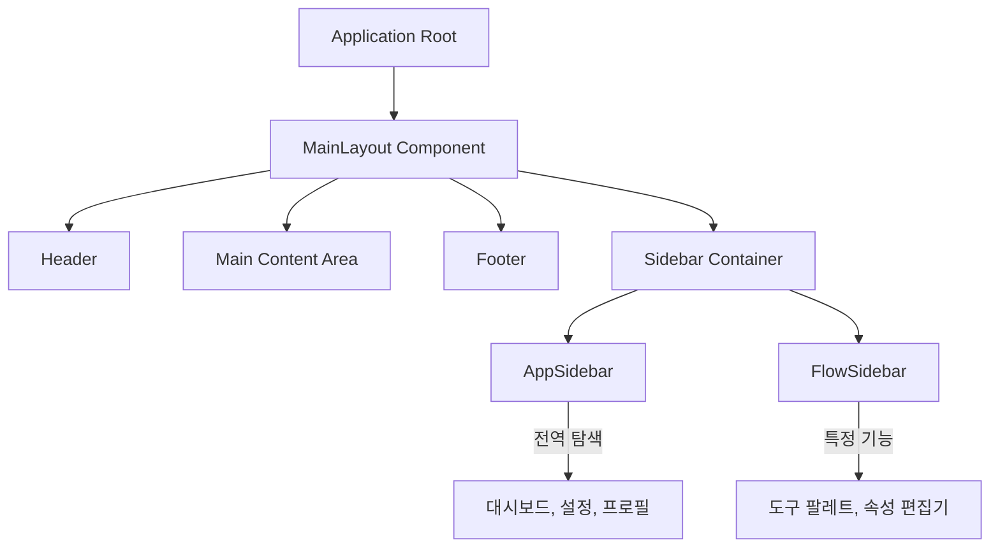
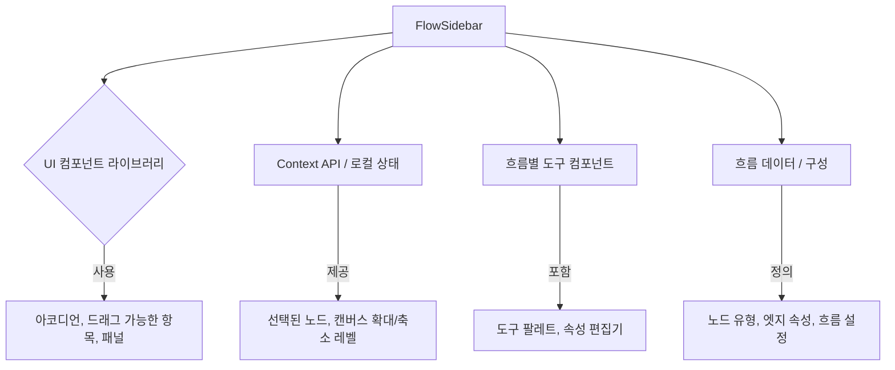

<cite>src/components/layout/</cite>

## 컴포넌트 - Layout

### 개요

Layout 컴포넌트는 애플리케이션의 전체적인 구조와 시각적 배치를 정의하는 역할을 합니다. `AppSidebar` 및 `FlowSidebar`와 같은 사이드바 컴포넌트들은 이러한 레이아웃의 핵심적인 부분으로, 사용자에게 일관된 탐색 경험과 특정 기능에 대한 접근성을 제공합니다. 이들은 애플리케이션의 다양한 섹션이나 특정 작업 환경에 맞춰 내용을 동적으로 조절하여 사용자 인터페이스의 효율성을 높입니다.

### 아키텍처 다이어그램

#### 1. 애플리케이션 전체 레이아웃 아키텍처

이 다이어그램은 `AppSidebar`와 `FlowSidebar`가 애플리케이션의 전반적인 레이아웃에 어떻게 통합되는지를 보여줍니다. 일반적으로 메인 레이아웃 컴포넌트 내에서 조건부로 렌더링되거나 특정 페이지의 컨텍스트에 따라 활성화됩니다.



#### 2. AppSidebar 내부 구조 및 의존성

`AppSidebar`는 애플리케이션 전반의 탐색을 담당하며, 주로 라우팅, 전역 상태 관리 및 UI 라이브러리에 의존합니다.

```mermaid
graph TD
    A[AppSidebar] --> B{UI 컴포넌트 라이브러리}
    A --> C[React Router Hooks]
    A --> D[전역 상태 관리 (예: Zustand, Redux)]
    A --> E[탐색 메뉴 항목 데이터]
    B -- "사용" --> F[버튼, 리스트, 아이콘]
    C -- "제공" --> G[현재 경로, 탐색 함수]
    D -- "제공" --> H[사이드바 열림/닫힘 상태, 사용자 역할]
    E -- "정의" --> I[홈, 설정, 사용자 관리]
```

#### 3. FlowSidebar 내부 구조 및 의존성

`FlowSidebar`는 특정 흐름 편집기나 다이어그램 도구와 같은 전문적인 환경에서 사용되며, 해당 환경의 상태와 도구 컴포넌트에 깊이 의존합니다.



### 주요 함수/클래스

다음은 `src/components/layout` 경로에 위치한 주요 레이아웃 컴포넌트들입니다.

-   **`AppSidebar`**
    -   **시그니처:** `const AppSidebar: React.FC<AppSidebarProps>`
        -   `AppSidebarProps`: `isOpen?: boolean`, `onClose?: () => void`, `menuItems?: MenuItem[]` 등의 속성을 포함할 수 있습니다.
    -   **설명:** 애플리케이션의 전역 탐색 기능을 제공하는 사이드바 컴포넌트입니다. 주요 섹션(예: 대시보드, 설정, 프로필)으로의 이동 링크를 포함하며, 사용자 인증 상태나 권한에 따라 메뉴 항목을 동적으로 표시할 수 있습니다. 사이드바의 열림/닫힘 상태는 전역 상태 관리 시스템과 연동되거나 부모 컴포넌트로부터 제어될 수 있습니다. 반응형 디자인을 지원하여 작은 화면에서는 숨겨지거나 오버레이 형태로 나타날 수 있습니다.

-   **`FlowSidebar`**
    -   **시그니처:** `const FlowSidebar: React.FC<FlowSidebarProps>`
        -   `FlowSidebarProps`: `flowData?: FlowData`, `selectedNodeId?: string`, `onNodePropertyChange?: (id: string, key: string, value: any) => void` 등의 속성을 포함할 수 있습니다.
    -   **설명:** 특정 "흐름(Flow)" 또는 다이어그램 편집 환경에서 사용되는 사이드바 컴포넌트입니다. 흐름을 구성하는 요소(노드, 엣지 등)의 도구 팔레트, 선택된 요소의 속성 편집기, 또는 흐름 관련 설정 옵션 등을 포함할 수 있습니다. 흐름 편집기의 현재 상태(예: 선택된 노드, 캔버스 확대/축소 레벨)와 상호작용하며, 사용자가 흐름을 시각적으로 구성하고 편집하는 데 필요한 도구들을 제공합니다.

### 설정/사용법 섹션

레이아웃 컴포넌트는 일반적으로 애플리케이션의 최상위 또는 특정 페이지의 레이아웃을 정의하는 데 사용됩니다.

#### 1. 메인 레이아웃 컴포넌트에서 사이드바 통합

`MainLayout`과 같은 상위 레이아웃 컴포넌트 내에서 `AppSidebar`와 `FlowSidebar`를 조건부로 렌더링하는 예시입니다.

```tsx
// src/components/layout/MainLayout.tsx
import React from 'react';
import { AppSidebar } from './AppSidebar';
import { FlowSidebar } from './FlowSidebar';

interface MainLayoutProps {
  children: React.ReactNode;
  showFlowSidebar?: boolean; // FlowSidebar 표시 여부를 제어하는 속성
}

const MainLayout: React.FC<MainLayoutProps> = ({ children, showFlowSidebar = false }) => {
  return (
    <div style={{ display: 'flex', minHeight: '100vh', width: '100%' }}>
      <AppSidebar /> {/* 항상 표시되는 애플리케이션 사이드바 */}
      {showFlowSidebar && <FlowSidebar />} {/* showFlowSidebar가 true일 때만 표시 */}
      <main style={{ flexGrow: 1, padding: '20px', overflowY: 'auto' }}>
        {children}
      </main>
    </div>
  );
};

export default MainLayout;
```

#### 2. 페이지 컴포넌트에서 레이아웃 사용

다양한 페이지에서 `MainLayout` 컴포넌트를 사용하여 일관된 레이아웃을 적용하고, 특정 페이지에서 `FlowSidebar`를 활성화하는 예시입니다.

```tsx
// src/pages/DashboardPage.tsx
import React from 'react';
import MainLayout from '../components/layout/MainLayout';

const DashboardPage: React.FC = () => {
  return (
    <MainLayout> {/* AppSidebar만 표시 */}
      <h1>대시보드</h1>
      <p>애플리케이션의 주요 정보를 한눈에 볼 수 있습니다.</p>
    </MainLayout>
  );
};

export default DashboardPage;

// src/pages/FlowEditorPage.tsx
import React from 'react';
import MainLayout from '../components/layout/MainLayout';

const FlowEditorPage: React.FC = () => {
  return (
    <MainLayout showFlowSidebar={true}> {/* AppSidebar와 FlowSidebar 모두 표시 */}
      <h1>흐름 편집기</h1>
      <p>새로운 흐름을 생성하거나 기존 흐름을 편집하세요.</p>
      {/* Flow 편집기 관련 UI */}
    </MainLayout>
  );
};

export default FlowEditorPage;
```

### 문제 해결 가이드

레이아웃 및 사이드바 컴포넌트를 사용하면서 발생할 수 있는 일반적인 문제들과 해결 방안입니다.

1.  **사이드바가 올바르게 렌더링되지 않거나 레이아웃이 깨짐:**
    -   **문제:** 사이드바가 예상치 못한 위치에 나타나거나, 다른 콘텐츠와 겹치거나, 전체 레이아웃이 비정상적으로 표시됩니다.
    -   **원인:** CSS 충돌, 부모 컨테이너의 flexbox 또는 CSS Grid 설정 오류, 사이드바 자체의 너비/높이 설정 문제.
    -   **해결책:**
        -   개발자 도구(F12)를 사용하여 사이드바와 주변 요소의 CSS 속성을 검사합니다. 특히 `position`, `z-index`, `width`, `height`, `flex` 또는 `grid` 관련 속성을 확인합니다.
        -   `MainLayout`과 같은 상위 레이아웃 컴포넌트가 `display: flex` 또는 `display: grid`를 사용하여 자식 요소들을 올바르게 배치하고 있는지 확인합니다.
        -   사이드바 컴포넌트 자체의 최소/최대 너비 설정을 검토하여 반응형 동작을 확인합니다.
        -   CSS 모듈 또는 Styled Components와 같은 CSS-in-JS 라이브러리를 사용하여 스타일 충돌을 방지합니다.

2.  **사이드바 메뉴 항목이 업데이트되지 않거나 클릭 시 반응 없음:**
    -   **문제:** `AppSidebar`의 메뉴 항목이 사용자 권한 변경 후에도 업데이트되지 않거나, 메뉴 항목 클릭 시 페이지 이동이 발생하지 않습니다.
    -   **원인:** 전역 상태 관리 시스템(예: Redux, Zustand)과의 동기화 문제, React Router 설정 오류, 이벤트 핸들러 누락 또는 잘못된 구현.
    -   **해결책:**
        -   메뉴 항목 데이터가 전역 상태에서 올바르게 업데이트되고 있는지 확인합니다. `AppSidebar`가 해당 상태를 구독하고 있는지 검토합니다.
        -   React Router의 `Link` 컴포넌트나 `useNavigate` 훅이 올바르게 사용되었는지 확인합니다. 경로가 정확한지, 대소문자 구분이 맞는지 등을 점검합니다.
        -   클릭 이벤트 핸들러가 `e.preventDefault()`를 호출하여 기본 동작을 막고 있는지 확인하고, 필요한 경우 제거합니다.
        -   메뉴 항목을 동적으로 생성할 때 `key` prop을 사용하여 React가 리스트를 효율적으로 렌더링하도록 합니다.

3.  **사이드바 열림/닫힘 상태가 동기화되지 않음:**
    -   **문제:** 사이드바의 열림/닫힘 버튼을 클릭해도 상태가 변경되지 않거나, 다른 컴포넌트에서 사이드바 상태를 변경하려 할 때 동기화되지 않습니다.
    -   **원인:** 사이드바 상태 관리 로직 오류, 여러 컴포넌트 간의 상태 불일치, 불필요한 리렌더링.
    -   **해결책:**
        -   사이드바의 열림/닫힘 상태를 관리하는 주체를 명확히 합니다 (예: 전역 상태, `MainLayout` 컴포넌트의 로컬 상태).
        -   상태를 변경하는 함수(예: `toggleSidebar`)가 올바르게 호출되고, 해당 상태가 사이드바 컴포넌트의 `isOpen` prop으로 정확히 전달되는지 확인합니다.
        -   컨텍스트 API나 전역 상태 관리 라이브러리를 사용하여 여러 컴포넌트가 동일한 사이드바 상태를 공유하고 동기화할 수 있도록 구현합니다.
        -   `React.memo`를 사용하여 사이드바 컴포넌트의 불필요한 리렌더링을 방지하고, prop 변화에만 반응하도록 최적화할 수 있습니다.