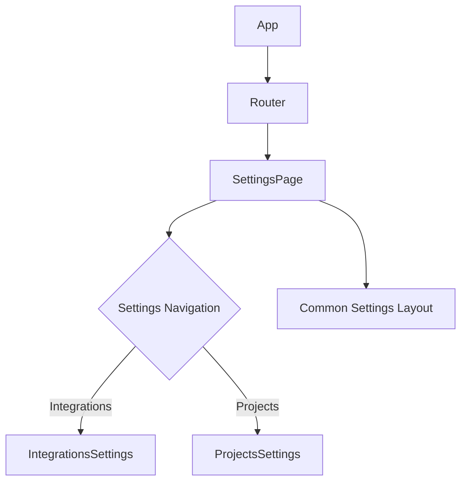
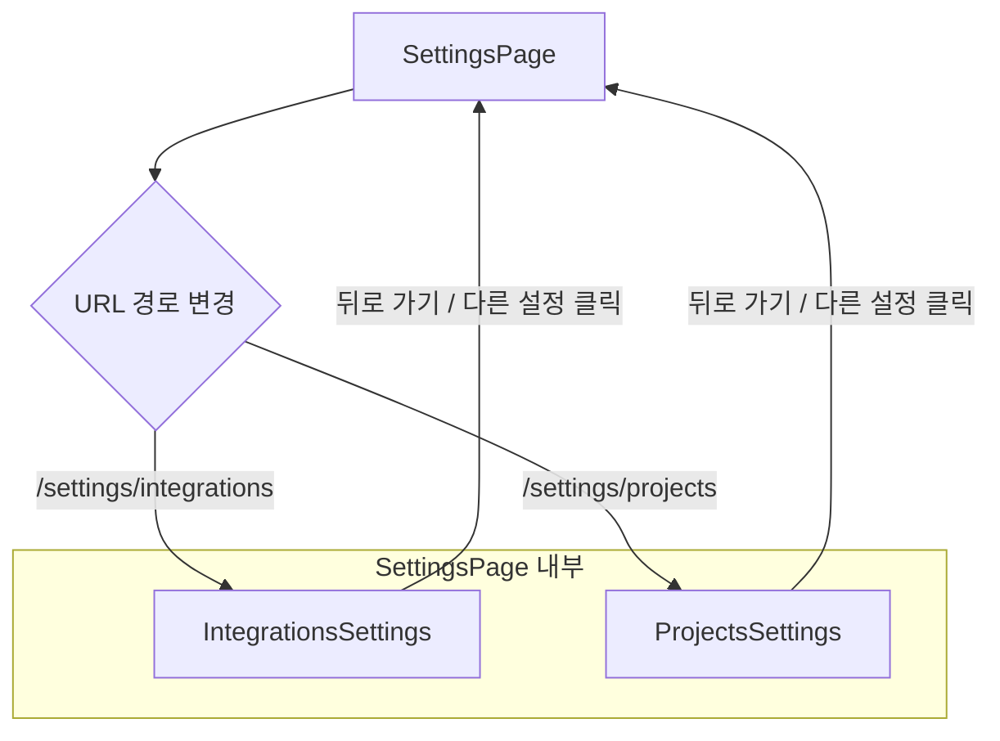

<cite>
src/components/settings/IntegrationsSettings.tsx
src/components/settings/ProjectsSettings.tsx
src/components/settings/SettingsPage.tsx
src/components/settings/index.ts
</cite>

## 개요

이 문서에서 다루는 "Settings" 컴포넌트 그룹은 애플리케이션의 다양한 설정 기능을 사용자에게 제공하는 역할을 합니다. `SettingsPage`는 모든 설정의 진입점으로서 일관된 레이아웃과 내비게이션 구조를 제공하며, `IntegrationsSettings` 및 `ProjectsSettings`와 같은 하위 컴포넌트들은 각각 특정 영역에 대한 세부 설정을 담당합니다. 이 모듈은 사용자가 애플리케이션의 동작 방식, 외부 서비스 연동, 프로젝트 관리 등을 커스터마이징할 수 있도록 지원합니다.

## 아키텍처 다이어그램

### 1. 컴포넌트 계층 구조


이 다이어그램은 애플리케이션의 전반적인 설정 컴포넌트 계층을 보여줍니다. `SettingsPage`가 메인 진입점이며, 내비게이션을 통해 `IntegrationsSettings`와 `ProjectsSettings`와 같은 특정 설정 페이지로 이동합니다. `Common Settings Layout`은 모든 설정 페이지에 공통적으로 적용되는 UI 요소를 나타낼 수 있습니다.

### 2. 설정 페이지 내비게이션 흐름


이 다이어그램은 `SettingsPage` 내에서 사용자가 특정 설정 섹션을 선택했을 때의 내비게이션 흐름을 시각화합니다. URL 경로 변경을 통해 해당 설정 컴포넌트가 동적으로 렌더링되며, 사용자는 언제든지 다른 설정 섹션으로 이동하거나 `SettingsPage`의 메인 화면으로 돌아올 수 있습니다.

## 주요 함수/클래스

### SettingsPage

*   **이름**: `SettingsPage`
*   **시그니처**: `function SettingsPage(): JSX.Element`
*   **설명**: 애플리케이션의 모든 설정 페이지를 위한 최상위 컨테이너 컴포넌트입니다. 이 컴포넌트는 설정 메뉴, 레이아웃, 그리고 URL 경로에 따라 적절한 하위 설정 컴포넌트(예: `IntegrationsSettings`, `ProjectsSettings`)를 렌더링하는 라우팅 로직을 담당합니다. 사용자가 설정 섹션 간에 원활하게 이동할 수 있도록 내비게이션 기능을 제공하며, 전반적인 설정 환경의 일관성을 유지합니다.

### IntegrationsSettings

*   **이름**: `IntegrationsSettings`
*   **시그니처**: `function IntegrationsSettings(): JSX.Element`
*   **설명**: 외부 서비스 연동(Integrations)과 관련된 설정을 관리하는 컴포넌트입니다. 이 컴포넌트는 서드파티 API 키 관리, 웹훅 설정, 외부 시스템과의 연결 상태 표시 등 통합 기능에 필요한 사용자 인터페이스와 로직을 포함합니다. 사용자는 이 페이지에서 애플리케이션이 다른 서비스와 어떻게 상호작용하는지 구성할 수 있습니다.

### ProjectsSettings

*   **이름**: `ProjectsSettings`
*   **시그니처**: `function ProjectsSettings(): JSX.Element`
*   **설명**: 애플리케이션 내 프로젝트 관련 설정을 관리하는 컴포넌트입니다. 프로젝트 생성, 수정, 삭제, 접근 권한 관리, 프로젝트별 기본값 설정 등 프로젝트 생명주기와 관련된 다양한 옵션을 제공합니다. 이 컴포넌트는 프로젝트 관리자가 각 프로젝트의 특성에 맞게 설정을 조정할 수 있도록 돕습니다.

## 설정/사용법

`Settings` 컴포넌트 그룹은 일반적으로 애플리케이션의 라우터 내부에 구성되어 특정 경로를 통해 접근됩니다. `SettingsPage`는 메인 설정 레이아웃을 제공하고, 하위 라우트를 통해 각 세부 설정 컴포넌트를 렌더링합니다.

### 1. 라우터 설정 예시

```jsx
// src/AppRouter.tsx (예시)
import React from 'react';
import { BrowserRouter as Router, Routes, Route } from 'react-router-dom';
import { SettingsPage } from './components/settings'; // index.ts를 통해 export
import Dashboard from './components/dashboard/Dashboard'; // 다른 컴포넌트

function AppRouter() {
  return (
    <Router>
      <Routes>
        <Route path="/" element={<Dashboard />} />
        <Route path="/settings/*" element={<SettingsPage />} />
        {/* SettingsPage 내부에서 하위 라우트 처리 */}
      </Routes>
    </Router>
  );
}

export default AppRouter;
```

`SettingsPage` 내부에서는 `react-router-dom`의 `useRoutes` 또는 중첩된 `<Route>` 컴포넌트를 사용하여 `/settings/integrations`, `/settings/projects`와 같은 하위 경로를 처리합니다.

### 2. SettingsPage 내부 라우팅 예시

```jsx
// src/components/settings/SettingsPage.tsx (예시)
import React from 'react';
import { Routes, Route, Link, useLocation } from 'react-router-dom';
import IntegrationsSettings from './IntegrationsSettings';
import ProjectsSettings from './ProjectsSettings';

function SettingsPage() {
  const location = useLocation();

  return (
    <div className="settings-container">
      <aside className="settings-sidebar">
        <nav>
          <Link to="integrations" className={location.pathname.includes('integrations') ? 'active' : ''}>
            통합 설정
          </Link>
          <Link to="projects" className={location.pathname.includes('projects') ? 'active' : ''}>
            프로젝트 설정
          </Link>
          {/* 다른 설정 링크들 */}
        </nav>
      </aside>
      <main className="settings-content">
        <Routes>
          <Route path="integrations" element={<IntegrationsSettings />} />
          <Route path="projects" element={<ProjectsSettings />} />
          <Route index element={<h2>설정을 선택하세요.</h2>} /> {/* 기본 페이지 */}
        </Routes>
      </main>
    </div>
  );
}

export default SettingsPage;
```
이 예시는 `SettingsPage`가 사이드바 내비게이션과 메인 콘텐츠 영역을 어떻게 구성하는지 보여줍니다. `Link` 컴포넌트를 사용하여 하위 경로로 이동하며, `Routes`와 `Route`를 통해 해당 경로에 맞는 설정 컴포넌트가 렌더링됩니다.

## 문제 해결 가이드

### 1. 하위 설정 페이지가 올바르게 렌더링되지 않음

*   **증상**: `SettingsPage`에 진입했으나, 사이드바에서 특정 설정 항목을 클릭해도 해당 내용이 나타나지 않거나 빈 화면이 표시됩니다.
*   **원인**:
    *   `SettingsPage` 내부의 라우팅 설정이 잘못되었거나 누락되었을 수 있습니다.
    *   URL 경로와 `<Route path>`가 일치하지 않을 수 있습니다.
    *   해당 하위 컴포넌트(예: `IntegrationsSettings`)가 제대로 로드되지 않거나 오류를 발생시킬 수 있습니다.
*   **해결**:
    *   브라우저 개발자 도구(콘솔 및 네트워크 탭)를 열어 오류 메시지나 실패한 리소스 로드를 확인합니다.
    *   `SettingsPage.tsx` 파일에서 `<Routes>` 및 `<Route>` 정의를 검토하여 `path` 속성이 예상하는 URL 경로와 정확히 일치하는지 확인합니다. 상대 경로를 사용하는 경우 `useMatch` 훅을 활용하여 현재 경로를 정확히 파악하는 것이 도움이 될 수 있습니다.
    *   `Link` 컴포넌트의 `to` 속성이 올바른 경로를 가리키는지 확인하고, 절대 경로 대신 상대 경로를 사용하는 경우 `useResolvedPath` 훅을 사용하여 최종 경로를 검증할 수 있습니다.

### 2. 설정 데이터가 저장/로드되지 않음

*   **증상**: 사용자가 설정을 변경하고 저장 버튼을 눌렀을 때, 변경 사항이 반영되지 않거나 페이지를 새로 고치면 이전 값으로 돌아갑니다.
*   **원인**:
    *   백엔드 API 호출이 실패했거나, 요청/응답 데이터 형식이 맞지 않을 수 있습니다.
    *   클라이언트 측 상태 관리(예: React Context, Redux, Zustand)에 오류가 있어 데이터가 올바르게 업데이트되지 않거나 동기화되지 않을 수 있습니다.
    *   사용자에게 해당 설정을 변경할 권한이 없을 수 있습니다.
*   **해결**:
    *   개발자 도구의 네트워크 탭에서 설정 저장 시 발생하는 API 요청(POST/PUT)을 확인합니다. 요청 페이로드와 서버 응답을 검토하여 오류 코드(예: 4xx, 5xx)나 메시지를 찾습니다.
    *   클라이언트 상태 관리 도구를 사용하여 설정 데이터의 상태 변화를 추적하고, 예상대로 업데이트되는지 확인합니다.
    *   백엔드 로그를 확인하여 서버 측에서 발생한 오류나 권한 관련 메시지가 있는지 확인합니다. 필요한 경우, API 명세서와 클라이언트 코드의 데이터 형식을 다시 한번 비교하여 일치시킵니다.

### 3. 내비게이션 링크가 작동하지 않거나 시각적으로 활성화되지 않음

*   **증상**: 사이드바의 설정 링크를 클릭해도 페이지가 이동하지 않거나, 현재 활성화된 설정 페이지를 나타내는 시각적 표시(예: 배경색 변경)가 적용되지 않습니다.
*   **원인**:
    *   `Link` 컴포넌트(예: `react-router-dom`의 `Link`) 대신 일반 `<a>` 태그를 사용하여 클라이언트 측 라우팅이 아닌 전체 페이지 새로 고침이 발생할 수 있습니다.
    *   활성화된 링크를 판단하는 로직(예: `location.pathname.includes('integrations')`)에 오류가 있거나, CSS 클래스가 제대로 적용되지 않을 수 있습니다.
    *   URL 경로가 변경될 때 컴포넌트가 제대로 리렌더링되지 않을 수 있습니다.
*   **해결**:
    *   모든 내부 내비게이션에 `react-router-dom`의 `Link` 컴포넌트 또는 `useNavigate` 훅을 사용하고 있는지 확인합니다.
    *   `location.pathname`과 `Link to` 속성을 비교하는 로직을 다시 검토합니다. `NavLink` 컴포넌트를 사용하면 `isActive` prop을 통해 활성화 상태를 더 쉽게 관리할 수 있습니다.
    *   CSS 선택자(`active` 클래스 등)가 올바르게 정의되어 있고, 컴포넌트가 리렌더링될 때 해당 클래스가 적용되는지 개발자 도구의 요소 탭에서 확인합니다.