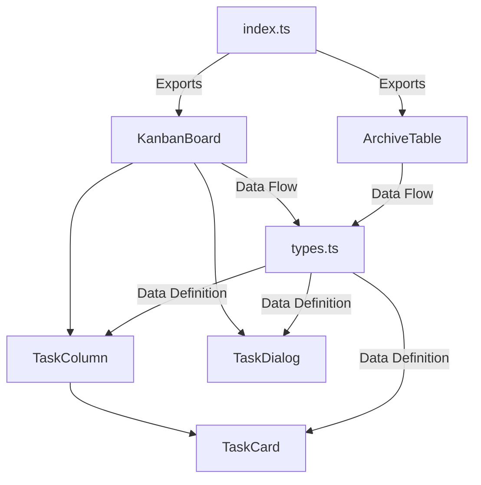
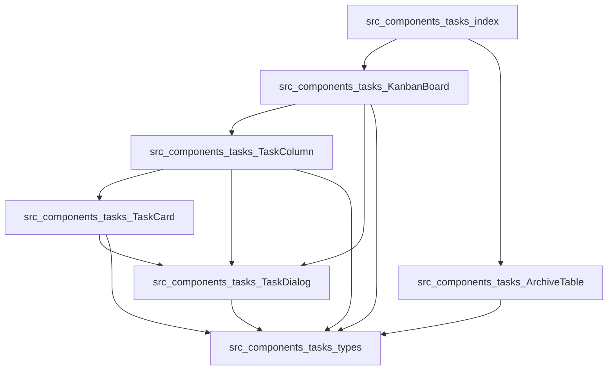

<cite>
src/components/tasks/ArchiveTable.tsx
src/components/tasks/KanbanBoard.tsx
src/components/tasks/TaskCard.tsx
src/components/tasks/TaskColumn.tsx
src/components/tasks/TaskDialog.tsx
src/components/tasks/index.ts
src/components/tasks/types.ts
</cite>

### 개요
`Tasks` 컴포넌트 모듈은 애플리케이션 내에서 작업(Task)을 관리하고 시각화하는 데 필요한 모든 UI 컴포넌트와 로직을 제공합니다. 이는 칸반 보드, 작업 상세 다이얼로그, 그리고 아카이브된 작업을 포함하여 작업의 생성, 조회, 수정, 삭제 및 상태 변경 기능을 지원합니다. 이 모듈은 사용자가 작업을 효율적으로 추적하고 관리할 수 있도록 돕는 핵심 기능을 담당합니다.

### 아키텍처 다이어그램


### 데이터 흐름 다이어그램 (칸반 보드 중심)
```mermaid
graph LR
    subgraph Task Management Lifecycle
        State(Parent Component State - tasks: Task[])
        State -- Provides tasks --> KanbanBoard
        KanbanBoard -- Filters & Passes --> TaskColumn
        TaskColumn -- Renders --> TaskCard
        TaskCard -- User Clicks --> TaskDialog(TaskDialog - Open/Edit)
        TaskDialog -- Saves Task --> KanbanBoard(KanbanBoard - onSave/onUpdateTask)
        KanbanBoard -- Updates Parent State --> State
        TaskCard -- User Drags --> KanbanBoard(KanbanBoard - onDragEnd)
        KanbanBoard -- Updates Task Status --> State
        KanbanBoard -- Creates New Task --> TaskDialog
        TaskDialog -- Adds New Task --> KanbanBoard(KanbanBoard - onAddTask)
        KanbanBoard -- Updates Parent State --> State
    end
```

### 의존성 다이어그램


### 주요 함수/클래스

*   **`KanbanBoard`**
    *   **시그니처**: `(props: { tasks: Task[]; onUpdateTask: (task: Task) => void; onAddTask: (task: Partial<Task>) => void; onDeleteTask: (id: string) => void; })`
    *   **설명**: 전체 칸반 보드를 렌더링하는 메인 컴포넌트입니다. `TaskColumn`들을 포함하며, 작업의 상태 변경을 위한 드래그 앤 드롭 로직을 관리합니다. 작업 생성/수정/삭제를 위한 `TaskDialog`를 제어하고, 부모 컴포넌트로부터 전달받은 `tasks` 데이터를 기반으로 UI를 업데이트합니다.

*   **`TaskColumn`**
    *   **시그니처**: `(props: { status: TaskStatus; tasks: Task[]; onTaskClick: (task: Task) => void; onDragEnd: (taskId: string, newStatus: TaskStatus) => void; })`
    *   **설명**: 특정 상태(예: 'TODO', 'IN_PROGRESS', 'DONE')에 해당하는 작업들을 표시하는 칸반 보드의 한 열입니다. `TaskCard` 컴포넌트들을 렌더링하며, 드래그 가능한 영역을 정의합니다.

*   **`TaskCard`**
    *   **시그니처**: `(props: { task: Task; onClick: (task: Task) => void; })`
    *   **설명**: 개별 작업을 시각적으로 표현하는 컴포넌트입니다. 작업의 제목, 설명 등 핵심 정보를 표시하며, 클릭 시 작업 상세 다이얼로그를 열고, 드래그 가능한 요소로 동작합니다.

*   **`TaskDialog`**
    *   **시그니처**: `(props: { open: boolean; onClose: () => void; task?: Task; onSave: (task: Task) => void; onDelete?: (id: string) => void; })`
    *   **설명**: 작업의 생성, 상세 조회 및 수정을 위한 모달 다이얼로그 컴포넌트입니다. 작업 데이터를 입력받아 저장하거나 삭제하는 기능을 제공합니다. `open` prop을 통해 다이얼로그의 가시성을 제어합니다.

*   **`ArchiveTable`**
    *   **시그니처**: `(props: { archivedTasks: Task[]; onRestoreTask: (id: string) => void; })`
    *   **설명**: 아카이브된 작업 목록을 테이블 형태로 표시하는 컴포넌트입니다. 아카이브된 작업을 다시 활성 상태로 복원하는 기능을 제공할 수 있습니다.

*   **`types.ts`**
    *   **설명**: `Task` 인터페이스와 `TaskStatus` 타입 등 이 모듈에서 사용되는 모든 타입 정의를 포함합니다. 데이터 구조의 일관성을 유지하고 TypeScript를 통한 타입 안정성을 보장합니다.

### 설정/사용법

**1. `KanbanBoard` 사용 예시**

```tsx
import React, { useState } from 'react';
import { KanbanBoard, Task } from './components/tasks'; // 가정: index.ts에서 export

// 초기 작업 데이터 예시
const initialTasks: Task[] = [
  { id: '1', title: '기술 문서 작성', description: 'Tasks 컴포넌트 기술 문서 작성', status: 'TODO', createdAt: '2023-01-01T10:00:00Z' },
  { id: '2', title: '코드 리팩토링', description: '불필요한 코드 제거 및 최적화', status: 'IN_PROGRESS', createdAt: '2023-01-02T11:00:00Z' },
  { id: '3', title: '새 기능 개발', description: '사용자 인증 모듈 구현', status: 'DONE', createdAt: '2023-01-03T12:00:00Z' },
];

function MyTaskDashboard() {
  const [tasks, setTasks] = useState<Task[]>(initialTasks);

  const handleUpdateTask = (updatedTask: Task) => {
    setTasks(prevTasks => prevTasks.map(task =>
      task.id === updatedTask.id ? updatedTask : task
    ));
  };

  const handleAddTask = (newTaskPartial: Partial<Task>) => {
    const newTask: Task = {
      id: String(Date.now()), // 간단한 ID 생성 예시
      createdAt: new Date().toISOString(),
      status: 'TODO', // 기본 상태
      ...newTaskPartial,
    };
    setTasks(prevTasks => [...prevTasks, newTask]);
  };

  const handleDeleteTask = (id: string) => {
    setTasks(prevTasks => prevTasks.filter(task => task.id !== id));
  };

  return (
    <div style={{ padding: '20px' }}>
      <h1>내 프로젝트 작업</h1>
      <KanbanBoard
        tasks={tasks}
        onUpdateTask={handleUpdateTask}
        onAddTask={handleAddTask}
        onDeleteTask={handleDeleteTask}
      />
    </div>
  );
}

export default MyTaskDashboard;
```

**2. `ArchiveTable` 사용 예시**

```tsx
import React, { useState } from 'react';
import { ArchiveTable, Task } from './components/tasks'; // 가정: index.ts에서 export

const archivedTasksData: Task[] = [
  { id: 'a1', title: '오래된 버그 수정', description: '클라이언트 보고 버그 해결', status: 'ARCHIVED', createdAt: '2022-05-10T09:00:00Z' },
  { id: 'a2', title: '이전 프로젝트 정리', description: '완료된 프로젝트 문서화', status: 'ARCHIVED', createdAt: '2022-06-15T14:30:00Z' },
];

function MyArchivePage() {
  const [archivedTasks, setArchivedTasks] = useState<Task[]>(archivedTasksData);

  const handleRestoreTask = (id: string) => {
    // 실제 애플리케이션에서는 백엔드 API 호출 후 상태 업데이트
    console.log(`Task ${id} 복원 요청`);
    setArchivedTasks(prev => prev.filter(task => task.id !== id));
    // 복원된 작업은 KanbanBoard의 tasks 상태로 이동시켜야 합니다.
  };

  return (
    <div style={{ padding: '20px' }}>
      <h1>아카이브된 작업</h1>
      <ArchiveTable
        archivedTasks={archivedTasks}
        onRestoreTask={handleRestoreTask}
      />
    </div>
  );
}

export default MyArchivePage;
```

### 문제 해결 가이드

*   **1. 작업 드래그 앤 드롭이 작동하지 않음**
    *   **원인**: `KanbanBoard` 또는 `TaskColumn`에서 `react-beautiful-dnd` 관련 컴포넌트 (`DragDropContext`, `Droppable`, `Draggable`)가 올바르게 설정되지 않았거나, `onDragEnd` 콜백이 누락되었을 수 있습니다.
    *   **해결**: `KanbanBoard`의 최상위에서 `DragDropContext`로 전체 영역을 감싸고, 각 `TaskColumn`을 `Droppable`로, 각 `TaskCard`를 `Draggable`로 래핑했는지 확인합니다. `KanbanBoard`에 전달된 `onDragEnd` 함수가 드롭 이벤트 발생 시 작업의 상태를 올바르게 업데이트하는지 검토합니다.

*   **2. `TaskDialog`가 열리지 않거나, 데이터가 저장되지 않음**
    *   **원인**: `TaskCard` 클릭 시 `TaskDialog`의 `open` prop을 `true`로 설정하는 로직이 없거나, `onSave` 콜백이 부모 컴포넌트의 상태를 제대로 업데이트하지 못하는 경우입니다.
    *   **해결**: `TaskCard`의 `onClick` 이벤트 핸들러가 `TaskDialog`를 제어하는 부모 컴포넌트의 상태(예: `isDialogOpen`, `selectedTask`)를 올바르게 변경하는지 확인합니다. 또한, `TaskDialog`의 `onSave` prop으로 전달된 함수가 `tasks` 배열을 불변성(immutability)을 유지하면서 업데이트하는지 확인합니다.

*   **3. UI는 업데이트되지만 실제 데이터(백엔드)는 변경되지 않음**
    *   **원인**: `onUpdateTask`, `onAddTask`, `onDeleteTask`와 같은 콜백 함수들이 클라이언트 상태만 업데이트하고, 실제 백엔드 API 호출 로직이 누락되었을 수 있습니다.
    *   **해결**: 해당 콜백 함수들 내부에 백엔드 API를 호출하는 비동기 로직을 추가해야 합니다. API 호출이 성공하면 클라이언트 상태를 업데이트하고, 실패 시에는 사용자에게 오류 메시지를 표시하는 에러 핸들링 로직을 구현하는 것이 좋습니다.