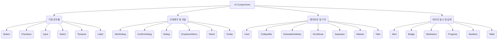
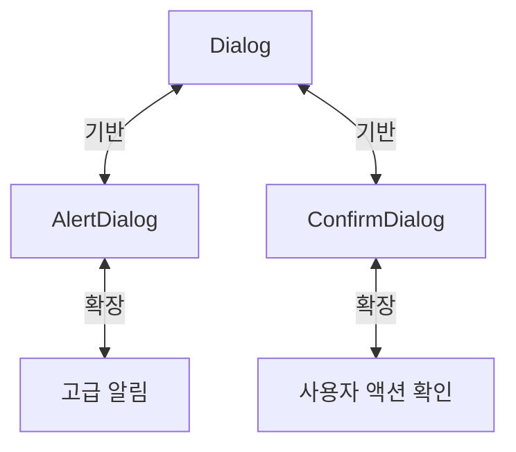

<cite>src/components/ui</cite>

## 개요
`src/components/ui` 디렉토리는 애플리케이션 전반에 걸쳐 일관된 디자인과 사용자 경험을 제공하기 위한 재사용 가능한 UI 컴포넌트들을 모아둔 곳입니다. 이 컴포넌트들은 기본적인 상호작용 요소부터 복잡한 레이아웃 및 데이터 표시 요소까지 다양한 기능을 포함하며, 개발 생산성을 높이고 시각적 통일성을 유지하는 데 핵심적인 역할을 합니다.

## 아키텍처 다이어그램

### 1. UI 컴포넌트 분류 및 계층 구조


### 2. 모달 컴포넌트 의존성


### 3. 사용자 인터랙션 흐름 예시
```mermaid
graph TD
    A[사용자 액션] --> B[버튼 클릭 (Button)]
    B --> C[다이얼로그 열기 (Dialog)]
    C --> D[데이터 입력 (Input)]
    D --> E[데이터 선택 (Select)]
    E --> F[확인 버튼 클릭 (Button)]
    F --> G[성공 메시지 표시 (Alert)]
    F --> H[진행 상태 표시 (Progress)]
```

## 주요 함수/클래스

*   **AlertDialog**
    *   시그니처: `function AlertDialog(props: AlertDialogProps): JSX.Element`
    *   설명: 사용자에게 중요한 경고 메시지를 표시하고, 사용자 액션(확인/취소)을 요구하는 모달 대화 상자입니다. `Dialog` 컴포넌트를 기반으로 경고 목적에 특화되어 있습니다.

*   **Alert**
    *   시그니처: `function Alert(props: AlertProps): JSX.Element`
    *   설명: 사용자에게 정보, 경고, 성공, 오류 등의 메시지를 비모달 방식으로 표시하는 컴포넌트입니다. 시각적으로 구분되는 스타일을 가집니다.

*   **Button**
    *   시그니처: `function Button(props: ButtonProps): JSX.Element`
    *   설명: 클릭 가능한 사용자 인터랙션 요소입니다. 다양한 스타일(primary, secondary, ghost 등)과 크기를 지원하며, 로딩 상태 등을 표시할 수 있습니다.

*   **Card**
    *   시그니처: `function Card(props: CardProps): JSX.Element`
    *   설명: 콘텐츠를 그룹화하고 시각적으로 구분하는 데 사용되는 컨테이너 컴포넌트입니다. 헤더, 본문, 푸터 영역을 가질 수 있습니다.

*   **Checkbox**
    *   시그니처: `function Checkbox(props: CheckboxProps): JSX.Element`
    *   설명: 사용자가 여러 옵션 중 하나 이상을 선택할 수 있도록 하는 입력 컨트롤입니다. `Label`과 함께 사용되는 것이 일반적입니다.

*   **Dialog**
    *   시그니처: `function Dialog(props: DialogProps): JSX.Element`
    *   설명: 애플리케이션 콘텐츠 위에 오버레이되어 중요한 정보나 상호작용을 제공하는 모달 대화 상자의 기본 형태입니다. `AlertDialog`와 `ConfirmDialog`의 기반이 됩니다.

*   **Input**
    *   시그니처: `function Input(props: InputProps): JSX.Element`
    *   설명: 사용자로부터 단일 줄 텍스트 또는 숫자와 같은 데이터를 입력받는 표준 입력 필드입니다. 다양한 타입(text, password, email 등)을 지원합니다.

*   **Markdown**
    *   시그니처: `function Markdown(props: MarkdownProps): JSX.Element`
    *   설명: Markdown 형식의 텍스트를 HTML로 렌더링하여 표시하는 컴포넌트입니다. 콘텐츠 관리 시스템이나 사용자 생성 콘텐츠 표시에 유용합니다.

*   **Select**
    *   시그니처: `function Select(props: SelectProps): JSX.Element`
    *   설명: 드롭다운 메뉴를 통해 사용자가 미리 정의된 여러 옵션 중 하나를 선택할 수 있도록 하는 폼 컨트롤입니다.

*   **Sheet**
    *   시그니처: `function Sheet(props: SheetProps): JSX.Element`
    *   설명: 화면 가장자리(상단, 하단, 좌측, 우측)에서 슬라이드 인/아웃되는 오버레이 패널입니다. 주로 메뉴, 필터, 상세 정보 표시 등에 사용됩니다.

*   **Sidebar**
    *   시그니처: `function Sidebar(props: SidebarProps): JSX.Element`
    *   설명: 주 콘텐츠 영역 옆에 위치하여 내비게이션 링크나 보조 정보를 제공하는 사이드 패널 컴포넌트입니다.

*   **Table**
    *   시그니처: `function Table(props: TableProps): JSX.Element`
    *   설명: 구조화된 데이터를 행과 열 형식으로 표시하는 컴포넌트입니다. 헤더, 본문, 푸터 섹션을 포함할 수 있습니다.

## 설정/사용법

### 1. 기본 버튼과 알림 사용
```tsx
import { Button } from '@/components/ui/button';
import { Alert, AlertDescription, AlertTitle } from '@/components/ui/alert';
import { Terminal } from 'lucide-react'; // 아이콘 라이브러리 예시

function MyPage() {
  const handleClick = () => {
    alert('버튼이 클릭되었습니다!');
  };

  return (
    <div className="p-4 space-y-4">
      <Button onClick={handleClick}>클릭하세요</Button>

      <Alert>
        <Terminal className="h-4 w-4" />
        <AlertTitle>알림!</AlertTitle>
        <AlertDescription>
          이것은 정보성 알림 메시지입니다.
        </AlertDescription>
      </Alert>
    </div>
  );
}

export default MyPage;
```

### 2. 입력 필드와 다이얼로그 사용
```tsx
import { useState } from 'react';
import { Button } from '@/components/ui/button';
import { Dialog, DialogContent, DialogDescription, DialogFooter, DialogHeader, DialogTitle, DialogTrigger } from '@/components/ui/dialog';
import { Input } from '@/components/ui/input';
import { Label } from '@/components/ui/label';

function UserInputDialog() {
  const [username, setUsername] = useState('');

  const handleSubmit = () => {
    console.log('입력된 사용자 이름:', username);
    // 실제로는 여기에 데이터 처리 로직 추가
  };

  return (
    <Dialog>
      <DialogTrigger asChild>
        <Button variant="outline">사용자 이름 입력</Button>
      </DialogTrigger>
      <DialogContent className="sm:max-w-[425px]">
        <DialogHeader>
          <DialogTitle>프로필 편집</DialogTitle>
          <DialogDescription>
            여기에 당신의 사용자 이름을 입력하세요.
          </DialogDescription>
        </DialogHeader>
        <div className="grid gap-4 py-4">
          <div className="grid grid-cols-4 items-center gap-4">
            <Label htmlFor="username" className="text-right">
              사용자 이름
            </Label>
            <Input
              id="username"
              value={username}
              onChange={(e) => setUsername(e.target.value)}
              className="col-span-3"
            />
          </div>
        </div>
        <DialogFooter>
          <Button type="submit" onClick={handleSubmit}>저장</Button>
        </DialogFooter>
      </DialogContent>
    </Dialog>
  );
}

export default UserInputDialog;
```

## 문제 해결 가이드

### 1. 컴포넌트 스타일이 적용되지 않음
*   **문제**: 컴포넌트가 예상한 스타일로 렌더링되지 않고 기본 HTML 요소처럼 보입니다.
*   **원인**:
    *   CSS 프레임워크(예: Tailwind CSS) 설정이 올바르지 않거나, purge/content 경로에 컴포넌트 파일이 포함되지 않았을 수 있습니다.
    *   컴포넌트가 올바르게 import 되지 않았거나, 필요한 CSS 파일이 번들링되지 않았을 수 있습니다.
    *   `asChild` prop을 사용하는 경우, 자식 요소에 스타일이 전달되지 않을 수 있습니다.
*   **해결책**:
    *   `tailwind.config.js` 파일의 `content` 배열에 컴포넌트 경로(`'./src/**/*.{js,jsx,ts,tsx}'`)가 올바르게 포함되어 있는지 확인합니다.
    *   개발 서버를 재시작하여 CSS 변경 사항이 적용되는지 확인합니다.
    *   `asChild` prop을 사용하는 경우, 자식 컴포넌트가 `className` prop을 받아 스타일을 적용할 수 있는지 확인하거나, `cn` 유틸리티 함수를 사용하여 스타일을 병합합니다.

### 2. 모달/다이얼로그가 열리지 않거나 닫히지 않음
*   **문제**: `Dialog`, `AlertDialog`, `Sheet`와 같은 오버레이 컴포넌트가 `Trigger` 클릭 시 열리지 않거나, 외부 클릭 또는 ESC 키로 닫히지 않습니다.
*   **원인**:
    *   `DialogTrigger` 컴포넌트가 올바르게 렌더링되지 않았거나, `asChild` prop 사용 시 자식 컴포넌트가 `onClick` 이벤트를 제대로 전달받지 못하고 있을 수 있습니다.
    *   컴포넌트의 `open` 또는 `onOpenChange` prop을 사용하여 상태를 수동으로 제어하는 경우, 상태 업데이트 로직에 오류가 있을 수 있습니다.
    *   전역 이벤트 리스너(예: ESC 키)가 다른 스크립트에 의해 가로채지고 있을 수 있습니다.
*   **해결책**:
    *   `DialogTrigger` 내부에 클릭 가능한 요소(예: `<Button>`)가 올바르게 배치되었는지 확인합니다.
    *   `asChild`를 사용하는 경우, 자식 컴포넌트가 `ref`와 `onClick` prop을 전달받을 수 있도록 `forwardRef`를 사용하거나, 해당 컴포넌트가 이를 지원하는지 확인합니다.
    *   `open`과 `onOpenChange`를 사용하는 경우, `useState` 훅을 사용하여 `open` 상태를 관리하고 `onOpenChange`에서 상태를 토글하는 로직이 정확한지 검토합니다.

### 3. 폼 입력 컴포넌트(Input, Select, Checkbox)의 상태 관리 문제
*   **문제**: 입력 필드에 값이 반영되지 않거나, `onChange` 이벤트 핸들러가 작동하지 않습니다.
*   **원인**:
    *   컴포넌트가 제어되지 않는(uncontrolled) 방식으로 사용되고 있거나, 제어되는(controlled) 방식으로 사용될 때 `value` prop과 `onChange` 핸들러가 제대로 연결되지 않았습니다.
    *   `name` prop이 누락되어 폼 제출 시 데이터가 전송되지 않을 수 있습니다.
*   **해결책**:
    *   대부분의 UI 입력 컴포넌트는 제어되는 컴포넌트로 사용하는 것이 좋습니다. `useState` 훅을 사용하여 `value` prop과 `onChange` 핸들러를 연결합니다.
        ```tsx
        import { useState } from 'react';
        import { Input } from '@/components/ui/input';

        function MyFormInput() {
          const [inputValue, setInputValue] = useState('');
          return (
            <Input
              value={inputValue}
              onChange={(e) => setInputValue(e.target.value)}
              placeholder="텍스트를 입력하세요"
            />
          );
        }
        ```
    *   폼 제출 시 데이터를 수집해야 하는 경우, `name` prop을 포함하여 각 입력 필드를 식별할 수 있도록 합니다.