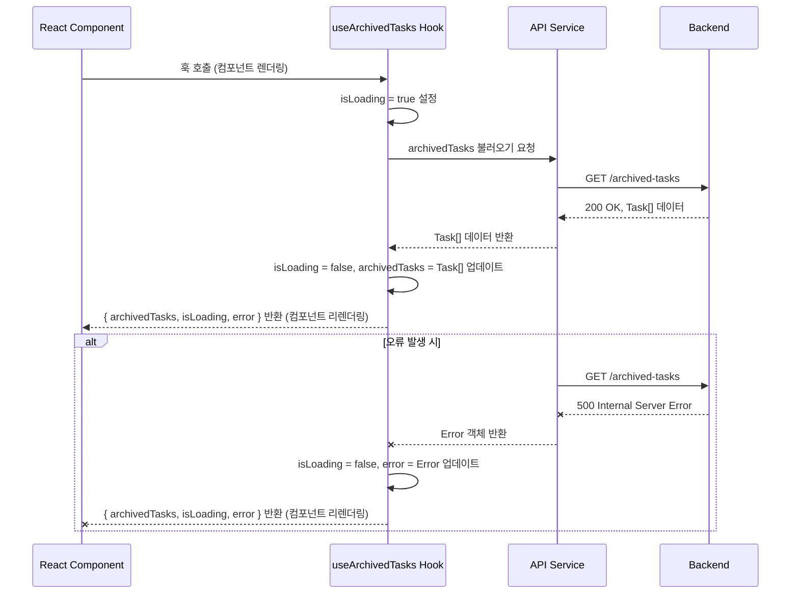

<cite>src/hooks/useArchivedTasks.ts</cite>

## 훅 (Hooks) - `useArchivedTasks`

### 개요

`useArchivedTasks` 훅은 애플리케이션 내에서 보관된(archived) 작업 목록을 효율적으로 불러오고 관리하기 위해 설계되었습니다. 이 훅은 데이터 페칭(fetching) 로직을 추상화하여 컴포넌트가 로딩 상태, 오류 및 실제 작업 목록에 쉽게 접근할 수 있도록 합니다. 이를 통해 개발자는 데이터 관리의 복잡성 없이 사용자 인터페이스 구현에 집중할 수 있습니다.

### 아키텍처 및 데이터 흐름 다이어그램

```mermaid
graph TD
    A[React Component] --> B{useArchivedTasks Hook};
    B --> C{내부 상태 관리<br>(isLoading, error, archivedTasks)};
    B --> D[API 서비스 호출];
    D -- 비동기 요청 --> E[백엔드/데이터 저장소];
    E -- 응답 (데이터/오류) --> D;
    D --> C;
    C --> B;
    B --> A;
```

*설명: React 컴포넌트가 `useArchivedTasks` 훅을 호출하면, 훅은 내부적으로 로딩 상태, 오류, 그리고 보관된 작업 목록을 관리하는 상태를 초기화합니다. 이와 동시에, 백엔드 또는 데이터 저장소로부터 데이터를 비동기적으로 가져오기 위해 API 서비스를 호출합니다. API 서비스로부터 응답(데이터 또는 오류)이 도착하면, 훅의 내부 상태가 업데이트되고, 이는 다시 훅을 호출한 React 컴포넌트에 반영되어 UI가 갱신됩니다.*



*설명: 컴포넌트가 렌더링될 때 `useArchivedTasks` 훅이 호출되며, 즉시 로딩 상태를 `true`로 설정하고 API 서비스에 보관된 작업 목록을 요청합니다. API 서비스는 백엔드에 실제 요청을 보내고, 성공적인 응답을 받으면 훅으로 데이터를 전달합니다. 훅은 로딩 상태를 `false`로, 작업 목록을 받은 데이터로 업데이트한 후 컴포넌트에 반환하여 UI를 갱신합니다. 만약 백엔드에서 오류가 발생하면, 훅은 오류 상태를 업데이트하여 컴포넌트에 전달합니다.*

```mermaid
graph LR
    subgraph "src/hooks/useArchivedTasks.ts"
        A[useArchivedTasks Hook]
    end

    subgraph "React Core"
        B[useState]
        C[useEffect]
        D[useCallback]
    end

    subgraph "Application Services"
        E[taskApiService (가정)]
        F[Task 인터페이스 (가정)]
    end

    A -- 의존 --> B
    A -- 의존 --> C
    A -- 의존 --> D
    A -- 의존 --> E
    A -- 의존 --> F
```

*설명: `useArchivedTasks` 훅은 React의 기본적인 훅인 `useState` (상태 관리), `useEffect` (사이드 이펙트 처리 및 데이터 페칭), `useCallback` (함수 메모이제이션)에 의존합니다. 또한, 실제 데이터 페칭 로직을 담당하는 `taskApiService`와 작업 데이터의 구조를 정의하는 `Task` 인터페이스에 의존하여 기능을 구현합니다.*

### 주요 함수

#### `useArchivedTasks`

*   **시그니처**:
    ```typescript
    interface Task {
      id: string;
      title: string;
      description: string;
      isArchived: boolean;
      createdAt: string;
      archivedAt?: string;
    }

    function useArchivedTasks(): {
      archivedTasks: Task[];
      isLoading: boolean;
      error: Error | null;
      refetchArchivedTasks: () => void;
    };
    ```
*   **설명**:
    React 컴포넌트 내에서 보관된 작업 목록을 비동기적으로 불러오고 관리하는 커스텀 훅입니다. 이 훅은 다음과 같은 값들을 반환합니다:
    *   `archivedTasks`: 불러온 보관된 작업 객체들의 배열입니다. 데이터가 로드되지 않았거나 오류가 발생한 경우 빈 배열일 수 있습니다.
    *   `isLoading`: 작업 목록을 불러오는 중인지 여부를 나타내는 불리언 값입니다. `true`이면 데이터 페칭이 진행 중임을 의미합니다.
    *   `error`: 작업 목록을 불러오는 동안 발생한 오류 객체입니다. 오류가 없으면 `null`입니다.
    *   `refetchArchivedTasks`: 보관된 작업 목록을 수동으로 다시 불러올 수 있는 함수입니다. 이 함수를 호출하면 새로운 API 요청이 시작됩니다.

### 설정/사용법

#### 예제 1: 보관된 작업 목록 표시

```typescript
import React from 'react';
import useArchivedTasks from './src/hooks/useArchivedTasks'; // 실제 경로에 맞게 조정

function ArchivedTasksList() {
  const { archivedTasks, isLoading, error } = useArchivedTasks();

  if (isLoading) {
    return <p>보관된 작업들을 불러오는 중입니다...</p>;
  }

  if (error) {
    return <p style={{ color: 'red' }}>오류 발생: {error.message}</p>;
  }

  if (archivedTasks.length === 0) {
    return <p>보관된 작업이 없습니다.</p>;
  }

  return (
    <div>
      <h2>보관된 작업 목록</h2>
      <ul>
        {archivedTasks.map((task) => (
          <li key={task.id}>
            <strong>{task.title}</strong>: {task.description} (보관일: {task.archivedAt})
          </li>
        ))}
      </ul>
    </div>
  );
}

export default ArchivedTasksList;
```

#### 예제 2: 작업 목록 새로고침 기능 추가

```typescript
import React from 'react';
import useArchivedTasks from './src/hooks/useArchivedTasks'; // 실제 경로에 맞게 조정

function RefetchableArchivedTasks() {
  const { archivedTasks, isLoading, error, refetchArchivedTasks } = useArchivedTasks();

  const handleRefetch = () => {
    refetchArchivedTasks();
  };

  return (
    <div>
      <h2>보관된 작업 목록 (새로고침 가능)</h2>
      <button onClick={handleRefetch} disabled={isLoading}>
        {isLoading ? '불러오는 중...' : '새로고침'}
      </button>

      {isLoading && <p>데이터를 새로 불러오는 중입니다...</p>}
      {error && <p style={{ color: 'red' }}>오류 발생: {error.message}</p>}

      {!isLoading && !error && archivedTasks.length === 0 && (
        <p>보관된 작업이 없습니다.</p>
      )}

      {!isLoading && !error && archivedTasks.length > 0 && (
        <ul>
          {archivedTasks.map((task) => (
            <li key={task.id}>
              <strong>{task.title}</strong>: {task.description} (보관일: {task.archivedAt})
            </li>
          ))}
        </ul>
      )}
    </div>
  );
}

export default RefetchableArchivedTasks;
```

### 문제 해결 가이드

#### 1. 보관된 작업 목록이 표시되지 않음

*   **원인**: API 호출 실패, 네트워크 문제, 백엔드에서 빈 배열 반환, 또는 데이터 파싱 오류.
*   **해결책**:
    *   브라우저 개발자 도구(DevTools)의 네트워크 탭을 열어 `useArchivedTasks` 훅이 호출하는 API 요청이 성공했는지(HTTP 상태 코드 200 OK) 확인합니다.
    *   `error` 상태가 `null`이 아닌지 확인하여 구체적인 오류 메시지를 확인합니다.
    *   백엔드 로그를 확인하여 서버 측에서 오류가 발생했는지 또는 의도적으로 빈 데이터를 반환했는지 확인합니다.
    *   `Task` 인터페이스와 API 응답 데이터 구조가 일치하는지 확인합니다.

#### 2. 로딩 상태가 계속 `true`로 유지됨

*   **원인**: API 요청이 완료되지 않았거나, 응답을 받았지만 훅의 내부 상태가 제대로 업데이트되지 않은 경우.
*   **해결책**:
    *   네트워크 요청이 타임아웃되었거나, 서버로부터 응답이 오지 않고 있는지 확인합니다.
    *   훅 내부의 `useEffect` 또는 비동기 로직에서 `finally` 블록이나 `catch` 블록에서 `isLoading` 상태를 `false`로 설정하는 로직이 누락되었는지 확인합니다.
    *   API 서비스가 Promise를 제대로 반환하고, Promise가 성공적으로 해결(resolve)되거나 거부(reject)되는지 확인합니다.

#### 3. 불필요한 API 호출이 너무 많이 발생함

*   **원인**: `useEffect`의 의존성 배열이 잘못 설정되어 컴포넌트가 불필요하게 리렌더링될 때마다 API 호출이 반복되는 경우.
*   **해결책**:
    *   `useArchivedTasks` 훅 내부의 `useEffect` 의존성 배열(`[]` 또는 특정 변수)이 올바르게 설정되었는지 확인합니다. 대부분의 경우 초기 마운트 시 한 번만 호출되도록 빈 배열(`[]`)을 사용합니다.
    *   `refetchArchivedTasks` 함수가 불필요하게 자주 호출되지 않도록 사용자 인터랙션(예: 버튼 클릭)에 의해서만 호출되도록 합니다.
    *   만약 부모 컴포넌트의 상태 변화로 인해 훅이 포함된 컴포넌트가 자주 리렌더링된다면, React.memo 등을 사용하여 컴포넌트의 불필요한 리렌더링을 방지하는 것을 고려할 수 있습니다.