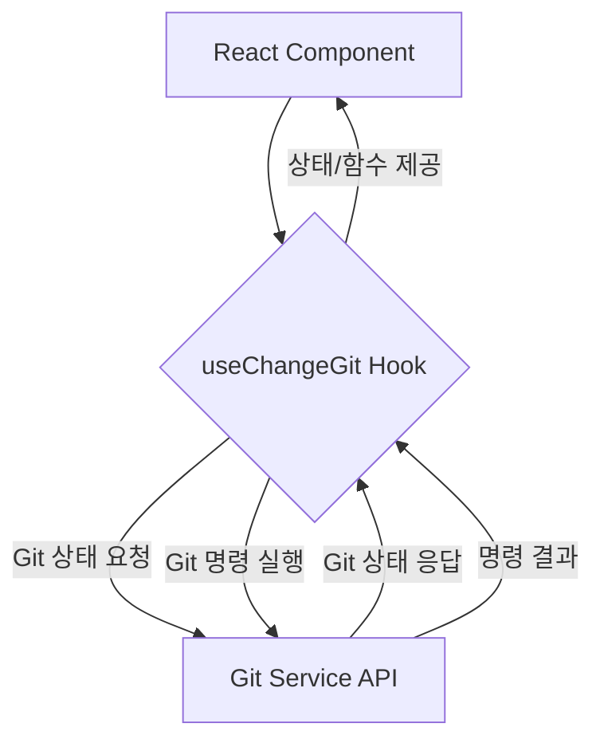

<cite>src/hooks/useChangeGit.ts</cite>

## 개요

`useChangeGit` 훅은 React 애플리케이션 내에서 Git 저장소의 변경사항을 효율적으로 관리하고 상호작용하기 위해 설계되었습니다. 이 훅은 로컬 Git 저장소의 상태를 감지하고, 커밋 및 푸시와 같은 Git 명령을 실행할 수 있는 기능을 제공하여 개발자가 애플리케이션에서 직접 Git 관련 작업을 수행할 수 있도록 돕습니다. 이를 통해 Git 작업의 진행 상태, 변경된 파일 목록 및 발생 가능한 오류를 UI에 쉽게 통합할 수 있습니다.

## Mermaid 다이어그램

### `useChangeGit` 아키텍처



### `useChangeGit` 데이터 흐름

```mermaid
graph LR
    subgraph Input
        A[트리거 (예: 버튼 클릭)]
        B[커밋 메시지]
        C[파일 경로]
    end

    subgraph useChangeGit 내부
        D{Git 상태 감지}
        E[변경사항 목록]
        F{Git 명령 실행 (add, commit, push)}
        G[로딩 상태]
        H[에러 상태]
        I[성공 메시지]
    end

    A --> D
    B --> F
    C --> F
    D --> E
    F --> G
    F --> H
    F --> I

    subgraph Output
        J[isChanging]
        K[changedFiles]
        L[commitChanges]
        M[pushChanges]
        N[error]
    end

    G --> J
    E --> K
    F --> L
    F --> M
    H --> N
```

### `useChangeGit` 의존성

```mermaid
graph LR
    subgraph useChangeGit
        A[useChangeGit.ts]
    end

    subgraph 외부 라이브러리/모듈
        B[React (useState, useEffect, useCallback)]
        C[Git API 클라이언트 (e.g., Axios)]
        D[유틸리티 함수 (e.g., debounce)]
    end

    A -- 의존 --> B
    A -- 의존 --> C
    A -- 의존 --> D
```

## 주요 함수/클래스

*   **`useChangeGit()`**
    *   **시그니처:** `useChangeGit(): { isChanging: boolean; changedFiles: GitChange[]; error: Error | null; commitChanges: (message: string) => Promise<void>; pushChanges: () => Promise<void>; refreshChanges: () => Promise<void>; }`
    *   **설명:** Git 저장소의 변경사항을 감지하고 관리하는 React 훅입니다. `isChanging`을 통해 현재 Git 작업의 진행 상태를 나타내며, `changedFiles`로 변경된 파일 목록을 제공합니다. `commitChanges` 함수는 지정된 메시지로 변경사항을 커밋하고, `pushChanges` 함수는 커밋된 변경사항을 원격 저장소로 푸시합니다. `refreshChanges`는 현재 Git 상태를 다시 불러옵니다.

*   **`GitChange` (인터페이스/타입)**
    *   **시그니처:** `interface GitChange { path: string; status: 'added' | 'modified' | 'deleted' | 'untracked'; }`
    *   **설명:** Git 변경사항의 단일 항목을 나타내는 타입입니다. 파일 경로(`path`)와 변경 상태(`status`)를 포함합니다. `status`는 'added'(추가됨), 'modified'(수정됨), 'deleted'(삭제됨), 'untracked'(추적되지 않음) 중 하나를 가집니다.

## 설정/사용법 섹션

### 예제 1: Git 변경사항 확인 및 커밋

이 예제는 `useChangeGit` 훅을 사용하여 Git 저장소의 변경된 파일을 목록화하고, 커밋 메시지를 입력받아 변경사항을 커밋하는 방법을 보여줍니다.

```typescript
import React, { useState } from 'react';
import { useChangeGit } from './src/hooks/useChangeGit'; // 실제 경로에 맞게 조정

function GitChangeManager() {
  const { isChanging, changedFiles, error, commitChanges, refreshChanges } = useChangeGit();
  const [commitMessage, setCommitMessage] = useState('');

  const handleCommit = async () => {
    if (!commitMessage) {
      alert('커밋 메시지를 입력해주세요.');
      return;
    }
    try {
      await commitChanges(commitMessage);
      setCommitMessage('');
      alert('변경사항이 성공적으로 커밋되었습니다.');
      await refreshChanges(); // 커밋 후 변경사항 목록 새로고침
    } catch (err) {
      console.error('커밋 실패:', err);
      alert(`커밋 실패: ${error?.message || '알 수 없는 오류'}`);
    }
  };

  return (
    <div>
      <h2>Git 변경사항 관리</h2>
      <button onClick={refreshChanges} disabled={isChanging}>
        {isChanging ? '새로고침 중...' : '변경사항 새로고침'}
      </button>
      {error && <p style={{ color: 'red' }}>에러: {error.message}</p>}

      <h3>변경된 파일 ({changedFiles.length}개)</h3>
      {changedFiles.length === 0 ? (
        <p>변경사항이 없습니다.</p>
      ) : (
        <ul>
          {changedFiles.map((file) => (
            <li key={file.path}>
              [{file.status}] {file.path}
            </li>
          ))}
        </ul>
      )}

      {changedFiles.length > 0 && (
        <div>
          <input
            type="text"
            value={commitMessage}
            onChange={(e) => setCommitMessage(e.target.value)}
            placeholder="커밋 메시지 입력"
            disabled={isChanging}
            style={{ width: '300px', padding: '8px', marginRight: '10px' }}
          />
          <button onClick={handleCommit} disabled={isChanging || !commitMessage}>
            {isChanging ? '커밋 중...' : '커밋'}
          </button>
        </div>
      )}
    </div>
  );
}

export default GitChangeManager;
```

### 예제 2: Git 원격 저장소로 푸시

이 예제는 `useChangeGit` 훅의 `pushChanges` 함수를 사용하여 로컬에 커밋된 변경사항을 원격 저장소로 푸시하는 방법을 보여줍니다.

```typescript
import React from 'react';
import { useChangeGit } from './src/hooks/useChangeGit'; // 실제 경로에 맞게 조정

function GitPusher() {
  const { isChanging, error, pushChanges } = useChangeGit();

  const handlePush = async () => {
    try {
      await pushChanges();
      alert('변경사항이 성공적으로 푸시되었습니다.');
    } catch (err) {
      console.error('푸시 실패:', err);
      alert(`푸시 실패: ${error?.message || '알 수 없는 오류'}`);
    }
  };

  return (
    <div>
      <h2>Git 원격 저장소 푸시</h2>
      {error && <p style={{ color: 'red' }}>에러: {error.message}</p>}
      <button onClick={handlePush} disabled={isChanging}>
        {isChanging ? '푸시 중...' : '푸시'}
      </button>
      <p>푸시 작업은 커밋된 변경사항을 원격 저장소로 전송합니다.</p>
    </div>
  );
}

export default GitPusher;
```

## 문제 해결 가이드

### 1. Git 명령 실패 (예: 커밋, 푸시)

*   **원인:** Git 서비스 API와의 통신 문제, 인증 오류, 로컬 Git 저장소 상태 불일치 (예: 병합 충돌), 원격 저장소에 대한 쓰기 권한 부족 등이 원인일 수 있습니다.
*   **해결:**
    1.  **네트워크 확인:** 브라우저 개발자 도구의 네트워크 탭을 확인하여 Git API 요청이 성공했는지, 어떤 오류 코드(예: 401 Unauthorized, 500 Internal Server Error)를 반환했는지 확인합니다.
    2.  **백엔드 로그:** Git 서비스 API 서버의 로그를 확인하여 백엔드에서 발생한 구체적인 오류 메시지를 파악합니다.
    3.  **로컬 Git 상태:** 애플리케이션 외부에서 터미널을 열어 `git status`, `git commit`, `git push` 명령을 직접 실행하여 문제가 로컬 Git 설정 또는 저장소 상태에 있는지 확인합니다.
    4.  **인증 정보:** 원격 저장소에 대한 접근 권한(SSH 키 또는 개인 접근 토큰)이 올바르게 설정되어 있고 유효한지 확인합니다.

### 2. 변경사항 목록이 올바르게 업데이트되지 않음

*   **원인:** `refreshChanges` 함수가 필요한 시점에 호출되지 않거나, Git 상태를 감지하는 백엔드 로직에 문제가 있는 경우 발생할 수 있습니다.
*   **해결:**
    1.  **`refreshChanges` 호출:** 파일 변경 후, 커밋/푸시와 같은 Git 작업 완료 후 `refreshChanges` 함수가 제대로 호출되고 있는지 확인합니다. `useEffect`를 사용하여 특정 의존성 변경 시 자동으로 새로고침하도록 설정할 수도 있습니다.
    2.  **API 응답 확인:** `useChangeGit` 내부에서 Git 상태를 가져오는 API 호출이 정상적으로 작동하며, 올바른 데이터를 반환하는지 백엔드 로그 또는 네트워크 탭을 통해 확인합니다.
    3.  **훅 의존성:** 훅이 마운트될 때 한 번만 변경사항을 가져오는 경우, `useEffect`의 의존성 배열을 검토하여 필요한 상태 변화에 따라 상태 감지 로직이 재실행되도록 합니다.

### 3. `isChanging` 상태가 예상과 다르게 동작함

*   **원인:** 비동기 Git 작업의 시작 및 완료 시점에 `isChanging` 상태를 올바르게 `true`/`false`로 설정/해제하지 못하는 경우 발생합니다.
*   **해결:**
    1.  **상태 전환 로직:** `commitChanges`나 `pushChanges`와 같은 비동기 함수 내부에서 `isChanging` 상태가 작업 시작 시 `true`로 설정되고, 작업 완료(성공 또는 실패) 시 `finally` 블록에서 `false`로 재설정되는지 확인합니다.
    2.  **동시 작업:** 여러 Git 작업이 동시에 발생할 가능성이 있다면, 각 작업의 로딩 상태를 개별적으로 관리하거나, 전역 로딩 상태를 신중하게 관리하여 한 작업의 로딩 상태가 다른 작업에 영향을 주지 않도록 합니다.