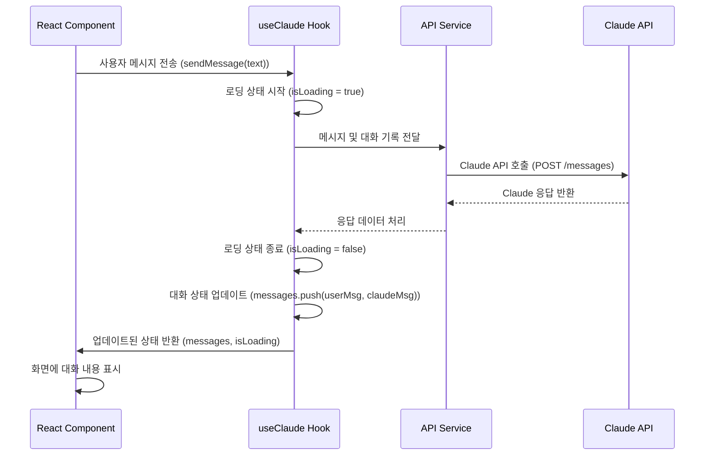

<cite>src/hooks/useClaude.ts</cite>

## 훅 (Hooks) - useClaude

### 개요

`useClaude` 훅은 React 애플리케이션 내에서 Anthropic의 Claude AI 모델과 효율적으로 상호작용하기 위해 설계된 사용자 정의 훅입니다. 이 훅은 대화 상태 관리, AI 메시지 전송 및 응답 수신, 그리고 로딩 및 에러 상태 처리를 통합하여, 개발자가 복잡한 AI 통합 로직 없이 클로드의 강력한 기능을 쉽게 활용할 수 있도록 돕습니다. 이를 통해 사용자 친화적인 AI 기반 채팅 인터페이스나 콘텐츠 생성 기능을 손쉽게 구현할 수 있습니다.

### 아키텍처 다이어그램

```mermaid
graph TD
    A[React Component] --> B{useClaude Hook}
    B --> C[API Service Layer]
    C --> D[Claude API Endpoint]
    D --> C
    C --> B
    B -- manages --> E[Conversation State (messages)]
    B -- manages --> F[Loading State (isLoading)]
    B -- manages --> G[Error State (error)]
    B --> A
```

### 데이터 흐름 다이어그램



### 주요 함수/클래스

#### `useClaude` 훅

*   **시그니처**: `function useClaude(options?: UseClaudeOptions): UseClaudeReturn`
*   **설명**:
    Claude AI와의 대화 로직을 캡슐화하는 React 훅입니다. 이 훅은 메시지 목록, 로딩 상태, 에러 상태, 메시지 전송 함수, 대화 초기화 함수 등을 포함하는 객체를 반환합니다. `options` 객체를 통해 API 키, 모델명, 시스템 프롬프트 등 Claude API 호출에 필요한 추가 설정을 전달할 수 있습니다.
*   **`UseClaudeOptions` 타입**:
    *   `apiKey?: string`: (선택 사항) Claude API 호출에 사용할 API 키. 제공되지 않으면 환경 변수에서 로드됩니다.
    *   `model?: string`: (선택 사항) 사용할 Claude 모델 (기본값: "claude-3-opus-20240229" 또는 최신 안정 모델).
    *   `systemPrompt?: string`: (선택 사항) Claude에게 전달할 시스템 프롬프트. AI의 역할과 행동을 정의합니다.
*   **`UseClaudeReturn` 타입**:
    *   `messages: Message[]`: 현재까지의 대화 메시지 목록. 각 메시지는 `role` (사용자 또는 Claude)과 `content`를 포함합니다.
    *   `isLoading: boolean`: Claude가 응답을 생성 중인지 여부를 나타내는 불리언 값.
    *   `error: Error | null`: 대화 중 발생한 에러 객체 (있는 경우).
    *   `sendMessage: (message: string) => Promise<void>`: Claude에게 새로운 메시지를 전송하고 응답을 기다리는 비동기 함수.
    *   `resetConversation: () => void`: 현재 대화 상태 (메시지 목록)를 초기화하는 함수.

### 설정/사용법

#### 1. 기본 사용법

```typescript jsx
import React, { useState } from 'react';
import { useClaude } from './src/hooks/useClaude'; // 실제 경로에 맞게 수정

function ChatComponent() {
  const [input, setInput] = useState('');
  const { messages, isLoading, error, sendMessage, resetConversation } = useClaude();

  const handleSubmit = async (e: React.FormEvent) => {
    e.preventDefault();
    if (input.trim() && !isLoading) {
      await sendMessage(input);
      setInput('');
    }
  };

  return (
    <div style={{ maxWidth: '600px', margin: '20px auto', border: '1px solid #ccc', padding: '15px' }}>
      <h1>Claude AI 채팅</h1>
      <div style={{ maxHeight: '400px', overflowY: 'scroll', borderBottom: '1px solid #eee', marginBottom: '10px' }}>
        {messages.map((msg, index) => (
          <div key={index} style={{ textAlign: msg.role === 'user' ? 'right' : 'left', marginBottom: '8px' }}>
            <span style={{
              background: msg.role === 'user' ? '#e0f7fa' : '#f0f0f0',
              padding: '8px 12px',
              borderRadius: '15px',
              display: 'inline-block',
              maxWidth: '80%'
            }}>
              <strong>{msg.role === 'user' ? '나' : 'Claude'}:</strong> {msg.content}
            </span>
          </div>
        ))}
        {isLoading && (
          <div style={{ textAlign: 'left', marginBottom: '8px' }}>
            <span style={{ background: '#f0f0f0', padding: '8px 12px', borderRadius: '15px', display: 'inline-block' }}>
              Claude가 생각 중...
            </span>
          </div>
        )}
      </div>
      {error && <p style={{ color: 'red' }}>에러: {error.message}</p>}
      <form onSubmit={handleSubmit} style={{ display: 'flex' }}>
        <input
          type="text"
          value={input}
          onChange={(e) => setInput(e.target.value)}
          placeholder="메시지를 입력하세요..."
          disabled={isLoading}
          style={{ flexGrow: 1, padding: '10px', border: '1px solid #ddd', borderRadius: '5px', marginRight: '10px' }}
        />
        <button type="submit" disabled={isLoading} style={{ padding: '10px 15px', background: '#007bff', color: 'white', border: 'none', borderRadius: '5px', cursor: 'pointer' }}>
          전송
        </button>
        <button type="button" onClick={resetConversation} disabled={isLoading} style={{ padding: '10px 15px', background: '#6c757d', color: 'white', border: 'none', borderRadius: '5px', marginLeft: '10px', cursor: 'pointer' }}>
          초기화
        </button>
      </form>
    </div>
  );
}

export default ChatComponent;
```

#### 2. 옵션 설정 사용법

```typescript jsx
import React, { useState } from 'react';
import { useClaude } from './src/hooks/useClaude'; // 실제 경로에 맞게 수정

function AdvancedChatComponent() {
  const [input, setInput] = useState('');
  // API 키와 시스템 프롬프트를 직접 전달
  const { messages, isLoading, error, sendMessage, resetConversation } = useClaude({
    apiKey: process.env.REACT_APP_MY_CLAUDE_API_KEY, // 환경 변수에서 로드하거나 직접 입력
    model: 'claude-3-haiku-20240307', // 특정 Claude 모델 지정
    systemPrompt: '당신은 사용자에게 친절하고 유머러스하게 답변하는 AI 조수입니다. 질문에 대한 답변은 항상 50단어 이내로 요약해주세요.'
  });

  const handleSubmit = async (e: React.FormEvent) => {
    e.preventDefault();
    if (input.trim() && !isLoading) {
      await sendMessage(input);
      setInput('');
    }
  };

  return (
    <div style={{ maxWidth: '700px', margin: '30px auto', border: '1px solid #4CAF50', padding: '20px', borderRadius: '8px', boxShadow: '0 4px 8px rgba(0,0,0,0.1)' }}>
      <h1 style={{ color: '#4CAF50', textAlign: 'center' }}>유머러스한 Claude AI</h1>
      {/* 메시지 표시 및 입력 폼은 기본 사용법과 유사 */}
      {/* ... (이전 예시의 메시지 목록과 폼을 여기에 포함) */}
      <div style={{ maxHeight: '400px', overflowY: 'scroll', borderBottom: '1px solid #eee', marginBottom: '10px' }}>
        {messages.map((msg, index) => (
          <div key={index} style={{ textAlign: msg.role === 'user' ? 'right' : 'left', marginBottom: '8px' }}>
            <span style={{
              background: msg.role === 'user' ? '#e0f2f7' : '#e6ffe6',
              padding: '8px 12px',
              borderRadius: '15px',
              display: 'inline-block',
              maxWidth: '80%'
            }}>
              <strong>{msg.role === 'user' ? '나' : 'Claude'}:</strong> {msg.content}
            </span>
          </div>
        ))}
        {isLoading && (
          <div style={{ textAlign: 'left', marginBottom: '8px' }}>
            <span style={{ background: '#e6ffe6', padding: '8px 12px', borderRadius: '15px', display: 'inline-block' }}>
              Claude가 생각 중...
            </span>
          </div>
        )}
      </div>
      {error && <p style={{ color: 'red' }}>에러: {error.message}</p>}
      <form onSubmit={handleSubmit} style={{ display: 'flex' }}>
        <input
          type="text"
          value={input}
          onChange={(e) => setInput(e.target.value)}
          placeholder="메시지를 입력하세요..."
          disabled={isLoading}
          style={{ flexGrow: 1, padding: '10px', border: '1px solid #a5d6a7', borderRadius: '5px', marginRight: '10px' }}
        />
        <button type="submit" disabled={isLoading} style={{ padding: '10px 15px', background: '#4CAF50', color: 'white', border: 'none', borderRadius: '5px', cursor: 'pointer' }}>
          전송
        </button>
        <button type="button" onClick={resetConversation} disabled={isLoading} style={{ padding: '10px 15px', background: '#81c784', color: 'white', border: 'none', borderRadius: '5px', marginLeft: '10px', cursor: 'pointer' }}>
          초기화
        </button>
      </form>
    </div>
  );
}

export default AdvancedChatComponent;
```

### 문제 해결 가이드

#### 1. API 키 오류 또는 미설정

*   **증상**: "API Key not provided" 또는 "Authentication error" 메시지가 `error` 상태로 반환됩니다. Claude의 응답을 받을 수 없습니다.
*   **원인**: Claude API에 접근하기 위한 유효한 API 키가 제공되지 않았습니다. `useClaude` 훅의 `options.apiKey`로 직접 전달되거나, `process.env.REACT_APP_CLAUDE_API_KEY`와 같은 환경 변수로 설정되어야 합니다.
*   **해결책**:
    1.  Anthropic 개발자 콘솔에서 유효한 Claude API 키를 발급받습니다.
    2.  프로젝트의 `.env` 파일에 `REACT_APP_CLAUDE_API_KEY=your_api_key_here` 형식으로 환경 변수를 설정합니다. (React 앱의 경우 `REACT_APP_` 접두사가 필요합니다.)
    3.  `useClaude` 훅을 호출할 때 `apiKey` 옵션을 통해 직접 전달할 수도 있습니다: `useClaude({ apiKey: 'YOUR_API_KEY' })`.

#### 2. 네트워크 오류 또는 CORS 문제

*   **증상**: `error` 상태에 "Network Error", "Failed to fetch" 또는 "CORS policy" 관련 메시지가 나타납니다. 브라우저 개발자 도구의 네트워크 탭에서 요청 실패를 확인할 수 있습니다.
*   **원인**: 클라이언트 측에서 Claude API로 직접 요청할 때 발생하는 보안 제한 (CORS) 또는 인터넷 연결 문제, Claude API 서버의 일시적인 문제일 수 있습니다.
*   **해결책**:
    1.  **CORS 문제**: 보안상의 이유로 브라우저에서 직접 외부 API 호출을 제한할 수 있습니다. 대부분의 프로덕션 환경에서는 클라이언트 -> **자체 백엔드 서버** -> Claude API 형식으로 요청을 중계하는 것이 일반적입니다. 백엔드 서버에서 Claude API를 호출하면 CORS 문제가 발생하지 않습니다.
    2.  **인터넷 연결 확인**: 사용자 기기의 인터넷 연결 상태를 확인합니다.
    3.  **Claude API 상태 확인**: Anthropic의 시스템 상태 페이지를 방문하여 Claude API에 장애가 있는지 확인합니다.

#### 3. 토큰 한도 초과 또는 응답 지연

*   **증상**: 대화가 길어질수록 Claude의 응답이 느려지거나, 특정 길이 이상의 메시지를 보낼 때 "Context window exceeded" 또는 유사한 에러가 발생합니다.
*   **원인**: Claude AI 모델은 한 번에 처리할 수 있는 입력(프롬프트와 이전 대화 기록)의 토큰 수에 제한이 있습니다. 대화가 길어지면 이 한도를 초과할 수 있습니다.
*   **해결책**:
    1.  **`resetConversation()` 활용**: 대화가 너무 길어지면 `resetConversation` 함수를 호출하여 대화 기록을 초기화하고 새로운 대화를 시작하도록 유도합니다.
    2.  **시스템 프롬프트 최적화**: `systemPrompt`를 사용하여 Claude의 역할과 행동을 명확히 정의하되, 불필요하게 긴 내용은 피합니다.
    3.  **모델 선택**: 더 큰 컨텍스트 윈도우를 가진 Claude 모델 (예: Opus)을 사용하거나, 비용 효율적인 모델 (예: Haiku)을 사용하여 토큰 사용량을 조절할 수 있습니다.
    4.  **메시지 요약**: 자체적으로 이전 대화 기록을 요약하여 Claude에게 전달하는 로직을 추가하는 것도 고급 해결책이 될 수 있습니다.