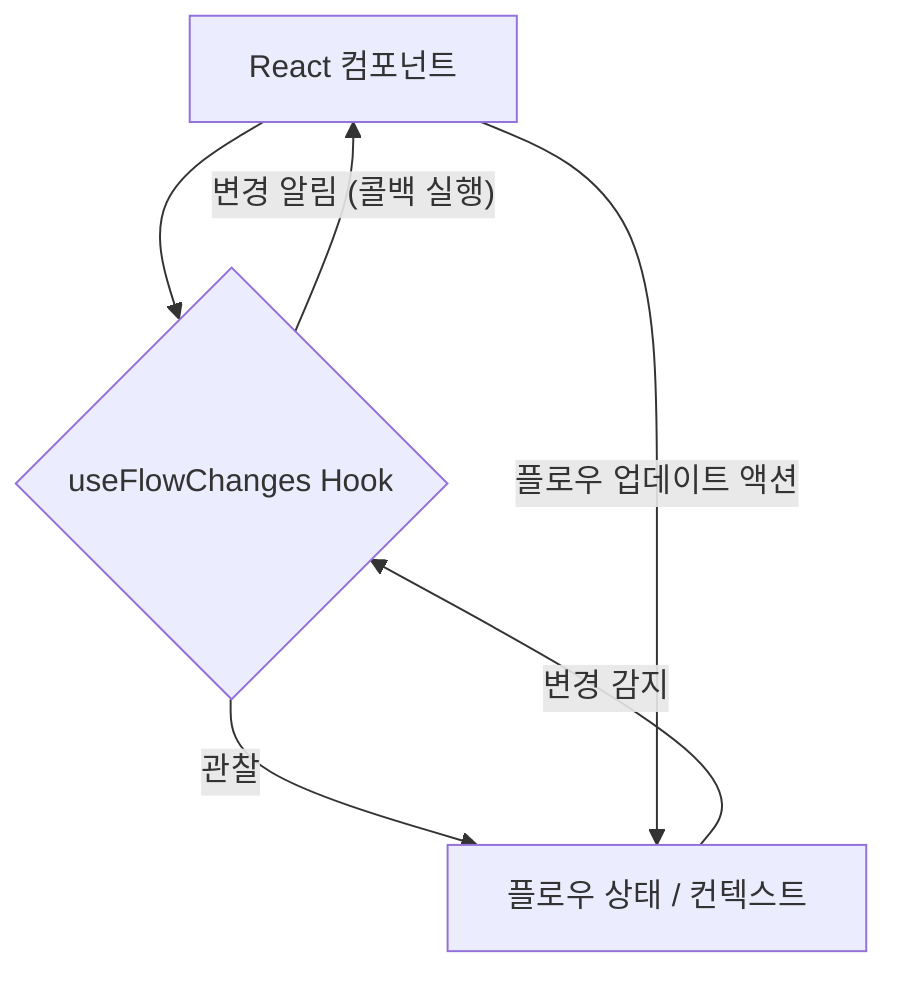
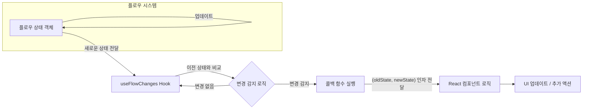

<cite>src/hooks/useFlowChanges.ts</cite>

## 훅 (Hooks) - Use Flow Changes

### 개요

`useFlowChanges` 훅은 애플리케이션 내 특정 "플로우" 또는 상태 객체의 변경을 효율적으로 감지하고 이에 반응하기 위한 메커니즘을 제공합니다. 이 훅은 주어진 상태의 이전 값과 현재 값을 비교하여 변경 사항이 있을 때 정의된 콜백 함수를 실행함으로써, 복잡한 상태 관리 로직 없이도 플로우의 흐름 변화에 따른 부수 효과를 쉽게 처리할 수 있도록 돕습니다. 이를 통해 컴포넌트는 플로우 상태 변화에 따라 UI를 업데이트하거나, 데이터 동기화, 알림 발생 등 다양한 액션을 선언적으로 수행할 수 있습니다.

### Mermaid 다이어그램

#### `useFlowChanges` 아키텍처



#### 변경 감지 데이터 흐름



### 주요 함수

**`useFlowChanges`**

*   **이름**: `useFlowChanges`
*   **시그니처**: `function useFlowChanges<T>(flowState: T, callback: (oldState: T, newState: T) => void, options?: { comparer?: (a: T, b: T) => boolean; debounceTime?: number }): void`
*   **설명**:
    제공된 `flowState` 값의 변경을 감지하고, 변경이 발생했을 때 `callback` 함수를 실행하는 React 훅입니다.
    `flowState`는 비교 가능한 모든 타입의 값(객체, 배열, 원시 값 등)이 될 수 있습니다.
    훅은 내부적으로 `flowState`의 이전 값과 현재 값을 비교하여 변경 여부를 판단합니다.
    `options` 객체를 통해 훅의 동작 방식을 세밀하게 제어할 수 있습니다:
    *   `comparer`: 두 `flowState` 값이 동일한지 판단하는 커스텀 비교 함수를 제공합니다. 기본적으로는 얕은 비교를 수행합니다.
    *   `debounceTime`: 변경 감지 후 `callback`을 실행하기까지 대기할 시간을 밀리초 단위로 설정합니다. 짧은 시간 내에 여러 변경이 발생하는 경우 불필요한 콜백 실행을 방지하는 데 유용합니다.

### 설정/사용법

`useFlowChanges` 훅은 React 컴포넌트 내에서 플로우 상태의 변화에 반응해야 할 때 사용됩니다.

#### 예시 1: 기본적인 플로우 상태 변경 감지

```tsx
import React, { useState, useEffect } from 'react';
import { useFlowChanges } from './src/hooks/useFlowChanges'; // 실제 경로에 맞게 조정

interface WorkflowState {
  step: number;
  status: 'pending' | 'processing' | 'completed' | 'failed';
  data: string[];
}

function WorkflowComponent() {
  const [workflow, setWorkflow] = useState<WorkflowState>({
    step: 1,
    status: 'pending',
    data: [],
  });

  const handleWorkflowChange = (oldState: WorkflowState, newState: WorkflowState) => {
    console.log('워크플로우 상태가 변경되었습니다.');
    console.log('이전 상태:', oldState);
    console.log('현재 상태:', newState);

    if (newState.status === 'completed') {
      alert('워크플로우가 완료되었습니다!');
      // 완료 후 추가 로직 수행 (예: 서버에 완료 알림)
    }
  };

  useFlowChanges(workflow, handleWorkflowChange, {
    debounceTime: 500, // 500ms 동안 변경이 없으면 콜백 실행
    comparer: (a, b) => JSON.stringify(a) === JSON.stringify(b), // 객체 깊은 비교
  });

  const nextStep = () => {
    setWorkflow(prev => ({
      ...prev,
      step: prev.step + 1,
      status: prev.step + 1 >= 3 ? 'completed' : 'processing',
      data: [...prev.data, `Step ${prev.step + 1} data`],
    }));
  };

  return (
    <div>
      <h1>워크플로우 상태</h1>
      <pre>{JSON.stringify(workflow, null, 2)}</pre>
      <button onClick={nextStep} disabled={workflow.status === 'completed'}>
        다음 단계
      </button>
    </div>
  );
}

export default WorkflowComponent;
```

### 문제 해결 가이드

1.  **변경 콜백이 예상보다 자주 또는 드물게 실행됩니다.**
    *   **원인**: `flowState` 객체의 참조가 변경될 때마다 `useFlowChanges`는 변경을 감지합니다. 객체 내부의 값만 변경되고 참조는 동일하게 유지되는 경우(mutable 객체) 변경이 감지되지 않거나, 불필요한 참조 변경으로 인해 너무 자주 감지될 수 있습니다.
    *   **해결**:
        *   `flowState`는 항상 불변(immutable) 객체로 관리하는 것이 좋습니다. 상태를 업데이트할 때는 항상 새로운 객체를 생성하세요.
        *   `options.debounceTime`을 사용하여 콜백 실행 빈도를 조절할 수 있습니다. 예를 들어, 짧은 시간 내에 여러 변경이 발생할 때 마지막 변경에 대해서만 콜백을 실행하도록 설정할 수 있습니다.
        *   `options.comparer`를 사용하여 두 `flowState` 객체가 동일한지 판단하는 커스텀 로직을 제공할 수 있습니다. 이는 복잡한 객체나 배열의 깊은 비교가 필요한 경우 유용합니다.

2.  **`flowState`의 내부 값이 변경되었음에도 불구하고 변경이 감지되지 않습니다.**
    *   **원인**: `useFlowChanges`는 기본적으로 얕은 비교를 사용하여 `flowState`의 참조 변경을 감지합니다. `flowState`가 객체나 배열이고 그 내부 속성만 변경되었지만 객체 자체의 참조는 동일한 경우 변경으로 인식하지 못합니다.
    *   **해결**: `options.comparer` 함수를 사용하여 깊은 비교 로직을 구현해야 합니다. 예를 들어, `lodash.isEqual`과 같은 라이브러리 함수를 사용하거나 `JSON.stringify`를 통한 비교를 활용할 수 있습니다.
        ```typescript
        // 예시: 깊은 비교를 위한 comparer
        useFlowChanges(flow, handleFlowChange, {
          comparer: (a, b) => JSON.stringify(a) === JSON.stringify(b)
        });
        ```

3.  **`handleFlowChange` 콜백 내부에서 최신 `flowState`나 다른 상태를 참조하지 못합니다.**
    *   **원인**: `useFlowChanges`에 전달된 `handleFlowChange` 콜백 함수가 컴포넌트의 특정 렌더링 시점의 클로저를 캡처하고 있어, 해당 렌더링 이후에 변경된 상태를 참조하지 못하는 경우가 발생할 수 있습니다.
    *   **해결**:
        *   `handleFlowChange` 콜백 함수를 `useCallback`으로 감싸고, 해당 콜백이 의존하는 모든 외부 상태를 `useCallback`의 의존성 배열에 명시적으로 포함시키세요.
        *   `useFlowChanges` 훅이 이미 `oldState`와 `newState`를 인자로 제공하므로, 콜백 내부에서 직접 `flow` 상태를 참조하기보다는 이 인자들을 활용하는 것이 더 안전합니다.
        *   만약 콜백이 최신 값을 필요로 하지만 의존성 배열에 추가하기 어려운 상황이라면, `useRef`를 사용하여 변경 가능한 참조를 유지하는 방법을 고려할 수 있습니다. 하지만 이는 React의 선언적 패러다임과 다소 거리가 있으므로 신중하게 사용해야 합니다.