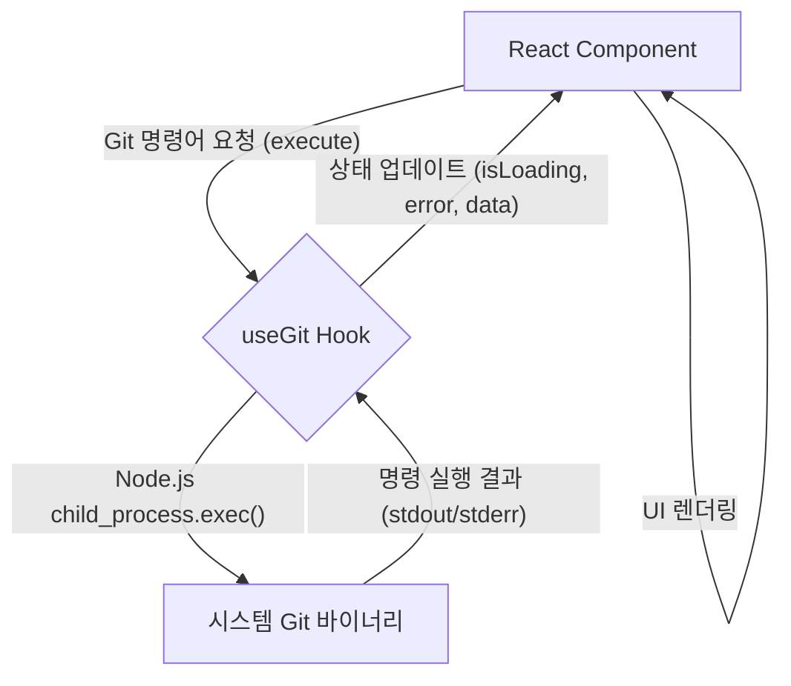
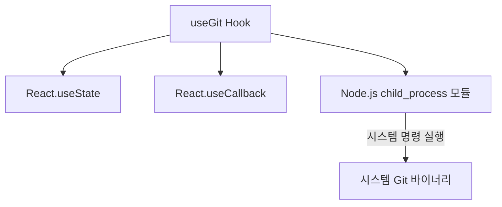

<cite>src/hooks/useGit.ts</cite>

## 개요

`useGit` 훅은 React 컴포넌트 내에서 Git 명령어를 비동기적으로 실행하고 그 결과를 효과적으로 관리하기 위해 설계되었습니다. 이 훅은 Git 작업의 로딩 상태, 발생할 수 있는 에러, 그리고 성공적인 실행 결과를 추상화하여 제공함으로써, 개발자가 복잡한 비동기 로직 대신 Git 명령어 자체에 집중할 수 있도록 돕습니다. 이를 통해 Git 관련 기능을 React 애플리케이션에 손쉽게 통합할 수 있습니다.

## 아키텍처 다이어그램

`useGit` 훅이 React 컴포넌트와 시스템 Git 바이너리 사이에서 어떻게 작동하는지 보여주는 아키텍처 다이어그램입니다.



## 데이터 흐름 다이어그램

`useGit` 훅 내에서 Git 명령어가 실행되고 그 결과가 컴포넌트로 전달되는 데이터 흐름을 시각화합니다.

```mermaid
graph TD
    A[Component] -- 1. Git 명령어 실행 요청 --> B{useGit Hook};
    B -- 2. isLoading = true 설정 --> A;
    B -- 3. child_process.exec() 호출 --> C[Git CLI];
    C -- 4. 명령 실행 및 결과 반환 --> B;
    alt 성공 시
        B -- 5a. data = 결과, isLoading = false 설정 --> A;
    else 실패 시
        B -- 5b. error = 에러, isLoading = false 설정 --> A;
    end
    A -- 6. 상태 변화에 따른 UI 재렌더링 --> A;
```

## 의존성 다이어그램

`useGit` 훅이 내부적으로 사용하는 주요 모듈 및 React 기능들의 의존성을 나타냅니다.



## 주요 함수/클래스

### `useGit()`

*   **시그니처**:
    ```typescript
    useGit(): {
      isLoading: boolean;
      error: Error | null;
      data: string | null;
      execute: (command: string, args?: string[], options?: GitExecuteOptions) => Promise<void>;
      clear: () => void;
    }
    ```
*   **설명**:
    Git 명령어를 비동기적으로 실행하고 그 실행 상태(로딩 여부), 에러, 그리고 성공적인 실행 결과를 관리하는 React 훅입니다. 이 훅은 Git 명령어 실행을 위한 `execute` 함수와 현재 상태를 초기화하는 `clear` 함수를 제공합니다. `GitExecuteOptions`는 `cwd` (현재 작업 디렉토리)와 같은 추가 실행 옵션을 포함할 수 있습니다.

### `execute(command: string, args?: string[], options?: GitExecuteOptions)`

*   **시그니처**:
    ```typescript
    execute(command: string, args?: string[], options?: GitExecuteOptions): Promise<void>
    ```
*   **설명**:
    주어진 Git `command`와 선택적 `args` (인자들)를 사용하여 실제 Git 명령어를 실행합니다. 이 함수가 호출되면 훅의 `isLoading` 상태가 `true`로 설정되고, 명령 실행이 완료되면 `data`에 표준 출력(stdout) 결과가 저장되거나 에러 발생 시 `error`에 에러 객체가 저장됩니다. `options` 객체를 통해 명령어 실행 환경(예: 작업 디렉토리)을 제어할 수 있습니다.

### `clear()`

*   **시그니처**:
    ```typescript
    clear(): void
    ```
*   **설명**:
    `useGit` 훅의 현재 상태(isLoading, error, data)를 초기 상태로 초기화합니다. 이는 새로운 Git 작업을 시작하기 전에 이전 실행의 결과를 지우거나, UI에서 이전 결과 표시를 제거해야 할 때 유용합니다.

## 설정/사용법 섹션

### 예시 1: 현재 Git 저장소의 상태 확인

```typescript
import React from 'react';
import { useGit } from './hooks/useGit'; // 실제 파일 경로에 맞게 수정

function GitStatusViewer() {
  const { isLoading, error, data, execute, clear } = useGit();

  const handleGetStatus = async () => {
    clear(); // 이전 결과 초기화
    await execute('status'); // 'git status' 명령어 실행
  };

  return (
    <div>
      <h2>Git 저장소 상태</h2>
      <button onClick={handleGetStatus} disabled={isLoading}>
        {isLoading ? 'Git 상태 로딩 중...' : 'Git 상태 확인'}
      </button>
      {error && (
        <p style={{ color: 'red', fontWeight: 'bold' }}>
          에러 발생: {error.message}
        </p>
      )}
      {data && (
        <pre style={{ backgroundColor: '#f0f0f0', padding: '15px', borderRadius: '8px', overflowX: 'auto' }}>
          <code>{data}</code>
        </pre>
      )}
      <button onClick={clear} disabled={!data && !error && !isLoading}>
        결과 지우기
      </button>
    </div>
  );
}

export default GitStatusViewer;
```

### 예시 2: 특정 브랜치로 체크아웃 및 작업 디렉토리 지정

```typescript
import React, { useState } from 'react';
import { useGit } from './hooks/useGit'; // 실제 파일 경로에 맞게 수정

function GitBranchCheckout() {
  const { isLoading, error, data, execute, clear } = useGit();
  const [branchName, setBranchName] = useState('main');
  const [targetDirectory, setTargetDirectory] = useState('/path/to/your/repo'); // Git 저장소 경로 지정

  const handleCheckout = async () => {
    clear(); // 이전 결과 초기화
    // 'git checkout [branchName]' 명령어 실행, targetDirectory에서 실행
    await execute('checkout', [branchName], { cwd: targetDirectory });
  };

  return (
    <div>
      <h2>Git 브랜치 체크아웃</h2>
      <div style={{ marginBottom: '10px' }}>
        <label htmlFor="branch-input" style={{ marginRight: '10px' }}>브랜치 이름:</label>
        <input
          id="branch-input"
          type="text"
          value={branchName}
          onChange={(e) => setBranchName(e.target.value)}
          placeholder="예: develop 또는 feature/new-feature"
          style={{ padding: '8px', borderRadius: '4px', border: '1px solid #ccc', width: '200px' }}
        />
      </div>
      <div style={{ marginBottom: '20px' }}>
        <label htmlFor="dir-input" style={{ marginRight: '10px' }}>작업 디렉토리:</label>
        <input
          id="dir-input"
          type="text"
          value={targetDirectory}
          onChange={(e) => setTargetDirectory(e.target.value)}
          placeholder="Git 저장소의 절대 경로"
          style={{ padding: '8px', borderRadius: '4px', border: '1px solid #ccc', width: '300px' }}
        />
      </div>
      <button onClick={handleCheckout} disabled={isLoading || !branchName || !targetDirectory}>
        {isLoading ? '체크아웃 중...' : `브랜치 '${branchName}'로 체크아웃`}
      </button>
      {error && (
        <p style={{ color: 'red', fontWeight: 'bold' }}>
          체크아웃 실패: {error.message}
        </p>
      )}
      {data && (
        <p style={{ color: 'green', fontWeight: 'bold' }}>
          체크아웃 성공: {data}
        </p>
      )}
      <button onClick={clear} disabled={!data && !error && !isLoading} style={{ marginLeft: '10px' }}>
        결과 지우기
      </button>
    </div>
  );
}

export default GitBranchCheckout;
```

## 문제 해결 가이드

### 1. Git 명령어를 찾을 수 없습니다 (Git command not found)

*   **원인**: `useGit` 훅이 내부적으로 호출하는 `git` 실행 파일이 시스템의 PATH 환경 변수에 등록되어 있지 않거나, Git이 시스템에 설치되어 있지 않은 경우 발생합니다.
*   **해결**:
    1.  **Git 설치 확인**: 먼저 시스템에 Git이 올바르게 설치되어 있는지 확인하십시오. 터미널에서 `git --version`을 실행하여 Git 버전 정보가 출력되는지 확인합니다.
    2.  **PATH 환경 변수 확인**: Git이 설치되어 있다면, Git 실행 파일(예: Windows의 `git.exe`, macOS/Linux의 `git`)의 경로가 시스템의 PATH 환경 변수에 포함되어 있는지 확인하십시오. 필요한 경우 Git을 재설치하거나, Git 설치 경로를 수동으로 PATH에 추가해야 합니다. Node.js 애플리케이션이 실행되는 환경 변수도 함께 확인해야 합니다.

### 2. 권한 오류가 발생합니다 (Permission denied)

*   **원인**: Git 명령어를 실행하려는 디렉토리 또는 Git 저장소 자체에 대해 애플리케이션이 실행되는 사용자 계정에 적절한 읽기/쓰기 권한이 없는 경우 발생합니다. 때로는 Git 저장소의 `.git` 디렉토리나 내부 파일들이 손상되었을 수도 있습니다.
*   **해결**:
    1.  **디렉토리 권한 확인**: `execute` 함수에 `cwd` 옵션으로 지정된 디렉토리 또는 애플리케이션이 실행되는 현재 작업 디렉토리에 대해 사용자 계정이 충분한 권한(읽기, 쓰기, 실행)을 가지고 있는지 확인하십시오.
    2.  **Git 저장소 무결성 검사**: Git 저장소 자체의 문제일 수 있으므로, 해당 저장소 디렉토리에서 `git fsck` 명령어를 실행하여 저장소의 무결성을 검사해 볼 수 있습니다.
    3.  **관리자 권한으로 실행**: 개발 환경에서 테스트하는 경우, 터미널이나 IDE를 관리자 권한으로 실행하여 권한 문제를 일시적으로 우회할 수 있습니다. (운영 환경에서는 권한 설정을 올바르게 하는 것이 중요합니다.)

### 3. 명령어가 너무 오래 걸리거나 응답이 없습니다.

*   **원인**: 실행되는 Git 명령어가 매우 큰 저장소를 대상으로 하거나, 네트워크를 통해 대량의 데이터를 전송(예: `git clone`, `git push` 대용량 파일)하여 시간이 오래 걸리는 경우, 또는 잘못된 인자로 인해 명령어가 멈춘 상태일 수 있습니다.
*   **해결**:
    1.  **명령어 및 인자 검토**: 실행 중인 Git 명령의 인자가 올바른지 다시 확인하십시오. 불필요한 옵션이나 잘못된 경로가 지정되었을 수 있습니다.
    2.  **비동기 처리 및 UI 피드백**: 시간이 오래 걸리는 작업의 경우, 사용자에게 현재 작업이 진행 중임을 명확히 알리는 UI(예: 로딩 스피너, 진행률 표시줄)를 제공해야 합니다. `isLoading` 상태를 활용하여 이 피드백을 구현할 수 있습니다.
    3.  **타임아웃 설정**: `child_process.exec` 또는 `spawn` 함수에 타임아웃 옵션을 설정하여, 특정 시간 내에 응답이 없으면 명령어를 강제로 종료하도록 할 수 있습니다. `useGit` 훅 내부에서 이 옵션을 추가하여 불안정한 명령으로부터 보호할 수 있습니다.
    4.  **Git 설정 최적화**: 대규모 저장소의 경우, `git config --global core.fscache false`와 같은 설정을 통해 Git의 파일 시스템 캐시 사용을 비활성화하여 성능을 개선할 수 있는 경우도 있습니다.