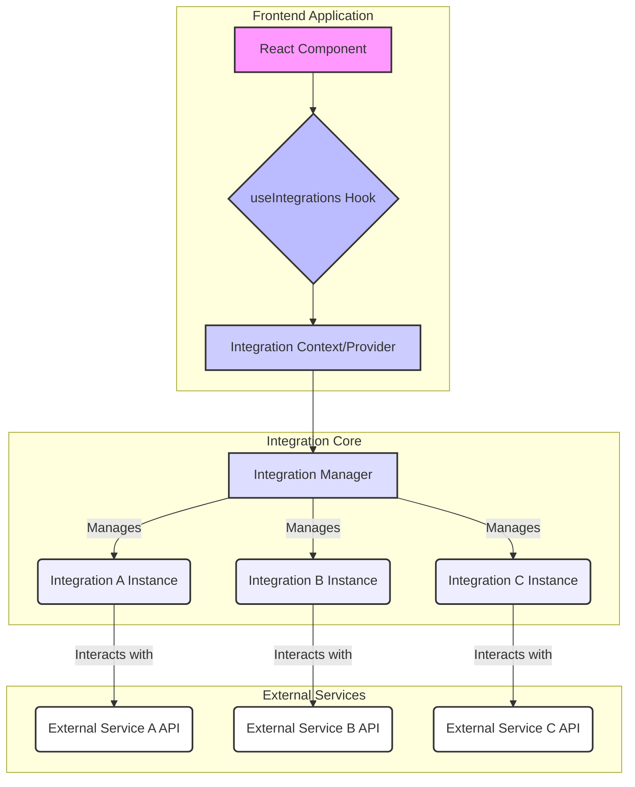
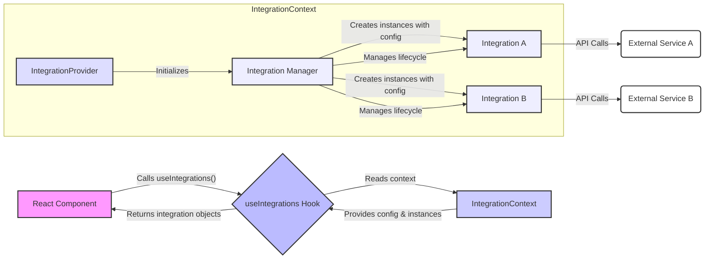
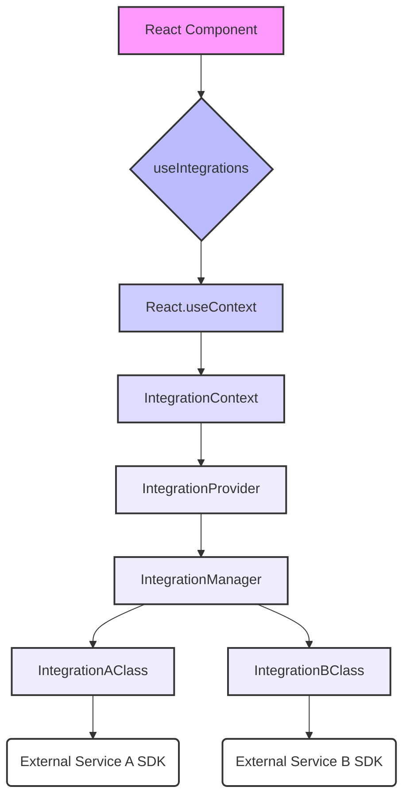

<cite>src/hooks/useIntegrations.ts</cite>

## 훅 (Hooks) - Use Integrations

### 개요
`useIntegrations` 훅은 애플리케이션 내에서 다양한 외부 서비스 및 도구와의 통합(Integration)을 관리하고 쉽게 접근할 수 있도록 설계되었습니다. 이 훅은 통합 서비스의 초기화, 상태 관리 및 해당 서비스의 기능에 대한 일관된 인터페이스를 제공하여 개발자가 복잡한 통합 로직에 직접 관여하지 않고도 기능을 활용할 수 있게 합니다. 이를 통해 코드의 재사용성을 높이고, 통합 관련 로직을 중앙 집중화하여 유지보수성을 향상시킵니다.

### 아키텍처 다이어그램



### 데이터 흐름 다이어그램



### 의존성 다이어그램



### 주요 함수/클래스

*   **`useIntegrations` 훅**
    *   **시그니처**: `function useIntegrations(): Integrations`
    *   **설명**: 이 훅은 애플리케이션 전반에 걸쳐 초기화된 통합 서비스 인스턴스들을 담고 있는 객체를 반환합니다. 반환되는 `Integrations` 객체는 각 통합 서비스의 이름(예: `analytics`, `crm`, `paymentGateway`)을 키로 하고 해당 서비스의 인스턴스를 값으로 가집니다. 이를 통해 컴포넌트는 필요한 통합 서비스에 직접 접근하여 기능을 호출할 수 있습니다. 예를 들어, `integrations.analytics.trackEvent('UserClickedButton')`와 같이 사용할 수 있습니다. 이 훅은 `IntegrationContext`를 통해 제공되는 값을 소비하므로, 애플리케이션 트리의 상위에 `IntegrationProvider`가 설정되어 있어야 합니다.

*   **`IntegrationContext`**
    *   **시그니처**: `React.Context<Integrations | undefined>`
    *   **설명**: 모든 통합 서비스 인스턴스를 담고 있는 객체를 전역적으로 제공하기 위한 React 컨텍스트입니다. `useIntegrations` 훅은 이 컨텍스트를 사용하여 통합 서비스에 접근합니다.

*   **`IntegrationProvider` 컴포넌트**
    *   **시그니처**: `function IntegrationProvider({ children, config }: { children: React.ReactNode; config: IntegrationConfig }): JSX.Element`
    *   **설명**: 이 컴포넌트는 `IntegrationContext`를 제공하는 역할을 합니다. `config` prop을 통해 각 통합 서비스에 필요한 초기화 설정을 받으며, 이 설정을 바탕으로 `IntegrationManager`를 사용하여 통합 서비스 인스턴스들을 초기화합니다. 초기화된 인스턴스들은 `IntegrationContext`를 통해 하위 컴포넌트들에게 제공됩니다. 애플리케이션의 루트 또는 통합 서비스가 필요한 최상위 컴포넌트에 한 번만 렌더링되어야 합니다.

### 설정/사용법

`useIntegrations` 훅을 사용하려면 먼저 애플리케이션의 최상위 또는 통합 서비스를 사용할 범위에 `IntegrationProvider`를 설정해야 합니다.

**1. `IntegrationProvider` 설정 (예: `App.tsx`)**

```typescript
// src/integrations/config.ts
export const integrationConfig = {
  analytics: {
    apiKey: 'YOUR_ANALYTICS_API_KEY',
    trackingId: 'UA-XXXXX-Y',
  },
  crm: {
    endpoint: 'https://api.crm.example.com',
    clientId: 'YOUR_CRM_CLIENT_ID',
  },
  // ... 다른 통합 서비스 설정
};

// src/App.tsx
import React from 'react';
import { IntegrationProvider } from './providers/IntegrationProvider'; // 가정된 경로
import { integrationConfig } from './integrations/config';
import MyComponent from './components/MyComponent';

function App() {
  return (
    <IntegrationProvider config={integrationConfig}>
      <div className="App">
        <h1>My Application</h1>
        <MyComponent />
      </div>
    </IntegrationProvider>
  );
}

export default App;
```

**2. `useIntegrations` 훅 사용 (예: `MyComponent.tsx`)**

```typescript
import React from 'react';
import { useIntegrations } from '../hooks/useIntegrations'; // 가정된 경로

function MyComponent() {
  const integrations = useIntegrations();

  const handleButtonClick = () => {
    if (integrations && integrations.analytics) {
      integrations.analytics.trackEvent('User Interaction', {
        category: 'Button Click',
        label: 'Submit Form',
      });
      console.log('Analytics event tracked.');
    } else {
      console.warn('Analytics integration not available.');
    }

    if (integrations && integrations.crm) {
      integrations.crm.createLead({
        name: 'John Doe',
        email: 'john.doe@example.com',
      });
      console.log('CRM lead created.');
    }
  };

  return (
    <div>
      <h2>Welcome to My Component</h2>
      <button onClick={handleButtonClick}>
        Perform Action
      </button>
      {!integrations?.analytics && <p>Loading analytics integration...</p>}
    </div>
  );
}

export default MyComponent;
```

### 문제 해결 가이드

**1. `integrations` 객체가 `undefined`이거나 특정 통합 서비스가 누락됨**

*   **증상**: `useIntegrations()` 호출 후 반환된 객체가 `undefined`이거나, `integrations.analytics`와 같이 특정 서비스에 접근하려 할 때 오류가 발생합니다.
*   **가능한 원인**:
    *   `IntegrationProvider`가 컴포넌트 트리의 상위에 렌더링되지 않았습니다. `useIntegrations`를 사용하는 모든 컴포넌트는 `IntegrationProvider`의 자식이어야 합니다.
    *   `IntegrationProvider`에 전달된 `config` 객체에 해당 통합 서비스에 대한 설정이 누락되었거나 잘못되었습니다.
    *   통합 서비스의 초기화 과정에서 오류가 발생하여 인스턴스 생성이 실패했습니다.
*   **해결책**:
    *   `App.tsx` 또는 최상위 레이아웃 파일에서 `IntegrationProvider`가 올바르게 설정되었는지 확인하세요.
    *   `IntegrationProvider`에 전달되는 `config` 객체에 필요한 모든 통합 서비스에 대한 유효한 설정이 포함되어 있는지 확인하세요.
    *   `IntegrationProvider` 내부의 콘솔 로그나 오류 처리를 확인하여 통합 서비스 초기화 과정에서 발생하는 문제를 진단하세요.

**2. 통합 서비스 메서드 호출 시 오류 발생 (예: `trackEvent is not a function`)**

*   **증상**: `integrations.analytics.trackEvent()`와 같이 통합 서비스의 특정 메서드를 호출할 때 "메서드가 함수가 아닙니다"와 같은 오류가 발생합니다.
*   **가능한 원인**:
    *   해당 통합 서비스 인스턴스가 예상된 인터페이스를 따르지 않거나, 초기화 과정에서 잘못된 객체가 생성되었습니다.
    *   타입스크립트를 사용하는 경우, 타입 정의가 실제 구현과 일치하지 않을 수 있습니다.
    *   통합 서비스 내부에서 비동기 초기화가 완료되기 전에 메서드를 호출했을 수 있습니다.
*   **해결책**:
    *   `IntegrationManager` 또는 개별 통합 서비스 클래스의 구현을 검토하여 해당 메서드가 올바르게 정의되고 노출되는지 확인하세요.
    *   `useIntegrations` 훅이 반환하는 객체의 타입을 확인하고, 실제 런타임 객체 구조와 일치하는지 검증하세요.
    *   필요하다면, 통합 서비스 인스턴스가 완전히 초기화되었음을 나타내는 `isReady`와 같은 상태를 추가하고, 해당 상태가 `true`일 때만 메서드를 호출하도록 로직을 수정하세요.

**3. 통합 서비스 설정 변경 시 반영되지 않음**

*   **증상**: `IntegrationProvider`에 전달된 `config` prop을 변경했지만, `useIntegrations` 훅을 통해 접근하는 통합 서비스 인스턴스가 새로운 설정을 반영하지 않습니다.
*   **가능한 원인**:
    *   `IntegrationProvider`가 `config` prop의 변경을 감지하고 통합 서비스 인스턴스를 재초기화하는 로직이 없거나 잘못 구현되었습니다.
    *   `config` 객체가 불변성을 유지하지 않고 직접 수정되어 React가 변경을 감지하지 못했을 수 있습니다.
*   **해결책**:
    *   `IntegrationProvider` 내부에서 `config` prop이 변경될 때 `useEffect` 훅 등을 사용하여 통합 서비스 인스턴스를 재초기화하는 로직이 있는지 확인하세요.
    *   `IntegrationProvider`에 전달하는 `config` 객체는 항상 새로운 객체로 전달하여 React가 변경을 감지할 수 있도록 하세요 (예: `...prevConfig, newSetting: value`).
    *   대부분의 통합 서비스는 애플리케이션 수명 주기 동안 한 번만 초기화되는 것을 가정하므로, 런타임에 설정을 자주 변경해야 하는 경우, 해당 통합 서비스가 동적 설정을 지원하는지 확인하거나, 설정을 업데이트하는 별도의 메서드를 제공해야 할 수 있습니다.