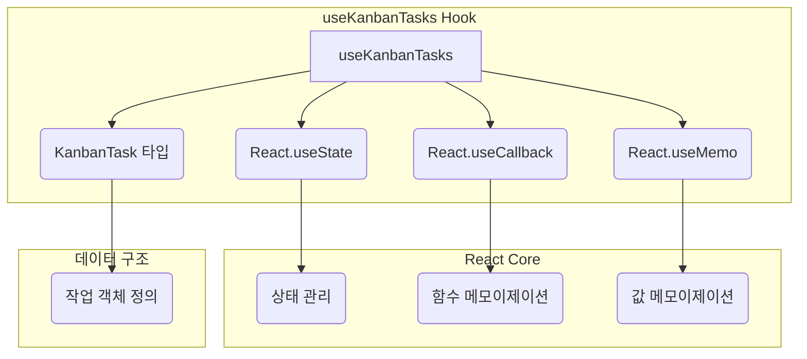
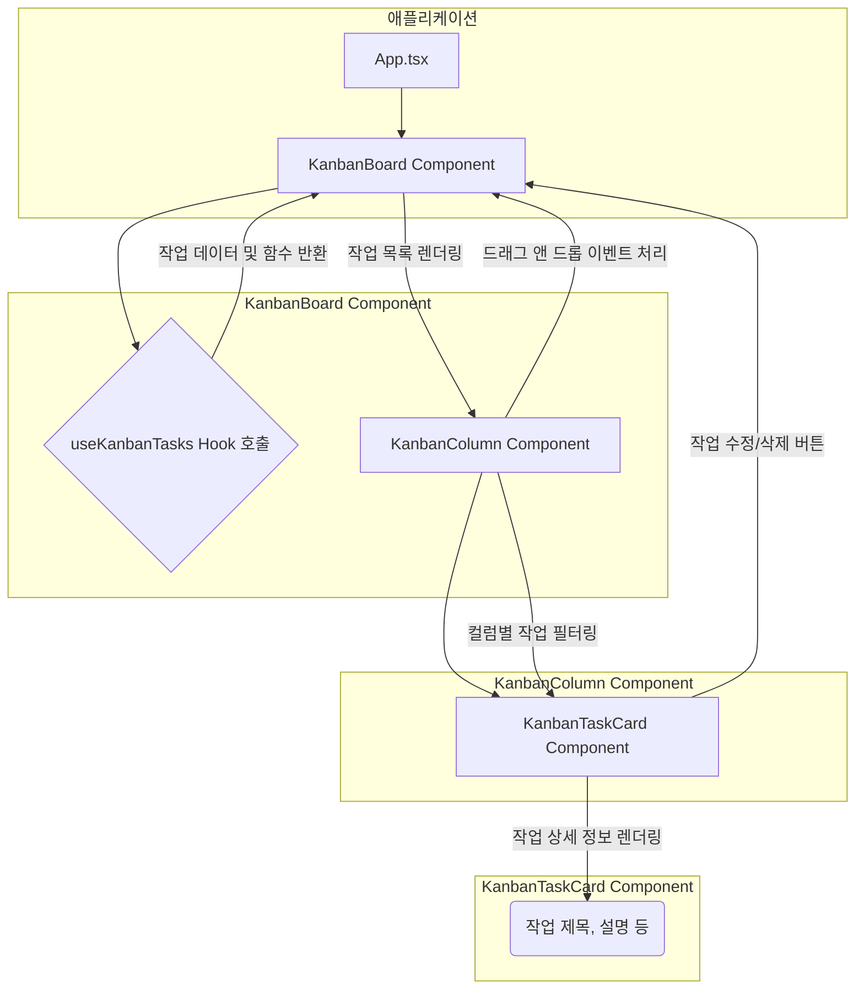

<cite>src/hooks/useKanbanTasks.ts</cite>

## 개요

`useKanbanTasks` 훅은 React 애플리케이션에서 칸반 보드 형태의 작업을 효율적으로 관리하기 위해 설계되었습니다. 이 훅은 작업 목록의 상태를 중앙에서 관리하고, 작업의 추가, 수정, 삭제, 이동 등 다양한 조작을 위한 일관된 인터페이스를 제공합니다. 복잡한 상태 관리 로직을 캡슐화하여, 컴포넌트 개발자는 오직 비즈니스 로직에 집중하고 UI를 구현하는 데 더 많은 시간을 할애할 수 있도록 돕습니다.

## Mermaid 다이어그램

### 1. 데이터 흐름 다이어그램

```mermaid
graph TD
    subgraph UI Component
        A[KanbanBoard Component] --> B{작업 추가/수정/삭제/이동 요청};
    end

    subgraph useKanbanTasks Hook
        B --> C[useKanbanTasks Hook];
        C --> D[내부 작업 상태 (tasks)];
        D -- 상태 변경 --> C;
    end

    subgraph 데이터 흐름
        C -- 업데이트된 작업 목록 반환 --> A;
        D -- UI 렌더링을 위한 데이터 --> A;
    end
```

### 2. 내부 의존성 다이어그램



### 3. 컴포넌트 상호작용 다이어그램



## 주요 함수/타입

### `interface KanbanTask`

*   **설명**: 칸반 보드 내의 단일 작업을 나타내는 데이터 구조입니다. 이 인터페이스는 작업의 고유 ID, 제목, 설명, 현재 속한 컬럼 ID 등 필수 정보를 정의하며, 필요에 따라 우선순위, 담당자, 생성일 등 추가적인 필드를 포함할 수 있습니다. `useKanbanTasks` 훅의 모든 작업 관련 함수는 이 타입을 기반으로 데이터를 처리합니다.

### `useKanbanTasks(initialTasks?: KanbanTask[])`

*   **시그니처**: `useKanbanTasks(initialTasks?: KanbanTask[]): { tasks: KanbanTask[], addTask: (task: KanbanTask) => void, updateTask: (taskId: string, updates: Partial<KanbanTask>) => void, deleteTask: (taskId: string) => void, moveTask: (taskId: string, fromColumnId: string, toColumnId: string, newIndex: number) => void, findTask: (taskId: string) => KanbanTask | undefined }`
*   **설명**: 칸반 보드 작업을 관리하기 위한 주된 React Hook입니다. 초기 작업 목록을 선택적으로 인자로 받아 내부 상태를 초기화합니다. 이 훅은 현재 작업 목록(`tasks`)과 함께 작업을 추가, 업데이트, 삭제, 이동, 조회하는 데 사용되는 여러 헬퍼 함수들을 객체 형태로 반환합니다. 이 반환값들을 통해 컴포넌트는 작업 상태를 직접 조작하지 않고도 간편하게 칸반 보드 기능을 구현할 수 있습니다.

### `tasks`

*   **시그니처**: `KanbanTask[]`
*   **설명**: `useKanbanTasks` 훅이 관리하는 현재 작업 목록의 배열입니다. 이 배열은 컴포넌트가 칸반 보드의 UI를 렌더링하는 데 필요한 모든 작업 데이터를 포함하며, 훅의 내부 함수들에 의해 상태가 변경될 때마다 자동으로 업데이트됩니다.

### `addTask(task: KanbanTask)`

*   **시그니처**: `(task: KanbanTask) => void`
*   **설명**: 새로운 작업을 칸반 보드에 추가하는 함수입니다. `KanbanTask` 타입의 객체를 인자로 받아 현재 작업 목록의 끝에 추가하고 상태를 업데이트합니다. 이 함수는 주로 "새 작업 생성" 버튼 클릭 이벤트 등에서 사용됩니다.

### `updateTask(taskId: string, updates: Partial<KanbanTask>)`

*   **시그니처**: `(taskId: string, updates: Partial<KanbanTask>) => void`
*   **설명**: 특정 작업의 정보를 업데이트하는 함수입니다. 업데이트할 작업의 고유 `taskId`와, 변경할 속성들을 담은 `Partial<KanbanTask>` 객체를 인자로 받습니다. 주어진 `taskId`에 해당하는 작업을 찾아 `updates` 객체의 내용으로 병합하여 상태를 갱신합니다. 이를 통해 작업의 제목, 설명, 담당자 등 다양한 필드를 수정할 수 있습니다.

### `deleteTask(taskId: string)`

*   **시그니처**: `(taskId: string) => void`
*   **설명**: 특정 작업을 칸반 보드에서 제거하는 함수입니다. 제거할 작업의 고유 `taskId`를 인자로 받습니다. 해당 `taskId`를 가진 작업을 찾아 작업 목록에서 제거하고 상태를 업데이트합니다. 주로 "작업 삭제" 버튼 클릭 이벤트에 사용됩니다.

### `moveTask(taskId: string, fromColumnId: string, toColumnId: string, newIndex: number)`

*   **시그니처**: `(taskId: string, fromColumnId: string, toColumnId: string, newIndex: number) => void`
*   **설명**: 특정 작업을 다른 컬럼으로 이동시키거나, 같은 컬럼 내에서 순서를 변경하는 함수입니다. 이동할 작업의 `taskId`, 작업이 원래 있던 `fromColumnId`, 작업이 이동할 `toColumnId`, 그리고 대상 컬럼 내에서의 새로운 인덱스인 `newIndex`를 인자로 받습니다. 이 함수는 드래그 앤 드롭 기능을 구현할 때 핵심적으로 사용됩니다.

### `findTask(taskId: string)`

*   **시그니처**: `(taskId: string) => KanbanTask | undefined`
*   **설명**: 주어진 `taskId`에 해당하는 `KanbanTask` 객체를 찾아 반환하는 헬퍼 함수입니다. 작업을 찾지 못하면 `undefined`를 반환합니다. 특정 작업의 상세 정보를 조회하거나, 작업과 관련된 추가적인 로직을 수행할 때 유용하게 사용될 수 있습니다.

## 설정/사용법

`useKanbanTasks` 훅은 React 컴포넌트 내에서 호출하여 칸반 작업 상태와 조작 함수들을 쉽게 가져올 수 있습니다.

### 예제 1: 칸반 보드에 작업 표시 및 조작

이 예제는 `useKanbanTasks` 훅을 사용하여 초기 작업을 설정하고, 새 작업을 추가하며, 기존 작업을 업데이트하고 삭제하는 기본적인 방법을 보여줍니다.

```typescript jsx
import React, { useState } from 'react';
import { useKanbanTasks } from './useKanbanTasks'; // 실제 경로에 맞게 수정

// KanbanTask 인터페이스 정의 (훅 내부 또는 별도 파일에 정의될 수 있습니다)
interface KanbanTask {
  id: string;
  title: string;
  description?: string;
  columnId: string; // 예: 'todo', 'doing', 'done'
}

const initialTasks: KanbanTask[] = [
  { id: '1', title: '기술 문서 작성', description: 'useKanbanTasks 훅 문서화', columnId: 'todo' },
  { id: '2', title: '코드 리뷰', description: '새로운 기능 PR 검토', columnId: 'doing' },
  { id: '3', title: '버그 수정', description: '로그인 페이지 버그 해결', columnId: 'done' },
];

function KanbanBoardComponent() {
  const { tasks, addTask, updateTask, deleteTask, moveTask } = useKanbanTasks(initialTasks);
  const [newTaskTitle, setNewTaskTitle] = useState('');

  const handleAddTask = () => {
    if (newTaskTitle.trim() === '') return;
    const newTask: KanbanTask = {
      id: `task-${Date.now()}`,
      title: newTaskTitle,
      description: '새로 추가된 작업입니다.',
      columnId: 'todo', // 기본적으로 'todo' 컬럼에 추가
    };
    addTask(newTask);
    setNewTaskTitle('');
  };

  const handleUpdateTask = (taskId: string) => {
    // 특정 작업의 제목을 업데이트하는 예시
    updateTask(taskId, { title: `업데이트된 작업 (${taskId})` });
  };

  const handleDeleteTask = (taskId: string) => {
    // 특정 작업을 삭제하는 예시
    if (window.confirm(`${taskId} 작업을 삭제하시겠습니까?`)) {
      deleteTask(taskId);
    }
  };

  const handleMoveTask = (taskId: string, fromColumn: string, toColumn: string, newIndex: number) => {
    // 작업을 다른 컬럼으로 이동하는 예시 (여기서는 간단히 'doing'으로 이동)
    moveTask(taskId, fromColumn, toColumn, newIndex);
  };

  return (
    <div style={{ padding: '20px' }}>
      <h1>나의 칸반 보드</h1>

      <div style={{ marginBottom: '20px' }}>
        <input
          type="text"
          value={newTaskTitle}
          onChange={(e) => setNewTaskTitle(e.target.value)}
          placeholder="새 작업 제목 입력"
          style={{ marginRight: '10px', padding: '8px' }}
        />
        <button onClick={handleAddTask} style={{ padding: '8px 15px' }}>작업 추가</button>
      </div>

      <div style={{ display: 'flex', gap: '20px' }}>
        {['todo', 'doing', 'done'].map(columnId => (
          <div key={columnId} style={{ flex: 1, border: '1px solid #ccc', borderRadius: '5px', padding: '10px' }}>
            <h2>{columnId.toUpperCase()}</h2>
            {tasks
              .filter(task => task.columnId === columnId)
              .map(task => (
                <div
                  key={task.id}
                  style={{
                    border: '1px solid #eee',
                    borderRadius: '3px',
                    padding: '10px',
                    margin: '10px 0',
                    backgroundColor: '#f9f9f9',
                  }}
                >
                  <h3>{task.title}</h3>
                  <p>{task.description}</p>
                  <div style={{ display: 'flex', gap: '5px', marginTop: '10px' }}>
                    <button onClick={() => handleUpdateTask(task.id)}>제목 수정</button>
                    <button onClick={() => handleDeleteTask(task.id)}>삭제</button>
                    {columnId !== 'doing' && (
                      <button onClick={() => handleMoveTask(task.id, columnId, 'doing', 0)}>Doing으로 이동</button>
                    )}
                  </div>
                </div>
              ))}
          </div>
        ))}
      </div>
    </div>
  );
}

export default KanbanBoardComponent;
```

**코드 설명:**
1.  **`useKanbanTasks(initialTasks)` 호출**: `KanbanBoardComponent` 내부에서 `useKanbanTasks` 훅을 호출하여 초기 작업 목록을 전달하고, `tasks` 배열과 함께 작업을 조작하는 함수들(`addTask`, `updateTask`, `deleteTask`, `moveTask`)을 구조 분해 할당으로 가져옵니다.
2.  **새 작업 추가**: `newTaskTitle` 상태를 사용하여 입력 필드의 값을 관리하고, "작업 추가" 버튼 클릭 시 `handleAddTask` 함수를 통해 새로운 `KanbanTask` 객체를 생성하여 `addTask` 함수로 전달합니다.
3.  **작업 업데이트**: 각 작업 카드 내의 "제목 수정" 버튼 클릭 시 `handleUpdateTask` 함수를 호출하여 해당 작업의 `id`와 변경할 `Partial<KanbanTask>` 객체(여기서는 `title`만 변경)를 `updateTask` 함수에 전달합니다.
4.  **작업 삭제**: "삭제" 버튼 클릭 시 `handleDeleteTask` 함수를 호출하여 해당 작업의 `id`를 `deleteTask` 함수에 전달합니다.
5.  **작업 이동**: "Doing으로 이동" 버튼 클릭 시 `handleMoveTask` 함수를 호출하여 `moveTask` 함수에 필요한 인자들(작업 ID, 현재 컬럼 ID, 대상 컬럼 ID, 새 인덱스)을 전달합니다. 이 예시에서는 간단히 모든 작업을 'doing' 컬럼의 첫 번째 위치로 이동하도록 구현했습니다.
6.  **UI 렌더링**: `tasks` 배열을 기반으로 'todo', 'doing', 'done' 세 개의 컬럼을 렌더링하고, 각 컬럼에 해당하는 작업들만 필터링하여 표시합니다.

## 문제 해결 가이드

### 1. 작업 상태가 업데이트되지 않음

*   **문제**: `addTask`, `updateTask`, `deleteTask`, `moveTask` 함수를 호출했지만 UI가 변경되지 않거나, 예상과 다른 상태가 유지됩니다.
*   **원인**: React의 상태 업데이트는 불변성(immutability)을 유지해야 합니다. 즉, 기존 상태 객체나 배열을 직접 수정하는 대신, 항상 새로운 객체나 배열을 생성하여 반환해야 합니다. `useKanbanTasks` 훅 내부에서 이 원칙을 따르지 않았을 수 있습니다.
*   **해결책**:
    *   `useKanbanTasks` 훅의 내부 구현을 확인하여, 상태를 업데이트할 때 `[...prevTasks, newTask]`와 같이 스프레드 연산자를 사용하거나, `map`, `filter` 등의 배열 메서드를 사용하여 항상 새로운 배열을 반환하는지 확인합니다.
    *   `updateTask`와 같은 함수에서 `Object.assign({}, oldTask, updates)` 또는 `{ ...oldTask, ...updates }`와 같이 새로운 객체를 생성하여 속성을 병합하는지 확인합니다.

### 2. 드래그 앤 드롭 시 작업 순서가 꼬이거나 위치가 잘못됨

*   **문제**: `moveTask` 함수를 사용하여 작업을 이동할 때, 작업이 올바른 위치에 놓이지 않거나 순서가 뒤섞입니다.
*   **원인**: `moveTask` 함수가 `newIndex`를 계산하는 로직이나, 기존 배열에서 작업을 제거하고 새 배열에 삽입하는 로직에 오류가 있을 수 있습니다. 특히 `fromColumnId`와 `toColumnId`가 같을 때 (같은 컬럼 내에서 순서 변경)와 다를 때 (다른 컬럼으로 이동)의 처리 로직이 복잡하여 오류가 발생하기 쉽습니다.
*   **해결책**:
    *   `moveTask` 함수의 내부 로직, 특히 `splice` 또는 `slice`와 같은 배열 조작 메서드의 사용법을 다시 검토합니다.
    *   같은 컬럼 내에서 이동하는 경우 (예: `fromColumnId === toColumnId`), 해당 컬럼의 배열에서 작업을 제거하고 `newIndex` 위치에 다시 삽입하는 로직이 정확한지 확인합니다.
    *   다른 컬럼으로 이동하는 경우, `fromColumnId` 컬럼의 배열에서 작업을 제거하고, `toColumnId` 컬럼의 배열에 `newIndex` 위치에 삽입하며, 작업의 `columnId` 속성도 `toColumnId`로 업데이트되는지 확인합니다.

### 3. 대규모 칸반 보드에서 성능 저하 발생

*   **문제**: 작업 수가 많아질수록 칸반 보드의 렌더링 성능이 저하되거나, 작업 조작 시 UI 반응이 느려집니다.
*   **원인**: `useKanbanTasks` 훅이 반환하는 함수들이 매 렌더링마다 새로 생성되거나, 불필요하게 많은 컴포넌트가 리렌더링되기 때문일 수 있습니다. 또한, 작업 목록 필터링이나 정렬 같은 연산이 비효율적으로 반복될 수도 있습니다.
*   **해결책**:
    *   `useKanbanTasks` 훅 내부에서 `addTask`, `updateTask` 등 작업 조작 함수들을 `React.useCallback`으로 감싸서 메모이제이션하여, 불필요한 함수 재생성을 방지합니다.
    *   `tasks` 배열에서 파생되는 데이터를 계산할 때(`columnId`별 필터링 등) `React.useMemo`를 사용하여 캐싱함으로써, 의존성이 변경될 때만 다시 계산되도록 합니다.
    *   칸반 보드의 각 작업 카드(`KanbanTaskCard`) 컴포넌트를 `React.memo`로 감싸서, 해당 컴포넌트의 `props`가 변경되지 않는 한 리렌더링되지 않도록 최적화합니다.