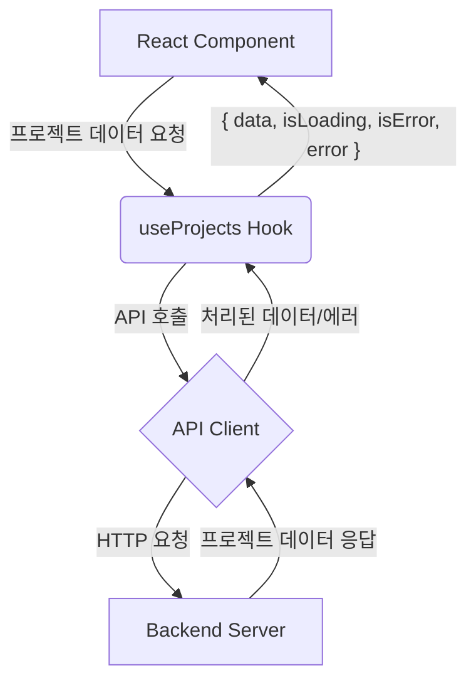

<cite>src/hooks/useProjects.ts</cite>

## 개요

`useProjects` 훅은 애플리케이션에서 프로젝트 목록 데이터를 효율적으로 가져오고 관리하기 위해 설계되었습니다. 이 훅은 데이터 페칭 로직, 로딩 상태, 에러 처리, 그리고 데이터 캐싱 및 동기화 기능을 추상화하여, 컴포넌트가 복잡한 데이터 관리 없이 오직 UI 렌더링에만 집중할 수 있도록 돕습니다. 이를 통해 코드의 재사용성을 높이고 개발 생산성을 향상시킵니다.

## 아키텍처 다이어그램

`useProjects` 훅이 애플리케이션 내에서 어떻게 작동하고 다른 구성 요소와 상호작용하는지 보여주는 아키텍처 다이어그램입니다.



## 데이터 흐름 다이어그램

`useProjects` 훅이 호출되었을 때 데이터가 어떤 경로로 흘러가고 각 단계에서 어떤 정보가 전달되는지 시각화한 다이어그램입니다.

```mermaid
sequenceDiagram
    participant C as Component
    participant H as useProjects Hook
    participant A as API Client
    participant B as Backend API

    C->>H: 프로젝트 데이터 요청 (useProjects() 호출)
    activate H
    H->>H: 로딩 상태 설정 (isLoading = true)
    H->>A: `fetchProjects` 함수 호출
    activate A
    A->>B: GET /projects HTTP 요청
    activate B
    B-->>A: HTTP 응답 (200 OK & 프로젝트 목록 또는 5xx 에러)
    deactivate B
    alt 성공적인 응답
        A-->>H: 프로젝트 목록 데이터 반환
        deactivate A
        H->>H: 데이터 캐싱 및 상태 업데이트 (isLoading = false, data = Project[])
        H-->>C: { data: Project[], isLoading: false, isError: false, error: null }
    else 에러 응답
        A-->>H: 에러 객체 반환
        deactivate A
        H->>H: 에러 상태 업데이트 (isLoading = false, isError = true, error = Error)
        H-->>C: { data: undefined, isLoading: false, isError: true, error: Error }
    end
    deactivate H
    C->>C: UI 렌더링 (로딩 스피너, 프로젝트 목록 또는 에러 메시지)
```

## 의존성 다이어그램

`useProjects` 훅이 내부적으로 의존하는 주요 모듈 및 라이브러리 관계를 나타내는 다이어그램입니다. 일반적으로 React Query와 같은 데이터 페칭 라이브러리와 애플리케이션의 API 클라이언트에 의존합니다.

```mermaid
graph LR
    subgraph Frontend Application
        Component -- 사용 --> useProjects
        useProjects -- 의존 --> APIClient[API Client (예: axios 인스턴스)]
        useProjects -- 활용 --> ReactQuery[React Query (데이터 페칭/캐싱)]
    end

    APIClient -- 통신 --> BackendService[Backend Service (프로젝트 API)]
```

## 주요 함수

### `useProjects`

*   **시그니처:**
    ```typescript
    function useProjects(
      options?: {
        enabled?: boolean; // 쿼리 활성화 여부
        staleTime?: number; // 데이터가 stale 상태가 되기까지의 시간 (ms)
        cacheTime?: number; // 쿼리 데이터가 캐시에서 제거되기까지의 시간 (ms)
        onSuccess?: (data: Project[]) => void;
        onError?: (error: Error) => void;
      }
    ): {
      data: Project[] | undefined;
      isLoading: boolean;
      isFetching: boolean;
      isError: boolean;
      error: Error | null;
      refetch: () => Promise<QueryObserverResult<Project[]>>;
      status: 'idle' | 'loading' | 'error' | 'success';
    }
    ```
*   **설명:**
    백엔드로부터 프로젝트 목록을 비동기적으로 가져오는 React 훅입니다. 이 훅은 데이터 로딩 상태 (`isLoading`, `isFetching`), 에러 발생 여부 (`isError`), 발생한 에러 객체 (`error`), 그리고 실제 프로젝트 데이터 (`data`)를 포함하는 객체를 반환합니다. 또한, 필요에 따라 수동으로 데이터를 다시 가져올 수 있는 `refetch` 함수를 제공합니다. `options` 객체를 통해 쿼리의 동작을 세밀하게 제어할 수 있습니다 (예: 쿼리 활성화/비활성화, 캐싱 시간 설정 등).

## 설정/사용법

### 기본 프로젝트 목록 가져오기

`useProjects` 훅을 사용하여 컴포넌트 내에서 프로젝트 데이터를 쉽게 가져오고 로딩 및 에러 상태를 처리하는 예시입니다.

```typescript
import React from 'react';
import { useProjects } from 'src/hooks/useProjects'; // 훅 경로 가정

interface Project {
  id: string;
  name: string;
  description: string;
}

function ProjectListPage() {
  const { data: projects, isLoading, isError, error, refetch } = useProjects();

  if (isLoading) {
    return (
      <div style={{ padding: '20px', textAlign: 'center' }}>
        <p>프로젝트 목록을 불러오는 중입니다...</p>
        {/* 로딩 스피너 등 */}
      </div>
    );
  }

  if (isError) {
    return (
      <div style={{ padding: '20px', color: 'red', textAlign: 'center' }}>
        <h2>에러 발생!</h2>
        <p>프로젝트를 불러오는 데 실패했습니다: {error?.message}</p>
        <button onClick={() => refetch()} style={{ marginTop: '10px' }}>
          다시 시도
        </button>
      </div>
    );
  }

  return (
    <div style={{ padding: '20px' }}>
      <h1>내 프로젝트</h1>
      {projects && projects.length > 0 ? (
        <ul style={{ listStyleType: 'none', padding: 0 }}>
          {projects.map((project: Project) => (
            <li key={project.id} style={{ marginBottom: '10px', border: '1px solid #eee', padding: '10px' }}>
              <h3>{project.name}</h3>
              <p>{project.description}</p>
            </li>
          ))}
        </ul>
      ) : (
        <p>표시할 프로젝트가 없습니다.</p>
      )}
      <button onClick={() => refetch()} style={{ marginTop: '20px' }}>
        프로젝트 새로고침
      </button>
    </div>
  );
}

export default ProjectListPage;
```

### 쿼리 옵션과 함께 사용하기

`useProjects` 훅에 추가 옵션을 전달하여 쿼리의 동작을 세밀하게 제어하는 예시입니다. 예를 들어, 특정 조건에서만 쿼리를 실행하거나, 캐싱 정책을 변경할 수 있습니다.

```typescript
import React, { useState } from 'react';
import { useProjects } from 'src/hooks/useProjects';

function ConditionalProjectViewer() {
  const [fetchEnabled, setFetchEnabled] = useState(false); // 초기에는 쿼리 비활성화

  // fetchEnabled가 true일 때만 쿼리를 실행하고, 데이터는 1분 동안 fresh 상태로 유지
  const { data: projects, isLoading, isError, error, refetch } = useProjects({
    enabled: fetchEnabled,
    staleTime: 60 * 1000, // 1분
    onSuccess: (data) => console.log('프로젝트 로드 성공:', data.length),
    onError: (err) => console.error('프로젝트 로드 실패:', err.message),
  });

  const toggleFetch = () => {
    setFetchEnabled(!fetchEnabled);
    if (!fetchEnabled) {
      // 쿼리가 비활성화 상태였다가 활성화될 때 (처음 fetchEnabled=false -> true),
      // react-query는 자동으로 데이터를 가져오므로 refetch를 명시적으로 호출할 필요는 없음.
      // 하지만, 이미 활성화된 상태에서 수동으로 refetch하려면 필요.
      console.log('프로젝트 데이터 페칭 활성화');
    }
  };

  return (
    <div style={{ padding: '20px' }}>
      <h2>조건부 프로젝트 뷰어</h2>
      <button onClick={toggleFetch} style={{ marginBottom: '20px' }}>
        {fetchEnabled ? '프로젝트 페칭 비활성화' : '프로젝트 페칭 활성화'}
      </button>

      {isLoading && fetchEnabled && <p>프로젝트 로딩 중...</p>}
      {isError && fetchEnabled && <p style={{ color: 'red' }}>에러: {error?.message}</p>}

      {projects && projects.length > 0 && (
        <div>
          <h3>로드된 프로젝트 ({projects.length}개)</h3>
          <ul style={{ listStyleType: 'decimal', paddingLeft: '20px' }}>
            {projects.map((project) => (
              <li key={project.id}>{project.name}</li>
            ))}
          </ul>
          <button onClick={() => refetch()} style={{ marginTop: '15px' }}>
            수동 새로고침
          </button>
        </div>
      )}
      {!fetchEnabled && <p>프로젝트 페칭이 비활성화되었습니다.</p>}
      {fetchEnabled && !isLoading && !isError && (!projects || projects.length === 0) && <p>표시할 프로젝트가 없습니다.</p>}
    </div>
  );
}

export default ConditionalProjectViewer;
```

## 문제 해결 가이드

### 1. 데이터가 로드되지 않거나 오래된 데이터가 표시됩니다.

*   **증상:** 컴포넌트가 로딩 상태에서 멈추거나, 데이터가 전혀 표시되지 않거나, 백엔드에서 업데이트되었음에도 불구하고 이전 데이터가 계속 표시됩니다.
*   **원인:**
    *   API 요청 실패 (네트워크 오류, 백엔드 서버 다운 등).
    *   `enabled` 옵션이 `false`로 설정되어 쿼리가 실행되지 않음.
    *   `staleTime`이 너무 길게 설정되어 데이터가 오랫동안 `fresh` 상태로 유지되어 재요청이 발생하지 않음.
    *   쿼리 키가 올바르게 설정되지 않아 캐시된 데이터를 사용하지 않거나, 잘못된 데이터를 가져옴.
*   **해결:**
    *   브라우저 개발자 도구의 '네트워크' 탭에서 API 요청이 성공했는지, 응답 데이터가 올바른지 확인합니다.
    *   `useProjects` 훅의 `enabled` 옵션이 의도한 대로 `true`로 설정되어 있는지 확인합니다.
    *   `staleTime` 옵션을 적절하게 조정하거나, `refetch()` 함수를 사용하여 수동으로 데이터를 새로고침합니다.
    *   `onError` 콜백을 사용하여 에러 발생 시 상세한 로그를 출력하고, 에러 메시지를 사용자에게 명확하게 전달합니다.

### 2. 훅을 사용하면 무한 렌더링 루프가 발생합니다.

*   **증상:** 컴포넌트가 지속적으로 렌더링되거나, 브라우저가 느려지거나 멈춥니다.
*   **원인:**
    *   `useEffect` 또는 `useCallback`의 의존성 배열이 누락되었거나 잘못 설정되어 불필요한 재실행을 유발합니다.
    *   `useProjects` 훅에서 반환된 값을 기반으로 컴포넌트 상태를 업데이트하는데, 이 상태 업데이트가 다시 훅을 트리거하는 방식으로 무한 루프가 발생합니다.
    *   컴포넌트 내에서 인라인으로 객체나 함수를 생성하여 `useProjects`의 `options`로 전달할 때, 매 렌더링마다 새로운 객체가 생성되어 훅이 이를 변경으로 인식하고 재실행될 수 있습니다.
*   **해결:**
    *   `useProjects` 훅의 `options` 객체를 전달할 경우, `useMemo`를 사용하여 객체 생성을 한 번만 하도록 최적화합니다.
    *   `useEffect`나 `useCallback`을 사용하는 경우, 의존성 배열에 모든 외부 변수를 포함하고, 불필요한 의존성은 제거합니다.
    *   `useProjects` 훅 내부에서 컴포넌트 상태를 직접 변경하는 로직이 있다면, 이를 분리하거나 조건부로 실행되도록 수정합니다.

### 3. 에러 메시지가 명확하지 않습니다.

*   **증상:** `isError` 상태는 `true`이지만, `error?.message`가 일반적이거나 이해하기 어려운 메시지를 반환합니다.
*   **원인:**
    *   백엔드 API가 상세하고 사용자 친화적인 에러 메시지를 제공하지 않습니다.
    *   API 클라이언트 또는 훅 내부에서 에러 응답을 적절히 파싱하여 상세 정보를 추출하지 못합니다.
*   **해결:**
    *   백엔드 개발팀에 요청하여 API 에러 응답 형식에 에러 코드, 상세 메시지, 해결 방법 등의 정보를 포함하도록 개선합니다.
    *   `useProjects` 훅 내부 또는 `APIClient` 레이어에서 에러 응답을 가로채어 (인터셉터 사용) 에러 객체를 표준화하고, 사용자 친화적인 메시지로 변환하는 로직을 추가합니다.
    *   `onError` 콜백을 사용하여 `error` 객체의 모든 속성을 로깅하고, 개발 단계에서 에러의 원인을 파악하는 데 도움을 받습니다.