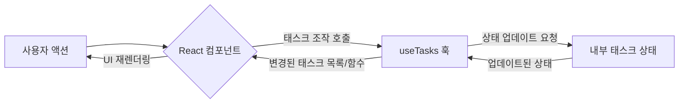

<cite> src/hooks/useTasks.ts </cite>

## 개요

`useTasks` 훅은 애플리케이션 내에서 태스크(할 일) 관련 상태와 로직을 효율적으로 관리하기 위해 설계된 커스텀 React 훅입니다. 이 훅은 태스크 목록을 생성, 조회, 업데이트, 삭제하고 필터링하는 기능을 캡슐화하여, 컴포넌트가 태스크 관리의 복잡성에서 벗어나 UI 렌더링에 집중할 수 있도록 돕습니다. 이를 통해 코드의 재사용성을 높이고 컴포넌트 로직을 간소화합니다.

## 아키텍처 다이어그램

```mermaid
graph TD
    A[React 컴포넌트] --> B{useTasks 훅}
    B -- 관리 --> C[태스크 상태 (useState)]
    B -- 로직 --> D[태스크 조작 함수]
    C -- 제공 --> B
    D -- 제공 --> B
    B -- 반환 --> A
```

## 데이터 흐름 다이어그램



## 의존성 다이어그램

```mermaid
graph TD
    A[useTasks Hook] --> B[React.useState]
    A --> C[React.useMemo]
    A --> D[Unique ID Generator (예: uuid)]
    A --> E[Task Data Structure]
```

## 주요 함수/클래스

*   **`useTasks()`**
    *   **시그니처**: `function useTasks(): { tasks: Task[], addTask: (title: string) => void, updateTask: (id: string, updates: Partial<Task>) => void, deleteTask: (id: string) => void, toggleTaskCompletion: (id: string) => void, filterTasks: (filter: 'all' | 'active' | 'completed') => void, currentFilter: 'all' | 'active' | 'completed', filteredTasks: Task[] }`
    *   **설명**: 태스크 관리 로직을 캡슐화하는 커스텀 훅입니다. 태스크 목록, 태스크 추가, 업데이트, 삭제, 완료 상태 토글, 필터링 기능을 제공합니다. 반환 객체는 현재 태스크 목록 (`tasks`), 현재 적용된 필터 (`currentFilter`), 필터링된 태스크 목록 (`filteredTasks`), 그리고 태스크를 조작하는 여러 함수를 포함합니다.

*   **`addTask(title: string)`**
    *   **시그니처**: `(title: string) => void`
    *   **설명**: 새로운 태스크를 태스크 목록에 추가합니다. `title`은 필수이며, 새로운 태스크는 고유 ID와 함께 `isCompleted: false` 상태로 생성됩니다.

*   **`updateTask(id: string, updates: Partial<Task>)`**
    *   **시그니처**: `(id: string, updates: Partial<Task>) => void`
    *   **설명**: 지정된 ID를 가진 태스크의 속성을 업데이트합니다. `updates` 객체는 `Task` 타입의 부분 집합이 될 수 있으며, 예를 들어 태스크의 제목이나 완료 상태를 변경할 때 사용됩니다.

*   **`deleteTask(id: string)`**
    *   **시그니처**: `(id: string) => void`
    *   **설명**: 지정된 ID를 가진 태스크를 목록에서 제거합니다.

*   **`toggleTaskCompletion(id: string)`**
    *   **시그니처**: `(id: string) => void`
    *   **설명**: 지정된 ID를 가진 태스크의 완료 상태 (`isCompleted`)를 토글합니다. 완료되지 않은 태스크는 완료로, 완료된 태스크는 미완료로 변경됩니다.

*   **`filterTasks(filter: 'all' | 'active' | 'completed')`**
    *   **시그니처**: `(filter: 'all' | 'active' | 'completed') => void`
    *   **설명**: 태스크 목록에 적용할 필터를 설정합니다. 'all'은 모든 태스크, 'active'는 미완료 태스크, 'completed'는 완료된 태스크를 보여주도록 `filteredTasks`를 업데이트합니다.

## 설정/사용법

`useTasks` 훅은 React 함수형 컴포넌트 내에서 호출하여 태스크 관리 기능을 활용할 수 있습니다.

```typescript
// src/hooks/useTasks.ts (예시 구현)
import { useState, useMemo } from 'react';
import { v4 as uuidv4 } from 'uuid'; // 고유 ID 생성을 위한 라이브러리

interface Task {
  id: string;
  title: string;
  isCompleted: boolean;
}

type TaskFilter = 'all' | 'active' | 'completed';

export function useTasks() {
  const [tasks, setTasks] = useState<Task[]>([]);
  const [currentFilter, setCurrentFilter] = useState<TaskFilter>('all');

  const addTask = (title: string) => {
    const newTask: Task = {
      id: uuidv4(),
      title,
      isCompleted: false,
    };
    setTasks((prevTasks) => [...prevTasks, newTask]);
  };

  const updateTask = (id: string, updates: Partial<Task>) => {
    setTasks((prevTasks) =>
      prevTasks.map((task) => (task.id === id ? { ...task, ...updates } : task))
    );
  };

  const deleteTask = (id: string) => {
    setTasks((prevTasks) => prevTasks.filter((task) => task.id !== id));
  };

  const toggleTaskCompletion = (id: string) => {
    setTasks((prevTasks) =>
      prevTasks.map((task) =>
        task.id === id ? { ...task, isCompleted: !task.isCompleted } : task
      )
    );
  };

  const filterTasks = (filter: TaskFilter) => {
    setCurrentFilter(filter);
  };

  const filteredTasks = useMemo(() => {
    switch (currentFilter) {
      case 'active':
        return tasks.filter((task) => !task.isCompleted);
      case 'completed':
        return tasks.filter((task) => task.isCompleted);
      case 'all':
      default:
        return tasks;
    }
  }, [tasks, currentFilter]);

  return {
    tasks,
    addTask,
    updateTask,
    deleteTask,
    toggleTaskCompletion,
    filterTasks,
    currentFilter,
    filteredTasks,
  };
}
```

**사용 예시: 태스크 관리 컴포넌트**

```typescript jsx
import React, { useState } from 'react';
import { useTasks } from './useTasks'; // 실제 파일 경로에 맞게 조정

function TaskManager() {
  const { 
    tasks, 
    addTask, 
    updateTask, 
    deleteTask, 
    toggleTaskCompletion, 
    filterTasks, 
    currentFilter, 
    filteredTasks 
  } = useTasks();
  const [newTaskTitle, setNewTaskTitle] = useState('');

  const handleAddTask = () => {
    if (newTaskTitle.trim()) {
      addTask(newTaskTitle);
      setNewTaskTitle('');
    }
  };

  return (
    <div>
      <h1>태스크 관리자</h1>
      <div>
        <input
          type="text"
          value={newTaskTitle}
          onChange={(e) => setNewTaskTitle(e.target.value)}
          placeholder="새 태스크 추가"
        />
        <button onClick={handleAddTask}>추가</button>
      </div>

      <div>
        <button onClick={() => filterTasks('all')} disabled={currentFilter === 'all'}>모두</button>
        <button onClick={() => filterTasks('active')} disabled={currentFilter === 'active'}>진행 중</button>
        <button onClick={() => filterTasks('completed')} disabled={currentFilter === 'completed'}>완료됨</button>
      </div>

      <ul>
        {filteredTasks.map((task) => (
          <li key={task.id} style={{ textDecoration: task.isCompleted ? 'line-through' : 'none' }}>
            <span onClick={() => toggleTaskCompletion(task.id)} style={{ cursor: 'pointer' }}>
              {task.title}
            </span>
            <button onClick={() => deleteTask(task.id)} style={{ marginLeft: '10px' }}>삭제</button>
          </li>
        ))}
      </ul>
    </div>
  );
}

export default TaskManager;
```

## 문제 해결 가이드

### 1. 태스크 상태 변경이 UI에 반영되지 않거나 예기치 않게 동작하는 경우

*   **원인**: React 상태 업데이트는 불변성(immutability)을 유지해야 합니다. 태스크 객체나 배열을 직접 수정하면 React가 변경을 감지하지 못해 UI 업데이트가 누락될 수 있습니다.
*   **해결책**: `addTask`, `updateTask`, `deleteTask`와 같은 함수 내에서 상태를 업데이트할 때 항상 새로운 배열이나 객체를 생성하여 반환해야 합니다. 예를 들어, `setTasks(prevTasks => [...prevTasks, newTask])` 또는 `setTasks(prevTasks => prevTasks.map(task => task.id === id ? { ...task, ...updates } : task))`와 같이 스프레드 연산자를 사용하세요.

### 2. 태스크 목록이 많아질수록 필터링 또는 렌더링 성능이 저하되는 경우

*   **원인**: 필터링 로직이 매 렌더링마다 불필요하게 재실행되거나, 리스트 렌더링 시 최적화가 부족할 수 있습니다.
*   **해결책**:
    1.  **필터링 최적화**: `useMemo` 훅을 사용하여 `filteredTasks` 계산을 최적화합니다. `tasks`와 `currentFilter`가 변경될 때만 `filteredTasks`를 재계산하도록 합니다. 예시 코드에서 `filteredTasks`에 `useMemo`가 적용되어 있습니다.
    2.  **리스트 렌더링 최적화**: `map` 함수 내에서 각 리스트 아이템에 고유한 `key` prop을 제공해야 합니다. `key`가 없거나 고유하지 않으면 React의 가상 DOM 비교 알고리즘이 비효율적으로 작동하여 불필요한 재렌더링이 발생할 수 있습니다.

### 3. 새로운 태스크 추가 시 ID 충돌이 발생하거나 예측 불가능한 동작을 하는 경우

*   **원인**: 태스크의 고유 ID 생성 로직이 충분히 강건하지 않거나, 중복된 ID를 생성할 가능성이 있습니다.
*   **해결책**: 태스크 ID는 전역적으로 고유해야 합니다. 간단한 카운터나 `Date.now()`만으로는 충분하지 않을 수 있습니다. `uuid`와 같은 라이브러리를 사용하여 강력한 고유 ID를 생성하는 것을 권장합니다. 예시 코드에서는 `uuid` 라이브러리를 사용하고 있습니다.