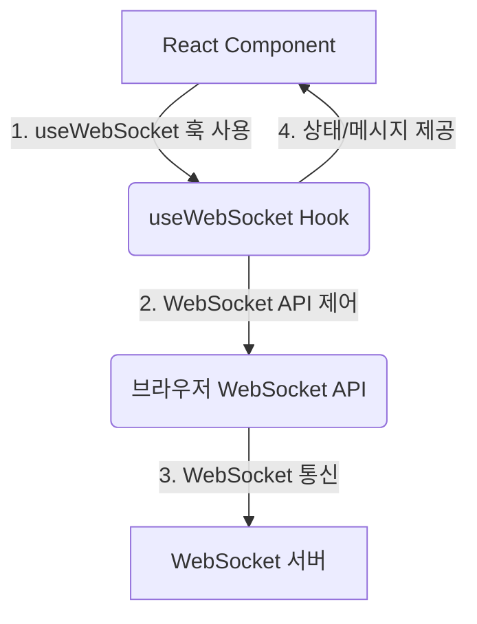
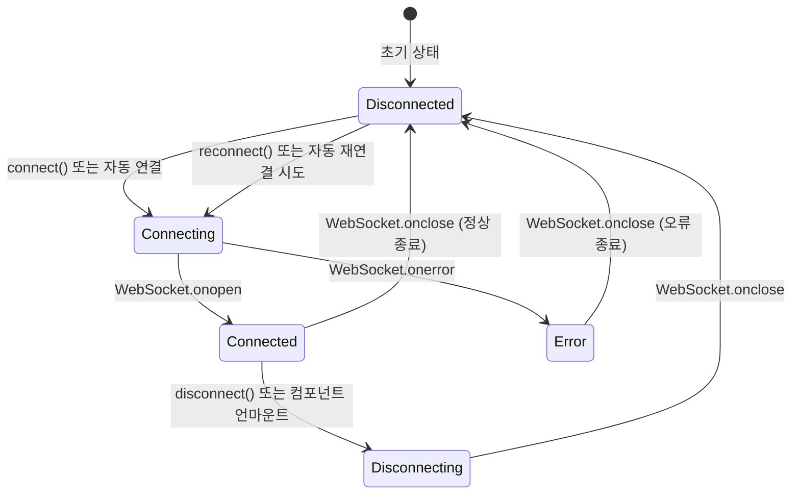

<cite>src/hooks/useWebSocket.ts</cite>

## 개요

`useWebSocket` 훅은 React 컴포넌트 내에서 WebSocket 연결을 손쉽게 관리할 수 있도록 설계되었습니다. 이 훅은 WebSocket 연결 상태, 수신 메시지, 오류 등을 추적하고, 메시지 전송 및 연결/해제 기능을 제공하여 실시간 통신 애플리케이션 개발을 간소화합니다. 컴포넌트의 생명주기에 맞춰 WebSocket 연결을 자동으로 관리하며, 필요에 따라 재연결 로직도 지원합니다.

## 아키텍처 다이어그램



## 데이터 흐름 다이어그램

```mermaid
graph TD
    A[React Component] -->|1. 메시지 전송 요청 (sendMessage)| B(useWebSocket Hook)
    B -->|2. WebSocket.send() 호출| C(WebSocket 연결)
    C -->|3. 메시지 전송| D[WebSocket 서버]
    D -->|4. 메시지 수신| C
    C -->|5. onmessage 이벤트 발생| B
    B -->|6. 수신 메시지 (lastMessage) 업데이트| A
    B -->|7. 연결 상태 (readyState) 및 오류 (error) 업데이트| A
```

## 연결 상태 전이 다이어그램



## 주요 함수 및 타입

### `useWebSocket`

*   **시그니처**: `useWebSocket(url: string, options?: UseWebSocketOptions)`
*   **설명**: 주어진 URL로 WebSocket 연결을 설정하고 관리하는 React 훅입니다. 연결 상태, 마지막 수신 메시지, 오류 객체, 그리고 메시지 전송 및 연결 제어 함수들을 반환합니다.
    *   `url`: 연결할 WebSocket 서버의 URL 문자열입니다 (예: `ws://localhost:8080`).
    *   `options`: 연결 동작을 사용자 정의하기 위한 선택적 객체입니다.

### `UseWebSocketOptions` (타입)

*   **설명**: `useWebSocket` 훅의 동작을 설정하는 데 사용되는 객체 타입입니다.
    *   `manual?: boolean`: `true`로 설정하면 훅이 마운트될 때 자동으로 연결하지 않고, `connect()` 함수를 호출해야 연결됩니다. 기본값은 `false`입니다.
    *   `protocols?: string | string[]`: WebSocket 연결 시 사용할 프로토콜 목록입니다.
    *   `reconnectInterval?: number`: 연결이 끊어졌을 때 재연결을 시도하는 간격(밀리초)입니다. 기본값은 `3000` (3초)입니다.
    *   `reconnectLimit?: number`: 재연결 시도 횟수 제한입니다. 이 횟수를 초과하면 재연결을 더 이상 시도하지 않습니다. 기본값은 `5`입니다.
    *   `onOpen?: (event: Event) => void`: WebSocket 연결이 성공적으로 열렸을 때 호출되는 콜백 함수입니다.
    *   `onClose?: (event: CloseEvent) => void`: WebSocket 연결이 닫혔을 때 호출되는 콜백 함수입니다.
    *   `onMessage?: (event: MessageEvent) => void`: WebSocket으로부터 메시지를 수신했을 때 호출되는 콜백 함수입니다.
    *   `onError?: (event: Event) => void`: WebSocket 연결 중 오류가 발생했을 때 호출되는 콜백 함수입니다.

### 훅 반환 값

`useWebSocket` 훅은 다음 속성들을 포함하는 객체를 반환합니다.

*   `sendMessage(message: string | ArrayBufferLike | Blob | ArrayBuffer)`
    *   **설명**: WebSocket 서버로 메시지를 전송하는 함수입니다. 다양한 타입의 데이터를 전송할 수 있습니다.
*   `lastMessage: MessageEvent | null`
    *   **설명**: WebSocket으로부터 마지막으로 수신된 메시지 `MessageEvent` 객체입니다. 메시지가 없으면 `null`입니다.
*   `readyState: number`
    *   **설명**: 현재 WebSocket 연결 상태를 나타내는 숫자 값입니다.
        *   `WebSocket.CONNECTING` (0): 연결 시도 중
        *   `WebSocket.OPEN` (1): 연결 성공 및 통신 가능
        *   `WebSocket.CLOSING` (2): 연결 종료 중
        *   `WebSocket.CLOSED` (3): 연결 종료됨
*   `error: Event | null`
    *   **설명**: WebSocket 연결 중 발생한 오류 `Event` 객체입니다. 오류가 없으면 `null`입니다.
*   `connect()`
    *   **설명**: `manual` 옵션이 `true`일 때 수동으로 WebSocket 연결을 시작하는 함수입니다.
*   `disconnect()`
    *   **설명**: 현재 WebSocket 연결을 수동으로 종료하는 함수입니다.
*   `reconnect()`
    *   **설명**: 연결이 끊어졌을 때 수동으로 재연결을 시도하는 함수입니다.

## 설정 및 사용법

### 기본 사용 예시

```typescript
import React, { useEffect, useState } from 'react';
import useWebSocket from '../hooks/useWebSocket'; // 경로에 맞게 수정

function ChatComponent() {
  const { sendMessage, lastMessage, readyState, disconnect } = useWebSocket('ws://localhost:8080/chat');
  const [messageInput, setMessageInput] = useState('');

  useEffect(() => {
    if (lastMessage) {
      console.log('새 메시지:', lastMessage.data);
      // 채팅 메시지 목록에 추가하는 로직
    }
  }, [lastMessage]);

  const connectionStatus = {
    0: '연결 중',
    1: '연결됨',
    2: '연결 종료 중',
    3: '연결 종료됨',
  }[readyState];

  const handleSendMessage = () => {
    if (messageInput.trim() && readyState === WebSocket.OPEN) {
      sendMessage(messageInput);
      setMessageInput('');
    }
  };

  return (
    <div>
      <h3>WebSocket Chat ({connectionStatus})</h3>
      <input
        type="text"
        value={messageInput}
        onChange={(e) => setMessageInput(e.target.value)}
        placeholder="메시지를 입력하세요"
        disabled={readyState !== WebSocket.OPEN}
      />
      <button onClick={handleSendMessage} disabled={readyState !== WebSocket.OPEN}>
        전송
      </button>
      <button onClick={disconnect} disabled={readyState === WebSocket.CLOSED}>
        연결 해제
      </button>
      <div>
        <h4>수신 메시지:</h4>
        <p>{lastMessage ? lastMessage.data : '메시지 없음'}</p>
      </div>
    </div>
  );
}

export default ChatComponent;
```

### 고급 설정 예시 (수동 연결 및 재연결 제한)

```typescript
import React from 'react';
import useWebSocket from '../hooks/useWebSocket'; // 경로에 맞게 수정

function ManualConnectionComponent() {
  const {
    sendMessage,
    lastMessage,
    readyState,
    error,
    connect,
    disconnect,
    reconnect,
  } = useWebSocket('wss://echo.websocket.events', {
    manual: true, // 수동 연결
    reconnectLimit: 3, // 재연결 3회 제한
    reconnectInterval: 5000, // 5초마다 재연결 시도
    onOpen: () => console.log('WebSocket 연결이 열렸습니다.'),
    onClose: (event) => console.log('WebSocket 연결이 닫혔습니다:', event.code, event.reason),
    onError: (event) => console.error('WebSocket 오류 발생:', event),
  });

  const connectionStatus = {
    0: '연결 중',
    1: '연결됨',
    2: '연결 종료 중',
    3: '연결 종료됨',
  }[readyState];

  return (
    <div>
      <h3>수동 WebSocket 연결 예시</h3>
      <p>상태: {connectionStatus}</p>
      {error && <p style={{ color: 'red' }}>오류: {error.type}</p>}
      <button onClick={connect} disabled={readyState === WebSocket.OPEN || readyState === WebSocket.CONNECTING}>
        연결 시작
      </button>
      <button onClick={disconnect} disabled={readyState !== WebSocket.OPEN}>
        연결 종료
      </button>
      <button onClick={reconnect} disabled={readyState === WebSocket.OPEN || readyState === WebSocket.CONNECTING}>
        재연결
      </button>
      <button onClick={() => sendMessage('Hello from Manual!')} disabled={readyState !== WebSocket.OPEN}>
        메시지 전송
      </button>
      <p>마지막 수신 메시지: {lastMessage?.data || '없음'}</p>
    </div>
  );
}

export default ManualConnectionComponent;
```

## 문제 해결 가이드

### 1. WebSocket 연결 실패 또는 `readyState`가 `OPEN`이 아님

*   **문제**: 훅이 `CONNECTING` 상태에 머물거나 `CLOSED` 상태로 빠르게 전환되며 메시지를 주고받을 수 없습니다.
*   **해결책**:
    *   **URL 확인**: WebSocket 서버 URL(`ws://` 또는 `wss://`)이 올바른지, 포트 번호가 정확한지 확인하세요.
    *   **서버 실행 여부**: 연결하려는 WebSocket 서버가 정상적으로 실행 중인지 확인하세요. 서버 로그를 확인하여 연결 시도가 수신되는지 보세요.
    *   **방화벽/네트워크**: 클라이언트와 서버 간의 방화벽 또는 네트워크 설정이 WebSocket 통신을 차단하고 있지 않은지 확인하세요.
    *   **프로토콜 불일치**: `options.protocols`를 사용하는 경우, 서버가 해당 프로토콜을 지원하는지 확인하세요.

### 2. 메시지 전송은 되지만 수신이 안 됨 (`lastMessage`가 업데이트되지 않음)

*   **문제**: `sendMessage`를 호출하면 오류 없이 실행되지만, `lastMessage`는 업데이트되지 않고 서버로부터 아무런 응답도 받지 못합니다.
*   **해결책**:
    *   **서버 로직 확인**: WebSocket 서버가 클라이언트로부터 메시지를 수신했을 때 적절히 처리하고 응답 메시지를 다시 클라이언트로 전송하는 로직이 구현되어 있는지 확인하세요.
    *   **메시지 포맷**: 서버가 특정 메시지 포맷을 기대하는 경우, `sendMessage`로 전송하는 메시지의 포맷이 서버의 요구사항과 일치하는지 확인하세요.
    *   **브라우저 개발자 도구**: 네트워크 탭에서 WebSocket 연결을 확인하고, 주고받는 프레임을 검사하여 메시지가 실제로 오가는지 확인하세요.

### 3. 재연결 시도가 작동하지 않거나 너무 빨리 중단됨

*   **문제**: 네트워크 문제 등으로 연결이 끊겼을 때 재연결이 시도되지 않거나, 설정한 횟수보다 적게 시도된 후 재연결을 멈춥니다.
*   **해결책**:
    *   **`reconnectLimit` 확인**: `options.reconnectLimit` 값이 너무 작게 설정되어 있지 않은지 확인하세요. 기본값은 5회입니다.
    *   **`reconnectInterval` 확인**: `options.reconnectInterval` 값이 적절한지 확인하세요. 너무 짧으면 서버 과부하를 유발할 수 있으며, 너무 길면 연결 복구가 느려집니다.
    *   **서버 측 강제 종료**: 서버가 클라이언트 연결을 강제로 종료하는 경우 (예: 인증 실패, 타임아웃), 이는 클라이언트의 재연결 시도와 별개로 발생할 수 있습니다. 서버 로그를 확인하여 연결이 왜 종료되는지 파악해야 합니다.
    *   **네트워크 불안정**: 클라이언트의 네트워크 환경이 매우 불안정하면, 재연결 시도 자체가 성공하기 어려울 수 있습니다.