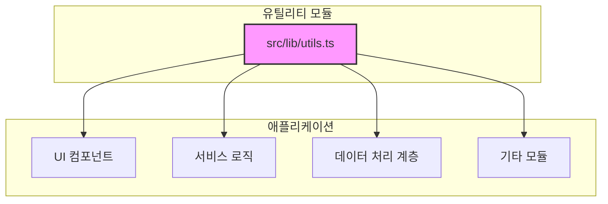
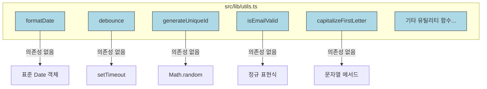

<cite>src/lib/utils.ts</cite>

## 개요

`src/lib/utils.ts` 파일은 애플리케이션 전반에 걸쳐 재사용 가능한 범용 유틸리티 함수들을 모아둔 라이브러리입니다. 특정 도메인에 종속되지 않고, 다양한 컴포넌트, 서비스, 페이지에서 공통적으로 필요한 데이터 처리, 형식 변환, 헬퍼 기능을 제공하여 코드의 중복을 줄이고 유지보수성을 향상시키는 것을 목적으로 합니다. 이 유틸리티 컬렉션은 개발 효율성을 높이고 일관된 동작을 보장하는 핵심적인 역할을 수행합니다.

## Mermaid 다이어그램

### 1. 유틸리티 모듈 의존성 개요



### 2. 유틸리티 함수 호출 흐름 예시 (날짜 포맷팅)

```mermaid
graph LR
    A[날짜 데이터 (Date | string)] --> B{formatDate 함수 호출}
    B -- 포맷 문자열 전달 --> C[formatDate(date, format)]
    C -- 날짜 파싱 및 변환 --> D[포맷된 날짜 문자열 반환]
    D --> E[UI 표시 또는 다른 로직에 사용]
```

### 3. 유틸리티 함수 내부 구조 (개념적)



## 주요 함수

`src/lib/utils.ts`에 포함될 수 있는 주요 함수들은 다음과 같습니다.

### `formatDate`

*   **시그니처:** `formatDate(date: Date | string, format: string = 'YYYY-MM-DD'): string`
*   **설명:** 주어진 날짜를 지정된 형식의 문자열로 변환합니다. `date` 인수는 `Date` 객체 또는 날짜 문자열이 될 수 있으며, `format` 인수는 'YYYY', 'MM', 'DD', 'HH', 'mm', 'ss' 등을 포함하는 포맷 문자열입니다. 기본 포맷은 'YYYY-MM-DD'입니다.

### `debounce`

*   **시그니처:** `debounce<T extends (...args: any[]) => void>(func: T, delay: number): T`
*   **설명:** 특정 함수가 너무 자주 호출되는 것을 방지하기 위해 사용됩니다. `delay` 밀리초 내에 다시 호출되지 않을 때만 `func`를 실행합니다. 주로 검색 입력 필드나 창 크기 조정과 같은 이벤트 핸들러에 유용합니다.

### `generateUniqueId`

*   **시그니처:** `generateUniqueId(): string`
*   **설명:** 전역적으로 고유한 식별자(UUID 또는 유사한 형태)를 생성하여 반환합니다. 클라이언트 측에서 임시로 고유한 키가 필요할 때 유용하며, 충돌 가능성이 매우 낮습니다.

### `isEmailValid`

*   **시그니처:** `isEmailValid(email: string): boolean`
*   **설명:** 주어진 문자열이 유효한 이메일 주소 형식인지 정규 표현식을 사용하여 검사합니다. 간단한 클라이언트 측 유효성 검사에 사용됩니다.

### `capitalizeFirstLetter`

*   **시그니처:** `capitalizeFirstLetter(str: string): string`
*   **설명:** 주어진 문자열의 첫 글자를 대문자로 변환하고 나머지 글자는 그대로 유지합니다. 빈 문자열이나 null/undefined 입력에 대한 안전 처리가 포함됩니다.

## 설정/사용법

`utils` 함수들은 별도의 설정 없이 바로 임포트하여 사용할 수 있습니다.

### 예시 1: 날짜 포맷팅 및 이메일 유효성 검사

```typescript
// src/components/UserProfile.ts
import { formatDate, isEmailValid } from '../lib/utils';

interface User {
  name: string;
  email: string;
  createdAt: Date;
}

function displayUserInfo(user: User): string {
  const formattedDate = formatDate(user.createdAt, 'YYYY년 MM월 DD일 HH시 mm분');
  const emailStatus = isEmailValid(user.email) ? '유효함' : '유효하지 않음';

  return `
    사용자 이름: ${user.name}
    이메일: ${user.email} (${emailStatus})
    가입일: ${formattedDate}
  `;
}

const newUser: User = {
  name: "김철수",
  email: "chulsoo@example.com",
  createdAt: new Date()
};

console.log(displayUserInfo(newUser));

const invalidUser: User = {
  name: "이영희",
  email: "younghee@invalid",
  createdAt: new Date()
};

console.log(displayUserInfo(invalidUser));
```

### 예시 2: 디바운스 적용된 검색 입력 필드

```typescript
// src/pages/SearchPage.ts
import { debounce } from '../lib/utils';

function performSearch(query: string) {
  console.log(`검색 실행: ${query}`);
  // 실제 API 호출 로직 ...
}

// 500ms 디바운스가 적용된 검색 함수
const debouncedSearch = debounce(performSearch, 500);

// 이벤트 리스너 시뮬레이션
const searchInput = document.getElementById('search-input');
if (searchInput) {
  searchInput.addEventListener('input', (event) => {
    const query = (event.target as HTMLInputElement).value;
    debouncedSearch(query);
  });
} else {
    // 예시를 위한 직접 호출
    console.log("--- 디바운스 검색 시뮬레이션 ---");
    debouncedSearch("apple");
    debouncedSearch("appl");
    debouncedSearch("app"); // 500ms 안에 호출되면 이전 호출은 무시됨
    setTimeout(() => debouncedSearch("apple"), 600); // 500ms 이후이므로 실행
    setTimeout(() => debouncedSearch("banana"), 700); // 이전 "apple"은 500ms 내에 실행되지 않았으므로 "apple"이 실행되고, 이 호출은 무시됨
    setTimeout(() => debouncedSearch("orange"), 1300); // "banana" 호출 후 500ms가 지났으므로 실행
}
```

## 문제 해결 가이드

### 1. 유틸리티 함수를 찾을 수 없거나 임포트 오류 발생

*   **문제:** `Module not found` 또는 `Cannot find name 'functionName'` 오류가 발생합니다.
*   **원인:** 잘못된 임포트 경로, 오타, 또는 함수가 `export` 되지 않았을 수 있습니다.
*   **해결책:**
    *   `import { functionName } from '../lib/utils';`와 같이 올바른 상대 경로를 사용했는지 확인합니다.
    *   `src/lib/utils.ts` 파일에서 해당 함수가 `export` 키워드를 사용하여 내보내지고 있는지 확인합니다. (예: `export function functionName(...)`)
    *   함수 이름에 오타가 없는지 확인합니다.

### 2. `debounce` 함수가 예상대로 작동하지 않음

*   **문제:** 디바운스된 함수가 너무 자주 호출되거나, 전혀 호출되지 않거나, `this` 컨텍스트 문제가 발생합니다.
*   **원인:** `delay` 값이 너무 짧거나 길게 설정되었거나, `debounce`로 감싼 함수가 `this` 컨텍스트에 의존하지만 바인딩되지 않았을 수 있습니다.
*   **해결책:**
    *   `delay` 값을 적절히 조정해봅니다. 일반적으로 사용자 입력의 경우 300ms ~ 1000ms 사이가 적당합니다.
    *   디바운스된 함수 내에서 `this` 컨텍스트가 필요한 경우, 원래 함수를 바인딩하거나(예: `debounce(myFunction.bind(this), delay)`) 화살표 함수를 사용하여 `this`를 캡처합니다.

### 3. `formatDate` 결과가 올바르지 않거나 오류 발생

*   **문제:** 날짜가 잘못된 형식으로 출력되거나, `Invalid Date` 오류가 발생합니다.
*   **원인:** `date` 인수로 전달된 값이 유효한 `Date` 객체나 파싱 가능한 문자열이 아니거나, `format` 문자열이 함수에서 지원하지 않는 형식을 포함할 수 있습니다.
*   **해결책:**
    *   `formatDate`에 전달하는 `date` 인수가 실제 `Date` 객체이거나, `new Date('YYYY-MM-DD')`와 같이 `Date` 생성자가 성공적으로 파싱할 수 있는 문자열 형식인지 확인합니다.
    *   `format` 문자열이 'YYYY', 'MM', 'DD', 'HH', 'mm', 'ss'와 같이 예상되는 패턴을 따르는지 확인합니다. 사용자 정의 포맷 문자열이 복잡하다면, 날짜 라이브러리(예: `date-fns`, `moment.js`) 사용을 고려할 수 있습니다.