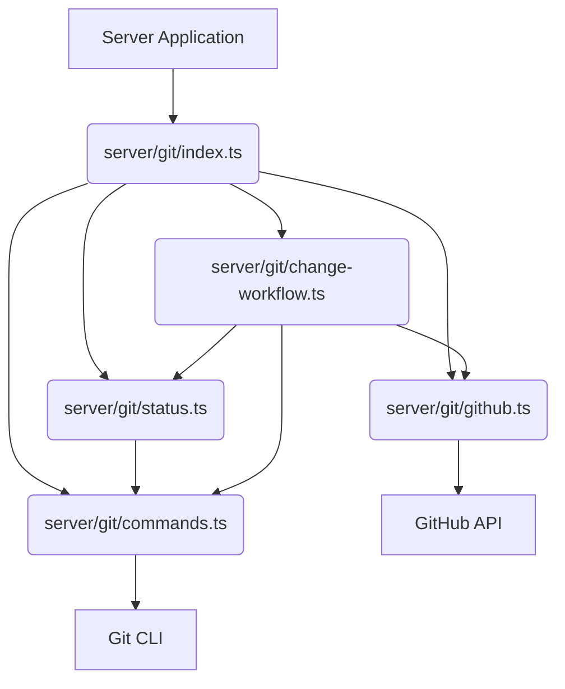
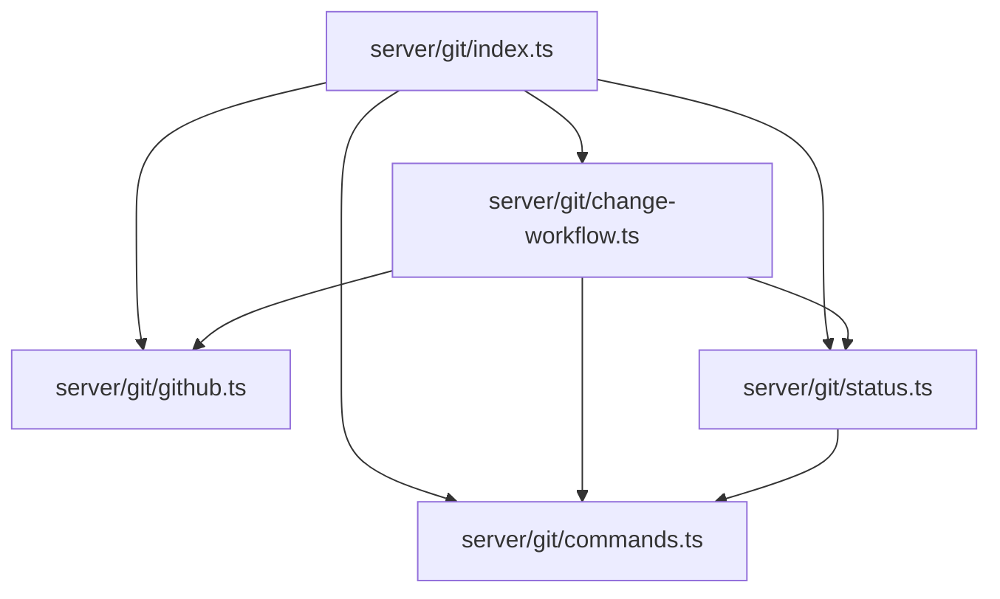

<cite>server/git/change-workflow.ts</cite>
<cite>server/git/commands.ts</cite>
<cite>server/git/github.ts</cite>
<cite>server/git/index.ts</cite>
<cite>server/git/status.ts</cite>

### 개요
`server/git` 모듈은 서버 환경에서 Git 저장소 및 GitHub 관련 작업을 자동화하고 관리하기 위해 설계되었습니다. 이 모듈은 Git 명령어 실행, GitHub API 연동, 저장소 상태 추적 및 변경 워크플로우 제어 기능을 제공합니다. 이를 통해 서버 애플리케이션이 코드 변경, 배포, CI/CD 파이프라인 등 다양한 Git 기반 프로세스를 효율적으로 처리할 수 있도록 지원합니다.

### 아키텍처 및 데이터 흐름

#### 1. 모듈 아키텍처


#### 2. 변경 워크플로우 (PR 생성)
```mermaid
graph LR
    A[Server App Action] --> B{initiateChangeWorkflow}
    B --&gt; C[Create New Branch & Checkout]
    C --&gt; D[Apply Local Changes]
    D --&gt; E[Add & Commit Changes]
    E --&gt; F[Push Branch to Remote]
    F --&gt; G{createPullRequest}
    G --&gt; H[GitHub API]
    H --&gt; I[PR Created]
    G --&gt; J[Update PR Status]
    C & D & E & F --&gt; K[commands.ts]
    G & J --&gt; L[github.ts]
    J --&gt; M[status.ts]
```

#### 3. 내부 모듈 의존성


### 주요 함수 및 클래스

*   **`GitService` (클래스, `server/git/index.ts` 또는 유사):**
    *   `constructor(repoPath: string)`
        *   설명: 특정 Git 저장소 경로를 기반으로 Git 작업을 수행하기 위한 서비스 인스턴스를 생성합니다.
    *   `initializeRepository(): Promise<void>`
        *   설명: 지정된 경로에 Git 저장소를 초기화하거나 기존 저장소를 준비합니다.

*   **`executeGitCommand(args: string[], cwd?: string): Promise<string>` (`server/git/commands.ts`):**
    *   설명: 주어진 인수로 Git CLI 명령어를 실행하고, 표준 출력 결과를 반환합니다. `cwd`를 통해 실행 디렉토리를 지정할 수 있습니다.

*   **`gitClone(repoUrl: string, targetPath: string): Promise<string>` (`server/git/commands.ts`):**
    *   설명: 원격 Git 저장소를 지정된 경로에 클론합니다.

*   **`gitPull(repoPath: string, branch?: string): Promise<string>` (`server/git/commands.ts`):**
    *   설명: 지정된 저장소 경로에서 원격 변경 사항을 가져와 병합합니다. 특정 브랜치를 지정할 수 있습니다.

*   **`gitCommit(repoPath: string, message: string, files?: string[]): Promise<string>` (`server/git/commands.ts`):**
    *   설명: 지정된 저장소 경로에서 변경 사항을 커밋합니다. 커밋 메시지와 커밋할 파일을 지정할 수 있습니다.

*   **`createPullRequest(owner: string, repo: string, head: string, base: string, title: string, body: string): Promise<{ url: string; number: number }>` (`server/git/github.ts`):**
    *   설명: GitHub API를 사용하여 지정된 저장소에 Pull Request를 생성합니다. PR의 소스 브랜치(head), 대상 브랜치(base), 제목 및 내용을 지정합니다.

*   **`getPullRequestStatus(owner: string, repo: string, prNumber: number): Promise<string>` (`server/git/github.ts`):**
    *   설명: 특정 Pull Request의 현재 상태(예: open, closed, merged)를 GitHub API를 통해 조회합니다.

*   **`getRepositoryStatus(repoPath: string): Promise<{ isClean: boolean; changedFiles: string[] }>` (`server/git/status.ts`):**
    *   설명: 지정된 Git 저장소의 현재 상태를 분석하여 변경된 파일 목록과 작업 디렉토리의 청결 여부를 반환합니다.

*   **`updateCommitStatus(owner: string, repo: string, sha: string, state: 'pending' | 'success' | 'failure' | 'error', description: string, context: string, target_url?: string): Promise<void>` (`server/git/status.ts`):**
    *   설명: 특정 커밋에 대한 GitHub 상태(Status API)를 업데이트합니다. CI/CD 결과 등을 표시하는 데 사용됩니다.

*   **`initiateChangeWorkflow(repoPath: string, sourceBranch: string, targetBranch: string, prTitle: string, prBody: string, changes: Array<{ filePath: string; content: string }>): Promise<string>` (`server/git/change-workflow.ts`):**
    *   설명: 서버에서 특정 변경 사항을 적용하고, 새로운 브랜치를 생성, 커밋, 푸시한 다음 Pull Request를 생성하는 전체 워크플로우를 시작합니다.

### 설정 및 사용법

#### 1. 설정
GitHub API와 연동하려면 GitHub Personal Access Token이 필요합니다. 이 토큰은 환경 변수로 관리하는 것이 안전합니다.
```typescript
// server/config/git.ts (예시)
export const GITHUB_CONFIG = {
  token: process.env.GITHUB_TOKEN || 'YOUR_DEFAULT_GITHUB_TOKEN', // 실제 환경에서는 반드시 환경 변수 사용
  owner: process.env.GITHUB_REPO_OWNER || 'your-organization',
  repo: process.env.GITHUB_REPO_NAME || 'your-repository',
};

// Git 사용자 정보 설정 (커밋 시 필요)
export const GIT_USER_CONFIG = {
  name: "Server Automation Bot",
  email: "bot@example.com",
};
```
Git 명령어 실행 시 `commands.ts` 내부에서 `GIT_USER_CONFIG`를 사용하여 사용자 정보를 설정할 수 있습니다.

#### 2. 사용법 (새로운 파일 추가 및 PR 생성)
```typescript
import { initiateChangeWorkflow } from './change-workflow'; // change-workflow 모듈 가져오기
import * as path from 'path';
import * as fs from 'fs';
import { GITHUB_CONFIG } from '../config/git'; // 위에서 정의한 설정 파일 가정

const REPO_LOCAL_PATH = '/tmp/my-server-repo'; // 서버에 클론된 저장소의 로컬 경로

async function runAutomatedFileAddition() {
  const newBranchName = `feature/auto-add-${Date.now()}`;
  const newFilePath = 'docs/new-automated-doc.md';
  const newFileContent = `# 자동 생성 문서\n\n이 문서는 서버 자동화 프로세스에 의해 생성되었습니다.`;

  console.log(`로컬 저장소 경로: ${REPO_LOCAL_PATH}`);

  // 1. 저장소 존재 여부 확인 및 초기 설정 (예시, 실제로는 clone/pull 로직 필요)
  if (!fs.existsSync(REPO_LOCAL_PATH)) {
    console.error(`오류: 저장소 경로 "${REPO_LOCAL_PATH}"가 존재하지 않습니다. 먼저 Git 저장소를 클론해주세요.`);
    // 예: await gitClone(`https://github.com/${GITHUB_CONFIG.owner}/${GITHUB_CONFIG.repo}.git`, REPO_LOCAL_PATH);
    return;
  }

  // 2. 변경 워크플로우 실행
  try {
    const prUrl = await initiateChangeWorkflow(
      REPO_LOCAL_PATH,
      newBranchName,
      'main', // 대상 브랜치
      `feat: Add automated documentation (${newBranchName})`,
      `이 Pull Request는 서버 자동화 봇에 의해 생성된 새 문서를 추가합니다.\n\n파일: ${newFilePath}`,
      [{ filePath: newFilePath, content: newFileContent }]
    );
    console.log(`Pull Request가 성공적으로 생성되었습니다: ${prUrl}`);
  } catch (error) {
    console.error('자동화된 변경 워크플로우 실행 중 오류 발생:', error);
  }
}

// 스크립트 실행
runAutomatedFileAddition();
```

### 문제 해결 가이드

#### 1. Git 명령어 실행 실패 (예: `git: command not found` 또는 `fatal: ...`)
*   **문제:** Git CLI가 서버 환경에 설치되어 있지 않거나, 실행 경로(`PATH`)에 포함되어 있지 않은 경우 발생합니다. 잘못된 저장소 경로를 지정했을 때도 발생할 수 있습니다.
*   **해결책:**
    1.  서버에 Git이 설치되어 있는지 확인합니다 (`git --version`).
    2.  Git 실행 파일의 경로가 시스템의 `PATH` 환경 변수에 포함되어 있는지 확인합니다.
    3.  `executeGitCommand` 함수 호출 시 `cwd` (current working directory) 인수가 올바른 Git 저장소 경로를 가리키는지 확인합니다.

#### 2. GitHub API 인증 실패 (예: `Bad credentials` 또는 `Resource not accessible by integration`)
*   **문제:** GitHub Personal Access Token이 잘못되었거나, 만료되었거나, 필요한 권한(scopes)을 가지고 있지 않은 경우 발생합니다.
*   **해결책:**
    1.  사용 중인 GitHub 토큰이 유효한지 GitHub 설정에서 확인합니다.
    2.  토큰에 저장소(repo)에 대한 읽기/쓰기 권한(예: `repo` scope)이 부여되어 있는지 확인합니다. Pull Request 생성, 상태 업데이트 등에는 해당 권한이 필요합니다.
    3.  환경 변수(`process.env.GITHUB_TOKEN`)가 올바르게 설정되었는지 확인하고, 애플리케이션이 이 값을 제대로 읽어오는지 디버깅합니다.

#### 3. 병합 충돌 발생
*   **문제:** `initiateChangeWorkflow`를 통해 Pull Request를 생성했지만, 대상 브랜치(`main` 등)에 이미 다른 변경 사항이 있어서 병합 충돌이 발생하는 경우입니다.
*   **해결책:**
    1.  서버에서 자동화된 변경을 푸시하기 전에 대상 브랜치의 최신 상태를 `git pull`로 가져와 자신의 브랜치에 미리 병합(또는 rebase)하는 로직을 추가하여 충돌을 미리 해결하도록 시도할 수 있습니다.
    2.  충돌이 발생한 PR은 수동으로 해결해야 합니다. 서버 측 자동화는 일반적으로 충돌 해결을 직접 수행하지 않으며, 사람의 개입을 요구합니다.
    3.  워크플로우 설계 시, 충돌 가능성을 줄이기 위해 자동화된 변경이 독립적으로 실행되도록 하거나, 자주 업데이트되는 브랜치에 직접 푸시하기보다 PR 검토 단계를 거치도록 합니다.