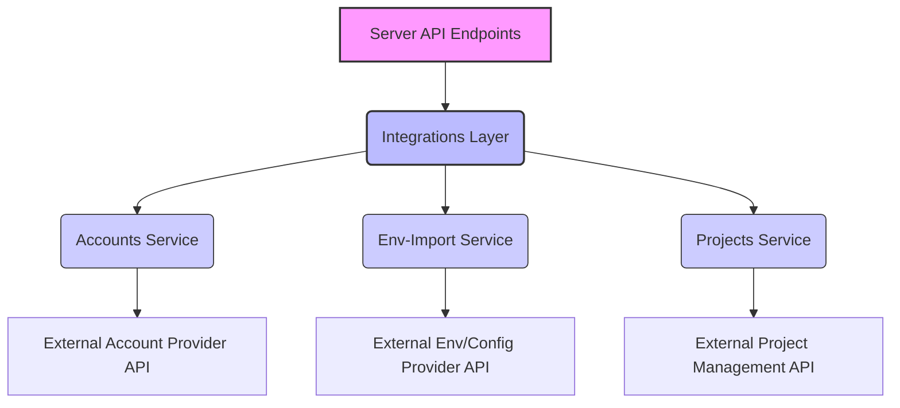
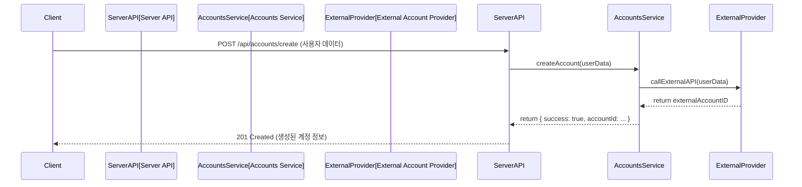
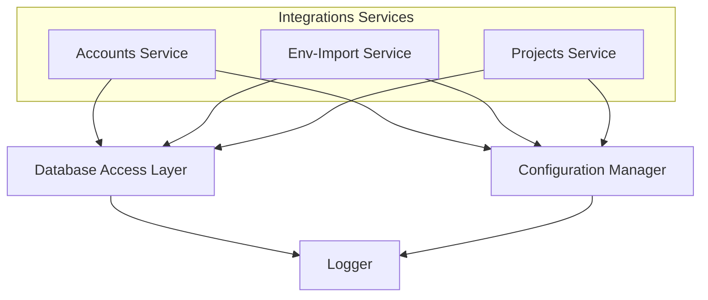

<cite>
server/integrations/services/accounts.ts
server/integrations/services/env-import.ts
server/integrations/services/projects.ts
</cite>

## 개요

`server/integrations/services` 디렉토리는 서버 애플리케이션이 다양한 외부 서비스와 상호작용하기 위한 핵심 통합 로직을 중앙 집중화하는 계층입니다. 이 모듈의 주된 목적은 외부 API 호출의 복잡성을 캡슐화하고, 데이터 변환 및 오류 처리 메커니즘을 표준화하여 서버의 나머지 부분에 일관된 인터페이스를 제공하는 것입니다. 이를 통해 API 컨트롤러나 비즈니스 로직 계층은 외부 서비스의 세부 구현에 대한 의존성을 줄이고, 더 높은 수준의 추상화를 통해 기능을 활용할 수 있게 됩니다.

각 파일은 특정 도메인 또는 외부 서비스와의 통합을 담당하며, 본 문서에서 다루는 `accounts.ts`, `env-import.ts`, `projects.ts`는 각각 사용자 계정 관리, 환경 변수 가져오기, 프로젝트 관리와 관련된 외부 연동 기능을 제공합니다. 이 서비스 계층은 서버의 안정성과 유지보수성을 향상시키는 데 중요한 역할을 합니다.

## 아키텍처 다이어그램

`integrations/services` 계층은 서버 API 엔드포인트와 실제 외부 서비스 API 사이에 위치하여 중개자 역할을 수행합니다.



## 데이터 흐름 예시: 계정 생성

클라이언트의 요청이 서버 API를 거쳐 Accounts Service를 통해 외부 계정 제공자 API로 전달되고, 그 결과가 다시 클라이언트에게 반환되는 과정입니다.



## 의존성 다이어그램

`integrations/services` 내의 서비스들은 공통적으로 데이터베이스 접근 계층, 설정 관리자, 로거와 같은 서버의 내부 유틸리티 및 계층에 의존합니다.



## 주요 함수 및 클래스

### `server/integrations/services/accounts.ts`

이 파일은 외부 계정 관리 서비스와의 통합을 담당하며, 사용자 계정의 생성, 조회, 업데이트와 같은 기능을 제공합니다.

*   **`createAccount(userData: AccountCreationData): Promise<Account>`**
    *   **설명**: 새로운 사용자 계정을 외부 계정 공급자에게 생성하고, 성공 시 생성된 계정 정보를 반환합니다. `userData`는 이름, 이메일, 비밀번호 등 계정 생성에 필요한 정보를 포함합니다. 이 함수는 외부 API 호출의 성공 또는 실패를 처리합니다.
*   **`getAccountDetails(accountId: string): Promise<AccountDetails>`**
    *   **설명**: 특정 `accountId`에 해당하는 계정의 상세 정보를 외부 서비스로부터 조회하여 반환합니다. 계정이 존재하지 않거나 접근 권한이 없을 경우 적절한 오류를 발생시킵니다.
*   **`updateAccount(accountId: string, updateData: AccountUpdateData): Promise<Account>`**
    *   **설명**: 특정 `accountId`의 계정 정보를 `updateData`에 따라 업데이트합니다. 업데이트된 계정 정보를 반환하며, 부분 업데이트(partial update)를 지원할 수 있습니다.

### `server/integrations/services/env-import.ts`

이 파일은 외부 소스(예: Git 저장소, 클라우드 환경)로부터 환경 변수를 가져오는 기능을 관리합니다.

*   **`importEnvironmentVariables(projectId: string, source: EnvSource, config: EnvImportConfig): Promise<EnvImportResult>`**
    *   **설명**: 지정된 `projectId`에 대해 외부 `source` (예: GitHub, GitLab)에서 환경 변수를 가져옵니다. `config`는 가져오기 방식(예: 브랜치, 파일 경로)을 정의하며, 가져온 변수와 작업 상태를 포함하는 결과를 반환합니다.
*   **`getImportHistory(projectId: string): Promise<EnvImportLog[]>`**
    *   **설명**: 특정 `projectId`에 대한 환경 변수 가져오기 작업의 이력을 조회하여 반환합니다. 각 로그 항목은 가져오기 시간, 성공 여부, 가져온 변수 수, 발생한 문제 등의 정보를 포함합니다.

### `server/integrations/services/projects.ts`

이 파일은 외부 프로젝트 관리 시스템과의 연동을 담당하며, 프로젝트 생성, 조회, 목록화 기능을 제공합니다.

*   **`createProject(projectData: ProjectCreationData): Promise<Project>`**
    *   **설명**: 새로운 프로젝트를 외부 프로젝트 관리 시스템에 생성하고, 성공 시 생성된 프로젝트 객체를 반환합니다. `projectData`에는 프로젝트 이름, 설명, 소유자 ID 등이 포함됩니다.
*   **`getProjectById(projectId: string): Promise<Project>`**
    *   **설명**: 주어진 `projectId`에 해당하는 프로젝트의 상세 정보를 외부 서비스로부터 조회하여 반환합니다. 프로젝트가 존재하지 않으면 오류를 발생시킵니다.
*   **`listProjects(userId: string): Promise<Project[]>`**
    *   **설명**: 특정 `userId`가 접근 가능한 모든 프로젝트 목록을 외부 서비스로부터 조회하여 반환합니다. 이 함수는 페이징 또는 필터링 옵션을 추가로 받을 수 있습니다.

## 설정 및 사용법

`integrations/services` 모듈은 서버의 API 핸들러나 다른 비즈니스 로직 계층에서 직접 호출하여 사용됩니다. 외부 서비스와의 인증 정보 및 엔드포인트는 일반적으로 서버의 환경 변수나 설정 파일을 통해 관리됩니다.

### 예시 1: 새로운 계정 생성

```typescript
// server/api/controllers/accountController.ts (가상의 컨트롤러 파일)
import { Request, Response } from 'express';
import { createAccount } from '../../integrations/services/accounts';
import { AccountCreationData } from '../../types/account'; // 가상의 타입 정의

export const createNewAccount = async (req: Request, res: Response) => {
    try {
        const userData: AccountCreationData = req.body;
        // 서비스 계층을 통해 계정 생성 로직 호출
        const newAccount = await createAccount(userData);
        res.status(201).json({ message: '계정이 성공적으로 생성되었습니다.', account: newAccount });
    } catch (error) {
        console.error('계정 생성 실패:', error);
        // 에러 유형에 따라 더 세분화된 응답을 제공할 수 있습니다.
        res.status(500).json({ message: '계정 생성 중 오류가 발생했습니다.', error: error.message });
    }
};
```

### 예시 2: 프로젝트 환경 변수 가져오기

```typescript
// server/api/controllers/projectController.ts (가상의 컨트롤러 파일)
import { Request, Response } from 'express';
import { importEnvironmentVariables } from '../../integrations/services/env-import';
import { EnvSource, EnvImportConfig } from '../../types/env'; // 가상의 타입 정의

export const importProjectEnv = async (req: Request, res: Response) => {
    try {
        const { projectId, source, config } = req.body; // 클라이언트로부터 받은 데이터
        if (!projectId || !source || !config) {
            return res.status(400).json({ message: '필수 요청 매개변수가 누락되었습니다.' });
        }

        // 서비스 계층을 통해 환경 변수 가져오기 로직 호출
        const importResult = await importEnvironmentVariables(
            projectId as string,
            source as EnvSource,
            config as EnvImportConfig
        );
        res.status(200).json({ message: '환경 변수 가져오기 작업이 완료되었습니다.', result: importResult });
    } catch (error) {
        console.error('환경 변수 가져오기 실패:', error);
        // 외부 서비스 API 오류 등 특정 에러에 대한 분기 처리가 필요할 수 있습니다.
        res.status(500).json({ message: '환경 변수 가져오기 중 오류가 발생했습니다.', error: error.message });
    }
};
```

## 문제 해결 가이드

### 1. 외부 API 연결 문제 (타임아웃, 인증 실패)

*   **증상**: API 요청 시 "Failed to connect to external API", "Authentication failed", "Request timed out", "Network Error" 등의 오류 메시지가 발생합니다. HTTP 상태 코드 401 (Unauthorized), 403 (Forbidden) 또는 504 (Gateway Timeout) 등이 관찰될 수 있습니다.
*   **원인**:
    *   **잘못된 자격 증명**: API 키, 비밀 토큰, OAuth 토큰 등 외부 서비스 인증에 사용되는 자격 증명이 유효하지 않거나 만료되었습니다.
    *   **잘못된 엔드포인트**: 외부 서비스의 API 엔드포인트 URL이 잘못 구성되었거나, 서비스가 업데이트되어 URL이 변경되었을 수 있습니다.
    *   **네트워크 또는 방화벽 문제**: 서버가 외부 서비스의 IP 주소 또는 도메인에 접근하지 못하도록 네트워크 정책이나 방화벽이 차단하고 있을 수 있습니다.
    *   **외부 서비스 중단**: 통합하려는 외부 서비스 자체가 일시적으로 다운되었거나 유지보수 중일 수 있습니다.
*   **해결책**:
    *   `server/integrations/services` 내에서 사용되는 API 키 및 토큰이 환경 변수나 설정 파일을 통해 올바르게 로드되고 있는지 확인합니다. 보안상 중요한 정보는 직접 코드에 하드코딩하지 않아야 합니다.
    *   외부 서비스의 공식 문서를 참조하여 API 엔드포인트 URL이 정확한지 다시 확인합니다.
    *   `curl` 또는 `ping` 명령어를 사용하여 서버 환경에서 외부 서비스 엔드포인트에 대한 네트워크 연결을 테스트합니다.
    *   외부 서비스의 상태 페이지나 공지사항을 확인하여 서비스 중단 여부를 파악합니다.
    *   API 호출 시 재시도(retry) 로직과 적절한 타임아웃 설정을 구현하여 일시적인 네트워크 불안정성을 처리할 수 있습니다.

### 2. 데이터 유효성 검사 실패 또는 데이터 불일치

*   **증상**: API 요청은 성공했으나, 외부 서비스에서 "Invalid input data", "Missing required fields", "Data format mismatch"와 같은 응답을 반환하거나, 예상과 다른 데이터가 저장/처리됩니다. HTTP 상태 코드 400 (Bad Request) 등이 흔하게 발생합니다.
*   **원인**:
    *   **클라이언트 입력 오류**: 클라이언트로부터 받은 데이터가 외부 서비스의 API 요구사항(필수 필드 누락, 잘못된 데이터 타입)을 충족하지 못합니다.
    *   **데이터 변환 오류**: `integrations/services` 계층에서 외부 서비스로 전달하기 전에 데이터 변환(매핑) 로직에 오류가 있거나, 외부 서비스의 스펙 변경을 반영하지 못했습니다.
    *   **응답 데이터 파싱 오류**: 외부 서비스가 예상치 못한 형식의 데이터를 반환하여 서버에서 이를 올바르게 파싱하지 못하는 경우.
*   **해결책**:
    *   `createAccount`, `createProject`, `importEnvironmentVariables`와 같은 함수에 전달되는 입력 객체(예: `userData`, `projectData`, `config`)가 외부 서비스의 API 스펙과 정확히 일치하는지 확인합니다.
    *   `integrations/services` 계층 내에서 외부 서비스로 데이터를 보내기 직전과 받은 직후에 데이터를 로그로 출력하여 실제 전송/수신되는 데이터의 형식을 면밀히 검토합니다.
    *   외부 서비스의 API 문서를 면밀히 검토하여 예상되는 요청 및 응답 데이터 스키마를 다시 확인하고, 서버의 타입 정의(TypeScript 인터페이스 등)가 이를 정확하게 반영하는지 검토합니다.
    *   강력한 유효성 검사 라이브러리(예: `zod`, `Joi`)를 사용하여 클라이언트 입력 및 내부 데이터 객체의 유효성을 사전에 검증합니다.

### 3. 외부 서비스의 Rate Limiting (요청 제한)

*   **증상**: 짧은 시간 내에 여러 API 요청을 보냈을 때, "Rate limit exceeded", "Too Many Requests", "API call limit reached" 등의 오류 메시지와 함께 HTTP 상태 코드 429가 반환됩니다.
*   **원인**:
    *   **과도한 요청 빈도**: 서버가 외부 서비스의 허용된 요청 빈도 제한을 초과하여 API를 호출했습니다.
    *   **동시성 문제**: 여러 비동기 작업이 동시에 외부 서비스로 요청을 보내 Rate Limiting에 도달했을 수 있습니다.
*   **해결책**:
    *   **요청 지연 및 재시도**: API 요청 사이에 적절한 지연 시간(delay)을 두거나, 지수 백오프(exponential backoff) 전략을 사용하여 실패한 요청을 자동으로 재시도하도록 구현합니다.
    *   **배치 처리**: 가능하다면, 여러 개의 개별 요청을 하나의 배치(batch) API 호출로 묶어 전송하는 기능을 활용합니다. 이는 요청 수를 줄이는 데 매우 효과적입니다.
    *   **요청 큐 및 스로틀링**: 요청을 큐에 넣어 관리하고, 특정 시간당 처리할 수 있는 요청 수를 제한하는 스로틀링(throttling) 메커니즘을 `integrations/services` 계층에 구현합니다.
    *   **API 사용량 증대**: 외부 서비스의 Rate Limiting 정책을 이해하고, 필요한 경우 더 높은 API 사용량을 제공하는 유료 플랜으로 업그레이드하는 것을 고려합니다.
    *   **캐싱**: 자주 변경되지 않는 데이터를 캐싱하여 외부 API 호출 횟수를 줄입니다.