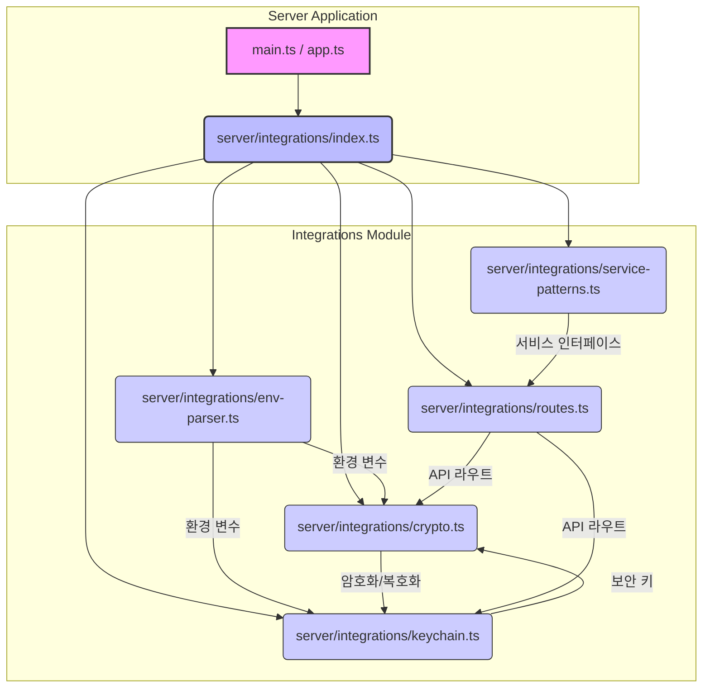
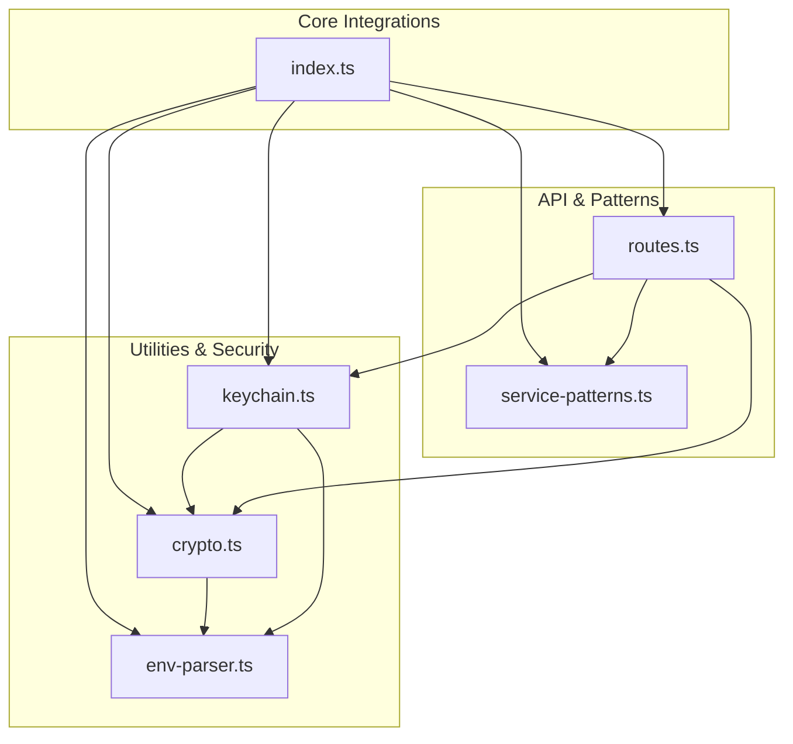

<cite>server/integrations</cite>

## 개요

`server/integrations` 모듈은 서버 애플리케이션 내외부 시스템과의 연동을 위한 핵심 기능을 제공합니다. 이 모듈은 암호화, 환경 변수 관리, 보안 키 저장, 서비스 패턴 정의 및 관련 API 라우트 설정을 포함하여 다양한 통합 지점을 표준화하고 추상화하는 역할을 합니다. 이를 통해 안정적이고 재사용 가능한 통합 계층을 구축하여 애플리케이션의 확장성과 유지보수성을 향상시킵니다.

## 아키텍처 다이어그램



## 의존성 다이어그램



## 주요 함수/클래스

### `server/integrations/crypto.ts`

*   **`encrypt(data: string, key: string): Promise<string>`**
    *   **설명**: 주어진 문자열 데이터를 지정된 키를 사용하여 암호화합니다. 비동기적으로 동작하며 암호화된 문자열을 반환합니다.
*   **`decrypt(encryptedData: string, key: string): Promise<string>`**
    *   **설명**: 암호화된 문자열 데이터를 지정된 키를 사용하여 복호화합니다. 비동기적으로 동작하며 원본 문자열을 반환합니다.
*   **`generateKey(): Promise<string>`**
    *   **설명**: 안전한 암호화 키를 생성하여 반환합니다. 이 키는 데이터를 암호화하고 복호화하는 데 사용될 수 있습니다.

### `server/integrations/env-parser.ts`

*   **`getEnvVar(key: string, defaultValue?: string): string`**
    *   **설명**: 환경 변수에서 지정된 `key`에 해당하는 값을 가져옵니다. 환경 변수가 설정되어 있지 않으면 `defaultValue`를 반환하거나 오류를 발생시킵니다.
*   **`loadEnvFile(path?: string): void`**
    *   **설명**: `.env` 파일을 로드하여 환경 변수로 설정합니다. `path`가 제공되지 않으면 기본 경로에서 파일을 찾습니다.

### `server/integrations/keychain.ts`

*   **`storeSecret(name: string, secret: string): Promise<void>`**
    *   **설명**: 지정된 `name`으로 보안 키 또는 비밀 값을 안전하게 저장합니다.
*   **`retrieveSecret(name: string): Promise<string | null>`**
    *   **설명**: 지정된 `name`에 해당하는 보안 키 또는 비밀 값을 검색합니다. 해당 값이 없으면 `null`을 반환합니다.
*   **`deleteSecret(name: string): Promise<void>`**
    *   **설명**: 지정된 `name`에 해당하는 보안 키 또는 비밀 값을 삭제합니다.

### `server/integrations/index.ts`

*   **`initializeIntegrations(): Promise<void>`**
    *   **설명**: `server/integrations` 모듈의 모든 하위 구성 요소를 초기화하는 메인 함수입니다. 환경 변수를 로드하고, 필요한 보안 키를 확인하며, 라우트를 등록하는 등의 초기 설정을 수행합니다.

### `server/integrations/routes.ts`

*   **`registerIntegrationRoutes(app: Express.Application): void`**
    *   **설명**: Express 애플리케이션 인스턴스에 통합 관련 API 라우트를 등록합니다. 이를 통해 외부 시스템 또는 클라이언트가 통합 기능을 사용할 수 있도록 엔드포인트를 제공합니다.

### `server/integrations/service-patterns.ts`

*   **`interface IntegrationService`**
    *   **설명**: 통합 서비스가 구현해야 할 공통 인터페이스를 정의합니다. `init()`, `getStatus()`, `processRequest()` 등과 같은 메서드를 포함할 수 있습니다.
*   **`class BaseIntegrationService implements IntegrationService`**
    *   **설명**: `IntegrationService` 인터페이스의 기본 구현을 제공하는 추상 클래스입니다. 모든 통합 서비스가 공유할 수 있는 공통 로직을 캡슐화합니다.

## 설정/사용법

### 1. 통합 모듈 초기화 및 환경 변수 로드

애플리케이션 시작 시 `initializeIntegrations`를 호출하여 환경 변수를 로드하고 필요한 초기 설정을 수행합니다.

```typescript
// src/app.ts 또는 src/main.ts
import express from 'express';
import { initializeIntegrations } from './server/integrations';
import { registerIntegrationRoutes } from './server/integrations/routes';
import { getEnvVar } from './server/integrations/env-parser';

async function bootstrap() {
    await initializeIntegrations(); // 환경 변수 로드 및 기타 초기화

    const app = express();
    const port = getEnvVar('PORT', '3000');

    registerIntegrationRoutes(app); // 통합 관련 라우트 등록

    app.get('/', (req, res) => {
        res.send('Server is running!');
    });

    app.listen(port, () => {
        console.log(`Server listening on port ${port}`);
    });
}

bootstrap();
```

### 2. 암호화 및 보안 키 사용

데이터를 암호화하고 복호화하며, 필요한 키를 키체인에서 관리하는 예시입니다.

```typescript
// src/some-service.ts
import { encrypt, decrypt, generateKey } from './server/integrations/crypto';
import { storeSecret, retrieveSecret } from './server/integrations/keychain';

async function handleSensitiveData(data: string) {
    let encryptionKey = await retrieveSecret('MY_SERVICE_ENCRYPTION_KEY');

    if (!encryptionKey) {
        encryptionKey = await generateKey();
        await storeSecret('MY_SERVICE_ENCRYPTION_KEY', encryptionKey);
        console.log('새로운 암호화 키가 생성되어 저장되었습니다.');
    }

    const encryptedData = await encrypt(data, encryptionKey);
    console.log('암호화된 데이터:', encryptedData);

    const decryptedData = await decrypt(encryptedData, encryptionKey);
    console.log('복호화된 데이터:', decryptedData);

    // 저장된 키를 삭제하는 경우 (주의해서 사용)
    // await deleteSecret('MY_SERVICE_ENCRYPTION_KEY');
}

handleSensitiveData('이것은 매우 중요한 비밀 정보입니다.');
```

## 문제 해결 가이드

### 1. 환경 변수 누락 또는 잘못된 값

*   **증상**: `getEnvVar` 호출 시 오류가 발생하거나, 애플리케이션이 예상치 못한 방식으로 동작합니다.
*   **원인**: `.env` 파일이 없거나, 필수 환경 변수가 정의되어 있지 않거나, 값이 잘못 설정되어 있습니다.
*   **해결책**:
    1.  프로젝트 루트에 `.env` 파일이 올바르게 위치해 있는지 확인합니다.
    2.  `initializeIntegrations()` 함수가 `loadEnvFile()`을 호출하여 `.env` 파일을 로드하는지 확인합니다.
    3.  `getEnvVar`로 가져오는 변수 키가 `.env` 파일의 키와 정확히 일치하는지 확인합니다 (대소문자 구분).
    4.  필수 환경 변수에는 기본값을 제공하지 않고, 누락 시 애플리케이션이 시작되지 않도록 명시적인 검사를 추가하는 것을 고려합니다.

### 2. 키체인(Keychain) 접근 오류

*   **증상**: `storeSecret` 또는 `retrieveSecret` 호출 시 권한 오류, 파일 시스템 접근 오류 또는 "키를 찾을 수 없음" 오류가 발생합니다.
*   **원인**: 키체인 저장소에 접근할 수 있는 권한이 없거나, 키체인 서비스가 올바르게 초기화되지 않았거나, 지정된 키가 존재하지 않습니다.
*   **해결책**:
    1.  애플리케이션이 실행되는 환경에서 키체인 저장소 (예: 파일 시스템, 운영체제 키체인)에 대한 읽기/쓰기 권한을 가지고 있는지 확인합니다.
    2.  `initializeIntegrations()`가 키체인 모듈을 올바르게 초기화하는지 확인합니다.
    3.  `retrieveSecret` 호출 전에 `storeSecret`을 통해 키가 먼저 저장되었는지 확인합니다. 특히 개발 환경에서 키가 한 번도 저장되지 않았을 수 있습니다.

### 3. 암호화/복호화 실패

*   **증상**: `encrypt` 또는 `decrypt` 함수가 오류를 반환하거나, 복호화된 데이터가 원본과 다릅니다.
*   **원인**: 암호화와 복호화에 사용된 키가 일치하지 않거나, 암호화 알고리즘 또는 패딩 방식이 호환되지 않습니다.
*   **해결책**:
    1.  `encrypt`와 `decrypt`에 동일한 키가 전달되는지 철저히 확인합니다. 키가 변조되거나 잘못 로드되지 않았는지 검증합니다.
    2.  `generateKey`로 생성된 키를 사용하고 있다면, 이 키가 키체인에 안전하게 저장되고 올바르게 검색되는지 확인합니다.
    3.  암호화 라이브러리 내부에서 발생하는 특정 오류 메시지를 확인하여 추가적인 디버깅 정보를 얻습니다. 예를 들어, `Invalid IV` 또는 `Bad decrypt`와 같은 메시지는 키 불일치나 데이터 손상 가능성을 나타냅니다.