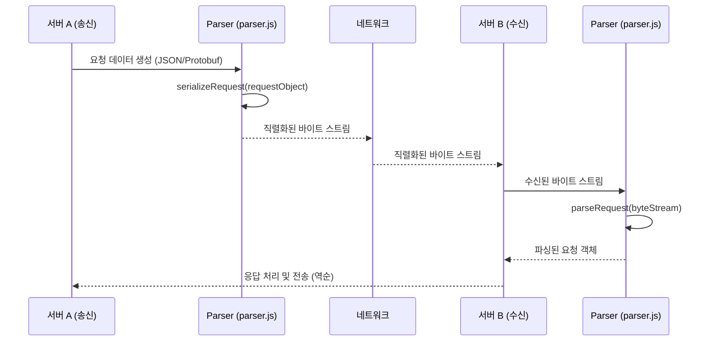

<cite>server/server/parser.js</cite>

## Server - Server 통신 기술 문서

### 개요
이 문서는 서버 간 통신(Server-to-Server communication)의 핵심 구성 요소와 `server/server/parser.js` 모듈의 역할을 설명합니다. 서버 간 통신은 마이크로서비스 아키텍처나 분산 시스템에서 서비스들이 서로 데이터를 교환하고 작업을 조율하는 데 필수적입니다. `parser.js`는 이러한 통신 과정에서 오가는 데이터를 특정 형식으로 변환(파싱 및 직렬화)하여, 각 서버가 데이터를 올바르게 이해하고 처리할 수 있도록 돕는 역할을 수행합니다.

### 아키텍처 다이어그램

```mermaid
graph TD
    subgraph Service A
        SA_API_Gateway[API Gateway]
        SA_Auth[인증 서비스]
        SA_Core[핵심 비즈니스 로직]
        SA_Parser[Parser Module (parser.js)]
        SA_DB[데이터베이스]
    end

    subgraph Service B
        SB_API_Gateway[API Gateway]
        SB_Auth[인증 서비스]
        SB_Core[핵심 비즈니스 로직]
        SB_Parser[Parser Module (parser.js)]
        SB_DB[데이터베이스]
    end

    subgraph Service C
        SC_API_Gateway[API Gateway]
        SC_Auth[인증 서비스]
        SC_Core[핵심 비즈니스 로직]
        SC_Parser[Parser Module (parser.js)]
        SC_DB[데이터베이스]
    end

    User --> SA_API_Gateway
    SA_API_Gateway --> SA_Auth
    SA_Auth --> SA_Core
    SA_Core -- 내부 호출 (HTTP/gRPC) --> SA_Parser
    SA_Parser -- 직렬화된 데이터 --> SB_API_Gateway
    SB_API_Gateway --> SB_Auth
    SB_Auth --> SB_Core
    SB_Core -- 내부 호출 (HTTP/gRPC) --> SB_Parser
    SB_Parser -- 직렬화된 데이터 --> SC_API_Gateway
    SC_API_Gateway --> SC_Auth
    SC_Auth --> SC_Core
```

### 데이터 흐름 다이어그램



### 의존성 다이어그램

```mermaid
graph TD
    CoreServerModule[핵심 서버 모듈]
    RequestProcessor[요청 처리기]
    ResponseSender[응답 송신기]
    Logger[로깅 모듈]
    ConfigManager[설정 관리자]
    ParserModule[Parser Module (parser.js)]

    CoreServerModule --> RequestProcessor
    CoreServerModule --> ResponseSender
    CoreServerModule --> ConfigManager
    RequestProcessor --> ParserModule
    ResponseSender --> ParserModule
    ParserModule --> Logger
```

### 주요 함수 및 클래스

`server/server/parser.js` 모듈은 서버 간 통신을 위한 데이터 변환 작업을 담당하며, 일반적으로 다음과 같은 함수들을 포함합니다.

*   **`parseRequest(rawData: Buffer | string): object`**
    *   **설명**: 네트워크를 통해 수신된 원시 데이터(바이트 스트림 또는 문자열)를 내부에서 사용 가능한 구조화된 객체(예: JSON 객체, Protobuf 메시지 객체)로 변환합니다. 이 함수는 데이터의 인코딩을 감지하고, 유효성을 검사하며, 필요한 경우 스키마에 따라 데이터를 정규화합니다. 파싱 과정에서 오류가 발생하면 적절한 예외를 발생시킵니다.
    *   **예시**: 수신된 HTTP 바디를 JSON 객체로 변환하거나, gRPC 메시지를 특정 Protobuf 클래스의 인스턴스로 변환합니다.

*   **`serializeResponse(responseObject: object): Buffer | string`**
    *   **설명**: 서버의 비즈니스 로직에서 생성된 응답 객체를 네트워크를 통해 전송하기 위한 원시 데이터(바이트 스트림 또는 문자열)로 직렬화합니다. 이 함수는 응답 객체를 지정된 형식(예: JSON 문자열, Protobuf 바이트)으로 변환하고, 필요한 경우 압축 또는 인코딩을 적용합니다.
    *   **예시**: 내부 응답 객체를 JSON 문자열로 변환하여 HTTP 응답 바디에 포함하거나, Protobuf 메시지로 직렬화하여 gRPC 응답으로 전송합니다.

*   **`validatePayload(parsedData: object, schema: object): boolean`**
    *   **설명**: `parseRequest` 함수를 통해 파싱된 데이터 객체가 사전 정의된 스키마를 준수하는지 검증합니다. 이 함수는 데이터의 필드 존재 여부, 데이터 타입, 값의 유효성 범위 등을 확인하여 데이터 무결성을 보장합니다. 검증에 실패하면 `false`를 반환하거나 특정 오류를 던질 수 있습니다.
    *   **예시**: 수신된 요청 JSON 객체가 필수 필드를 모두 포함하고 있으며, 각 필드의 데이터 타입이 올바른지 확인합니다.

*   **`createErrorResponse(errorCode: number, message: string, details?: object): object`**
    *   **설명**: 서버 간 통신에서 오류가 발생했을 때, 표준화된 오류 응답 객체를 생성합니다. 이 함수는 오류 코드, 메시지, 그리고 추가적인 상세 정보를 포함하는 객체를 반환하여, 오류 처리 및 로깅을 용이하게 합니다.
    *   **예시**: 파싱 실패 시 `errorCode: 400`, `message: "Invalid Request Format"`과 같은 오류 응답 객체를 생성합니다.

### 설정 및 사용법

`parser.js` 모듈은 일반적으로 서버의 요청 처리 미들웨어 또는 특정 통신 계층에서 사용됩니다.

#### 1. 수신 요청 파싱 및 검증

```javascript
// server/server/main_service.js (가상의 핵심 서비스 파일)
const http = require('http');
const parser = require('./parser'); // parser.js 모듈 임포트

const requestSchema = {
    type: 'object',
    properties: {
        id: { type: 'string', format: 'uuid' },
        action: { type: 'string', enum: ['create', 'update', 'delete'] },
        payload: { type: 'object' }
    },
    required: ['id', 'action', 'payload']
};

const server = http.createServer((req, res) => {
    if (req.method === 'POST' && req.url === '/internal-api/process') {
        let rawData = '';
        req.on('data', chunk => {
            rawData += chunk;
        });
        req.on('end', () => {
            try {
                // 1. 원시 데이터 파싱
                const parsedRequest = parser.parseRequest(rawData);
                
                // 2. 파싱된 데이터 검증
                if (!parser.validatePayload(parsedRequest, requestSchema)) {
                    const errorResponse = parser.createErrorResponse(400, 'Invalid Request Payload', { validationErrors: 'Schema mismatch' });
                    res.writeHead(400, { 'Content-Type': 'application/json' });
                    return res.end(parser.serializeResponse(errorResponse));
                }

                // 3. 비즈니스 로직 처리
                console.log('Received and validated request:', parsedRequest);
                const result = { status: 'success', message: 'Request processed', data: parsedRequest.payload };
                
                // 4. 응답 직렬화 및 전송
                res.writeHead(200, { 'Content-Type': 'application/json' });
                res.end(parser.serializeResponse(result));

            } catch (error) {
                console.error('Error processing request:', error);
                const errorResponse = parser.createErrorResponse(500, 'Internal Server Error', { details: error.message });
                res.writeHead(500, { 'Content-Type': 'application/json' });
                res.end(parser.serializeResponse(errorResponse));
            }
        });
    } else {
        res.writeHead(404, { 'Content-Type': 'text/plain' });
        res.end('Not Found');
    }
});

server.listen(3001, () => {
    console.log('Internal Service B listening on port 3001');
});
```

#### 2. 외부 서비스로 요청 생성 및 전송

```javascript
// server/server/client_service.js (가상의 클라이언트 서비스 파일)
const http = require('http');
const parser = require('./parser'); // parser.js 모듈 임포트

async function sendInternalRequest(action, data) {
    const requestPayload = {
        id: 'a1b2c3d4-e5f6-7890-1234-567890abcdef',
        action: action,
        payload: data
    };

    const serializedPayload = parser.serializeResponse(requestPayload); // 요청 객체를 직렬화

    const options = {
        hostname: 'localhost',
        port: 3001,
        path: '/internal-api/process',
        method: 'POST',
        headers: {
            'Content-Type': 'application/json',
            'Content-Length': Buffer.byteLength(serializedPayload)
        }
    };

    return new Promise((resolve, reject) => {
        const req = http.request(options, (res) => {
            let responseData = '';
            res.on('data', (chunk) => {
                responseData += chunk;
            });
            res.on('end', () => {
                try {
                    const parsedResponse = parser.parseRequest(responseData); // 응답 데이터 파싱
                    if (res.statusCode >= 400) {
                        reject(new Error(`Server Error (${res.statusCode}): ${parsedResponse.message || 'Unknown error'}`));
                    } else {
                        resolve(parsedResponse);
                    }
                } catch (parseError) {
                    reject(new Error(`Failed to parse response: ${parseError.message}`));
                }
            });
        });

        req.on('error', (e) => {
            reject(new Error(`Request error: ${e.message}`));
        });

        req.write(serializedPayload);
        req.end();
    });
}

// 예시 사용
sendInternalRequest('create', { name: 'New Item', value: 123 })
    .then(response => console.log('Internal Request Success:', response))
    .catch(error => console.error('Internal Request Failed:', error.message));
```

### 문제 해결 가이드

#### 1. 잘못된 형식의 요청/응답 데이터 (Parsing Error)
*   **증상**: `parser.parseRequest()` 호출 시 `SyntaxError` 또는 `TypeError` 발생, 예상치 못한 `null` 또는 `undefined` 값 반환.
*   **원인**:
    *   송신 서버에서 보낸 데이터가 예상 형식(예: JSON)이 아니거나, 손상되었거나, 인코딩이 다릅니다.
    *   `Content-Type` 헤더와 실제 데이터 형식이 일치하지 않아 `parser`가 잘못된 방식으로 데이터를 처리하려 합니다.
    *   대용량 데이터 전송 중 네트워크 문제로 데이터가 부분적으로만 수신되었습니다.
*   **해결책**:
    *   **로그 확인**: 송신 측에서 전송한 원시 데이터와 수신 측에서 `parser.parseRequest()`에 전달된 원시 데이터를 로깅하여 비교합니다.
    *   **Content-Type 검증**: HTTP 헤더의 `Content-Type`이 `application/json` 또는 `application/protobuf` 등 예상 형식과 일치하는지 확인합니다.
    *   **인코딩 확인**: 송수신 간 인코딩(예: UTF-8)이 일치하는지 확인합니다.
    *   **데이터 유효성 검사 강화**: `parser.parseRequest()` 내부 또는 외부에서 `try-catch` 블록을 사용하여 파싱 오류를 명확히 처리하고, 오류 발생 시 원시 데이터를 함께 로깅하여 디버깅을 돕습니다.

#### 2. 데이터 스키마 불일치 (Validation Error)
*   **증상**: `parser.validatePayload()`가 `false`를 반환하거나, 비즈니스 로직에서 예상치 못한 필드 누락 또는 잘못된 타입 오류가 발생합니다.
*   **원인**:
    *   송신 서버와 수신 서버 간에 데이터 스키마 정의가 동기화되지 않았습니다.
    *   스키마 버전 관리가 부재하여, 한 서버의 업데이트가 다른 서버의 스키마 기대치를 깨뜨립니다.
    *   필수 필드가 누락되었거나, 필드의 데이터 타입이 변경되었습니다.
*   **해결책**:
    *   **스키마 중앙 관리**: 모든 서비스가 참조하는 중앙화된 스키마 저장소(예: Git 저장소, Schema Registry)를 구축하고, 변경 시 모든 관련 서비스에 배포 및 적용을 강제합니다.
    *   **버전 관리**: API 및 데이터 스키마에 버전을 도입하여 하위 호환성을 유지하거나, 명시적인 버전 업그레이드 경로를 제공합니다.
    *   **강력한 유효성 검사**: `parser.validatePayload()` 함수를 적극적으로 활용하여, 비즈니스 로직이 실행되기 전에 데이터 유효성을 철저히 검사합니다. 검증 실패 시 구체적인 오류 메시지를 반환하도록 구현합니다.
    *   **테스트 자동화**: 통합 테스트 및 계약 테스트(Contract Testing)를 통해 서비스 간 스키마 호환성을 지속적으로 검증합니다.

#### 3. 성능 저하 (Serialization/Deserialization Overhead)
*   **증상**: 서버 간 통신이 많은 경우 CPU 사용량이 증가하고, 전체 요청 처리 시간이 길어집니다. 특히 대용량 데이터 전송 시 두드러집니다.
*   **원인**:
    *   `parser.js`가 사용하는 직렬화/역직렬화 라이브러리가 비효율적이거나, 최적화되지 않은 방식으로 사용됩니다.
    *   매우 큰 데이터 객체를 자주 직렬화/역직렬화하는 과정에서 오버헤드가 발생합니다.
    *   불필요한 데이터 필드까지 포함하여 전송함으로써 데이터 크기가 커집니다.
*   **해결책**:
    *   **프로파일링**: 애플리케이션 프로파일링 도구를 사용하여 `parser.serializeResponse()` 및 `parser.parseRequest()` 함수가 전체 CPU 시간에서 차지하는 비중을 분석합니다.
    *   **효율적인 형식 선택**: JSON 대신 Protobuf, Avro, MessagePack과 같은 더 효율적인 바이너리 직렬화 형식을 고려합니다. 이들은 일반적으로 더 작은 데이터 크기와 빠른 처리 속도를 제공합니다.
    *   **데이터 압축**: 네트워크 전송 전에 데이터를 압축(예: Gzip)하고, 수신 후 압축을 해제하여 네트워크 대역폭 사용량과 전송 시간을 줄입니다. `parser` 모듈에 압축/해제 로직을 통합할 수 있습니다.
    *   **불필요한 필드 제거**: 전송되는 데이터에서 실제로 필요하지 않은 필드를 제거하여 데이터 크기를 최소화합니다.
    *   **캐싱**: 자주 사용되는 정적 데이터나 변경 빈도가 낮은 데이터는 직렬화된 형태로 캐싱하여 반복적인 직렬화/역직렬화 작업을 줄입니다.