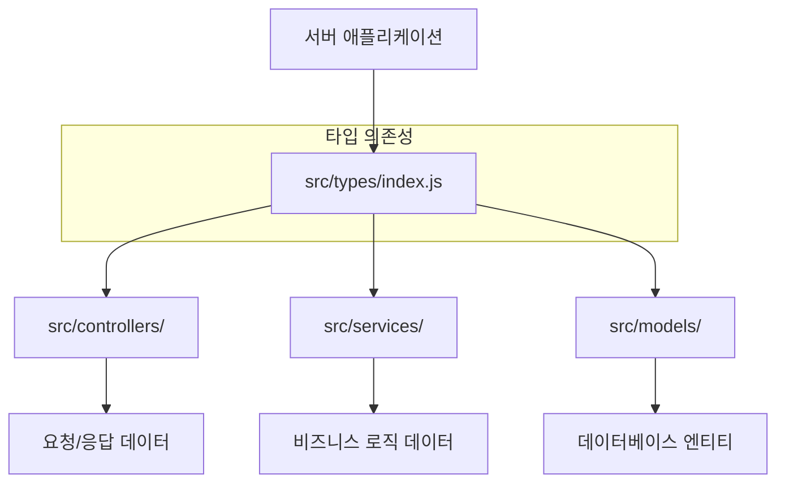
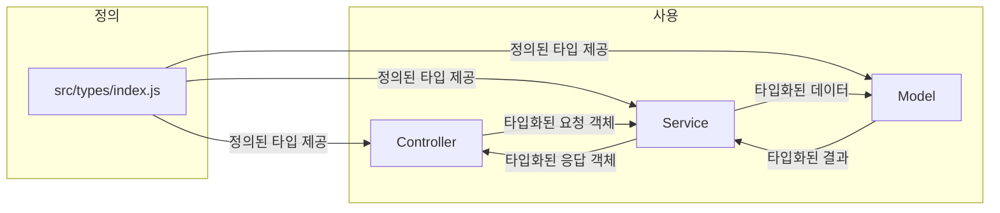
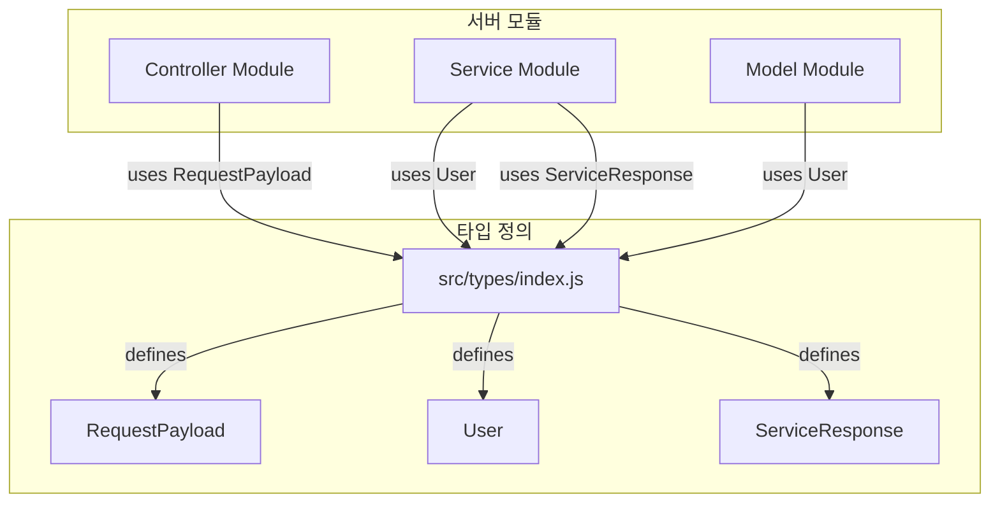

<cite>server/src/types/index.js</cite>

개요
`server/src/types/index.js` 파일은 서버 애플리케이션 전반에서 사용되는 공통 타입 정의를 중앙 집중화하는 역할을 합니다. 이 파일은 TypeScript 환경에서 서버 코드의 견고성과 가독성을 향상시키며, 데이터 구조에 대한 명확한 계약을 제공하여 개발자들이 일관된 방식으로 데이터를 다룰 수 있도록 돕습니다. 이를 통해 런타임 오류를 줄이고 코드 유지보수를 용이하게 합니다.

Mermaid 다이어그램

**1. 타입 정의 아키텍처**



**2. 타입 정의 흐름**



**3. 주요 타입 정의 모듈 의존성**



주요 타입 정의

`server/src/types/index.js`는 일반적으로 TypeScript의 `interface`나 `type` 키워드를 사용하여 데이터 구조를 정의합니다. 다음은 예시로 포함될 수 있는 주요 타입 정의들입니다.

*   **`RequestPayload`**
    *   **시그니처**: `type RequestPayload = { userId?: string; data: any; timestamp: Date; }`
    *   **설명**: 클라이언트로부터 서버로 전송되는 모든 요청의 본문(body)에 대한 표준화된 구조를 정의합니다. `userId`는 선택 사항이며, `data`는 실제 요청 데이터를 포함하고, `timestamp`는 요청 발생 시각을 나타냅니다.

*   **`User`**
    *   **시그니처**: `interface User { id: string; username: string; email: string; role: 'admin' | 'user' | 'guest'; createdAt: Date; updatedAt: Date; }`
    *   **설명**: 애플리케이션 내에서 사용자 엔티티를 나타내는 인터페이스입니다. 사용자의 고유 ID, 사용자명, 이메일, 역할, 생성 및 업데이트 시각과 같은 필수 속성을 정의합니다.

*   **`ServiceResponse<T>`**
    *   **시그니처**: `type ServiceResponse<T> = { success: boolean; data?: T; message?: string; errorCode?: string; }`
    *   **설명**: 서비스 계층에서 컨트롤러 계층으로 반환되는 응답의 표준화된 구조를 정의하는 제네릭 타입입니다. `success`는 작업 성공 여부를 나타내며, `data`는 성공 시 반환될 실제 데이터를, `message`와 `errorCode`는 오류 발생 시 상세 정보를 제공합니다.

*   **`PaginationOptions`**
    *   **시그니처**: `interface PaginationOptions { page: number; limit: number; sortBy?: string; sortOrder?: 'asc' | 'desc'; }`
    *   **설명**: 목록 조회 시 페이지네이션 관련 옵션을 정의하는 인터페이스입니다. 현재 페이지, 페이지당 항목 수, 정렬 기준 필드 및 정렬 순서(오름차순/내림차순)를 포함합니다.

*   **`ApiResponse<T>`**
    *   **시그니처**: `type ApiResponse<T> = { status: number; message: string; data?: T; }`
    *   **설명**: 클라이언트에 최종적으로 반환되는 API 응답의 표준 구조를 정의하는 제네릭 타입입니다. HTTP 상태 코드, 메시지, 그리고 실제 응답 데이터를 포함합니다.

설정/사용법

`server/src/types/index.js`에 정의된 타입들은 다른 서버 모듈에서 `import` 문을 통해 가져와 사용됩니다. 이를 통해 코드의 타입 안정성을 보장하고 개발자가 데이터 구조를 예측할 수 있게 합니다.

**예시 1: 컨트롤러에서 타입 사용**

```typescript
// src/controllers/userController.ts
import { Request, Response } from 'express';
import { User, RequestPayload, ServiceResponse } from '../types';
import * as userService from '../services/userService';

export const createUser = async (req: Request<any, any, RequestPayload>): Promise<Response<ServiceResponse<User>>> => {
    try {
        const userData: Omit<User, 'id' | 'createdAt' | 'updatedAt'> = req.body.data;
        const result: ServiceResponse<User> = await userService.createUser(userData);

        if (result.success) {
            return res.status(201).json(result);
        } else {
            return res.status(400).json(result);
        }
    } catch (error) {
        return res.status(500).json({ success: false, message: '서버 오류 발생' });
    }
};
```

**예시 2: 서비스에서 타입 사용**

```typescript
// src/services/userService.ts
import { User, ServiceResponse } from '../types';
import { v4 as uuidv4 } from 'uuid';

export const createUser = async (userData: Omit<User, 'id' | 'createdAt' | 'updatedAt'>): Promise<ServiceResponse<User>> => {
    try {
        const newUser: User = {
            id: uuidv4(),
            ...userData,
            createdAt: new Date(),
            updatedAt: new Date(),
        };
        // 데이터베이스에 newUser 저장 로직...
        console.log('새 사용자 생성:', newUser);
        return { success: true, data: newUser, message: '사용자가 성공적으로 생성되었습니다.' };
    } catch (error) {
        console.error('사용자 생성 중 오류:', error);
        return { success: false, message: '사용자 생성에 실패했습니다.', errorCode: 'USER_CREATE_FAILED' };
    }
};
```

문제 해결 가이드

*   **1. "Property 'X' does not exist on type 'Y'" 오류 발생**
    *   **원인**: 특정 객체에서 존재하지 않는 속성에 접근하려고 할 때 발생합니다. 이는 해당 객체의 타입 정의에 해당 속성이 없기 때문입니다.
    *   **해결**: `src/types/index.js` 또는 관련 타입 정의 파일에서 해당 타입(`Y`)에 필요한 속성(`X`)이 정의되어 있는지 확인하고, 필요한 경우 추가합니다. 만약 속성이 선택적(`?`)이라면, 접근하기 전에 해당 속성의 존재 여부를 확인하는 로직(`if (obj.X)`)을 추가하거나, 옵셔널 체이닝(`obj.X?.subProperty`)을 사용합니다.

*   **2. "Type 'A' is not assignable to type 'B'" 오류 발생**
    *   **원인**: 한 타입의 값을 다른 타입의 변수에 할당하려고 할 때, 두 타입의 구조가 일치하지 않아 발생합니다. 필수 속성이 누락되었거나, 속성의 타입이 일치하지 않을 수 있습니다.
    *   **해결**: 할당하려는 값(`A`)과 할당받는 변수의 타입(`B`) 정의를 비교하여 어떤 부분이 일치하지 않는지 확인합니다. 누락된 속성을 추가하거나, 잘못된 타입의 속성을 수정합니다. 필요하다면 `Partial<B>`, `Omit<B, 'prop'>`, `Pick<B, 'prop'>` 등의 유틸리티 타입을 사용하여 일시적으로 타입을 조정할 수 있습니다.

*   **3. "Cannot find name 'MyType'" 오류 발생**
    *   **원인**: 정의되지 않은 타입을 사용하려고 하거나, 타입이 정의된 파일에서 제대로 내보내지 않았거나, 현재 파일에서 올바르게 가져오지 않았을 때 발생합니다.
    *   **해결**:
        1.  `src/types/index.js` 파일에 `MyType`이 `export` 키워드와 함께 정의되어 있는지 확인합니다.
        2.  `MyType`을 사용하는 파일에서 `import { MyType } from '../types';`와 같이 올바른 경로로 가져오고 있는지 확인합니다.
        3.  파일 경로가 정확한지, 특히 `.js` 환경에서 `.ts` 파일을 참조하는 경우 `tsconfig.json` 설정(`"allowJs": true`, `"declaration": true` 등)이 올바른지 확인합니다.