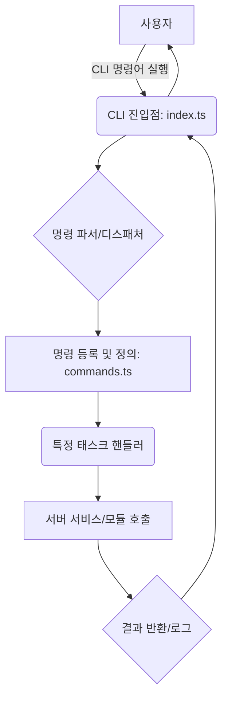
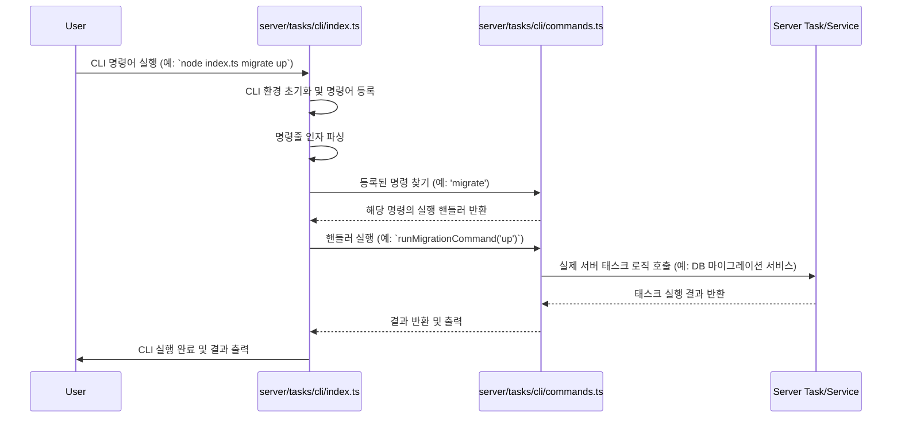

<cite>server/tasks/cli/commands.ts</cite>
<cite>server/tasks/cli/index.ts</cite>

## 개요

이 문서는 서버의 태스크를 명령줄 인터페이스(CLI)를 통해 관리하고 실행하는 시스템에 대해 설명합니다. `server/tasks/cli/index.ts`는 CLI 애플리케이션의 진입점 역할을 하며, 명령줄 인자를 파싱하고 적절한 태스크 핸들러를 호출하는 로직을 포함합니다. `server/tasks/cli/commands.ts`는 정의된 각 CLI 명령어와 해당 실행 로직을 구현하여, 개발 및 운영 환경에서 데이터베이스 마이그레이션, 캐시 관리, 스크립트 실행 등 다양한 백엔드 작업을 편리하게 수행할 수 있도록 지원합니다.

## 아키텍처 다이어그램


*   **사용자**: 명령줄을 통해 `index.ts` 스크립트를 실행합니다.
*   **CLI 진입점 (`index.ts`)**: CLI 애플리케이션을 초기화하고, 명령줄 인자를 받아들입니다.
*   **명령 파서/디스패처**: 입력된 명령어를 분석하여 어떤 명령이 실행되어야 하는지 결정합니다.
*   **명령 등록 및 정의 (`commands.ts`)**: 시스템에 등록된 모든 CLI 명령어와 그에 대한 설명을 포함하며, 각 명령어가 호출될 때 실행될 실제 로직을 정의합니다.
*   **특정 태스크 핸들러**: `commands.ts`에 정의된 특정 명령의 실행 로직입니다.
*   **서버 서비스/모듈 호출**: 태스크 핸들러는 실제 서버의 비즈니스 로직을 수행하는 서비스나 모듈을 호출합니다.
*   **결과 반환/로그**: 태스크 실행 결과는 콘솔에 출력되거나 로그 파일에 기록됩니다.

## 명령 실행 흐름


*   **User**: `node server/tasks/cli/index.ts <command> <args>` 형식으로 CLI 명령어를 실행합니다.
*   **IndexTs**: 애플리케이션의 진입점으로서, CLI 프레임워크를 초기화하고, `commands.ts`에서 정의된 모든 명령어를 등록합니다. 이후 명령줄 인자를 파싱하여 어떤 명령을 실행할지 결정합니다.
*   **CommandsTs**: `index.ts`로부터 특정 명령의 실행 요청을 받으면, 해당 명령에 연결된 함수(핸들러)를 실행합니다.
*   **ServerTask**: `commands.ts` 내의 핸들러는 실제 서버의 핵심 로직을 담당하는 서비스나 모듈을 호출하여 작업을 수행합니다. 작업이 완료되면 결과를 반환합니다.
*   **IndexTs**: 최종적으로 CLI 실행 결과를 사용자에게 출력하고 프로세스를 종료합니다.

## 주요 함수 및 클래스

### `server/tasks/cli/index.ts`

*   **`initializeCli(): Promise<void>`**
    *   **설명**: CLI 애플리케이션을 초기화하고, `commands.ts`에 정의된 모든 명령어를 등록하며, 명령줄 인자를 파싱하여 해당 명령어를 실행합니다. 이 함수는 CLI 시스템의 메인 진입점 역할을 합니다.
*   **`getCliProgram(): Command`**
    *   **설명**: CLI 명령어를 정의하고 관리하는 데 사용되는 Commander.js(또는 유사 라이브러리) 프로그램 인스턴스를 반환합니다. 다른 모듈에서 명령어를 추가하거나 설정에 접근할 때 사용됩니다.

### `server/tasks/cli/commands.ts`

*   **`defineCommand(options: { name: string; description: string; action: (...args: any[]) => Promise<void> | void; options?: Array<{ flag: string; description: string; defaultValue?: any }> }): void`**
    *   **설명**: 새로운 CLI 명령어를 시스템에 정의하고 등록하는 유틸리티 함수입니다. 명령어 이름, 설명, 실행될 액션 함수, 그리고 추가 옵션들을 인자로 받습니다.
*   **`runMigrationCommand(direction: 'up' | 'down', options: { target?: string }): Promise<void>`**
    *   **설명**: 데이터베이스 마이그레이션을 실행하는 명령어 핸들러입니다. `up` 또는 `down` 방향으로 마이그레이션을 수행하며, 특정 마이그레이션 파일을 대상으로 지정할 수도 있습니다.
*   **`clearCacheCommand(cacheType: string, options: { force?: boolean }): Promise<void>`**
    *   **설명**: 특정 유형의 서버 캐시를 비우는 명령어 핸들러입니다. 캐시 유형을 지정할 수 있으며, 강제 삭제 옵션을 제공할 수 있습니다.

## 설정 및 사용법

### 1. CLI 명령어 실행

CLI 태스크는 프로젝트 루트에서 `node` 명령어를 사용하여 실행할 수 있습니다. 각 명령어는 고유한 이름과 인자, 옵션을 가집니다.

```bash
# 데이터베이스 마이그레이션 실행 (모든 pending 마이그레이션 적용)
node server/tasks/cli/index.ts migrate up

# 특정 유형의 캐시를 비우기 (예: Redis 캐시)
node server/tasks/cli/index.ts cache clear --type=redis

# CLI 도움말 보기
node server/tasks/cli/index.ts --help

# 특정 명령어의 도움말 보기
node server/tasks/cli/index.ts migrate --help
```

### 2. 새로운 CLI 명령어 정의

`server/tasks/cli/commands.ts` 파일에 `getCliProgram()`을 통해 CLI 인스턴스를 가져와 새로운 명령어를 추가할 수 있습니다. 다음은 사용자에게 인사하는 `greet` 명령어를 추가하는 예시입니다.

```typescript
// server/tasks/cli/commands.ts
import { getCliProgram } from './index'; // index.ts에서 CLI 프로그램 인스턴스를 가져옵니다.

getCliProgram()
  .command('greet <name>')
  .description('지정된 사용자에게 인사말을 출력합니다.')
  .action(async (name: string) => {
    console.log(`안녕하세요, ${name}님! 서버 CLI로부터 인사드립니다.`);
    // 여기에 실제 서버 로직을 호출하는 코드를 추가할 수 있습니다.
    // 예: await someUserService.logGreeting(name);
  });
```
위 코드를 추가한 후, 다음 명령어로 실행할 수 있습니다:
```bash
node server/tasks/cli/index.ts greet "홍길동"
```

## 문제 해결 가이드

### 1. "Command not found" 오류

*   **문제**: 실행하려는 CLI 명령어를 시스템이 인식하지 못합니다.
*   **원인**: 명령어 이름에 오타가 있거나, `server/tasks/cli/commands.ts` 파일에 해당 명령어가 올바르게 정의 및 등록되지 않았을 수 있습니다.
*   **해결**:
    1.  명령어 이름을 다시 확인하고 오타가 없는지 검토합니다.
    2.  `server/tasks/cli/commands.ts` 파일을 열어 해당 명령어가 `defineCommand` 함수 또는 `getCliProgram().command(...)`를 통해 올바르게 등록되었는지 확인합니다.
    3.  `node server/tasks/cli/index.ts --help`를 실행하여 사용 가능한 명령어 목록을 확인합니다.

### 2. "Missing required argument" 또는 "Unknown option" 오류

*   **문제**: 명령어를 실행할 때 필수 인자가 누락되었거나, 알 수 없는 옵션을 사용했습니다.
*   **원인**: 명령어의 사용법을 정확히 따르지 않았을 때 발생합니다.
*   **해결**:
    1.  해당 명령어의 도움말을 확인합니다. `node server/tasks/cli/index.ts <command> --help`를 실행하여 필수 인자와 사용 가능한 옵션을 확인합니다.
    2.  명령어 시그니처와 일치하도록 인자 및 옵션을 정확하게 입력합니다.

### 3. "Task execution failed" 오류

*   **문제**: CLI 명령어 자체는 성공적으로 실행되었지만, 명령어가 호출한 내부 서버 태스크(예: 데이터베이스 마이그레이션, 캐시 삭제)가 실패했습니다.
*   **원인**: 태스크 핸들러 내부의 비즈니스 로직 오류, 데이터베이스 연결 문제, 권한 부족, 또는 잘못된 설정 등으로 인해 발생할 수 있습니다.
*   **해결**:
    1.  CLI 출력 메시지를 자세히 확인하여 오류의 구체적인 원인을 파악합니다.
    2.  서버의 애플리케이션 로그 파일을 확인하여 해당 태스크 실행 시 기록된 오류 메시지를 분석합니다.
    3.  `server/tasks/cli/commands.ts` 내의 해당 태스크 핸들러 함수 로직을 디버깅하거나, 관련 서버 서비스/모듈의 코드를 검토하여 문제를 해결합니다.