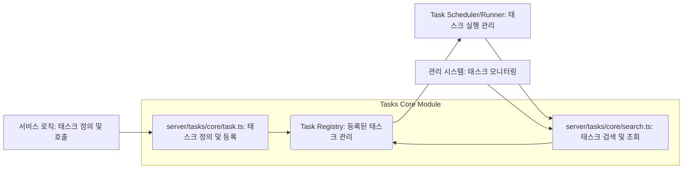
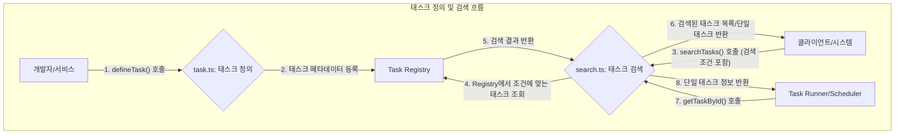
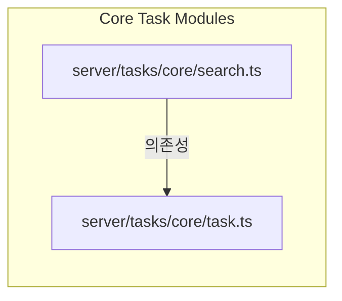

<cite>
server/tasks/core/search.ts
server/tasks/core/task.ts
</cite>

# Server - Tasks - Core 기술 문서

이 문서는 서버 측 백그라운드 태스크 관리의 핵심 로직을 담당하는 `server/tasks/core` 모듈에 대해 설명합니다. 본 모듈은 태스크의 정의, 등록 및 검색 기능을 제공하여, 시스템 내 다양한 비동기 작업을 효율적으로 관리하고 실행할 수 있도록 지원합니다. 이를 통해 안정적이고 확장 가능한 태스크 처리 아키텍처를 구축합니다.

## 아키텍처 다이어그램



## 데이터 흐름 다이어그램



## 의존성 다이어그램



## 주요 함수/클래스

### `server/tasks/core/task.ts`

*   **`interface Task<Payload = any, Result = any>`**
    *   **설명:** 백그라운드 태스크의 구조를 정의하는 인터페이스입니다. 태스크의 고유 ID, 타입, 상태, 생성/업데이트 시간, 페이로드(입력 데이터), 결과(출력 데이터) 등을 포함합니다.
    *   **시그니처:**
        ```typescript
        interface Task<Payload = any, Result = any> {
            id: string;
            type: string;
            status: TaskStatus;
            createdAt: Date;
            updatedAt: Date;
            startedAt?: Date;
            completedAt?: Date;
            payload: Payload;
            result?: Result;
            error?: string;
            maxAttempts: number;
            attempts: number;
            description?: string;
            // ... 추가 필드
        }
        ```

*   **`type TaskHandler<Payload = any, Result = any>`**
    *   **설명:** 특정 태스크를 실행하는 비동기 함수 시그니처입니다. 태스크 객체를 인수로 받아 작업을 수행하고 결과를 반환합니다.
    *   **시그니처:**
        ```typescript
        type TaskHandler<Payload = any, Result = any> = (
            task: Task<Payload>
        ) => Promise<Result | { status: 'success' | 'failure'; message?: string; data?: Result }>;
        ```

*   **`enum TaskStatus`**
    *   **설명:** 태스크가 가질 수 있는 상태를 정의하는 열거형입니다.
    *   **시그니처:**
        ```typescript
        enum TaskStatus {
            PENDING = 'PENDING',
            RUNNING = 'RUNNING',
            COMPLETED = 'COMPLETED',
            FAILED = 'FAILED',
            CANCELLED = 'CANCELLED',
        }
        ```

*   **`function defineTask<Payload = any, Result = any>(id: string, handler: TaskHandler<Payload, Result>, options?: TaskOptions): TaskDefinition<Payload, Result>`**
    *   **설명:** 새로운 태스크 정의를 시스템에 등록합니다. 고유한 ID와 해당 태스크의 실행 로직(핸들러)을 연결합니다.
    *   **시그니처:**
        ```typescript
        function defineTask<Payload = any, Result = any>(
            id: string,
            handler: TaskHandler<Payload, Result>,
            options?: TaskOptions
        ): TaskDefinition<Payload, Result>;
        ```

### `server/tasks/core/search.ts`

*   **`interface TaskSearchOptions`**
    *   **설명:** 태스크를 검색할 때 사용할 수 있는 다양한 필터링 및 정렬 옵션을 정의하는 인터페이스입니다.
    *   **시그니처:**
        ```typescript
        interface TaskSearchOptions {
            id?: string;
            type?: string;
            status?: TaskStatus;
            createdAtRange?: { start?: Date; end?: Date };
            updatedAtRange?: { start?: Date; end?: Date };
            limit?: number;
            offset?: number;
            sortBy?: 'createdAt' | 'updatedAt' | 'id';
            sortOrder?: 'asc' | 'desc';
        }
        ```

*   **`function searchTasks(options?: TaskSearchOptions): Promise<Task[]>`**
    *   **설명:** 주어진 검색 옵션에 따라 등록된 태스크 목록을 비동기적으로 조회합니다.
    *   **시그니처:**
        ```typescript
        function searchTasks(options?: TaskSearchOptions): Promise<Task[]>;
        ```

*   **`function getTaskById(id: string): Promise<Task | undefined>`**
    *   **설명:** 특정 ID를 가진 단일 태스크 정보를 비동기적으로 조회합니다.
    *   **시그니처:**
        ```typescript
        function getTaskById(id: string): Promise<Task | undefined>;
        ```

## 설정/사용법

### 1. 새로운 태스크 정의 및 등록

```typescript
// server/tasks/my-background-task.ts
import { defineTask, Task, TaskStatus } from './task'; // 실제 경로에 맞게 조정

interface MyTaskPayload {
  userId: string;
  reportType: 'daily' | 'monthly';
}

interface MyTaskResult {
  reportUrl: string;
  generatedAt: Date;
}

const generateReportTaskHandler = async (task: Task<MyTaskPayload, MyTaskResult>) => {
  console.log(`[${task.id}] 리포트 생성 시작. 사용자 ID: ${task.payload.userId}, 타입: ${task.payload.reportType}`);

  // 실제 리포트 생성 로직 (예: DB 조회, 파일 생성, 외부 API 호출)
  await new Promise(resolve => setTimeout(resolve, 3000)); // 3초 대기 시뮬레이션

  const reportUrl = `https://example.com/reports/${task.payload.userId}/${task.payload.reportType}-${Date.now()}.pdf`;
  console.log(`[${task.id}] 리포트 생성 완료: ${reportUrl}`);

  return {
    reportUrl: reportUrl,
    generatedAt: new Date(),
  };
};

export const generateReportTask = defineTask<MyTaskPayload, MyTaskResult>(
  'generateUserReport',
  generateReportTaskHandler,
  {
    description: '사용자별 리포트를 생성하는 백그라운드 태스크',
    maxAttempts: 3, // 최대 3회 재시도
  }
);

console.log(`태스크 정의 완료: ID - ${generateReportTask.id}, 설명 - ${generateReportTask.description}`);
```

### 2. 정의된 태스크 검색

```typescript
// server/services/task-monitor.ts
import { searchTasks, getTaskById, TaskStatus } from '../tasks/core/search'; // 실제 경로에 맞게 조정
import { generateReportTask } from '../tasks/my-background-task'; // 정의된 태스크 임포트

async function monitorAndLogTasks() {
  console.log('--- 모든 PENDING 상태 태스크 검색 ---');
  const pendingTasks = await searchTasks({
    status: TaskStatus.PENDING,
    limit: 5,
    sortBy: 'createdAt',
    sortOrder: 'asc',
  });

  if (pendingTasks.length > 0) {
    console.log(`현재 ${pendingTasks.length}개의 PENDING 태스크가 있습니다:`);
    pendingTasks.forEach(task => {
      console.log(`- ID: ${task.id}, 타입: ${task.type}, 생성일: ${task.createdAt.toLocaleString()}`);
    });
  } else {
    console.log('현재 PENDING 상태의 태스크가 없습니다.');
  }

  console.log('\n--- 특정 태스크 ID로 검색 ---');
  // 예시: 이미 등록된 태스크 중 하나를 가정하여 검색
  const specificTaskId = 'some-existing-task-id-123'; // 실제 태스크 ID로 대체
  const taskById = await getTaskById(specificTaskId);

  if (taskById) {
    console.log(`ID '${specificTaskId}' 태스크 정보:`);
    console.log(`  상태: ${taskById.status}`);
    console.log(`  설명: ${taskById.description}`);
    console.log(`  페이로드: ${JSON.stringify(taskById.payload)}`);
  } else {
    console.log(`ID '${specificTaskId}' 태스크를 찾을 수 없습니다.`);
  }

  // 예시: defineTask에서 정의한 태스크를 직접 검색
  const definedTaskById = await getTaskById(generateReportTask.id);
  if (definedTaskById) {
    console.log(`\n정의된 태스크 '${definedTaskById.id}'의 현재 상태: ${definedTaskById.status}`);
  }
}

monitorAndLogTasks();
```

## 문제 해결 가이드

### 1. 태스크가 검색되지 않거나 존재하지 않는다고 나옴

*   **원인:** `defineTask` 함수를 통해 태스크가 올바르게 등록되지 않았거나, `searchTasks` 또는 `getTaskById` 호출 시 사용된 검색 조건(ID, 상태 등)이 실제 태스크와 일치하지 않을 수 있습니다.
*   **해결책:**
    1.  **등록 확인:** `defineTask` 호출이 애플리케이션 시작 시점에 한 번만 실행되는지 확인하십시오. 태스크 정의가 누락되었거나, 조건부 로직으로 인해 등록되지 않았을 수 있습니다.
    2.  **ID 정확성:** `getTaskById`를 사용하는 경우, 태스크 ID가 정확한지 다시 확인하십시오. 오타나 대소문자 불일치로 인해 찾지 못할 수 있습니다.
    3.  **검색 옵션 검토:** `searchTasks`를 사용하는 경우, `TaskSearchOptions`의 `status`, `type`, `createdAtRange` 등의 필터링 조건이 너무 엄격하여 원하는 태스크를 제외하는지 확인하십시오. 처음에는 옵션 없이 검색하여 모든 태스크를 확인해 보는 것도 도움이 됩니다.

### 2. 태스크 실행 중 예기치 않은 오류 발생 및 상태가 FAILED로 변경됨

*   **원인:** 태스크 핸들러(`TaskHandler`) 내부의 비즈니스 로직에서 처리되지 않은 예외가 발생했거나, 외부 서비스와의 통신에 실패했을 수 있습니다.
*   **해결책:**
    1.  **핸들러 로깅:** 태스크 핸들러 내부의 핵심 로직에 `try-catch` 블록을 추가하여 예외를 명시적으로 처리하고, `console.error` 등을 사용하여 상세한 오류 메시지와 스택 트레이스를 기록하도록 구현하십시오.
    2.  **외부 의존성:** 태스크가 외부 데이터베이스, API, 메시지 큐 등과 상호작용하는 경우, 해당 서비스들의 가용성과 응답 상태를 확인하십시오. 네트워크 문제나 서비스 장애로 인해 태스크가 실패할 수 있습니다.
    3.  **재시도 로직:** `defineTask` 시 `maxAttempts` 옵션을 설정하여 일시적인 오류에 대한 자동 재시도 기능을 활용할 수 있습니다.

### 3. 대량의 태스크 검색 시 성능 저하

*   **원인:** `Task Registry`에 매우 많은 태스크가 저장되어 있거나, `searchTasks` 호출 시 필터링 없이 광범위한 조건으로 태스크를 조회하려는 경우 발생할 수 있습니다.
*   **해결책:**
    1.  **필터링 강화:** `searchTasks` 호출 시 `TaskSearchOptions`의 `limit`, `offset`, `status`, `createdAtRange` 등의 필터링 옵션을 적극적으로 사용하여 검색 범위를 최소화하십시오. 필요한 태스크만 정확히 조회하도록 조건을 구체화해야 합니다.
    2.  **인덱싱:** `Task Registry`가 데이터베이스를 사용하는 경우, `status`, `createdAt`, `type` 등 자주 검색되는 필드에 적절한 데이터베이스 인덱스를 생성하여 검색 성능을 최적화할 수 있습니다.
    3.  **아카이빙/삭제:** 완료되었거나 실패한 오래된 태스크는 주기적으로 아카이빙하거나 삭제하는 정책을 수립하여 `Task Registry`의 크기를 관리하십시오. 불필요한 데이터를 줄이는 것이 검색 성능 유지에 중요합니다.