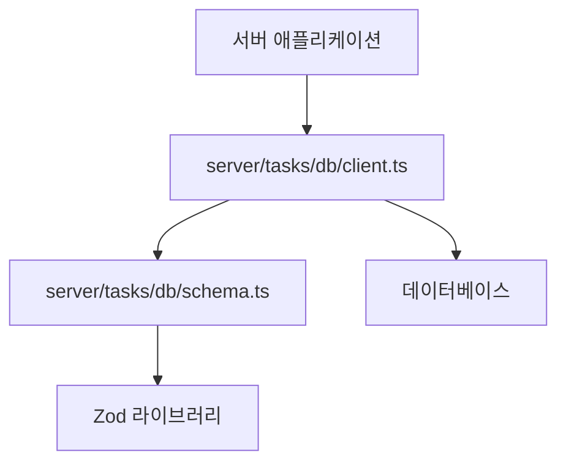
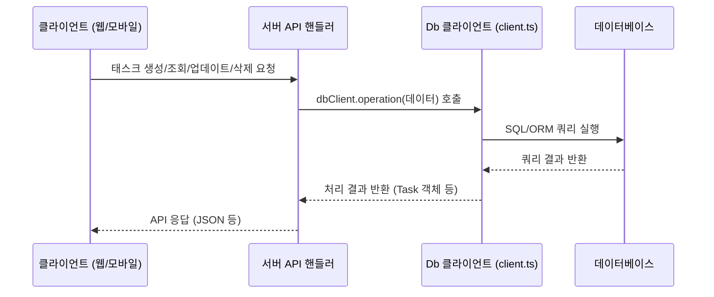
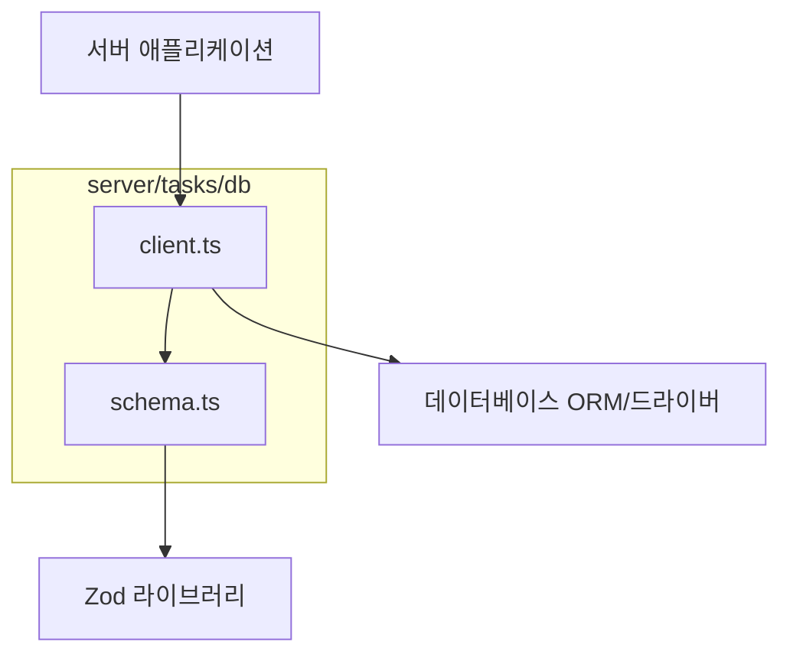

<cite>server/tasks/db/client.ts</cite>
<cite>server/tasks/db/schema.ts</cite>

### 개요

이 모듈은 서버 애플리케이션 내에서 태스크(Task)와 관련된 데이터베이스 작업을 효율적이고 안정적으로 관리하기 위해 설계되었습니다. `server/tasks/db/schema.ts`는 태스크 데이터의 구조와 유효성 규칙을 정의하며, `server/tasks/db/client.ts`는 이러한 스키마를 기반으로 데이터베이스와의 상호작용을 위한 강력한 인터페이스를 제공합니다. 이를 통해 태스크 데이터의 일관성을 유지하고, 개발자가 복잡한 SQL 쿼리 대신 추상화된 메서드를 사용하여 쉽게 데이터를 조작할 수 있도록 돕습니다.

### 아키텍처 다이어그램

#### 1. 모듈 아키텍처 개요

이 다이어그램은 `server/tasks/db` 모듈이 전체 서버 애플리케이션 및 실제 데이터베이스와 어떻게 상호작용하는지 보여줍니다. `client.ts`는 애플리케이션의 요청을 받아 `schema.ts`에 정의된 구조를 활용하여 데이터베이스와 통신합니다.



#### 2. 데이터 흐름 다이어그램

클라이언트로부터의 태스크 관련 요청이 서버 API 핸들러를 거쳐 `dbClient`를 통해 데이터베이스에 접근하고, 그 결과가 다시 사용자에게 전달되는 과정을 보여줍니다.



#### 3. 모듈 의존성 다이어그램

`server/tasks/db` 내부의 `client.ts`와 `schema.ts` 간의 의존성 및 외부 라이브러리(Zod)와의 관계를 나타냅니다.



### 주요 함수/클래스

이 섹션에서는 `server/tasks/db` 모듈에서 제공하는 핵심 함수 및 클래스에 대해 설명합니다.

*   `TaskSchema` (from `schema.ts`)
    *   시그니처: `const TaskSchema = z.object({ id: z.string().uuid(), title: z.string().min(1), description: z.string().nullable(), status: z.enum(['pending', 'in-progress', 'completed']), createdAt: z.date(), updatedAt: z.date(), });`
    *   설명: 데이터베이스에 저장될 태스크 객체의 구조와 각 필드의 유효성을 정의하는 Zod 스키마입니다. 이 스키마는 태스크의 고유 ID, 제목, 상세 설명, 현재 상태, 생성 및 업데이트 시각 등 모든 속성을 명시합니다. 이를 통해 입력 데이터의 유효성을 자동으로 검증하고, 데이터베이스에 잘못된 형식의 데이터가 저장되는 것을 방지하여 데이터 무결성을 보장합니다. 또한, API 요청 유효성 검사 등 다양한 계층에서 재사용될 수 있습니다.

*   `Task` (from `schema.ts`)
    *   시그니처: `type Task = z.infer<typeof TaskSchema>;`
    *   설명: `TaskSchema`를 기반으로 자동으로 추론되는 TypeScript 타입입니다. 이 타입은 데이터베이스에서 조회되거나 애플리케이션 내부에서 다루어지는 모든 태스크 객체의 형태를 정확하게 정의합니다. 개발자는 이 `Task` 타입을 활용하여 코드 전반에 걸쳐 강력한 타입 안전성을 확보하고, 컴파일 시점에 잠재적인 타입 불일치 오류를 발견할 수 있습니다.

*   `NewTask` (from `schema.ts`)
    *   시그니처: `type NewTask = z.infer<typeof TaskSchema.omit({ id: true, createdAt: true, updatedAt: true })>;`
    *   설명: 새로운 태스크를 생성할 때 필요한 필드만을 정의하는 TypeScript 타입입니다. 일반적으로 `id`, `createdAt`, `updatedAt`와 같이 데이터베이스에서 자동으로 생성되거나 관리되는 필드를 제외한 나머지 필드들을 포함합니다. 이 타입을 사용하면 태스크 생성 시 필수적으로 제공해야 하는 데이터만 명시적으로 요구할 수 있어 API 인터페이스의 명확성을 높입니다.

*   `dbClient` (from `client.ts`)
    *   시그니처: `const dbClient = { createTask, getTaskById, updateTask, deleteTask, listTasks };`
    *   설명: 태스크 데이터베이스에 접근하기 위한 핵심 클라이언트 객체입니다. 이 객체는 데이터베이스와의 실제 상호작용을 캡슐화하며, 태스크와 관련된 모든 CRUD(Create, Read, Update, Delete) 작업을 위한 고수준의 메서드를 제공합니다. 애플리케이션의 다른 부분에서는 이 `dbClient` 인스턴스를 통해 데이터베이스에 직접 접근하는 대신 추상화된 메서드를 호출하여 데이터 작업을 수행합니다.

*   `createTask` (from `client.ts`)
    *   시그니처: `async createTask(newTask: NewTask): Promise<Task>`
    *   설명: 새로운 태스크 레코드를 데이터베이스에 삽입합니다. `NewTask` 타입의 객체를 인자로 받아 유효성 검사를 수행한 후 데이터베이스에 저장합니다. 성공적으로 생성된 태스크 객체(ID, 생성 시각 등 포함)를 `Promise<Task>` 형태로 반환합니다. 이 메서드는 데이터베이스 트랜잭션 관리 및 오류 처리 로직을 내부적으로 포함할 수 있습니다.

*   `getTaskById` (from `client.ts`)
    *   시그니처: `async getTaskById(id: string): Promise<Task | null>`
    *   설명: 주어진 고유 ID에 해당하는 태스크 레코드를 데이터베이스에서 조회합니다. 해당 ID의 태스크가 존재하면 `Task` 객체를 `Promise`로 반환하고, 찾을 수 없으면 `null`을 반환합니다. 이 메서드는 특정 태스크의 상세 정보를 조회하거나, 다른 작업에 앞서 태스크의 존재 여부를 확인하는 데 사용됩니다.

*   `updateTask` (from `client.ts`)
    *   시그니처: `async updateTask(id: string, updates: Partial<NewTask>): Promise<Task | null>`
    *   설명: 특정 ID를 가진 기존 태스크 레코드를 업데이트합니다. `id`와 함께 업데이트할 필드들을 포함하는 `Partial<NewTask>` 타입의 객체를 인자로 받습니다. 성공적으로 업데이트된 태스크 객체를 `Promise<Task>` 형태로 반환하며, 해당 ID의 태스크를 찾을 수 없는 경우 `null`을 반환합니다. `updatedAt` 필드는 자동으로 갱신될 수 있습니다.

*   `deleteTask` (from `client.ts`)
    *   시그니처: `async deleteTask(id: string): Promise<boolean>`
    *   설명: 주어진 고유 ID에 해당하는 태스크 레코드를 데이터베이스에서 삭제합니다. 삭제 작업의 성공 여부를 나타내는 `boolean` 값을 `Promise`로 반환합니다. (`true`: 삭제 성공, `false`: 해당 ID의 태스크를 찾을 수 없어 삭제 실패) 이는 실제 데이터 삭제 또는 소프트 삭제(soft delete) 방식으로 구현될 수 있습니다.

*   `listTasks` (from `client.ts`)
    *   시그니처: `async listTasks(options?: { status?: 'pending' | 'in-progress' | 'completed'; limit?: number; offset?: number; }): Promise<Task[]>`
    *   설명: 데이터베이스에 저장된 태스크 목록을 조회합니다. `options` 객체를 통해 특정 상태의 태스크를 필터링하거나, 페이지네이션(limit, offset)을 적용하여 결과를 제한할 수 있습니다. 조건에 맞는 태스크 객체들의 배열을 `Promise<Task[]>` 형태로 반환합니다. 이 메서드는 대시보드나 목록 화면에 태스크를 표시할 때 유용합니다.

### 설정/사용법

`server/tasks/db` 모듈을 사용하여 태스크 데이터를 관리하는 방법에 대한 예시 코드입니다.

#### 예시 1: 클라이언트 초기화 및 태스크 생성

```typescript
import { dbClient } from './client';
import { NewTask } from './schema'; // NewTask 타입 임포트

/**
 * 새로운 태스크를 생성하고 데이터베이스에 저장하는 함수
 * @param title 태스크의 제목
 * @param description 태스크의 상세 설명 (선택 사항)
 * @returns 생성된 태스크 객체
 */
async function createNewTask(title: string, description?: string) {
  // NewTask 타입에 맞는 객체 생성
  const newTask: NewTask = {
    title,
    description: description || null, // 설명이 없으면 null로 설정
    status: 'pending', // 기본 상태는 'pending'
    createdAt: new Date(), // 현재 시각으로 생성 시각 기록
    updatedAt: new Date(), // 현재 시각으로 업데이트 시각 기록
  };

  try {
    // dbClient를 사용하여 태스크 생성 요청
    const createdTask = await dbClient.createTask(newTask);
    console.log('✅ 새로운 태스크가 성공적으로 생성되었습니다:', createdTask);
    return createdTask;
  } catch (error) {
    console.error('❌ 태스크 생성 중 오류 발생:', error);
    // 오류 발생 시 추가적인 로깅 또는 사용자에게 오류 메시지 전달
    throw new Error(`태스크를 생성할 수 없습니다: ${(error as Error).message}`);
  }
}

// 함수 사용 예시
(async () => {
  console.log('--- 태스크 생성 예시 시작 ---');
  await createNewTask('월간 보고서 초안 작성', '다음 주까지 초안을 완성하고 팀에 공유');
  await createNewTask('회의록 정리', '오전 회의 내용 정리 및 액션 아이템 배정');
  console.log('--- 태스크 생성 예시 종료 ---');
})();
```

#### 예시 2: 태스크 조회, 업데이트 및 목록 조회

```typescript
import { dbClient } from './client';
import { Task } from './schema'; // Task 타입 임포트

/**
 * 특정 태스크의 상태를 업데이트하는 함수
 * @param taskId 업데이트할 태스크의 고유 ID
 * @param newStatus 변경할 태스크의 새 상태
 * @returns 업데이트된 태스크 객체 또는 null (태스크를 찾지 못한 경우)
 */
async function updateTaskStatus(taskId: string, newStatus: 'pending' | 'in-progress' | 'completed') {
  try {
    // 먼저 기존 태스크를 조회하여 존재하는지 확인
    const existingTask = await dbClient.getTaskById(taskId);
    if (!existingTask) {
      console.warn(`⚠️ 태스크 ID "${taskId}"를 찾을 수 없어 업데이트를 건너뜜니다.`);
      return null;
    }

    // 업데이트할 필드 정의 (updatedAt은 자동으로 갱신)
    const updates = {
      status: newStatus,
      updatedAt: new Date(),
    };

    // dbClient를 사용하여 태스크 업데이트 요청
    const updatedTask = await dbClient.updateTask(taskId, updates);
    console.log(`✅ 태스크 ID "${taskId}"의 상태가 "${newStatus}"로 업데이트되었습니다:`, updatedTask);
    return updatedTask;
  } catch (error) {
    console.error(`❌ 태스크 ID "${taskId}" 업데이트 중 오류 발생:`, error);
    throw new Error(`태스크 업데이트 실패: ${(error as Error).message}`);
  }
}

/**
 * 모든 (또는 필터링된) 태스크 목록을 조회하는 함수
 */
async function fetchAndListAllTasks() {
  console.log('--- 태스크 목록 조회 예시 시작 ---');
  try {
    // 모든 태스크를 조회 (필터링 및 페이지네이션 없이)
    const allTasks = await dbClient.listTasks();
    console.log('현재 모든 태스크 목록:', allTasks);

    // 'in-progress' 상태의 태스크만 조회 (최대 5개)
    const inProgressTasks = await dbClient.listTasks({ status: 'in-progress', limit: 5 });
    console.log('진행 중인 태스크 (최대 5개):', inProgressTasks);
  } catch (error) {
    console.error('❌ 태스크 목록 조회 중 오류 발생:', error);
    throw new Error(`태스크 목록 조회 실패: ${(error as Error).message}`);
  } finally {
    console.log('--- 태스크 목록 조회 예시 종료 ---');
  }
}

// 함수 사용 예시
(async () => {
  console.log('--- 태스크 업데이트 및 목록 조회 예시 시작 ---');
  // 실제 존재하는 태스크 ID로 대체해야 합니다.
  const sampleTaskId = 'a1b2c3d4-e5f6-7890-1234-567890abcdef';
  await updateTaskStatus(sampleTaskId, 'in-progress');
  await fetchAndListAllTasks();
  console.log('--- 태스크 업데이트 및 목록 조회 예시 종료 ---');
})();
```

### 문제 해결 가이드

이 섹션에서는 `server/tasks/db` 모듈을 사용하면서 발생할 수 있는 일반적인 문제와 해결책을 제시합니다.

#### 1. 스키마 유효성 검사 실패 (Zod Error)

*   **증상**: `createTask` 또는 `updateTask` 호출 시 `ZodError` 또는 "Invalid input"과 같은 오류 메시지가 발생하며 작업이 실패합니다. (예: "Expected string, received number at 'title'")
*   **원인**: 입력된 데이터가 `server/tasks/db/schema.ts`에 정의된 `TaskSchema`의 유효성 규칙을 따르지 않을 때 발생합니다. 필수 필드가 누락되었거나, 필드의 타입이 일치하지 않는 경우, 또는 특정 제약 조건(예: `min(1)`)을 위반했을 수 있습니다.
*   **해결책**:
    1.  오류 메시지를 자세히 확인하여 어떤 필드에서 어떤 유효성 문제가 발생했는지 파악합니다. Zod 오류 메시지는 문제의 경로와 기대되는/받은 값을 명확히 알려줍니다.
    2.  `createTask` 또는 `updateTask`에 전달하는 데이터 객체가 `NewTask` 또는 `Partial<Task>` 타입과 일치하는지, 그리고 `TaskSchema`의 각 필드 규칙(예: `z.string()`, `z.number().min(0)`, `z.enum([...])`)을 준수하는지 확인합니다.
    3.  개발 환경에서 입력 데이터에 대한 사전 유효성 검사 로직을 추가하여 명확한 오류 피드백을 제공할 수 있습니다. 예를 들어, API 엔드포인트에서 요청 바디를 `TaskSchema.parse(req.body)`로 미리 검증하는 단계를 추가합니다.

#### 2. 데이터베이스 연결 오류

*   **증상**: `dbClient`를 사용하는 모든 작업이 "Database connection failed", "Connection refused", 또는 이와 유사한 오류 메시지와 함께 실패합니다. 애플리케이션 시작 시에도 발생할 수 있습니다.
*   **원인**:
    1.  데이터베이스 서버가 실행 중이지 않거나 애플리케이션 서버에서 접근할 수 없는 상태입니다.
    2.  데이터베이스 연결 정보(호스트, 포트, 사용자명, 비밀번호, 데이터베이스 이름 등)가 환경 변수(`DATABASE_URL` 등)에 올바르게 설정되지 않았습니다. 오타, 잘못된 자격 증명, 또는 잘못된 포트 번호가 포함될 수 있습니다.
    3.  방화벽 설정으로 인해 애플리케이션 서버가 데이터베이스 서버에 접근하지 못합니다.
*   **해결책**:
    1.  데이터베이스 서버가 정상적으로 실행 중인지 확인합니다. (예: `docker ps`, `systemctl status postgresql` 명령 사용)
    2.  애플리케이션의 환경 변수 파일(`.env`) 또는 배포 환경에서 데이터베이스 연결 문자열이 올바르게 설정되어 있는지 확인합니다. 특히 비밀번호에 특수문자가 포함된 경우 URL 인코딩이 올바르게 되었는지 검토합니다.
    3.  네트워크 설정 및 방화벽 규칙을 검토하여 애플리케이션 서버에서 데이터베이스 포트로의 접근이 허용되어 있는지 확인합니다. (예: `telnet <db_host> <db_port>`)

#### 3. 특정 태스크를 찾을 수 없음

*   **증상**: `getTaskById`, `updateTask`, `deleteTask` 호출 시 예상과 달리 `null`이 반환되거나, "Task not found"와 같은 메시지가 발생합니다. 실제 데이터가 존재한다고 확신할 때 더욱 혼란스럽습니다.
*   **원인**:
    1.  제공된 태스크 ID가 데이터베이스에 실제로 존재하지 않습니다.
    2.  태스크 ID가 올바르지 않거나, 대소문자 구분을 포함하여 정확히 일치하지 않습니다. (특히 UUID 형식의 ID는 정확해야 합니다.)
    3.  데이터베이스에 데이터가 존재하지만, 쿼리 조건(예: `soft delete`된 태스크는 제외, 특정 사용자에게만 속한 태스크 필터링) 때문에 검색되지 않는 경우입니다.
*   **해결책**:
    1.  사용하려는 태스크 ID가 데이터베이스에 실제로 존재하는지 데이터베이스 클라이언트나 관리 도구(예: `psql`, `DBeaver`)를 통해 직접 확인합니다. ID를 복사하여 붙여넣기 할 때 공백이나 오타가 없는지 주의합니다.
    2.  태스크 ID를 전달하는 코드에서 오타나 불필요한 공백이 없는지 확인합니다. UUID와 같은 ID는 정확히 일치해야 합니다.
    3.  `getTaskById`와 같은 조회 함수가 `null`을 반환할 경우, 이를 적절히 처리하는 로직(예: 사용자에게 "요청하신 태스크를 찾을 수 없습니다" 메시지 표시)을 구현하여 애플리케이션이 견고하게 동작하도록 합니다.
    4.  `dbClient` 내부의 쿼리 로직을 검토하여, 의도치 않은 필터링 조건이 적용되어 태스크가 검색되지 않는 것은 아닌지 확인합니다.