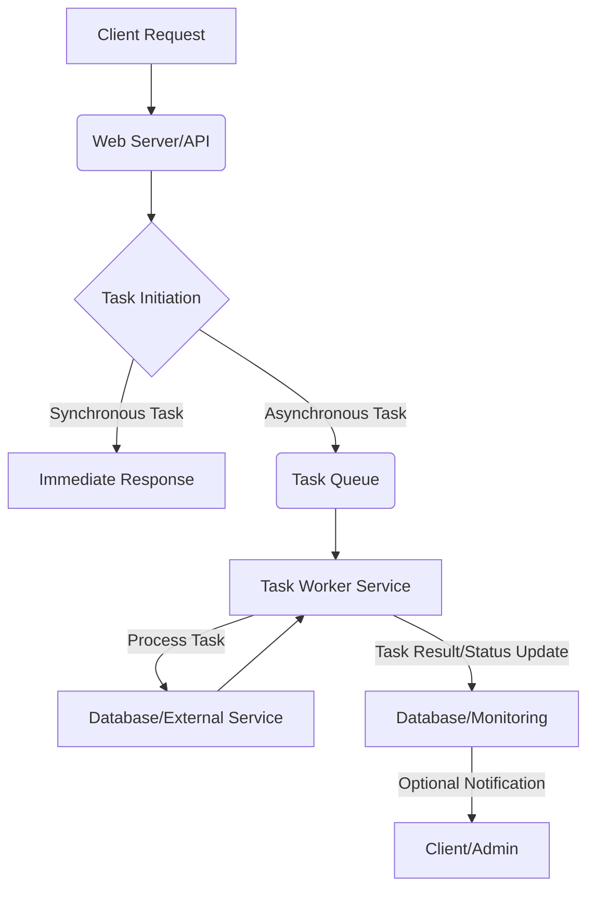
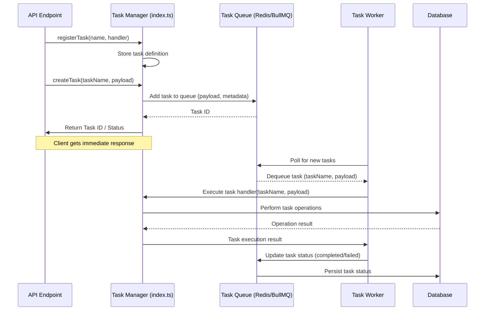

<cite>server/tasks/index.ts</cite>

## 개요

이 모듈은 서버에서 실행되는 모든 백그라운드 작업을 중앙 집중식으로 관리하고 오케스트레이션합니다. 비동기 작업을 효율적으로 처리하고, 시스템 부하를 분산하며, 주기적인 유지보수 작업을 자동화하는 데 핵심적인 역할을 수행합니다. 이를 통해 사용자 요청 처리와 무관하게 장시간이 소요되거나 반복적으로 실행되어야 하는 작업들을 안정적으로 관리할 수 있습니다.

## 아키텍처 다이어그램



## 작업 데이터 흐름 다이어그램



## 의존성 다이어그램

```mermaid
graph TD
    subgraph server/tasks
        A[index.ts] --> B(Task Scheduler)
        A --> C(Task Executor)
        A --> D(Task Definitions)
    end

    B --> E[Cron Library]
    C --> F[Queue Library (e.g., BullMQ)]
    C --> G[Logger]
    C --> H[Database ORM]
    F --> I[Redis]
```

## 주요 함수/클래스

이 모듈은 주로 다음과 같은 함수와 클래스를 노출하거나 내부적으로 사용합니다.

*   **`registerTask(name: string, handler: TaskHandler, options?: TaskOptions)`**
    *   **설명**: 새로운 백그라운드 작업을 시스템에 등록합니다. `name`은 작업의 고유 식별자이며, `handler`는 실제 작업을 수행하는 비동기 함수입니다. `options`를 통해 작업의 재시도 횟수, 지연 시간, 스케줄링(cron) 등을 설정할 수 있습니다.
    *   **시그니처**: `function registerTask(name: string, handler: (payload: any) => Promise<any>, options?: { cron?: string; retries?: number; delay?: number; })`

*   **`createTask(name: string, payload: any)`**
    *   **설명**: 이전에 등록된 작업을 실행 대기열에 추가합니다. `name`으로 식별되는 작업을 `payload` 데이터를 사용하여 실행하도록 요청합니다. 이 함수는 작업을 즉시 실행하는 대신, 작업 큐에 추가하고 작업 ID를 반환하여 호출자가 비동기적으로 작업 상태를 추적할 수 있도록 합니다.
    *   **시그니처**: `function createTask(name: string, payload: any): Promise<{ taskId: string; status: TaskStatus; }>`

*   **`getTaskStatus(taskId: string)`**
    *   **설명**: 특정 `taskId`에 해당하는 작업의 현재 상태를 조회합니다. 이 함수는 작업의 진행 상황(예: 대기 중, 진행 중, 완료됨, 실패함) 및 결과 또는 오류 메시지를 반환합니다.
    *   **시그니처**: `function getTaskStatus(taskId: string): Promise<{ status: TaskStatus; result?: any; error?: string; } | null>`

*   **`startTaskWorkers()`**
    *   **설명**: 등록된 작업들을 처리할 워커 프로세스를 시작합니다. 이 함수는 일반적으로 애플리케이션 시작 시 한 번 호출되며, 작업 큐에서 작업을 가져와 해당 핸들러를 실행하는 역할을 합니다.
    *   **시그니처**: `function startTaskWorkers(): Promise<void>`

*   **`TaskDefinition` (인터페이스/타입)**
    *   **설명**: 등록된 각 작업의 구조를 정의하는 타입입니다. 작업의 이름, 실행 핸들러, 그리고 스케줄링이나 재시도와 같은 옵션들을 포함합니다.
    *   **시그니처**:
        ```typescript
        interface TaskDefinition {
            name: string;
            handler: (payload: any) => Promise<any>;
            options?: {
                cron?: string;
                retries?: number;
                delay?: number;
            };
        }
        ```

## 설정/사용법 섹션

이 모듈을 설정하고 사용하는 방법은 다음과 같습니다.

**초기 설정 및 작업 등록:**

애플리케이션의 시작 부분(예: `src/app.ts` 또는 `src/server.ts`)에서 `server/tasks` 모듈을 초기화하고 필요한 작업을 등록합니다.

```typescript
// server/tasks/index.ts (내부 구현 가정)
import { registerTask, startTaskWorkers, createTask } from './index';
import { sendEmail } from '../services/emailService';
import { generateReport } from '../services/reportService';

// 1. 작업 등록
registerTask('sendWelcomeEmail', async (payload: { userId: string; email: string; }) => {
    console.log(`Sending welcome email to ${payload.email} for user ${payload.userId}`);
    await sendEmail(payload.email, 'Welcome!', 'Thank you for joining!');
    return { status: 'email_sent', userId: payload.userId };
}, { retries: 3, delay: 1000 }); // 3회 재시도, 1초 간격

registerTask('dailyReportGeneration', async (payload: { date: string; }) => {
    console.log(`Generating daily report for ${payload.date}`);
    const reportPath = await generateReport(payload.date);
    return { status: 'report_generated', path: reportPath };
}, { cron: '0 0 * * *' }); // 매일 자정 실행

// 2. 작업 워커 시작 (애플리케이션 초기화 시)
async function initializeTasks() {
    console.log('Starting task workers...');
    await startTaskWorkers();
    console.log('Task workers started.');
}

initializeTasks();
```

**작업 실행 요청:**

API 엔드포인트나 다른 서비스 로직에서 비동기 작업을 요청합니다.

```typescript
// src/controllers/userController.ts
import { createTask } from '../../server/tasks/index';
import { Request, Response } from 'express'; // 예시를 위한 타입 임포트

class UserController {
    async registerUser(req: Request, res: Response) {
        const { username, email } = req.body;
        // ... 사용자 생성 로직 ...

        // 환영 이메일 전송 작업을 비동기적으로 생성
        try {
            const task = await createTask('sendWelcomeEmail', { userId: 'newUserId123', email });
            console.log(`Welcome email task created: ${task.taskId}`);
            res.status(201).json({ message: 'User registered, email will be sent soon.', taskId: task.taskId });
        } catch (error) {
            console.error('Failed to create email task:', error);
            res.status(201).json({ message: 'User registered, but failed to queue email task.' });
        }
    }
}
```

## 문제 해결 가이드

*   **문제 1: 작업이 실행되지 않거나 지연됩니다.**
    *   **원인**:
        1.  `startTaskWorkers()` 함수가 호출되지 않았거나, 작업 워커 프로세스가 제대로 시작되지 않았을 수 있습니다.
        2.  작업 큐(예: Redis) 서버에 문제가 있거나 연결이 끊어졌을 수 있습니다.
        3.  작업 워커의 처리량이 부족하거나, 장시간 실행되는 다른 작업들로 인해 큐가 정체되었을 수 있습니다.
        4.  스케줄링된 작업(cron)의 크론 표현식이 잘못되었을 수 있습니다.
    *   **해결책**:
        1.  애플리케이션 시작 로그에서 `startTaskWorkers()` 호출 여부와 워커 시작 성공 메시지를 확인하세요.
        2.  작업 큐 서버(예: Redis)의 상태를 확인하고, 서버와 애플리케이션 간의 네트워크 연결을 점검하세요.
        3.  워커 프로세스의 수를 늘리거나, 작업 핸들러의 성능을 최적화하여 처리량을 개선하세요.
        4.  크론 표현식 검증 도구를 사용하여 스케줄이 올바른지 확인하세요.

*   **문제 2: 작업이 실패하고 재시도 후에도 완료되지 않습니다.**
    *   **원인**:
        1.  작업 핸들러 내부에서 예상치 못한 오류가 발생했습니다.
        2.  작업에 필요한 외부 서비스(데이터베이스, API 등)에 문제가 발생했습니다.
        3.  재시도 횟수(`retries` 옵션)가 너무 낮게 설정되었거나, 작업 자체가 본질적으로 불안정합니다.
        4.  작업 페이로드(payload) 데이터가 유효하지 않아 핸들러가 처리할 수 없습니다.
    *   **해결책**:
        1.  작업 실패 로그를 상세히 확인하여 정확한 오류 메시지와 스택 트레이스를 분석합니다. 필요한 경우 로깅 수준을 높입니다.
        2.  작업 핸들러가 의존하는 외부 서비스의 상태를 점검하고, 네트워크 연결을 확인합니다.
        3.  `retries` 옵션을 적절히 조정하거나, 지수 백오프(exponential backoff)와 같은 재시도 전략을 고려합니다.
        4.  `createTask` 호출 시 전달되는 `payload`의 유효성을 검사하는 로직을 추가하고, 핸들러 내에서도 입력 유효성 검사를 수행합니다.

*   **문제 3: 작업 상태 조회가 올바르지 않거나 최신 상태를 반영하지 않습니다.**
    *   **원인**:
        1.  `getTaskStatus()`가 조회하는 데이터 저장소(예: 데이터베이스 또는 큐 시스템의 메타데이터)가 최신 상태로 업데이트되지 않았을 수 있습니다.
        2.  작업 워커가 작업을 완료한 후 상태를 업데이트하는 데 실패했거나 지연되고 있습니다.
        3.  여러 인스턴스에서 작업이 실행될 때 상태 동기화 문제가 발생할 수 있습니다.
    *   **해결책**:
        1.  작업 워커가 작업을 완료하거나 실패할 때 상태 업데이트 로직이 정상적으로 작동하는지 로그를 통해 확인합니다.
        2.  작업 큐 시스템의 상태 관리 메커니즘을 이해하고, 해당 시스템이 상태를 어떻게 지속하고 동기화하는지 검토합니다.
        3.  분산 환경에서 작업 상태를 관리하는 경우, 일관성 모델을 고려하여 상태 업데이트가 모든 노드에 전파되는지 확인합니다. 필요하다면 큐 시스템의 모니터링 대시보드를 활용하여 실시간 상태를 확인합니다.