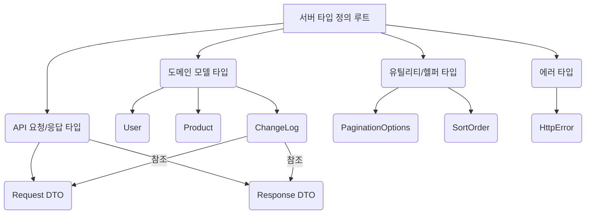
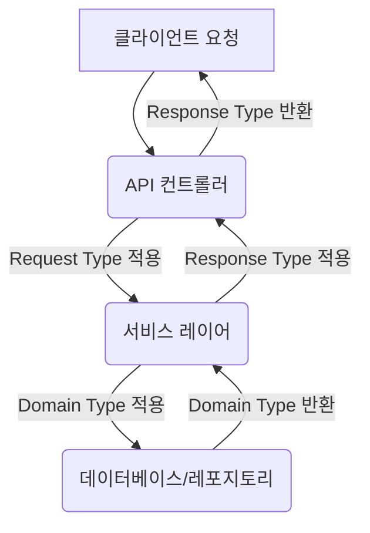

<cite>server/types/change-log.ts</cite>

### 개요

본 문서는 서버 애플리케이션의 타입 정의를 다루며, 특히 `change-log.ts` 파일을 통해 변경 이력 관리와 관련된 타입 정의의 목적과 역할을 설명합니다. 서버 타입 정의는 데이터 모델, API 요청/응답 구조, 내부 로직에서 사용되는 객체 형태 등을 명확하게 정의하여 개발 과정에서 발생할 수 있는 타입 관련 오류를 방지하고 코드의 가독성 및 유지보수성을 향상시키는 데 기여합니다. `change-log.ts`는 시스템의 중요한 변경 사항을 기록하고 관리하는 데 필요한 데이터 구조를 타입 레벨에서 정의함으로써, 데이터의 일관성과 정확성을 보장합니다.

### Mermaid 다이어그램

#### 1. 서버 타입 정의 구조 및 분류


설명: 서버 타입 정의는 크게 API 요청/응답, 도메인 모델, 유틸리티, 에러 타입 등으로 분류됩니다. `ChangeLog`와 같은 도메인 모델 타입은 API 요청/응답 타입 정의의 기반이 되며, 데이터의 핵심 구조를 정의합니다.

#### 2. 서버 데이터 흐름 내 타입 적용


설명: 클라이언트 요청이 서버에 도달하면, API 컨트롤러부터 데이터베이스 접근까지 각 레이어에서 적절한 타입 정의가 적용됩니다. 요청 데이터는 Request DTO 타입으로, 서비스 로직 및 데이터베이스 상호작용은 도메인 모델 타입으로, 최종 응답은 Response DTO 타입으로 명확하게 정의되어 데이터 흐름의 일관성을 유지합니다.

### 주요 타입 정의

`server/types/change-log.ts` 파일에서 정의될 수 있는 주요 타입들은 다음과 같습니다.

*   **`ChangeLogAction`**
    *   **시그니처**: `enum ChangeLogAction { 'CREATE', 'UPDATE', 'DELETE', 'LOGIN', 'LOGOUT', 'CONFIG_CHANGE' }`
    *   **설명**: 변경 로그 항목이 나타내는 동작의 유형을 정의하는 열거형입니다. 시스템에서 발생하는 다양한 이벤트(생성, 업데이트, 삭제, 로그인 등)를 명확하게 구분하는 데 사용됩니다.

*   **`ChangeLogTargetType`**
    *   **시그니처**: `enum ChangeLogTargetType { 'USER', 'PRODUCT', 'ORDER', 'SYSTEM_SETTING', 'API_KEY' }`
    *   **설명**: 변경 로그가 적용되는 대상 엔티티의 유형을 정의하는 열거형입니다. 어떤 종류의 객체에 변경이 발생했는지 식별하는 데 사용됩니다.

*   **`ChangeLogEntry`**
    *   **시그니처**: `interface ChangeLogEntry { id: string; timestamp: Date; actorId: string; actorName: string; action: ChangeLogAction; targetType: ChangeLogTargetType; targetId: string; description: string; details?: Record<string, any>; }`
    *   **설명**: 단일 변경 로그 항목의 구조를 정의하는 인터페이스입니다. 변경 시각, 변경을 수행한 사용자 정보, 변경 작업 유형, 대상 엔티티 유형 및 ID, 변경 내용 요약, 그리고 추가적인 세부 정보를 포함합니다.

*   **`CreateChangeLogRequest`**
    *   **시그니처**: `interface CreateChangeLogRequest { actorId: string; actorName: string; action: ChangeLogAction; targetType: ChangeLogTargetType; targetId: string; description: string; details?: Record<string, any>; }`
    *   **설명**: 새로운 변경 로그 항목을 생성하기 위한 API 요청의 본문(body) 타입을 정의합니다. `ChangeLogEntry`와 유사하지만, `id`나 `timestamp`와 같이 서버에서 자동으로 생성되는 필드는 제외됩니다.

*   **`GetChangeLogsQuery`**
    *   **시그니처**: `interface GetChangeLogsQuery { page?: number; limit?: number; search?: string; action?: ChangeLogAction; targetType?: ChangeLogTargetType; actorId?: string; startDate?: Date; endDate?: Date; sortBy?: keyof ChangeLogEntry; sortOrder?: 'asc' | 'desc'; }`
    *   **설명**: 변경 로그 목록을 조회하기 위한 API 요청의 쿼리 파라미터 타입을 정의합니다. 페이지네이션, 검색, 필터링, 정렬 등 다양한 조회 조건을 포함합니다.

### 설정/사용법 섹션

`server/types/change-log.ts`에 정의된 타입들은 서버의 컨트롤러, 서비스, 레포지토리 등 다양한 계층에서 데이터의 유효성을 검증하고 일관성을 유지하는 데 활용됩니다.

#### 1. 변경 로그 생성 API 컨트롤러에서 사용

```typescript
// src/controllers/change-log.controller.ts
import { Request, Response } from 'express';
import { ChangeLogService } from '../services/change-log.service';
import { CreateChangeLogRequest, ChangeLogEntry } from '../types/change-log';

export class ChangeLogController {
    constructor(private changeLogService: ChangeLogService) {}

    public async createChangeLog(req: Request<{}, {}, CreateChangeLogRequest>, res: Response<ChangeLogEntry>): Promise<void> {
        try {
            const newLogData: CreateChangeLogRequest = req.body;
            // DTO 유효성 검사 (예: class-validator 사용 시)
            // await validateOrReject(plainToClass(CreateChangeLogRequest, newLogData));

            const createdLog = await this.changeLogService.addLog(newLogData);
            res.status(201).json(createdLog);
        } catch (error) {
            // 에러 처리 로직
            console.error('Failed to create change log:', error);
            res.status(500).json({ message: 'Internal Server Error' } as any);
        }
    }
}
```

#### 2. 변경 로그 서비스 계층에서 사용

```typescript
// src/services/change-log.service.ts
import { ChangeLogRepository } from '../repositories/change-log.repository';
import { ChangeLogEntry, CreateChangeLogRequest, GetChangeLogsQuery } from '../types/change-log';

export class ChangeLogService {
    constructor(private changeLogRepository: ChangeLogRepository) {}

    public async addLog(logData: CreateChangeLogRequest): Promise<ChangeLogEntry> {
        // 비즈니스 로직 (예: 추가 유효성 검사, 데이터 가공)
        const fullLogEntry: ChangeLogEntry = {
            id: 'generated-id-' + Date.now(), // 실제로는 UUID 등을 사용
            timestamp: new Date(),
            ...logData,
        };
        return this.changeLogRepository.save(fullLogEntry);
    }

    public async getLogs(query: GetChangeLogsQuery): Promise<ChangeLogEntry[]> {
        // 필터링, 페이지네이션, 정렬 로직 적용
        return this.changeLogRepository.find(query);
    }
}
```

### 문제 해결 가이드

1.  **타입 불일치 오류 (`Type 'X' is not assignable to type 'Y'`)**
    *   **문제**: API 요청 본문이나 데이터베이스에서 가져온 객체가 예상하는 인터페이스/타입과 구조가 다를 때 발생합니다.
    *   **해결**:
        *   **데이터 구조 확인**: 실제 데이터가 기대하는 타입 정의와 정확히 일치하는지 확인합니다. 누락된 필드나 잘못된 타입의 필드가 있는지 검토합니다.
        *   **타입 캐스팅/변환**: 외부 입력(예: HTTP 요청 본문)의 경우, 직접 할당하기 전에 `plainToClass` (class-transformer), `Object.assign` 또는 수동 매핑을 통해 예상 타입으로 변환하거나 유효성을 검사합니다.
        *   **타입 정의 업데이트**: 실제 데이터 구조가 변경되었다면, `server/types/change-log.ts` 내의 해당 타입 정의를 최신화합니다.

2.  **선택적 필드 처리 부족 (`Object is possibly 'undefined'`)**
    *   **문제**: 인터페이스에서 `field?: Type`과 같이 선택적(optional)으로 정의된 필드를 사용할 때, 해당 필드가 존재하지 않을 가능성을 고려하지 않고 직접 접근할 경우 발생합니다.
    *   **해결**:
        *   **널/언디파인드 체크**: `if (obj.field)` 또는 `obj.field?.property` (선택적 체이닝)를 사용하여 필드의 존재 여부를 먼저 확인합니다.
        *   **기본값 설정**: 필드가 없을 경우 사용할 기본값을 설정합니다 (예: `const value = obj.field || defaultValue;`).
        *   **타입 가드 활용**: `if (obj.field !== undefined)`와 같은 타입 가드를 사용하여 TypeScript 컴파일러에게 해당 스코프 내에서 필드가 존재함을 알립니다.

3.  **타입 정의 누락 또는 불완전성**
    *   **문제**: 새로운 기능이 추가되거나 기존 기능이 확장될 때, 관련 타입 정의가 누락되거나 필요한 모든 필드를 포함하지 않아 런타임 오류나 개발 시 예측 불가능한 동작을 유발할 수 있습니다.
    *   **해결**:
        *   **초기 설계 단계에서의 고려**: 기능 개발 시작 시, 해당 기능에 필요한 모든 데이터 구조를 먼저 타입으로 정의하는 습관을 들입니다.
        *   **코드 리뷰 강화**: 타입 정의의 완전성과 정확성을 검토하는 과정을 코드 리뷰에 포함시킵니다.
        *   **테스트 케이스 작성**: 타입 정의에 기반한 유닛 테스트나 통합 테스트를 작성하여, 정의된 타입과 실제 데이터 흐름 간의 불일치를 조기에 발견합니다. 특히 API 스펙 변경 시 타입 정의도 함께 업데이트되는지 확인합니다.