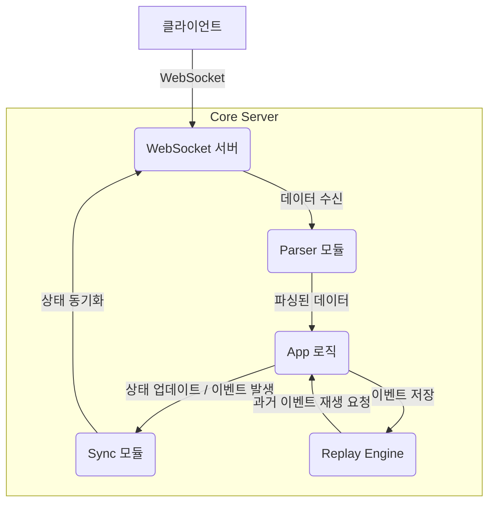
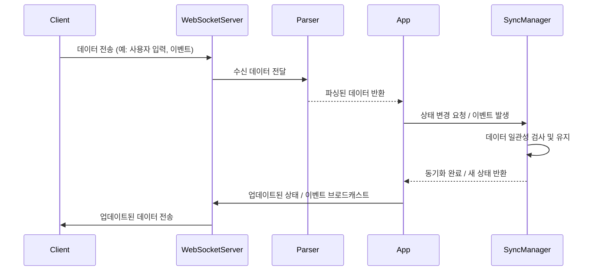

<cite>server/index.ts, server/app.ts, server/websocket.ts, server/parser.ts, server/replay-engine.ts, server/sync.ts</cite>

## 개요
이 서버 애플리케이션은 실시간 데이터 처리, 동기화, 그리고 이벤트 스트림 재생을 목적으로 합니다. 주로 웹소켓을 통해 클라이언트와 통신하며, 수신된 데이터를 파싱하고, 시스템 상태를 동기화하며, 필요에 따라 과거 이벤트를 재생하는 기능을 제공합니다. 견고한 동기화 실패 감지 및 복구 전략을 포함하여 데이터 일관성을 보장합니다.

## 아키텍처 다이어그램



## 데이터 흐름: 파싱 및 동기화



## 동기화 모듈 의존성

```mermaid
graph TD
    A[SyncManager (sync.ts)] --> B[SyncFailureDetector (sync-failure-detector.ts)]
    A --> C[SyncRecovery (sync-recovery.ts)]
    C --> D[SyncRecoveryStrategies (sync-recovery-strategies.ts)]
```

## 주요 함수/클래스

*   **`App` 클래스 (server/app.ts)**
    *   **설명**: 서버의 핵심 비즈니스 로직을 담당하며, 파싱된 데이터를 처리하고, 시스템 상태를 관리하며, `ReplayEngine` 및 `SyncManager`와 상호작용합니다.
    *   **시그니처**: `class App { constructor(websocketServer: WebSocketServer, parser: Parser, replayEngine: ReplayEngine, syncManager: SyncManager) }`

*   **`WebSocketServer` 클래스 (server/websocket.ts)**
    *   **설명**: 클라이언트와의 웹소켓 연결을 관리하고, 메시지를 수신 및 전송하며, 연결 상태를 추적합니다.
    *   **시그니처**: `class WebSocketServer { constructor(port: number); onMessage(callback: (client: WebSocket, message: string) => void): void; send(client: WebSocket, data: any): void; broadcast(data: any): void; }`

*   **`Parser` 클래스 (server/parser.ts)**
    *   **설명**: 특정 형식의 입력 데이터를 파싱하여 애플리케이션이 이해할 수 있는 구조화된 객체로 변환합니다. 파싱 유틸리티를 활용하여 복잡한 데이터 구조를 처리합니다.
    *   **시그니처**: `class Parser { parse(rawData: string): ParsedData; }`

*   **`ReplayEngine` 클래스 (server/replay-engine.ts)**
    *   **설명**: 과거에 발생한 이벤트나 저장된 데이터를 순서대로 재생하는 기능을 제공합니다. 특정 시점의 상태를 재구성하거나 시뮬레이션하는 데 사용됩니다.
    *   **시그니처**: `class ReplayEngine { loadReplayData(data: ReplayData[]): void; startReplay(onEvent: (event: any) => void, intervalMs: number): void; stopReplay(): void; }`

*   **`SyncManager` 클래스 (server/sync.ts)**
    *   **설명**: 분산 환경 또는 여러 클라이언트 간의 데이터 일관성을 유지하기 위한 동기화 로직을 관리합니다. `SyncFailureDetector`와 `SyncRecoveryStrategies`를 활용하여 동기화 문제를 해결합니다.
    *   **시그니처**: `class SyncManager { constructor(failureDetector: SyncFailureDetector, recoveryStrategies: SyncRecoveryStrategies); syncState(currentState: any, expectedState: any): Promise<any>; }`

*   **`Config` 객체 (server/config.ts)**
    *   **설명**: 서버 운영에 필요한 다양한 설정값들을 제공합니다. 환경 변수, 기본값 등을 통해 동적으로 로드될 수 있습니다.
    *   **시그니처**: `interface Config { port: number; logLevel: string; enableReplay: boolean; ... }`

## 설정/사용법 섹션

### 서버 실행 및 설정
서버는 `index.ts` 파일을 통해 시작되며, `config.ts`에서 정의된 설정값을 사용합니다.

```typescript
// server/index.ts
import { WebSocketServer } from './websocket';
import { Parser } from './parser';
import { ReplayEngine } from './replay-engine';
import { SyncManager } from './sync';
import { SyncFailureDetector } from './sync-failure-detector';
import { SyncRecoveryStrategies } from './sync-recovery-strategies';
import { App } from './app';
import { config } from './config';

async function bootstrap() {
    const wsServer = new WebSocketServer(config.port);
    const parser = new Parser();
    const replayEngine = new ReplayEngine();
    const failureDetector = new SyncFailureDetector();
    const recoveryStrategies = new SyncRecoveryStrategies();
    const syncManager = new SyncManager(failureDetector, recoveryStrategies);

    const app = new App(wsServer, parser, replayEngine, syncManager);

    // 웹소켓 메시지 핸들러 등록
    wsServer.onMessage((client, message) => {
        try {
            const parsedData = parser.parse(message);
            app.handleClientMessage(client, parsedData);
        } catch (error) {
            console.error('Parsing error:', error);
            wsServer.send(client, { type: 'error', message: 'Invalid data format' });
        }
    });

    console.log(`Server running on port ${config.port}`);
}

bootstrap();
```

### 설정 파일 예시

```typescript
// server/config.ts
import dotenv from 'dotenv';
import { Config } from './config.d';

dotenv.config();

export const config: Config = {
    port: parseInt(process.env.PORT || '8080', 10),
    logLevel: process.env.LOG_LEVEL || 'info',
    enableReplay: process.env.ENABLE_REPLAY === 'true',
    syncIntervalMs: parseInt(process.env.SYNC_INTERVAL_MS || '1000', 10),
    // 다른 설정들...
};
```

## 문제 해결 가이드

### 1. 웹소켓 연결 실패
*   **증상**: 클라이언트가 서버에 연결하지 못하거나, 연결이 즉시 끊어집니다.
*   **원인**:
    *   서버가 지정된 포트에서 실행되고 있지 않음.
    *   방화벽이 포트 접근을 차단하고 있음.
    *   클라이언트의 연결 URL이 잘못됨 (IP 주소, 포트 번호, 프로토콜).
*   **해결책**:
    1.  서버 로그를 확인하여 `Server running on port X` 메시지가 출력되었는지 확인합니다.
    2.  `config.ts` 파일에서 `port` 설정이 올바른지 확인합니다.
    3.  서버가 실행 중인 머신에서 해당 포트(예: 8080)가 방화벽에 의해 차단되지 않았는지 확인합니다.
    4.  클라이언트 코드에서 웹소켓 연결 URL이 `ws://localhost:8080` 또는 `wss://yourdomain.com`과 같이 올바른지 확인합니다.

### 2. 데이터 파싱 오류
*   **증상**: 서버에서 `Parsing error: ...` 메시지가 출력되거나, 클라이언트로부터 수신된 데이터가 제대로 처리되지 않습니다.
*   **원인**:
    *   클라이언트가 서버가 예상하는 데이터 형식과 다른 데이터를 전송하고 있습니다.
    *   `parser.ts` 모듈의 파싱 로직에 버그가 있습니다.
    *   데이터가 너무 크거나 손상되어 전송되었습니다.
*   **해결책**:
    1.  클라이언트가 전송하는 데이터의 형식이 `parser.ts`에서 정의된 예상 형식과 일치하는지 확인합니다. (예: JSON 문자열, 특정 구분자로 분리된 문자열).
    2.  `parser-debug.ts` 또는 `parser-utils.ts`를 활용하여 파싱 로직을 디버깅하고, 예상치 못한 입력에 대한 예외 처리가 잘 되어 있는지 검토합니다.
    3.  `WebSocketServer.onMessage` 핸들러 내에서 수신된 원본 메시지를 로그로 출력하여 실제 수신 데이터가 어떤 형태인지 확인합니다.

### 3. 동기화 실패 또는 데이터 불일치
*   **증상**: 여러 클라이언트가 동일한 서버 상태를 보고 있어야 하는데, 클라이언트마다 다른 상태를 표시하거나, 서버의 상태가 예상과 다르게 변경됩니다.
*   **원인**:
    *   `SyncManager`가 모든 상태 변경을 제대로 감지하고 전파하지 못하고 있습니다.
    *   `SyncFailureDetector`가 동기화 실패를 정확하게 식별하지 못합니다.
    *   `SyncRecoveryStrategies`가 불일치를 효과적으로 해결하지 못하고 있습니다.
    *   네트워크 지연이나 손실로 인해 동기화 메시지가 제때 도착하지 못했습니다.
*   **해결책**:
    1.  `SyncManager`의 `syncState` 호출 시점과 반환값을 상세히 로깅하여, 상태 변경이 일관되게 적용되는지 확인합니다.
    2.  `SyncFailureDetector`의 임계값이나 로직을 검토하여, 실제 불일치 상황에서 실패를 제대로 감지하는지 확인합니다.
    3.  `SyncRecoveryStrategies`의 복구 로직이 모든 가능한 불일치 시나리오를 처리하는지 검토하고, 필요한 경우 롤백 또는 강제 동기화 전략을 추가합니다.
    4.  네트워크 상태를 모니터링하고, 필요시 재전송 로직 또는 낙관적/비관적 동기화 전략을 도입하여 네트워크 불안정성에 대비합니다.