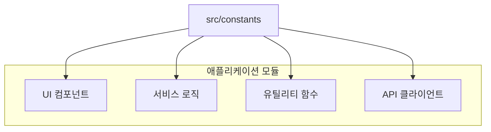
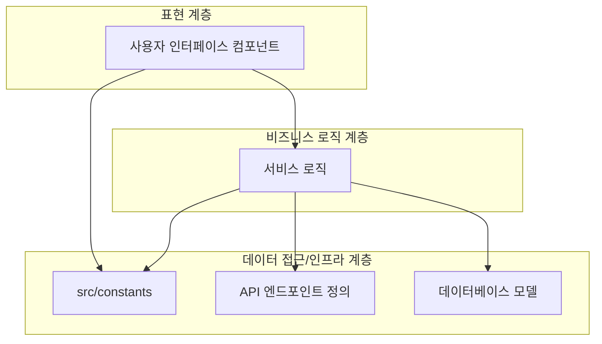
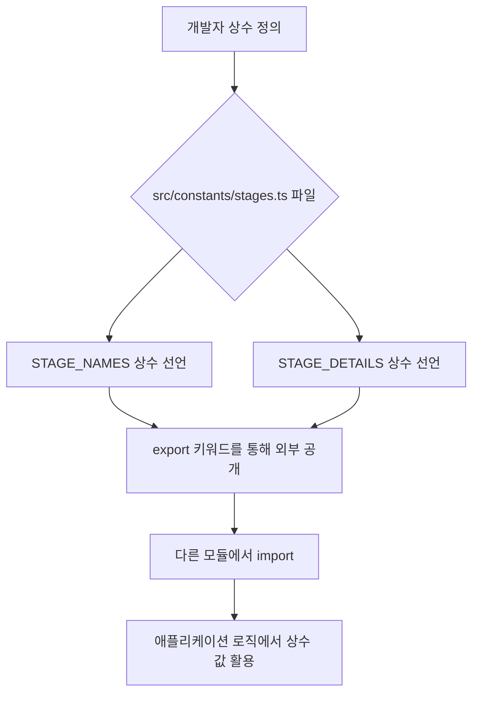

<cite>src/constants/index.ts (개념적) 및 src/constants/stages.ts</cite>

## 개요

`src/constants` 디렉토리는 애플리케이션 전반에 걸쳐 사용되는 불변(immutable) 값들을 중앙 집중화하여 관리하는 역할을 합니다. 이 모듈은 "매직 스트링"이나 "매직 넘버"의 사용을 방지하고, 코드의 가독성, 유지보수성 및 일관성을 크게 향상시킵니다. 시스템의 핵심적인 설정 값, 상태 코드, 메시지, 그리고 단계(stages)와 같은 고정된 데이터들을 한곳에 모아두어, 변경이 필요할 때 한 곳에서만 수정하면 되도록 설계되었습니다.

## Mermaid 다이어그램

### 1. 상수 모듈 의존성 다이어그램

`src/constants` 모듈이 애플리케이션의 다른 여러 모듈에 어떻게 상수 값을 제공하는지 보여줍니다. 상수 모듈은 하위 수준의 의존성을 가지지 않으면서, 다양한 상위 모듈에 의해 참조됩니다.



### 2. 애플리케이션 아키텍처 내 상수 위치

전체 애플리케이션 아키텍처에서 `src/constants`가 어떤 위치를 차지하는지 개념적으로 나타냅니다. 일반적으로 상수 모듈은 핵심 인프라 계층에 속하며, 다른 모든 계층에서 필요에 따라 접근할 수 있습니다.



### 3. 상수 정의 및 사용 흐름

`src/constants` 내에서 상수가 어떻게 정의되고, 다른 모듈에서 어떻게 임포트되어 사용되는지에 대한 일반적인 흐름을 보여줍니다.



## 주요 상수 설명

`src/constants/stages.ts` 파일에서 정의될 수 있는 주요 상수들을 예시로 설명합니다. 이들은 주로 특정 도메인(여기서는 "단계" 또는 "스테이지")과 관련된 고정된 데이터를 포함합니다.

*   **`STAGE_NAMES`**
    *   **유형:** `Readonly<Record<string, string>>`
    *   **설명:** 시스템 내에서 사용되는 각 단계(stage)의 사용자 친화적인 이름을 정의하는 객체입니다. 예를 들어, `PLANNING`이라는 내부 키에 대해 "기획"과 같은 표시 이름을 매핑합니다. 이는 UI 표시나 로깅 등에서 사용될 수 있습니다. `as const`를 사용하여 런타임 불변성을 보장하고 TypeScript에서 더욱 정확한 타입을 추론할 수 있도록 합니다.

*   **`STAGE_DETAILS`**
    *   **유형:** `Readonly<Record<string, { id: string; name: string; description: string; color: string; }>>`
    *   **설명:** 각 단계에 대한 더 상세한 속성들을 정의하는 객체입니다. 각 단계는 고유한 `id`, 표시 `name`, 상세 `description`, 그리고 UI 렌더링에 사용될 수 있는 `color` 속성 등을 가질 수 있습니다. 이 상수는 특정 단계의 모든 관련 정보를 한 번에 조회할 때 유용합니다.

*   **`DEFAULT_STAGE_KEY`**
    *   **유형:** `string`
    *   **설명:** 새로운 프로젝트나 항목이 생성될 때 기본적으로 할당될 단계의 키(예: `PLANNING`)를 정의하는 문자열 상수입니다. 이는 시스템의 기본 동작을 설정하는 데 사용됩니다.

## 설정 및 사용법

### 1. 상수 정의 예시 (`src/constants/stages.ts`)

`src/constants/stages.ts` 파일은 다음과 같이 단계 관련 상수들을 정의하고 내보낼 수 있습니다. `as const`를 사용하여 TypeScript의 타입 추론을 강화하고 런타임 불변성을 명시적으로 나타냅니다.

```typescript
// src/constants/stages.ts

/**
 * 프로젝트 및 작업 단계의 사용자 친화적인 이름을 정의합니다.
 * UI 표시 등에 활용됩니다.
 */
export const STAGE_NAMES = {
  PLANNING: '기획',
  DEVELOPMENT: '개발',
  TESTING: '테스트',
  DEPLOYMENT: '배포',
  COMPLETED: '완료',
} as const;

/**
 * 각 단계의 상세 정보(ID, 이름, 설명, 색상 등)를 정의합니다.
 * 단계별 고유 식별자 및 속성 관리에 사용됩니다.
 */
export const STAGE_DETAILS = {
  PLANNING: { id: 'stg-plan', name: '기획', description: '프로젝트 초기 기획 및 요구사항 분석 단계', color: '#ffeb3b' },
  DEVELOPMENT: { id: 'stg-dev', name: '개발', description: '실제 기능 구현 및 코드 작성 단계', color: '#2196f3' },
  TESTING: { id: 'stg-test', name: '테스트', description: '기능 검증 및 버그 수정 단계', color: '#ff9800' },
  DEPLOYMENT: { id: 'stg-deploy', name: '배포', description: '서비스 출시 및 운영 환경 적용 단계', color: '#4caf50' },
  COMPLETED: { id: 'stg-comp', name: '완료', description: '모든 작업이 완료된 최종 단계', color: '#9e9e9e' },
} as const;

/**
 * 새로운 항목 생성 시 기본적으로 할당될 단계의 키를 정의합니다.
 */
export const DEFAULT_STAGE_KEY = 'PLANNING';
```

### 2. 다른 모듈에서의 상수 사용 예시

다른 서비스나 컴포넌트에서 위에서 정의된 상수들을 `import`하여 사용할 수 있습니다. 이를 통해 코드의 일관성을 유지하고 "매직 스트링" 사용을 피할 수 있습니다.

```typescript
// src/services/project.service.ts

import { STAGE_NAMES, STAGE_DETAILS, DEFAULT_STAGE_KEY } from '../constants/stages';

/**
 * 프로젝트 단계와 관련된 비즈니스 로직을 처리하는 서비스 클래스입니다.
 */
class ProjectService {
  /**
   * 주어진 단계 키에 해당하는 사용자 친화적인 이름을 반환합니다.
   * @param stageKey 조회할 단계의 키 (예: 'DEVELOPMENT')
   * @returns 단계의 이름 (예: '개발')
   */
  getStageDisplayName(stageKey: keyof typeof STAGE_NAMES): string {
    return STAGE_NAMES[stageKey];
  }

  /**
   * 주어진 단계 키에 해당하는 상세 정보를 반환합니다.
   * @param stageKey 조회할 단계의 키 (예: 'TESTING')
   * @returns 단계의 상세 정보 객체
   */
  getStageFullDetails(stageKey: keyof typeof STAGE_DETAILS) {
    return STAGE_DETAILS[stageKey];
  }

  /**
   * 기본 단계의 상세 정보를 반환합니다.
   * @returns 기본 단계의 상세 정보 객체
   */
  getDefaultStageDetails() {
    return STAGE_DETAILS[DEFAULT_STAGE_KEY];
  }

  // ... 기타 프로젝트 관련 로직
}

// 서비스 인스턴스 생성 및 사용 예시
const projectService = new ProjectService();

console.log(`개발 단계 이름: ${projectService.getStageDisplayName('DEVELOPMENT')}`);
// 출력: 개발 단계 이름: 개발

const defaultStage = projectService.getDefaultStageDetails();
console.log(`기본 단계 ID: ${defaultStage.id}, 이름: ${defaultStage.name}`);
// 출력: 기본 단계 ID: stg-plan, 이름: 기획

const testingStage = projectService.getStageFullDetails('TESTING');
console.log(`테스트 단계 설명: ${testingStage.description}`);
// 출력: 테스트 단계 설명: 기능 검증 및 버그 수정 단계
```

## 문제 해결 가이드

### 1. 상수 값 변경 시 예상치 못한 동작

*   **문제:** 상수는 불변 값으로 간주되어야 하지만, 실수로 런타임에 상수 객체나 배열의 내부 값이 변경되어 예상치 못한 동작이 발생할 수 있습니다.
*   **원인:** JavaScript는 객체나 배열에 대해 얕은(shallow) 불변성을 제공하므로, `const` 키워드는 변수 재할당만 막을 뿐 객체 내부의 속성 변경은 막지 못합니다.
*   **해결책:**
    *   상수 정의 시 `as const` 어서션을 사용하여 TypeScript가 더 깊은 불변성을 추론하도록 합니다. 이는 컴파일 시점에서 불변성을 강화하는 데 도움이 됩니다.
    *   객체나 배열 형태의 상수를 정의할 때는 `Object.freeze()`를 사용하여 런타임에 객체의 변경을 방지할 수 있습니다.
    *   `export const MY_CONSTANT = Object.freeze({ KEY: 'value' });`

### 2. 오타 또는 존재하지 않는 상수 참조 오류

*   **문제:** 다른 모듈에서 상수를 임포트하거나 사용할 때, 오타로 인해 존재하지 않는 상수를 참조하여 `undefined` 오류나 런타임 에러가 발생합니다.
*   **원인:** 상수 이름에 오타가 있거나, 정의되지 않은 키로 객체 상수에 접근할 때 발생합니다.
*   **해결책:**
    *   **IDE의 자동 완성 기능 활용:** 대부분의 현대 IDE는 TypeScript와 통합되어 상수 이름을 입력할 때 자동 완성 기능을 제공합니다. 이를 적극적으로 활용하여 오타를 줄입니다.
    *   **TypeScript 타입 체크:** `as const` 어서션을 사용하여 상수를 정의하면, TypeScript는 해당 상수의 정확한 타입을 추론합니다. 이를 통해 존재하지 않는 키로 접근하려 할 때 컴파일 시점에서 오류를 감지할 수 있습니다.
    *   **코드 리뷰:** 동료 개발자와의 코드 리뷰를 통해 오타나 잘못된 상수 사용을 조기에 발견할 수 있습니다.

### 3. 순환 의존성 발생

*   **문제:** `src/constants` 모듈이 다른 애플리케이션 모듈에 의존하게 되어 순환 의존성(Circular Dependency)이 발생하고, 이는 애플리케이션 초기화 실패나 예측 불가능한 동작으로 이어질 수 있습니다.
*   **원인:** 상수는 일반적으로 다른 모듈에 의존하지 않는 독립적인 값이어야 합니다. 하지만 실수로 상수 파일 내에서 다른 서비스나 유틸리티 모듈을 임포트하는 경우 발생할 수 있습니다.
*   **해결책:**
    *   **엄격한 의존성 규칙:** `src/constants` 디렉토리 내의 파일들은 다른 애플리케이션 로직(서비스, 컴포넌트, 훅 등)을 임포트하지 않도록 엄격한 규칙을 적용합니다. 상수는 가장 기본적인 빌딩 블록이어야 합니다.
    *   **리팩토링:** 만약 상수 정의에 다른 모듈의 로직이 필요하다면, 해당 로직을 상수 모듈 외부로 분리하고, 상수는 순수한 값만 포함하도록 리팩토링합니다. 필요한 경우, 상수를 사용하는 모듈에서 로직과 상수를 함께 임포트하여 사용합니다.