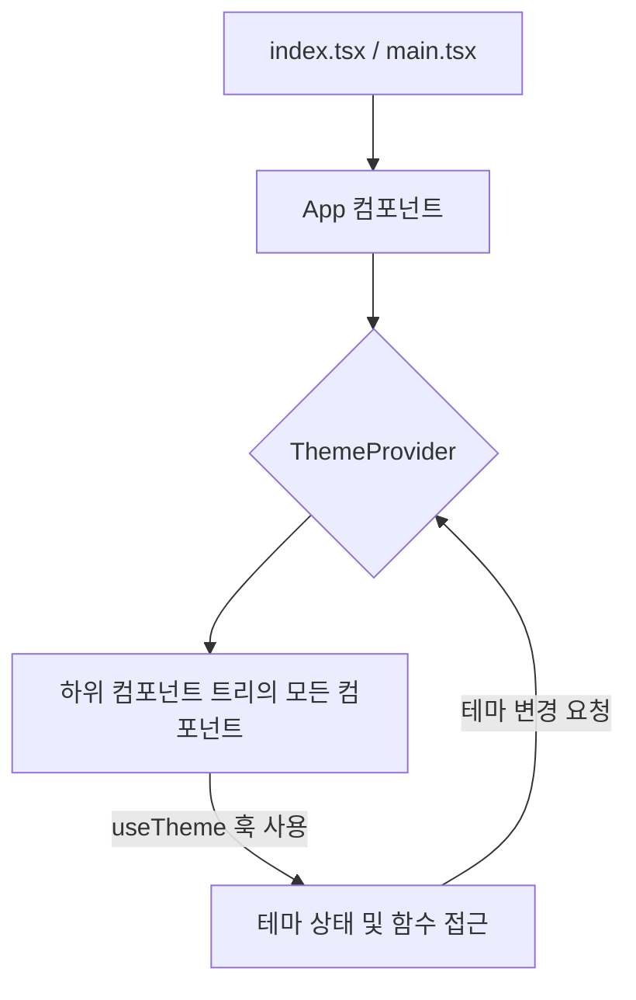

<cite>src/context/theme-provider.tsx</cite>

## 개요
이 파일은 React 애플리케이션의 테마(예: 라이트 모드, 다크 모드)를 전역적으로 관리하고 제공하는 `ThemeProvider` 컴포넌트를 정의합니다. React Context API를 활용하여 테마 상태와 테마 변경 함수를 컴포넌트 트리의 모든 하위 컴포넌트에 주입하며, 사용자가 애플리케이션 전체에서 일관된 테마 경험을 할 수 있도록 지원합니다. `localStorage`를 사용하여 사용자의 테마 설정을 브라우저에 저장하고 불러옴으로써 애플리케이션 재로드 시에도 테마를 유지합니다.

## 아키텍처 다이어그램


## 데이터 흐름 다이어그램
```mermaid
graph LR
    A[ThemeProvider] -- 1. 초기 테마 로드 (localStorage) --> B{Theme State: 'light' | 'dark'}
    B -- 2. Context를 통해 제공 --> C[useTheme 훅]
    C -- 3. 컴포넌트에서 테마 사용 및 toggleTheme 호출 --> D[사용자 인터랙션 (버튼 클릭 등)]
    D -- 4. 새로운 테마 설정 --> B
    B -- 5. 새로운 테마 localStorage에 저장 --> E[localStorage]
    B -- 6. 테마 변경에 따른 UI 업데이트 --> F[렌더링된 컴포넌트]
```

## 주요 함수/클래스

*   **`ThemeProvider`**
    *   **시그니처:** `function ThemeProvider({ children }: { children: React.ReactNode }): JSX.Element`
    *   **설명:** 애플리케이션의 테마 상태를 관리하고, 이 상태와 테마 변경 함수를 React Context를 통해 하위 컴포넌트에 제공하는 React 컴포넌트입니다. `localStorage`를 사용하여 테마 설정을 지속적으로 유지하며, 컴포넌트 마운트 시 저장된 테마를 로드합니다.
        `children` prop을 받아 해당 자식 컴포넌트들이 테마 컨텍스트에 접근할 수 있도록 합니다.

*   **`ThemeContext`**
    *   **시그니처:** `const ThemeContext = createContext<ThemeContextType | undefined>(undefined);`
    *   **설명:** 현재 테마 상태(`theme` - 'light' 또는 'dark')와 테마를 전환하는 함수(`toggleTheme`)를 포함하는 객체를 전달하기 위한 React Context 객체입니다. 이 컨텍스트는 `ThemeProvider`에 의해 생성 및 제공됩니다.

*   **`useTheme`**
    *   **시그니처:** `function useTheme(): ThemeContextType`
    *   **설명:** `ThemeContext`에 저장된 현재 테마 상태와 테마 변경 함수에 접근하기 위한 커스텀 React Hook입니다. 이 훅은 반드시 `ThemeProvider` 컴포넌트의 하위 트리에 있는 컴포넌트 내에서만 사용되어야 합니다. 그렇지 않으면 에러가 발생합니다.

## 설정/사용법 섹션

### 1. 애플리케이션 루트에 `ThemeProvider` 적용하기

`ThemeProvider`는 애플리케이션 전체에서 테마를 사용할 수 있도록 최상위 컴포넌트를 감싸는 것이 일반적입니다.

```typescript
// src/main.tsx 또는 src/App.tsx
import React from 'react';
import ReactDOM from 'react-dom/client';
import App from './App';
import { ThemeProvider } from './context/theme-provider'; // 실제 경로에 맞게 수정

ReactDOM.createRoot(document.getElementById('root')!).render(
  <React.StrictMode>
    <ThemeProvider>
      <App />
    </ThemeProvider>
  </React.StrictMode>,
);
```

### 2. 컴포넌트에서 테마 사용 및 변경하기

`useTheme` 훅을 사용하여 현재 테마 상태를 읽고 테마를 전환할 수 있습니다.

```typescript
// src/components/ThemeToggleButton.tsx
import React from 'react';
import { useTheme } from '../context/theme-provider'; // 실제 경로에 맞게 수정

function ThemeToggleButton() {
  const { theme, toggleTheme } = useTheme();

  return (
    <button
      onClick={toggleTheme}
      style={{
        backgroundColor: theme === 'light' ? '#fff' : '#333',
        color: theme === 'light' ? '#000' : '#fff',
        border: `1px solid ${theme === 'light' ? '#ccc' : '#666'}`,
        padding: '10px 20px',
        borderRadius: '5px',
        cursor: 'pointer',
      }}
    >
      현재 테마: {theme === 'light' ? '밝음' : '어두움'}
      <br />
      테마 전환하기
    </button>
  );
}

export default ThemeToggleButton;
```

## 문제 해결 가이드

*   **문제 1: `useTheme` 훅이 `ThemeProvider` 외부에서 호출됨**
    *   **증상:** "useTheme must be used within a ThemeProvider"와 유사한 런타임 에러가 발생합니다.
    *   **원인:** `useTheme` 훅은 `ThemeContext`에서 값을 가져오는데, 이 컨텍스트는 `ThemeProvider` 컴포넌트가 제공합니다. `useTheme`을 호출하는 컴포넌트가 `ThemeProvider`의 하위 트리에 포함되어 있지 않으면 컨텍스트 값을 찾을 수 없습니다.
    *   **해결책:** 애플리케이션의 최상위 컴포넌트 또는 `useTheme`을 사용하는 모든 컴포넌트를 감싸는 상위 컴포넌트에 `ThemeProvider`를 올바르게 배치했는지 확인하세요. 일반적으로 `src/main.tsx` 또는 `src/App.tsx` 파일에서 `ThemeProvider`로 전체 앱을 감싸야 합니다.

*   **문제 2: 테마 설정이 새로고침 후 유지되지 않음**
    *   **증상:** 사용자가 테마를 변경한 후 페이지를 새로고침하면 테마가 초기값(예: 'light')으로 되돌아갑니다.
    *   **원인:** `ThemeProvider`가 `localStorage`와 같은 영구 저장소에 테마 설정을 저장하고 로드하는 로직을 제대로 구현하지 않았거나, 구현되었더라도 오류가 발생하고 있을 수 있습니다.
    *   **해결책:** `theme-provider.tsx` 파일에서 `useEffect` 훅을 사용하여 테마 상태가 변경될 때 `localStorage.setItem`을 통해 테마를 저장하고, 컴포넌트 마운트 시 `localStorage.getItem`을 통해 저장된 테마를 로드하는 로직을 확인하고 디버깅하세요. `localStorage` 키가 일관되게 사용되는지도 중요합니다.

*   **문제 3: 테마 전환 시 일시적인 스타일 깜빡임 (FOUC)**
    *   **증상:** 페이지 로드 시 잠시 동안 기본 테마(예: 라이트 모드)가 보이다가 저장된 테마(예: 다크 모드)로 전환되면서 UI가 깜빡이는 현상이 발생합니다.
    *   **원인:** React가 클라이언트 측에서 렌더링을 시작하고 `localStorage`에서 테마를 비동기적으로 읽어오기 전까지는 초기 테마 설정이 적용되기 때문입니다.
    *   **해결책:**
        1.  **CSS 변수 사용:** CSS 변수를 사용하여 테마를 관리하고, `document.documentElement` (<html> 요소)에 `data-theme` 속성이나 클래스를 동적으로 추가하는 방식으로 깜빡임을 최소화할 수 있습니다.
        2.  **초기 렌더링 지연:** `ThemeProvider` 내에서 `localStorage`에서 테마를 불러오는 동안 `null` 또는 로딩 스피너를 렌더링하여 콘텐츠가 로드되기 전까지는 아무것도 표시하지 않는 방법을 고려할 수 있습니다.
        3.  **인라인 스크립트:** `<html>` 태그가 렌더링되기 전에 `localStorage`에서 테마를 읽어 `document.documentElement`에 클래스를 직접 추가하는 작은 인라인 스크립트를 `index.html` 파일의 `<head>` 섹션에 추가하여 초기 로드 시 깜빡임을 방지할 수 있습니다.