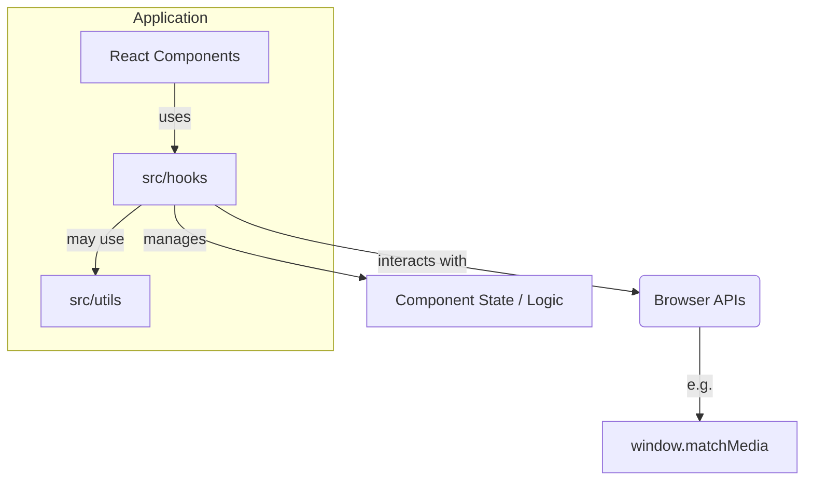
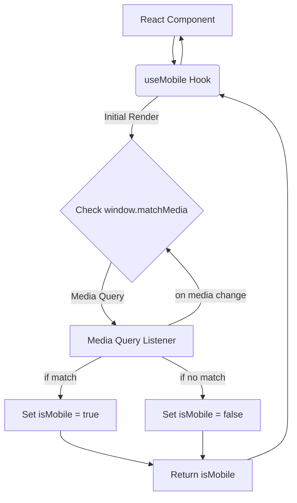
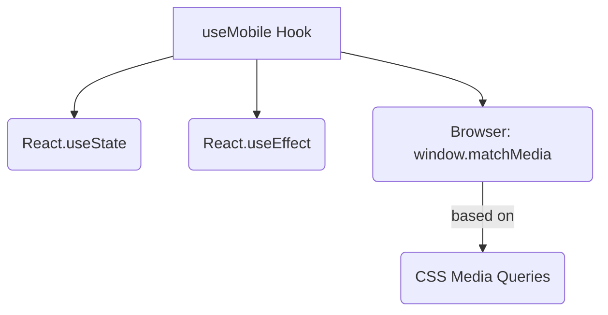

<cite>src/hooks/README.md</cite>

## 개요

`src/hooks` 디렉토리는 애플리케이션 전반에서 재사용 가능한 로직을 캡슐화하고 제공하는 커스텀 React 훅(Hooks)들을 포함합니다. 이 훅들은 컴포넌트의 로직을 분리하고, 상태 관리 및 부수 효과를 효율적으로 처리하여 코드의 재사용성과 유지보수성을 향상시키는 것을 목표로 합니다. 예를 들어, `useMobile` 훅은 기기 환경 감지 로직을 추상화하여 컴포넌트가 특정 기기 유형에 따라 다르게 동작하도록 돕습니다.

## 아키텍처 다이어그램



## `useMobile` 훅 데이터 흐름 다이어그램

`useMobile` 훅이 내부적으로 어떻게 작동하고 데이터를 흐르게 하는지 보여줍니다.



## `useMobile` 훅 의존성 다이어그램

`useMobile` 훅이 의존하는 주요 모듈 및 API를 시각화합니다.



## 주요 함수/클래스

### `useMobile`

*   **시그니처**: `function useMobile(): boolean`
*   **설명**: 현재 브라우저 환경이 모바일 기기인지 여부를 감지하여 불리언 값을 반환하는 커스텀 훅입니다. 이 훅은 주로 반응형 UI를 구현하거나 모바일 전용 로직을 실행할 때 사용됩니다. 내부적으로 `window.matchMedia` API를 활용하여 기기의 화면 너비를 기반으로 모바일 여부를 판단하며, 화면 크기 변경(예: 기기 회전, 브라우저 창 크기 조절)에 따라 자동으로 업데이트됩니다. 기본적으로 특정 너비(예: 768px) 이하를 모바일로 간주합니다.

## 설정/사용법

`useMobile` 훅은 컴포넌트 내에서 간편하게 가져와 사용할 수 있습니다.

### 예시 1: 모바일 환경에 따른 조건부 렌더링

```tsx
// src/components/MyResponsiveComponent.tsx
import React from 'react';
import { useMobile } from '../hooks/use-mobile'; // 또는 '@src/hooks/use-mobile'

function MyResponsiveComponent() {
  const isMobile = useMobile();

  return (
    <div>
      <h1>환영합니다!</h1>
      {isMobile ? (
        <p>현재 모바일 환경에서 접속하셨습니다. 모바일 전용 UI를 제공합니다.</p>
      ) : (
        <p>현재 데스크톱 환경에서 접속하셨습니다. 넓은 화면에 최적화된 UI를 제공합니다.</p>
      )}
      <button onClick={() => alert(`현재 모바일 여부: ${isMobile ? '예' : '아니오'}`)}>
        모바일 상태 확인
      </button>
    </div>
  );
}

export default MyResponsiveComponent;
```

### 예시 2: 모바일 환경에 따른 특정 로직 실행

```tsx
// src/components/ProductList.tsx
import React, { useEffect } from 'react';
import { useMobile } from '../hooks/use-mobile';

function ProductList() {
  const isMobile = useMobile();

  useEffect(() => {
    if (isMobile) {
      console.log('모바일 환경입니다. 스와이프 제스처를 활성화합니다.');
      // 모바일 전용 스와이프 라이브러리 초기화 로직 등
    } else {
      console.log('데스크톱 환경입니다. 마우스 호버 이벤트를 활성화합니다.');
      // 데스크톱 전용 호버 효과 로직 등
    }
  }, [isMobile]); // isMobile 값이 변경될 때마다 실행

  return (
    <div>
      <h2>제품 목록</h2>
      {/* 제품 목록 렌더링 */}
      <p>현재 기기 유형에 따라 최적화된 경험을 제공합니다.</p>
    </div>
  );
}

export default ProductList;
```

## 문제 해결 가이드

### 1. `useMobile` 훅이 항상 `false`를 반환하거나 업데이트되지 않음

*   **원인**:
    *   미디어 쿼리 문자열이 잘못되었거나, 브라우저가 `window.matchMedia`를 지원하지 않을 수 있습니다 (매우 드문 경우).
    *   서버 사이드 렌더링(SSR) 환경에서 초기 렌더링 시 `window` 객체가 없어 `false`로 초기화될 수 있습니다. `window` 객체는 브라우저 환경에서만 존재합니다.
*   **해결**:
    *   `src/hooks/use-mobile.tsx` 파일 내의 미디어 쿼리 문자열(예: `(max-width: 768px)`)이 올바른지 확인하세요.
    *   SSR 환경에서는 훅의 초기 상태를 `false`가 아닌 `undefined` 등으로 설정하여, 클라이언트 측에서 `useEffect`를 통해 실제 값을 계산하도록 하는 것이 일반적입니다. `useMobile` 훅은 `useEffect`를 사용하므로 클라이언트에서 정확한 값을 반영합니다. 혹시 `useEffect` 내 로직이 제대로 실행되는지 확인하세요.

### 2. 모바일 기기인데도 데스크톱 UI가 표시되거나 그 반대의 경우

*   **원인**: `useMobile` 훅의 임계값(Breakpoint)이 애플리케이션의 디자인 시스템과 일치하지 않을 수 있습니다. 예를 들어, 훅은 768px을 기준으로 하지만 디자인은 1024px을 기준으로 모바일/태블릿을 구분할 수 있습니다.
*   **해결**: `src/hooks/use-mobile.tsx` 파일 내의 `matchMedia` 쿼리 문자열 (`(max-width: 768px)`)을 애플리케이션의 반응형 디자인 가이드라인에 맞춰 조정해야 합니다. 예를 들어, 태블릿을 모바일로 간주하려면 `(max-width: 1024px)` 등으로 변경할 수 있습니다.

### 3. 테스트 환경에서 `window.matchMedia` 오류 발생

*   **원인**: Jest와 같은 테스트 환경에서는 브라우저 환경이 아니므로 `window.matchMedia` 객체가 기본적으로 존재하지 않아 훅을 테스트할 때 오류가 발생할 수 있습니다.
*   **해결**: 테스트 셋업 파일(예: `setupTests.js` 또는 `jest.setup.js`)에서 `window.matchMedia`를 모킹(mocking)하여 테스트 환경에서 에러가 발생하지 않도록 처리해야 합니다.

    ```javascript
    // jest.setup.js 또는 setupTests.js
    Object.defineProperty(window, 'matchMedia', {
      writable: true,
      value: jest.fn().mockImplementation(query => ({
        matches: false, // 테스트 시 기본값 설정 (필요에 따라 변경)
        media: query,
        onchange: null,
        addListener: jest.fn(), // deprecated
        removeListener: jest.fn(), // deprecated
        addEventListener: jest.fn(),
        removeEventListener: jest.fn(),
        dispatchEvent: jest.fn(),
      })),
    });
    ```
    테스트 케이스 내에서 특정 미디어 쿼리 결과가 필요할 경우, `window.matchMedia`의 `mockImplementation`을 오버라이드하거나 `matches` 속성을 동적으로 설정할 수 있습니다.