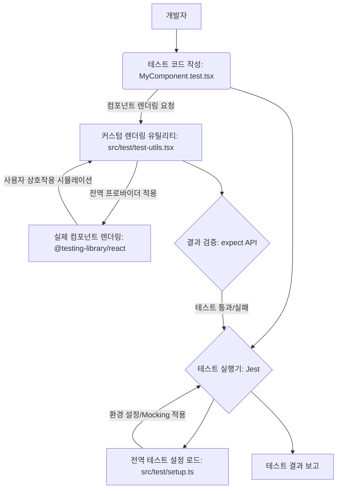
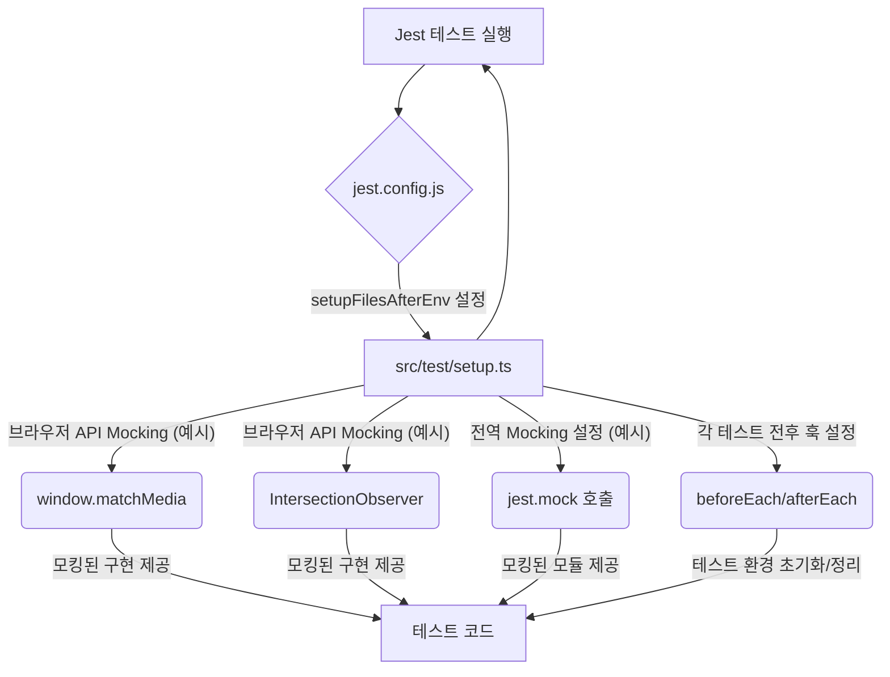

<cite>src/test/setup.ts, src/test/test-utils.tsx</cite>

## 개요

`src/test/setup.ts` 및 `src/test/test-utils.tsx` 파일은 애플리케이션의 테스트 환경을 설정하고 관리하기 위한 핵심 유틸리티를 제공합니다. 이들은 Jest 및 React Testing Library 기반의 테스트에서 일관된 환경을 보장하며, 실제 애플리케이션의 동작을 정확하게 시뮬레이션하는 데 필요한 전역 설정과 헬퍼 함수를 포함합니다. 이를 통해 견고하고 신뢰할 수 있는 테스트 스위트를 구축할 수 있습니다.

## 아키텍처 다이어그램

### 1. 테스트 워크플로우 아키텍처



### 2. `test-utils.tsx` 내부 구조 및 의존성

```mermaid
graph TD
    subgraph src/test/test-utils.tsx
        A[customRender 함수] --> B(AllTheProviders 컴포넌트)
        B --> C{children (테스트 대상 UI)}
    end
    A -- 내부적으로 사용 --> D[@testing-library/react의 render]
    B -- 전역 컨텍스트 제공 (예시) --> E[ThemeProvider]
    B -- 전역 컨텍스트 제공 (예시) --> F[BrowserRouter]
    B -- 전역 컨텍스트 제공 (예시) --> G[QueryClientProvider]
    D -- 결과 반환 --> A
```

### 3. `setup.ts`의 역할과 Jest 통합



## 주요 함수/클래스

### src/test/setup.ts

*   **`jest.mock` 호출**
    *   **시그니처:** `jest.mock(moduleName, factory?, options?)`
    *   **설명:** 특정 모듈을 가짜(mock) 구현으로 대체하여 테스트 환경을 격리하고 제어 가능한 상태로 만듭니다. 주로 브라우저 API(`window.matchMedia`, `IntersectionObserver`)나 외부 서비스 호출 등을 모킹하여 테스트의 독립성과 예측 가능성을 높입니다.
*   **`beforeEach` / `afterEach` 훅**
    *   **시그니처:** `beforeEach(fn, timeout?)`, `afterEach(fn, timeout?)`
    *   **설명:** Jest의 전역 훅으로, 각 테스트 또는 테스트 스위트 전후에 실행될 공통 설정 및 정리 로직을 정의합니다. 예를 들어, 테스트 간의 상태 오염을 방지하기 위해 데이터를 초기화하거나, 모킹된 함수를 초기화(`jest.clearAllMocks()`, `jest.restoreAllMocks()`)하여 일관된 테스트 조건을 유지합니다.

### src/test/test-utils.tsx

*   **`customRender` 함수**
    *   **시그니처:** `function customRender(ui: React.ReactElement, options?: RenderOptions): RenderResult`
    *   **설명:** `@testing-library/react`의 `render` 함수를 확장한 커스텀 함수입니다. 이 함수는 테스트 대상 컴포넌트를 애플리케이션의 전역 컨텍스트(예: 테마 프로바이더, 라우터, 상태 관리 프로바이더 등)로 감싸서 렌더링합니다. 이를 통해 컴포넌트가 실제 애플리케이션 환경과 유사한 조건에서 올바르게 동작하는지 테스트할 수 있습니다.
*   **`AllTheProviders` 컴포넌트**
    *   **시그니처:** `function AllTheProviders({ children }: { children: React.ReactNode }): JSX.Element`
    *   **설명:** `customRender` 함수 내부에서 사용되는 헬퍼 컴포넌트입니다. 테스트에 필요한 모든 전역 프로바이더(예: `ThemeProvider`, `QueryClientProvider`, `BrowserRouter` 등)를 한곳에 모아 `children`으로 전달된 테스트 대상 컴포넌트를 감쌉니다. 이는 반복적인 프로바이더 설정을 줄이고 테스트 코드를 간결하게 만듭니다.
*   **`render` (재내보내기)**
    *   **시그니처:** `@testing-library/react`의 `render` 함수와 동일
    *   **설명:** `test-utils.tsx` 파일에서 `customRender`와 함께 `@testing-library/react`의 주요 함수들을 재내보내기(re-export)하여, 테스트 파일에서 `test-utils`로부터 모든 필요한 함수를 한 번에 임포트할 수 있도록 편의성을 제공합니다.

## 설정/사용법

### 1. Jest 설정 파일 (`jest.config.js`)에 `setup.ts` 연동

`src/test/setup.ts` 파일은 Jest 테스트 환경이 시작되기 전에 실행되도록 `jest.config.js` 또는 `package.json`의 Jest 설정에 포함되어야 합니다.

```javascript
// jest.config.js
module.exports = {
  // 테스트 환경 설정 (브라우저 환경 시뮬레이션을 위해 'jsdom' 권장)
  testEnvironment: 'jsdom',

  // 각 테스트 파일이 실행되기 전에 실행될 설정 파일 지정
  // 이곳에 src/test/setup.ts 경로를 추가합니다.
  setupFilesAfterEnv: ['<rootDir>/src/test/setup.ts'],

  // 모듈 해상도 및 변환 설정 등 기타 Jest 설정...
  transform: {
    '^.+\\.(ts|tsx)$': 'ts-jest',
  },
  moduleNameMapper: {
    '\\.(css|less|scss|sass)$': 'identity-obj-proxy',
  },
  // ...
};
```

### 2. 테스트 파일에서 `customRender` 사용

컴포넌트 테스트 시, 애플리케이션의 전역 컨텍스트가 필요한 경우 `test-utils`에서 내보낸 `customRender` 함수를 사용합니다.

```typescript jsx
import React from 'react';
import { screen } from '@testing-library/react';
// src/test/test-utils.tsx에서 customRender와 기타 @testing-library/react 함수들을 임포트합니다.
import { customRender } from './test-utils';
import MyComponent from '../components/MyComponent';

describe('MyComponent', () => {
  test('컴포넌트가 올바르게 렌더링되고 특정 텍스트를 표시한다', () => {
    // customRender를 사용하여 컴포넌트를 렌더링하면,
    // AllTheProviders에 정의된 모든 전역 프로바이더가 자동으로 적용됩니다.
    customRender(<MyComponent />);

    // 화면에 'Hello World' 텍스트가 있는지 확인합니다.
    expect(screen.getByText(/Hello World/i)).toBeInTheDocument();
  });

  test('버튼 클릭 시 특정 이벤트가 발생한다', () => {
    const handleClick = jest.fn();
    customRender(<MyComponent onClick={handleClick} />);

    // 버튼을 찾아서 클릭합니다.
    const button = screen.getByRole('button', { name: /클릭하세요/i });
    fireEvent.click(button);

    // 클릭 핸들러가 호출되었는지 확인합니다.
    expect(handleClick).toHaveBeenCalledTimes(1);
  });
});
```

## 문제 해결 가이드

### 1. `ReferenceError: matchMedia is not defined` 또는 `IntersectionObserver is not defined`

*   **증상:** Jest 환경에서 `window.matchMedia`나 `IntersectionObserver`와 같은 브라우저 API를 사용하는 코드를 테스트할 때 발생하는 오류입니다. JSDOM 환경은 기본적으로 이러한 API를 제공하지 않습니다.
*   **원인:** `src/test/setup.ts` 파일에서 해당 브라우저 API에 대한 모킹(mocking)이 제대로 설정되지 않았거나 누락되었을 수 있습니다.
*   **해결책:** `src/test/setup.ts` 파일에 다음 코드를 추가하여 필요한 브라우저 API를 모킹합니다.
    ```typescript
    // src/test/setup.ts
    // window.matchMedia 모킹
    Object.defineProperty(window, 'matchMedia', {
      writable: true,
      value: jest.fn().mockImplementation(query => ({
        matches: false,
        media: query,
        onchange: null,
        addListener: jest.fn(), // Deprecated
        removeListener: jest.fn(), // Deprecated
        addEventListener: jest.fn(),
        removeEventListener: jest.fn(),
        dispatchEvent: jest.fn(),
      })),
    });

    // IntersectionObserver 모킹
    class IntersectionObserver {
      observe = jest.fn();
      unobserve = jest.fn();
      disconnect = jest.fn();
    }
    Object.defineProperty(window, 'IntersectionObserver', {
      writable: true,
      value: IntersectionObserver,
    });
    ```

### 2. 컴포넌트 렌더링 실패 또는 컨텍스트 누락 오류

*   **증상:** 컴포넌트가 렌더링되지 않거나, `Context is undefined`, `Provider not found`와 같은 오류 메시지가 발생합니다. 이는 주로 테마, 라우터, 전역 상태 관리 등 특정 컨텍스트에 의존하는 컴포넌트를 테스트할 때 나타납니다.
*   **원인:** 테스트 파일에서 `@testing-library/react`의 기본 `render` 함수를 사용했거나, `src/test/test-utils.tsx`의 `AllTheProviders` 컴포넌트에 필요한 모든 전역 프로바이더가 포함되지 않았기 때문입니다.
*   **해결책:**
    1.  모든 컴포넌트 테스트에서 `test-utils`에서 내보낸 `customRender` 함수를 사용하고 있는지 확인합니다.
    2.  `src/test/test-utils.tsx` 파일의 `AllTheProviders` 컴포넌트가 테스트 대상 컴포넌트가 의존하는 모든 전역 프로바이더(예: `ThemeProvider`, `BrowserRouter`, `QueryClientProvider`, Redux `Provider` 등)로 `children`을 감싸고 있는지 확인하고, 누락된 프로바이더가 있다면 추가합니다.

### 3. 테스트 실행 시간이 길거나 불안정함 (Flaky Tests)

*   **증상:** 특정 테스트가 실행될 때마다 성공/실패 여부가 불규칙하거나, 전체 테스트 스위트의 실행 시간이 예상보다 현저히 길어집니다.
*   **원인:** 테스트가 실제 네트워크 요청을 수행하거나, 외부 서비스에 의존하거나, 예측 불가능한 비동기 작업을 포함하고 있을 수 있습니다. 이는 테스트 환경의 격리가 불충분함을 의미합니다.
*   **해결책:**
    1.  `src/test/setup.ts` 또는 개별 테스트 파일에서 `jest.mock`을 사용하여 모든 외부 네트워크 요청(예: `fetch`, `axios`) 또는 외부 모듈(예: Firebase, analytics 라이브러리)을 모킹합니다.
    2.  `beforeEach` 훅을 사용하여 각 테스트 전에 모킹된 함수를 초기화(`jest.clearAllMocks()`)하여 테스트 간의 상태 오염을 방지합니다.
    3.  `jest.useFakeTimers()`를 사용하여 `setTimeout`, `setInterval`과 같은 타이머 기반 비동기 작업을 제어하고 `jest.runAllTimers()`로 즉시 실행하여 테스트 실행 시간을 단축합니다.