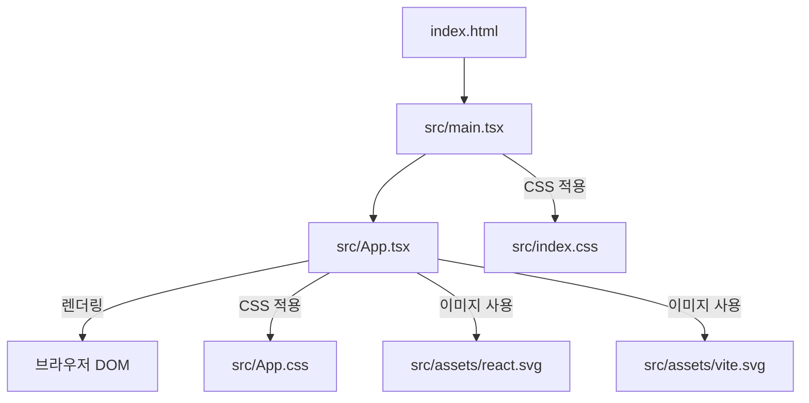
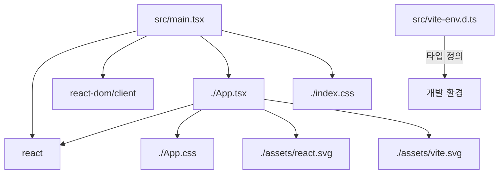

<cite>src/App.tsx</cite>
<cite>src/main.tsx</cite>
<cite>src/vite-env.d.ts</cite>

## 개요

이 "Src" 기술 문서는 Vite 기반의 React 애플리케이션 초기 구조를 설명합니다. 이 구조는 `main.tsx`를 통해 애플리케이션의 진입점을 정의하고, `App.tsx`에서 핵심 UI와 상태 로직을 구현하며, `vite-env.d.ts`로 Vite 환경 변수 및 모듈의 타입 안정성을 보장합니다. 이를 통해 개발자는 빠르고 효율적인 개발 환경에서 타입스크립트의 이점을 활용할 수 있습니다.

## 아키텍처 다이어그램



## 의존성 다이어그램



## 데이터 흐름 다이어그램 (App.tsx 내부)

```mermaid
graph TD
    A[초기 렌더링] --> B{count = 0};
    B --> C[UI 표시: "count is 0"];
    C -- 사용자 클릭 --> D[버튼 클릭 이벤트];
    D --> E[setCount(count + 1)];
    E --> F{count 업데이트};
    F --> B;
    F --> G[UI 재렌더링: "count is N"];
```

## 주요 함수/클래스

*   **`App` 함수 컴포넌트**
    *   **파일**: `src/App.tsx`
    *   **시그니처**: `function App(): JSX.Element`
    *   **설명**: React의 함수형 컴포넌트로, 애플리케이션의 메인 사용자 인터페이스를 정의합니다. `useState` 훅을 사용하여 `count` 상태를 관리하며, Vite 및 React 로고를 표시하고, 버튼 클릭 시 카운터를 증가시키는 기능을 제공합니다. JSX 문법으로 UI를 구성하고 스타일링을 위한 CSS 파일을 임포트합니다.

*   **`ReactDOM.createRoot` 메서드**
    *   **파일**: `src/main.tsx`
    *   **시그니처**: `createRoot(container: Element | DocumentFragment): Root`
    *   **설명**: React 18부터 도입된 새로운 루트 API입니다. HTML 문서의 특정 DOM 요소를 React 애플리케이션의 루트 컨테이너로 지정하고, 해당 컨테이너 내에서 React 컴포넌트를 렌더링할 수 있도록 합니다. 이 애플리케이션에서는 `document.getElementById('root')`를 통해 HTML의 `#root` 엘리먼트를 React 앱의 진입점으로 설정합니다.

*   **`root.render` 메서드**
    *   **파일**: `src/main.tsx`
    *   **시그니처**: `render(children: React.ReactNode): void`
    *   **설명**: `createRoot`로 생성된 루트 컨테이너 내부에 React 엘리먼트(`App` 컴포넌트)를 렌더링하는 역할을 합니다. `<React.StrictMode>`로 `App` 컴포넌트를 감싸서 개발 중 잠재적인 문제를 감지하고 경고를 표시하도록 합니다.

*   **`useState` 훅**
    *   **파일**: `src/App.tsx` (React 라이브러리에서 임포트)
    *   **시그니처**: `useState<S>(initialState: S | (() => S)): [S, Dispatch<SetStateAction<S>>]`
    *   **설명**: React 함수 컴포넌트 내에서 상태(state)를 관리할 수 있게 해주는 훅입니다. 초기 상태 값을 인자로 받아 현재 상태 값과 상태를 업데이트하는 함수를 배열 형태로 반환합니다. `App.tsx`에서는 `const [count, setCount] = useState(0);` 형태로 사용되어 숫자 카운터 상태를 관리합니다.

*   **`import.meta.env` 객체**
    *   **파일**: `src/vite-env.d.ts` (타입 정의), 런타임 시 Vite가 제공
    *   **시그니처**: `interface ImportMetaEnv { /* ... */ }`
    *   **설명**: Vite에서 제공하는 환경 변수 객체입니다. `vite-env.d.ts` 파일은 이 객체의 타입 정의를 제공하여, 개발자가 TypeScript 환경에서 `import.meta.env`를 통해 환경 변수에 안전하게 접근할 수 있도록 돕습니다. 예를 들어, `import.meta.env.VITE_SOME_KEY`와 같이 환경 변수에 접근할 수 있습니다.

## 설정/사용법 섹션

### 프로젝트 시작 및 개발 서버 실행

이 프로젝트는 Vite를 기반으로 하므로, 개발 환경 설정 및 시작이 매우 간단합니다.

1.  **의존성 설치**: 프로젝트 루트 디렉토리에서 다음 명령어를 실행하여 필요한 모든 패키지를 설치합니다.
    ```bash
    npm install
    # 또는 yarn install
    # 또는 pnpm install
    ```

2.  **개발 서버 실행**: 다음 명령어를 사용하여 개발 서버를 시작합니다.
    ```bash
    npm run dev
    # 또는 yarn dev
    # 또는 pnpm dev
    ```
    이 명령어를 실행하면 Vite 개발 서버가 시작되고, 일반적으로 `http://localhost:5173`과 같은 주소로 애플리케이션에 접속할 수 있습니다. 코드 변경 시 HMR(Hot Module Replacement)을 통해 브라우저에 즉시 반영됩니다.

### `App.tsx` 컴포넌트 수정 예시

`App.tsx` 파일은 애플리케이션의 핵심 UI 로직을 담고 있습니다. 다음은 기존 카운터 기능에 새로운 텍스트를 추가하는 예시입니다.

```typescript jsx
// src/App.tsx
import { useState } from 'react'
import reactLogo from './assets/react.svg'
import viteLogo from '/vite.svg'
import './App.css'

function App() {
  const [count, setCount] = useState(0)

  return (
    <>
      <div>
        <a href="https://vitejs.dev" target="_blank">
          
        </a>
        <a href="https://react.dev" target="_blank">
          
        </a>
      </div>
      <h1>Vite + React</h1>
      {/* 새로운 텍스트 추가 */}
      <p>안녕하세요, Vite와 React 앱입니다!</p>
      <div className="card">
        <button onClick={() => setCount((count) => count + 1)}>
          count is {count}
        </button>
        <p>
          Edit <code>src/App.tsx</code> and save to test HMR
        </p>
      </div>
      <p className="read-the-docs">
        Click on the Vite and React logos to learn more
      </p>
    </>
  )
}

export default App
```
위 코드를 저장하면 개발 서버가 자동으로 UI를 업데이트하여 추가된 텍스트를 확인할 수 있습니다.

## 문제 해결 가이드

### 1. `App` 컴포넌트가 렌더링되지 않거나 빈 화면이 나타나는 경우

*   **문제**: 애플리케이션을 시작했을 때 브라우저에 아무것도 표시되지 않거나 오류가 발생합니다.
*   **원인**: `src/main.tsx` 파일에서 `App` 컴포넌트가 올바르게 임포트되지 않았거나, `ReactDOM.createRoot`가 유효한 DOM 엘리먼트를 찾지 못했을 수 있습니다.
*   **해결책**:
    1.  `public/index.html` 파일에 `<div id="root"></div>` 엘리먼트가 존재하는지 확인합니다.
    2.  `src/main.tsx`에서 `import App from './App.tsx';` 구문이 올바른 경로를 가리키는지 확인합니다.
    3.  `ReactDOM.createRoot(document.getElementById('root') as HTMLElement)` 부분이 정확하게 작성되었는지 확인합니다. 특히 TypeScript 환경에서는 `as HTMLElement`와 같은 타입 단언이 필요할 수 있습니다.
    4.  브라우저 개발자 도구의 콘솔 탭에서 오류 메시지를 확인하여 구체적인 원인을 파악합니다.

### 2. `useState`로 관리하는 상태가 업데이트되지 않는 경우

*   **문제**: `App.tsx` 내에서 버튼 클릭 등 특정 이벤트 발생 시 `useState`로 관리하는 상태 값이 변경되지 않고 UI도 업데이트되지 않습니다.
*   **원인**: 상태 업데이트 함수(`setCount` 등)가 호출되지 않았거나, 상태 업데이트 방식이 React의 불변성(immutability) 원칙을 위반했을 수 있습니다.
*   **해결책**:
    1.  상태 업데이트 함수(`setCount`)가 이벤트 핸들러 내에서 올바르게 호출되는지 확인합니다. 예: `onClick={() => setCount(count + 1)}`.
    2.  객체나 배열과 같은 참조 타입의 상태를 업데이트할 때는 직접 수정하지 않고, 항상 새로운 객체나 배열을 생성하여 반환해야 합니다. (이 예시에서는 숫자이므로 해당 없음)
    3.  `setCount`에 전달하는 콜백 함수 형태(`setCount((prevCount) => prevCount + 1)`)를 사용하여 이전 상태 값에 안전하게 접근하는 것을 권장합니다.

### 3. Vite 환경 변수(`import.meta.env`)에 접근할 수 없거나 타입 오류가 발생하는 경우

*   **문제**: `.env` 파일에 정의된 환경 변수나 Vite가 제공하는 기본 환경 변수에 `import.meta.env`를 통해 접근하려고 할 때 `undefined`가 반환되거나 TypeScript 컴파일 오류가 발생합니다.
*   **원인**: `.env` 파일의 변수 이름 규칙을 따르지 않았거나, `src/vite-env.d.ts` 파일이 올바르게 구성되지 않아 TypeScript가 환경 변수의 타입을 알지 못하기 때문입니다.
*   **해결책**:
    1.  Vite는 `.env` 파일의 환경 변수가 `VITE_` 접두사로 시작해야만 클라이언트 사이드 코드에서 접근할 수 있습니다. 예를 들어, `MY_API_KEY=abc` 대신 `VITE_MY_API_KEY=abc`로 정의해야 합니다.
    2.  `src/vite-env.d.ts` 파일이 프로젝트 루트에 존재하고 다음 내용이 포함되어 있는지 확인합니다:
        ```typescript
        /// <reference types="vite/client" />
        ```
        이 지시문은 Vite 클라이언트 환경에 대한 타입 정의를 가져와 `import.meta.env` 등의 타입 정보를 제공합니다.
    3.  만약 사용자 정의 환경 변수의 타입을 명시적으로 추가하고 싶다면, `vite-env.d.ts`에 `ImportMetaEnv` 인터페이스를 확장할 수 있습니다:
        ```typescript
        /// <reference types="vite/client" />

        interface ImportMetaEnv {
          readonly VITE_APP_TITLE: string
          // 다른 환경 변수들도 여기에 추가
        }

        interface ImportMeta {
          readonly env: ImportMetaEnv
        }
        ```
    4.  개발 서버를 재시작하여 `.env` 파일 변경 사항이 적용되도록 합니다.