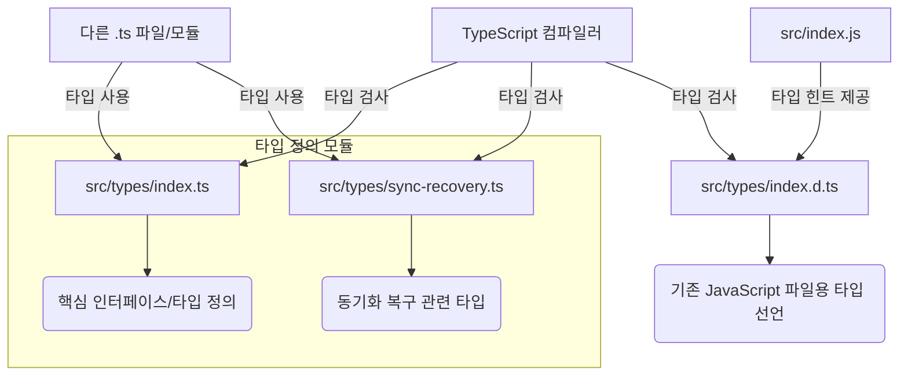
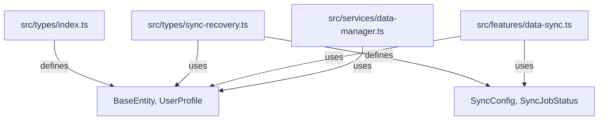

<cite>
src/types/index.d.ts
src/types/index.js
src/types/index.ts
src/types/sync-recovery.ts
</cite>

### 개요

"타입 정의"는 애플리케이션의 데이터 구조, 함수 시그니처, 객체 모양 등을 명확하게 정의하여 코드의 가독성, 유지보수성, 안정성을 향상시키는 기술입니다. 이 문서는 `src/types` 디렉토리에 위치한 타입 정의 파일들의 목적과 역할을 설명하며, 주로 TypeScript 환경에서 JavaScript 코드에 대한 타입 힌트를 제공하고, 복잡한 시스템의 타입을 체계적으로 관리하는 방법을 다룹니다. 이를 통해 개발자는 컴파일 시점에 잠재적인 오류를 미리 발견하고, 코드의 의도를 명확히 파악하며, 협업 효율성을 높일 수 있습니다.

### 타입 정의 아키텍처 및 흐름

#### 다이어그램 1: 타입 정의 파일 구조 및 관계



이 다이어그램은 `src/types` 디렉토리 내의 파일들이 어떻게 구성되고 서로 연관되는지를 보여줍니다. `index.ts`는 프로젝트 전반에 걸쳐 사용되는 공통적이고 핵심적인 타입(인터페이스, 타입 별칭 등)을 정의합니다. `sync-recovery.ts`와 같이 특정 기능 영역에 특화된 타입은 별도의 파일로 분리하여 모듈성을 높입니다. `index.d.ts`는 기존 JavaScript 파일(`src/index.js` 등)에 타입 정보를 제공하는 선언 파일로, TypeScript 컴파일러가 JavaScript 파일을 분석하고 타입 힌트를 제공할 수 있도록 돕습니다.

#### 다이어그램 2: 타입 검사 및 해상도 흐름

```mermaid
graph LR
    A[개발자 코드 (.ts, .js)] --> B(TypeScript 컴파일러)
    B --> C{타입 정의 파일 검토 및 해상도}
    C --> D[src/types/index.ts]
    C --> E[src/types/sync-recovery.ts]
    C --> F[src/types/index.d.ts]
    F -- JavaScript 코드에 타입 정보 제공 --> B
    B -- 타입 불일치/오류 발견 --> G(컴파일 오류 보고)
    B -- 타입 일치 및 유효성 확인 --> H(JavaScript 출력 또는 실행)
```

이 다이어그램은 TypeScript 컴파일러가 개발자 코드와 타입 정의 파일을 어떻게 활용하여 타입 검사를 수행하는지 보여줍니다. 컴파일러는 `.ts` 파일과 `.d.ts` 파일을 참조하여 코드 내의 모든 변수, 함수, 객체에 대한 타입을 추론하고 검증합니다. 만약 타입 정의와 실제 사용 간에 불일치가 발생하면 컴파일 오류를 보고하여 개발자가 문제를 수정하도록 안내하며, 모든 타입 검사를 통과하면 최종 JavaScript 코드를 생성하거나 실행 가능한 상태로 만듭니다.

#### 다이어그램 3: 모듈 간 타입 의존성 (예시)



이 다이어그램은 애플리케이션의 다양한 모듈들이 `src/types` 디렉토리의 타입 정의에 어떻게 의존하는지를 보여줍니다. `index.ts`는 `BaseEntity`나 `UserProfile`과 같은 기본적인 엔티티 타입을 정의하며, 이는 다른 모든 기능에서 재사용될 수 있습니다. `sync-recovery.ts`는 `SyncConfig`와 같은 특정 기능에 필요한 타입을 정의하며, 이 타입은 `BaseEntity`와 같은 핵심 타입을 확장하거나 포함할 수 있습니다. `data-sync.ts`나 `data-manager.ts`와 같은 실제 비즈니스 로직을 구현하는 모듈들은 이러한 정의된 타입들을 직접 임포트하여 사용함으로써 타입 안정성을 확보합니다.

### 주요 타입/인터페이스/클래스

이 섹션에서는 `src/types` 디렉토리에서 정의될 수 있는 주요 타입 및 인터페이스의 예시를 제시합니다.

*   **`interface BaseEntity`**
    *   **시그니처:**
        ```typescript
        interface BaseEntity {
            id: string;
            createdAt: Date;
            updatedAt: Date;
            deletedAt?: Date;
        }
        ```
    *   **설명:** 모든 데이터 엔티티가 공통적으로 가져야 할 기본 속성들을 정의하는 인터페이스입니다. 고유 식별자(`id`), 생성 일시(`createdAt`), 최종 업데이트 일시(`updatedAt`)를 포함하며, 소프트 삭제를 위한 `deletedAt`은 선택적 속성입니다. 다른 모든 구체적인 엔티티 인터페이스는 이 `BaseEntity`를 확장하여 공통 필드를 재사용하고 일관성을 유지합니다.

*   **`type SyncStatus`**
    *   **시그니처:**
        ```typescript
        type SyncStatus = 'pending' | 'in-progress' | 'completed' | 'failed' | 'cancelled';
        ```
    *   **설명:** 데이터 동기화 작업의 현재 상태를 나타내는 유니온 타입입니다. 가능한 모든 상태 값을 명시적으로 정의하여 오타나 유효하지 않은 상태 값의 사용을 방지하고, 코드의 가독성을 높입니다.

*   **`interface SyncRecoveryOptions`**
    *   **시그니처:**
        ```typescript
        interface SyncRecoveryOptions {
            maxRetries: number;
            retryIntervalMs: number;
            strategy: 'rollback' | 're-sync' | 'manual';
            onFailure?: (error: Error, attempt: number) => void;
        }
        ```
    *   **설명:** 동기화 실패 시 복구 메커니즘에 대한 설정을 정의하는 인터페이스입니다. 최대 재시도 횟수(`maxRetries`), 재시도 간격(`retryIntervalMs`), 복구 전략(`strategy`), 그리고 실패 시 호출될 콜백 함수(`onFailure`)를 포함합니다. 이는 `src/types/sync-recovery.ts`와 같은 특정 기능 파일에 정의될 수 있습니다.

*   **`class DataService<T extends BaseEntity>`**
    *   **시그니처:**
        ```typescript
        class DataService<T extends BaseEntity> {
            private collection: Map<string, T>;
            constructor();
            add(item: T): void;
            get(id: string): T | undefined;
            update(id: string, updates: Partial<T>): boolean;
            delete(id: string): boolean;
        }
        ```
    *   **설명:** `BaseEntity`를 확장하는 모든 타입 `T`에 대해 데이터를 관리하는 제네릭 서비스 클래스입니다. 내부적으로 `Map`을 사용하여 데이터를 저장하며, 항목 추가, 조회, 업데이트, 삭제 등의 기본 CRUD(Create, Read, Update, Delete) 작업을 제공합니다. 제네릭을 사용하여 다양한 엔티티 타입에 재사용 가능한 강력한 데이터 관리 로직을 구현할 수 있습니다.

### 설정/사용법

#### 1. `src/types/index.ts`에 핵심 타입 정의

```typescript
// src/types/index.ts

/**
 * 모든 데이터 엔티티의 기본 속성을 정의합니다.
 */
export interface BaseEntity {
    id: string;
    createdAt: Date;
    updatedAt: Date;
    deletedAt?: Date;
}

/**
 * 사용자 프로필 정보를 나타내는 인터페이스입니다.
 */
export interface UserProfile extends BaseEntity {
    username: string;
    email: string;
    isActive: boolean;
    roles: UserRole[];
}

/**
 * 사용자 역할을 정의하는 유니온 타입입니다.
 */
export type UserRole = 'admin' | 'editor' | 'viewer';

/**
 * 애플리케이션 설정을 나타내는 인터페이스입니다.
 */
export interface AppConfig {
    apiBaseUrl: string;
    timeoutMs: number;
    debugMode: boolean;
}
```

#### 2. `src/types/sync-recovery.ts`에 특정 기능 타입 정의

```typescript
// src/types/sync-recovery.ts
import { BaseEntity } from './index'; // 핵심 타입 임포트

/**
 * 동기화 작업의 상태를 나타내는 타입입니다.
 */
export type SyncJobStatus = 'pending' | 'running' | 'completed' | 'failed' | 'paused';

/**
 * 동기화 복구 관련 설정을 정의하는 인터페이스입니다.
 */
export interface SyncRecoveryConfig {
    maxRetries: number;
    retryIntervalMs: number; // 밀리초 단위
    strategy: 'rollback' | 're-sync' | 'manual';
    onRecoveryAttempt?: (attempt: number, error: Error) => void;
}

/**
 * 개별 동기화 작업을 나타내는 인터페이스입니다.
 */
export interface SyncJob extends BaseEntity {
    sourceId: string;
    targetId: string;
    status: SyncJobStatus;
    lastAttemptedAt: Date;
    retryCount: number;
    config: SyncRecoveryConfig;
}
```

#### 3. 다른 TypeScript 파일에서 타입 사용

```typescript
// src/services/userService.ts
import { UserProfile, UserRole, AppConfig, BaseEntity } from '../types';
import { SyncJobStatus } from '../types/sync-recovery';

class UserService {
    private users: Map<string, UserProfile> = new Map();
    private appConfig: AppConfig;

    constructor(config: AppConfig) {
        this.appConfig = config;
        console.log(`API Base URL: ${this.appConfig.apiBaseUrl}`);
    }

    /**
     * 새로운 사용자를 생성하고 저장합니다.
     */
    createUser(profile: UserProfile): UserProfile {
        if (this.users.has(profile.id)) {
            throw new Error(`User with ID ${profile.id} already exists.`);
        }
        this.users.set(profile.id, profile);
        console.log(`User ${profile.username} created with roles: ${profile.roles.join(', ')}`);
        return profile;
    }

    /**
     * 특정 ID의 사용자를 조회합니다.
     */
    getUser(id: string): UserProfile | undefined {
        return this.users.get(id);
    }

    /**
     * 동기화 작업 상태를 업데이트합니다. (예시)
     */
    updateSyncStatus(jobId: string, newStatus: SyncJobStatus): void {
        console.log(`Sync job ${jobId} status updated to: ${newStatus}`);
    }
}

// 사용 예시
const myAppConfig: AppConfig = {
    apiBaseUrl: 'https://api.example.com',
    timeoutMs: 5000,
    debugMode: true,
};

const userService = new UserService(myAppConfig);

const newUser: UserProfile = {
    id: 'user-001',
    createdAt: new Date(),
    updatedAt: new Date(),
    username: 'alice.smith',
    email: 'alice@example.com',
    isActive: true,
    roles: ['editor'],
};

userService.createUser(newUser);
const fetchedUser = userService.getUser('user-001');
if (fetchedUser) {
    console.log(`Fetched user: ${fetchedUser.username}`);
}

userService.updateSyncStatus('sync-job-xyz', 'completed');
```

#### 4. `src/types/index.d.ts`를 통한 JavaScript 파일 지원 (개념)

`src/types/index.d.ts` 파일은 기존 JavaScript 코드베이스에 타입 정보를 제공하는 데 사용됩니다. 이는 TypeScript 컴파일러가 JSDoc 주석과 함께 JavaScript 파일을 분석하여 타입 검사를 수행할 수 있도록 합니다.

```typescript
// src/types/index.d.ts
// 이 파일은 주로 JavaScript 모듈에 대한 전역 또는 외부 모듈 선언을 포함합니다.

// 'my-app/types' 모듈에 대한 타입 선언
declare module 'my-app/types' {
    export interface BaseEntity {
        id: string;
        createdAt: Date;
        updatedAt: Date;
        deletedAt?: Date;
    }

    export interface UserProfile extends BaseEntity {
        username: string;
        email: string;
        isActive: boolean;
        roles: UserRole[];
    }

    export type UserRole = 'admin' | 'editor' | 'viewer';
}

// src/index.js (JSDoc을 사용하여 타입 힌트 활용)
/**
 * @typedef {import('my-app/types').UserProfile} UserProfile
 * @typedef {import('my-app/types').UserRole} UserRole
 */

/**
 * 새로운 사용자를 생성하는 함수입니다.
 * @param {UserProfile} profile - 사용자 프로필 객체.
 * @returns {UserProfile} 생성된 사용자 프로필.
 */
function createJsUser(profile) {
    console.log(`JS Function: User ${profile.username} created with roles: ${profile.roles.join(', ')}`);
    return profile;
}

const jsNewUser = {
    id: 'js-user-001',
    createdAt: new Date(),
    updatedAt: new Date(),
    username: 'bob.js',
    email: 'bob@example.com',
    isActive: true,
    roles: ['viewer'], // 타입 힌트를 통해 'viewer'가 UserRole에 속함을 알 수 있음
};

createJsUser(jsNewUser);
// 만약 roles에 잘못된 값 (예: ['unknown'])을 넣으면,
// VS Code와 같은 IDE에서 JSDoc 기반으로 타입 오류 경고를 받을 수 있습니다.
```

### 문제 해결 가이드

#### 이슈 1: `TS2307: Cannot find module '...'` 또는 `Could not find a declaration file for module '...'`

*   **원인:** TypeScript 컴파일러가 임포트된 모듈을 찾을 수 없거나 해당 모듈에 대한 타입 정의(`.d.ts` 파일)를 찾을 수 없을 때 발생합니다. 이는 주로 다음 경우에 발생합니다.
    *   모듈 경로가 잘못되었을 때.
    *   외부 라이브러리를 사용하는데 해당 라이브러리에 자체 타입 정의가 없거나 `@types` 패키지가 설치되지 않았을 때.
    *   `tsconfig.json`의 `paths`나 `include` 설정이 올바르지 않을 때.
*   **해결:**
    1.  **경로 확인:** 임포트하는 모듈의 상대 또는 절대 경로가 정확한지 다시 확인합니다.
    2.  **`@types` 설치:** 외부 라이브러리인 경우, 해당 라이브러리의 타입 정의 패키지를 설치합니다 (`npm install --save-dev @types/{package-name}`).
    3.  **`tsconfig.json` 설정:**
        *   `"baseUrl"` 및 `"paths"` 설정이 프로젝트의 모듈 해상도 전략과 일치하는지 확인합니다.
        *   `"include"` 배열에 타입 정의 파일이 포함된 디렉토리(예: `"src/types/**/*.ts"`)가 명시되어 있는지 확인합니다.
    4.  **자체 모듈 선언:** 타입 정의가 없는 JavaScript 모듈을 사용하는 경우, `src/types/custom.d.ts`와 같은 파일에 직접 선언 파일을 추가할 수 있습니다:
        ```typescript
        // src/types/custom.d.ts
        declare module 'my-js-module' {
            export function doSomething(param: string): void;
            export const someValue: number;
        }
        ```

#### 이슈 2: `TS2345: Argument of type '...' is not assignable to parameter of type '...'`

*   **원인:** 함수나 메서드를 호출할 때 전달된 인수의 타입이 해당 함수/메서드가 기대하는 파라미터의 타입과 일치하지 않을 때 발생합니다. 이는 가장 흔한 TypeScript 오류 중 하나입니다.
*   **해결:**
    1.  **타입 정의 검토:** 함수 시그니처와 인수의 타입을 정의하는 인터페이스/타입 별칭을 면밀히 검토하여 불일치하는 부분을 찾습니다.
    2.  **인수 값 확인:** 함수에 전달되는 실제 값이 타입 정의와 일치하는지 확인합니다. 예를 들어, `string`을 기대하는데 `number`가 전달되고 있지는 않은지 확인합니다.
    3.  **부분 업데이트:** 객체 업데이트 시 `Partial<T>` 유틸리티 타입을 사용하여 모든 속성이 필수가 아님을 명시할 수 있습니다.
        ```typescript
        interface User { name: string; age: number; }
        function updateUser(id: string, updates: Partial<User>) { /* ... */ }
        updateUser('1', { name: 'New Name' }); // OK
        // updateUser('1', { invalidProp: 'value' }); // 오류: 'invalidProp'은 'User' 타입에 존재하지 않음
        ```
    4.  **타입 단언 (`as Type`):** 확실하게 타입이 일치한다고 판단되지만 컴파일러가 이를 추론하지 못할 때 `as` 키워드를 사용하여 강제로 타입을 지정할 수 있습니다. 하지만 이는 타입 안전성을 약화시킬 수 있으므로 신중하게 사용해야 합니다.

#### 이슈 3: `TS2339: Property '...' does not exist on type '...'`

*   **원인:** 특정 객체 타입에 존재하지 않는 속성에 접근하려고 시도할 때 발생합니다. 이는 주로 인터페이스나 타입 정의에 해당 속성이 누락되었거나, 객체가 예상과 다른 구조를 가질 때 발생합니다.
*   **해결:**
    1.  **타입 정의 업데이트:** 해당 객체의 인터페이스 또는 타입 정의에 누락된 속성을 추가합니다.
    2.  **선택적 속성 확인:** 속성이 항상 존재하지 않을 수 있다면, `?.` (옵셔널 체이닝) 연산자를 사용하거나 `if` 문 등으로 속성의 존재 여부를 먼저 확인합니다.
        ```typescript
        interface User { name: string; email?: string; }
        const user: User = { name: 'John' };
        console.log(user.email?.length); // undefined (오류 없음)
        if (user.email) {
            console.log(user.email.length); // OK
        }
        ```
    3.  **타입 가드 사용:** 런타임에 특정 조건에 따라 객체의 타입이 달라지는 경우, 타입 가드(Type Guard)를 사용하여 속성 접근 전에 타입을 좁힐 수 있습니다.
    4.  **데이터 유효성 검사:** 외부에서 데이터를 받아오는 경우, 런타임 유효성 검사(예: Zod, Yup 라이브러리)를 통해 데이터 구조를 확신한 후 접근하는 것이 안전합니다.